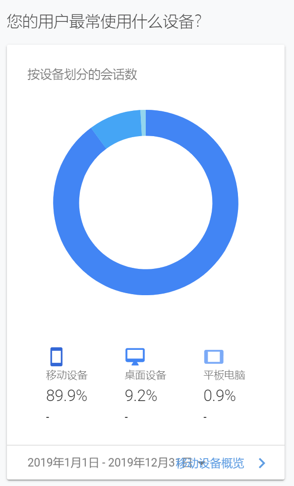
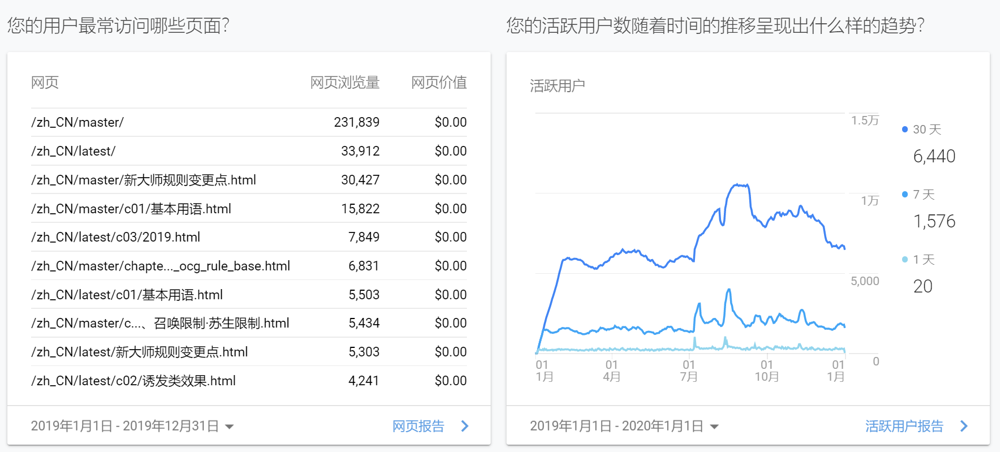
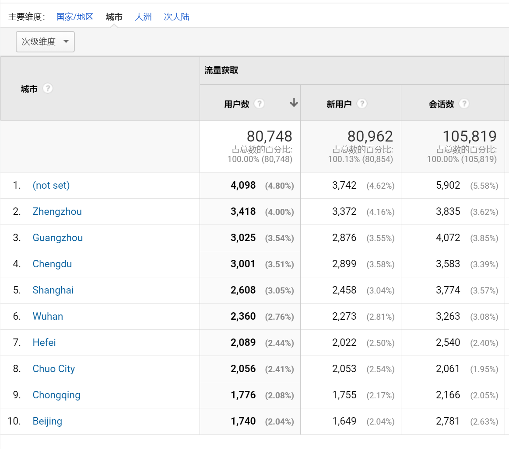
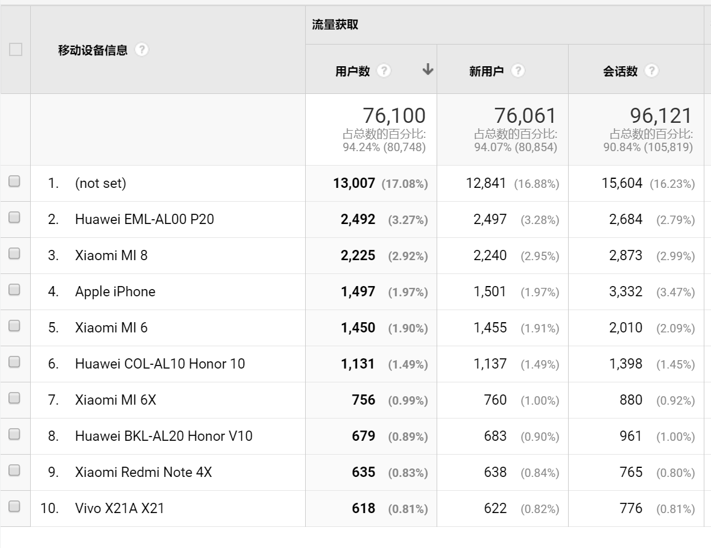
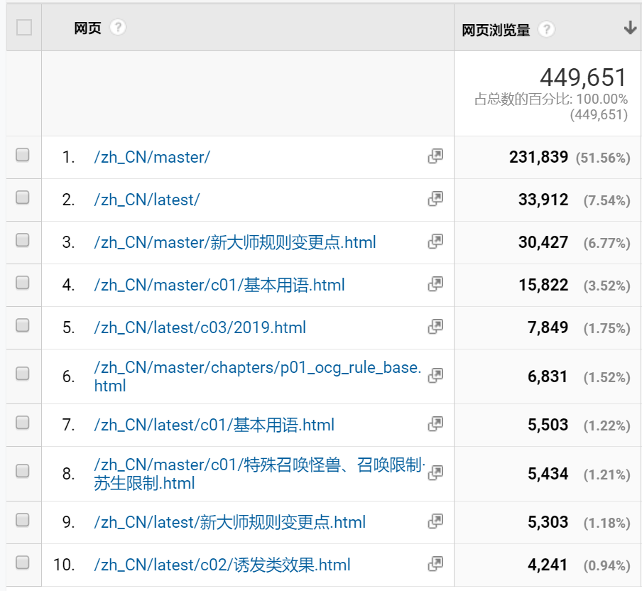
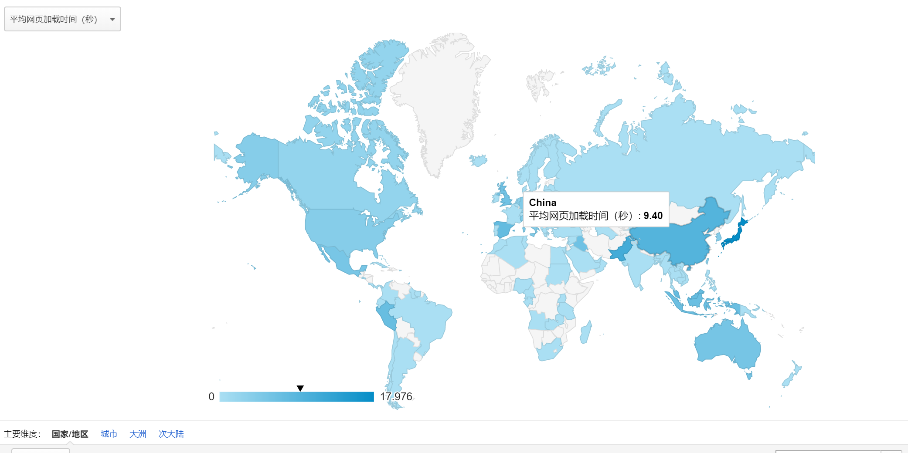
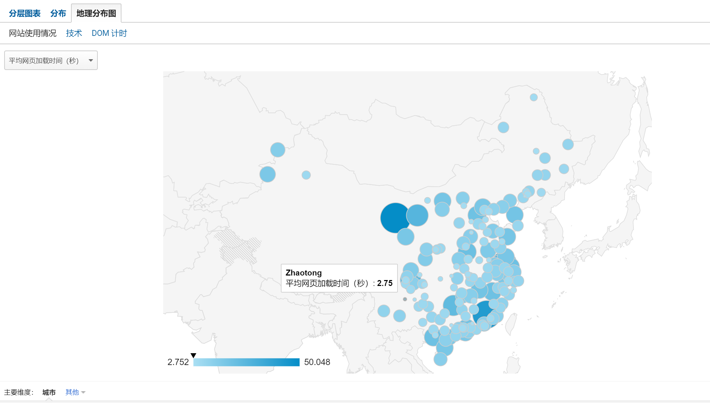

.. _2019年度统计:

===============
2019年度统计
===============

前言
=======

以下统计信息来自Google Analytics（2019年1月4日10:55接入），此处只是备份和记录。

概览
=======

.. figure:: .static/2019_statistic/1.png
   :alt: 2019年度总访问量

Google Analytics的用户数统计不准确，不过访问量是基本准确的，本站年度访问量是11万。

.. figure:: .static/2019_statistic/2.png
   :alt: 2019年度访问量的地理分布

不知这个统计是否计算了VPN，总之大陆地区访问量占了总访问量的89%。

手机访问量占了89%（ygomobile接入了本站）。

| ygomobile接入的url是本站master版本（首页说过，master与latest目前没有任何区别），而点击本站网址http://ocg-rule.readthedocs.io默认会进入latest版本，因此master版本基本是ygomobile用户在访问。
| 可以看出ygomobile用户点击量比其他多了一个数量级。虽然大多只进了首页，可能因为网页加载比较缓慢吧。
| 至于其他想说的，9102年都过去了，为什么2017年的新大师规则变更点还有这么多人不熟呢？

详细统计
=========

| not set是Google未统计到，所以这个截图实际是前九名。
| 郑州访问量第一，有一部分因素是我所在的C萌FW战队队员一部分在郑州的缘故。
| Chuo City是日本的城市，这个原因我就不了解了...

一些手机型号统计。注意苹果手机没有ygomobile，不过这个排名似乎是合计了苹果所有型号的数量。

就这个访问量来说，读者们还是对基本规则不过关呀~

| 上图是本站平均网页加载时间的地理分布，颜色越深表示加载时间越长。
| 由于本项目实际托管在海外网站，所以这些数据很不好看。但网站本身不是我做的，所以我只能从字体缓存之类的入手优化，这样只要第一次进入加载好之后，访问本站其他页面的速度其实还是挺快的。
| 不过实际上日本访问本站的平均加载时间最久，达到了17秒以上...

国内加载时间最长的地方花了50秒才能加载好，加载时间最短的地方只需要2.7秒就能加载好，这个目前很难优化，只能说因地区和宽带服务商而异吧...

搜索词
=======

| 总的来说搜索这个功能用的人很少。
| 下面的排名实际是按包含该关键字的搜索页面url访问次数相加（因为双版本+改版过）排名的，所以也不截图了，这个次数也不是很精确。
| 另外，在搜索词前后加上英文双引号\ ``""``\ 才能精确搜索！虽然这个说明是下半年加的，但目前知道的也太少了，下面的排名基本上没有用精确搜索，是因为首页的说明字数太多了没人仔细看吗？

1. 灵摆 229 （新人都不懂灵摆吗？）
2. 衍生物 106
3. 控制权 98
4. 超量 89
5. 大逮捕 84
6. 同调 73
7. 灰流丽 69
8. 连锁 64
9. 结束阶段 56
10. 卡时点 54
