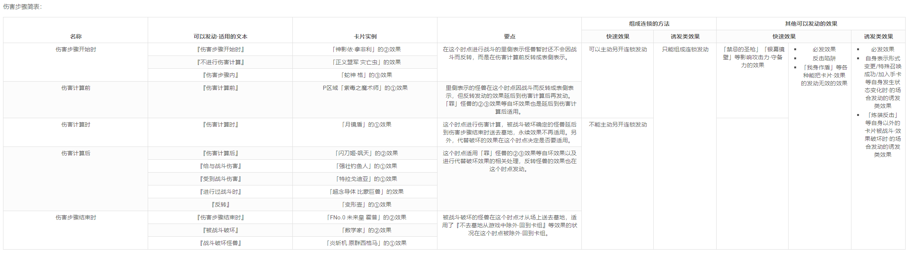

============
战斗阶段流程
============

.. role:: strike
   :class: strike

前言
========

| 互相放弃优先权，主要阶段1结束后，回合玩家选择是否要进入战斗阶段。先攻第1回合玩家不能进行战斗阶段。
| 即使没有能攻击的怪兽、没有怪兽，也能进入战斗阶段。
| 战斗阶段被跳过或者不能进行的回合，也不能进入主要阶段2。

| 在不能进行战斗阶段的回合，或在主要阶段2中，需要在战斗阶段内才能处理的，让怪兽能多次攻击、直接攻击、贯通、战斗伤害加倍·减半等效果基本上不能发动。不过，如果只作为附带的效果处理，基本上可以发动。
| 不需要战斗阶段就能处理的效果，如记述有『不能进行战斗阶段』『不能攻击』等文本的效果可以发动。
| 例：
| 「`电子鱼人-弓手`_」的效果\ `17/3/24 <https://www.db.yugioh-card.com/yugiohdb/faq_search.action?ope=5&fid=13790&request_locale=ja>`__ 「`回转调车`_」的①效果\ `17/3/24 <https://www.db.yugioh-card.com/yugiohdb/faq_search.action?ope=5&fid=118&request_locale=ja>`__ 「`电子化天使-美朱濡-`_」的①效果\ `17/3/24 <https://www.db.yugioh-card.com/yugiohdb/faq_search.action?ope=5&fid=19694&request_locale=ja>`__ 「`嵌合狂暴龙`_」的②效果\ `17/3/24 <https://www.db.yugioh-card.com/yugiohdb/faq_search.action?ope=5&fid=15011&request_locale=ja>`__ 「`雷击坏兽 雷鸣龙王`_」的④效果\ `17/3/24 <https://www.db.yugioh-card.com/yugiohdb/faq_search.action?ope=5&fid=19932&request_locale=ja>`__ 「`阴之天气模样`_」\ `17/8/31 <https://www.db.yugioh-card.com/yugiohdb/faq_search.action?ope=5&fid=8653&request_locale=ja>`__ 「`女巫特露德`_」的②效果\ `18/5/11 <https://www.db.yugioh-card.com/yugiohdb/faq_search.action?ope=5&fid=21&request_locale=ja877&request_locale=ja>`__ 可以发动。
| 「`仁王立`_」的②效果\ `17/3/24 <https://www.db.yugioh-card.com/yugiohdb/faq_search.action?ope=5&fid=18024&request_locale=ja>`__ 「`娱乐法师 秋千魔术家`_」的②效果\ `17/3/24 <https://www.db.yugioh-card.com/yugiohdb/faq_search.action?ope=5&fid=15365&request_locale=ja>`__ 「`DDD 怒涛王 凯撒`_」的①效果\ `17/3/24 <https://www.db.yugioh-card.com/yugiohdb/faq_search.action?ope=5&fid=13535&request_locale=ja>`__ 「`猪突猛进`_」\ `17/3/24 <https://www.db.yugioh-card.com/yugiohdb/faq_search.action?ope=5&fid=16582&request_locale=ja>`__ 「`No.95 银河眼暗物质龙`_」的②效果\ `17/3/24 <https://www.db.yugioh-card.com/yugiohdb/faq_search.action?ope=5&fid=14805&request_locale=ja>`__ 「`虹彩之魔术师`_」的P效果\ `17/3/24 <https://www.db.yugioh-card.com/yugiohdb/faq_search.action?ope=5&fid=20422&request_locale=ja>`__ 不能发动。
| 「`混沌战士 -开辟的使者-`_」的除外效果\ `17/3/24 <https://www.db.yugioh-card.com/yugiohdb/faq_search.action?ope=5&fid=13110&request_locale=ja>`__ 「`青眼亚白龙`_」的②效果\ `17/3/24 <https://www.db.yugioh-card.com/yugiohdb/faq_search.action?ope=5&fid=178&request_locale=ja34&request_locale=ja>`__ 「`灵魂补充`_」\ `17/3/24 <https://www.db.yugioh-card.com/yugiohdb/faq_search.action?ope=5&fid=13252&request_locale=ja>`__ 「`同胞的牵绊`_」\ `17/3/24 <https://www.db.yugioh-card.com/yugiohdb/faq_search.action?ope=5&fid=13512&request_locale=ja>`__ 可以发动。
| 在对方回合也能发动「`沙尘之大风暴`_」。\ `17/3/24 <https://www.db.yugioh-card.com/yugiohdb/faq_search.action?ope=5&fid=20916&request_locale=ja>`__

.. note::

   | 记述『这个回合○○』等文本的效果能否发动详见\ :ref:`效果的附加处理`\ 。
   | 另外，跳过战斗阶段不是不能进行，「`冰灵神 穆兰格雷斯`_」等效果让战斗阶段被跳过的回合，还是可以发动「`水精鳞-巨齿深渊鲨`_」的2次攻击效果。\ `13/1/12 <http://yugioh-wiki.net/index.php?%A1%D4%BF%E5%C0%BA%CE%DA%A1%DD%A5%E1%A5%AC%A5%ED%A5%A2%A5%D3%A5%B9%A1%D5#faq>`__

-  | 类似地，不能攻击的怪兽也不能被这些效果取对象，不能直接攻击的怪兽也不能被让怪兽可以直接攻击的效果取对象。
   | 不取对象的效果也不适用。
   | 例：
   | 「`光之护封剑`_」的效果适用中，对方不能对其怪兽发动「`病毒邮件`_」。 
   | 「`病毒邮件`_」不能以「`安全地带`_」的效果持续取对象的怪兽为对象发动。
   | 「`No.11 巨眼`_」的效果发动时，\ :ref:`誓约`\ 适用而不能攻击的回合，不能连锁以其为对象发动「`娱乐法师 秋千魔术家`_」的效果。\ `17/3/24 <https://www.db.yugioh-card.com/yugiohdb/faq_search.action?ope=5&fid=15829&keyword=&tag=-1&request_locale=ja>`__
   | 「`幻兽机 全球剑齿虎`_」等不能直接攻击的怪兽的攻击宣言时，发动「`轮盘蜘蛛`_」掷出2的场合，效果不适用，仍然向怪兽攻击。\ `17/3/24 <https://www.db.yugioh-card.com/yugiohdb/faq_search.action?ope=5&fid=15829&keyword=&tag=-1&request_locale=ja>`__

| 战斗阶段还分为4个步骤：开始步骤、战斗步骤、伤害步骤、结束步骤。
| 其中，开始步骤又称战斗阶段开始时，结束步骤又称战斗阶段结束时。虽然就命名上看起来像是1个时点，但实际上\ **不是时点**\ ，应该理解成更小的阶段， 详见\ :ref:`时点`\ 。

战斗阶段流程基本上如下：

::

   开始步骤  
      ↓  
   战斗步骤⇄伤害步骤  
      ↓    
   结束步骤  

::

   进入开始步骤  
       ↓  
   进入战斗步骤→攻击宣言→继续战斗步骤→转入伤害步骤→重新进入战斗步骤  
       ↓  
   进入结束步骤  
       ↓  
   进入主要阶段2  

.. _开始步骤:

开始步骤=战斗阶段开始时
=======================

| 宣言进入战斗阶段的步骤。
| 处理战斗阶段开始时发动和适用的效果。

-  | 「`蔷薇藤蔓`_」这样在战斗阶段开始时判断信息的效果，是在刚进入战斗阶段的时点判断，战斗阶段的开始步骤内对方场上的植物族怪兽数量变化的场合，「`蔷薇藤蔓`_」的攻击次数也不会随之变化。
   | 战斗阶段开始自己场上只有1只或没有怪兽，开始步骤内因卡的效果出现2只以上，这个战斗阶段内都被破坏的场合，也不能发动手卡中「`图拉丁`_」的效果。
   | 同一玩家的「`电子鱼人-弓手`_」和「`星见鸟 拉里斯`_」的不入连锁效果处理顺序由玩家自行决定。\ `19/8/23 <http://yugioh-wiki.net/index.php?%A1%D4%A5%D5%A5%A3%A5%C3%A5%B7%A5%E5%A5%DC%A1%BC%A5%B0%A1%DD%A5%A2%A1%BC%A5%C1%A5%E3%A1%BC%A1%D5#faq>`__

-  | 『战斗阶段开始时』发动的诱发效果，不会组成连锁，而是1个1个的另开连锁发动。
   | 和结束阶段等类似，这些诱发效果和其他\ :ref:`快速效果`\ 的发动顺序完全由玩家自行决定。「`极星邪狼 芬里尔`_」等必发效果也是如此，不需要在最先发动，只是作为必发效果，必须在开始步骤内发动，才能进入战斗步骤。
   | 例：
   | 回合玩家在这个步骤内有「`旋风`_」「`极星邪狼 芬里尔`_」「`No.107 银河眼时空龙`_」等效果要发动时，作为诱发效果的「`极星邪狼 芬里尔`_」「`No.107 银河眼时空龙`_」，即使一个是必发一个是选发效果，可以任意选择先后发动顺序来一个一个的发动，不能组成连锁发动。而「`旋风`_」可以在它们发动之前先发动并处理，也可以在之后，也可以连锁它们来发动。

-  | 步骤的过渡也存在优先权的转移。在进入战斗步骤之前，需要互相放弃优先权，确认双方没有效果发动后，进入战斗步骤。
   | 例：
   | 回合玩家X召唤「`闪光No.39 希望皇 霍普·电光皇`_」后，宣言结束主要阶段，非回合玩家也放弃优先权，进入战斗阶段的开始步骤后，回合玩家没有效果要发动的场合，必须放弃优先权来宣言要进入可以进行攻击宣言的战斗步骤，此时非回合玩家持有优先权，可以发动「`十二兽 龙枪`_」等效果。发动的场合，连锁处理后，卷回到战斗阶段的开始步骤。

.. tip:: 能用「`强制脱出装置`_」等\ :ref:`快速效果`\ 解决对方「`闪光No.39 希望皇 霍普·电光皇`_」等卡的最后时点就是开始步骤。战斗步骤内其攻击宣言前由于没有优先权的转移，不能发动\ :ref:`快速效果`\ 。

-  双方玩家互相放弃发动卡的优先权，开始步骤终了后，进入战斗步骤。即使没有怪兽也不能直接进入结束步骤。

.. _战斗步骤:

战斗步骤
========

| 进入战斗步骤后，在怪兽攻击宣言之前，没有其他效果发动的场合，由于没有优先权的转移，非回合玩家不能发动卡的效果。
| 例：
| 进入战斗阶段的战斗步骤后，自己的「`闪光No.39 希望皇 霍普·电光皇`_」攻击宣言之前，对方手卡的「`妖形杵`_」不能发动效果。

战斗步骤内可以用自己的怪兽进行攻击，或者不再攻击。互相放弃优先权后，进入结束步骤。

如果没有其他效果适用，1只怪兽在1个战斗阶段中只能进行1次攻击宣言。即使攻击无效，或里侧再反转的场合，这个战斗阶段中那个怪兽不能再次攻击。

攻击宣言时不转移优先权。攻击宣言按照以下顺序进行。

1. 从自己场上的表侧攻击表示怪兽中选择进行攻击的怪兽，对方场上有怪兽存在的场合，选择作为攻击对象的怪兽。进行攻击宣言。对方场上没有怪兽存在的场合，向对方玩家直接攻击。
2. 攻击宣言后，攻击宣言时或成为攻击对象时发动和适用的效果从回合玩家开始进行发动和处理。

| 『攻击宣言时才能发动』的卡，只能在攻击宣言这个\ :ref:`时点`\ 发动。这个连锁上，可以发动多张『攻击宣言时才能发动』的卡。
| 全部效果处理后，不再是「攻击宣言时」，\ **继续进行战斗步骤**\ ，需要发动效果的场合，从回合玩家开始发动。
| 例：
| 用自己场上装备着「`蔷薇刻印`_」的「`霞之谷的猎鹰`_」攻击宣言之际，先让「`蔷薇刻印`_」回到手卡的场合，立即归还「`霞之谷的猎鹰`_」的控制权，无法选择攻击对象，结果攻击宣言不能进行。这个战斗阶段内如果再度夺取了其控制权，也不能再度攻击。\ `17/3/24 <https://www.db.yugioh-card.com/yugiohdb/faq_search.action?ope=5&fid=8726&keyword=&tag=-1&request_locale=ja>`__
| 自己用「`灰篮鹰`_」夺取了控制权的「`星态龙`_」进行攻击，其立即适用③效果，恢复控制权。由于不在自己场上，这次攻击停止，进而「`灰篮鹰`_」的效果再度适用，控制权再度被夺取。由于这些处理不入连锁，此时才是攻击宣言时，对方发动「`神圣防护罩-反射镜力-`_」的场合，「`星态龙`_」会被「`神圣防护罩 -反射镜力-`_」破坏。
| 「`装弹枪管龙`_」攻击宣言时，可以先发动其②效果，此时由于不能连锁，对方的「`炸裂装甲`_」等不能发动。处理后由于不是攻击宣言时了，「`炸裂装甲`_」还是不能发动，结果无法阻止这次攻击。

.. tip:: 处理后不会立即进入伤害步骤。在这个连锁处理完毕时，或者在继续进行的这个战斗步骤内，都可以发动「`强制脱出装置`_」等可以自由连锁的\ :ref:`快速效果`\ 。

-  | 「`黑暗贵族`_」「`剑斗兽 多米提安努斯`_」等『对方怪兽的攻击对象由这张卡的控制者选择』的效果适用时，只是把第1步改为我方选择作为攻击对象的怪兽。除了「`因幡之白兔`_」这种必须直接攻击的效果，也能把适用自身效果进行的直接攻击改为向怪兽攻击。\ `wiki <http://yugioh-wiki.net/index.php?%A1%D4%A5%CE%A1%BC%A5%D6%A5%EB%A1%A6%A5%C9%A1%A6%A5%CE%A5%EF%A1%BC%A5%EB%A1%D5#faq>`__
   | 因此，仍然不能选「`传说的渔人`_」「`太阳神之翼神龙-球体形`_」等『这张卡不会成为对方的攻击对象』的怪兽，仍然必须选「`双穹之骑士 阿斯特拉姆`_」等『对方不能选择其他怪兽成为攻击对象』的怪兽。
   | 此外，即使是不受效果影响的怪兽，攻击对象仍然会改为由我方选择。不过，需要发动的「`地缚灵的引诱`_」不能改变不受影响的怪兽的攻击对象。\ `19/7/6 <http://yugioh-wiki.net/index.php?%B9%B6%B7%E2%C2%D0%BE%DD#faq>`__

-  | 「`魔术臂盾`_」等『攻击对象转移』的效果不是选择攻击对象的效果，仍然可以转移给「`传说的渔人`_」等记述了『这张卡不会成为攻击对象』效果的怪兽。\ `17/3/24 <https://www.db.yugioh-card.com/yugiohdb/faq_search.action?ope=5&fid=16170&request_locale=ja>`__ 但是，如果存在『必须向○○作出攻击』的效果，仍然只能攻击那只怪兽。
   | 但是，「`换位`_」要求『正确对象』，实质上是重新选择攻击对象的效果，因此也不能选「`传说的渔人`_」。（实际上目前「`换位`_」的处理和「`地缚灵的引诱`_」一致）
   | 例：
   | 自己场上存在「`鲨鱼要塞`_」和「`No.38 希望魁龙 银河巨神`_」，对方怪兽在攻击宣言和战斗卷回时攻击对象只能选择「`鲨鱼要塞`_」，此时自己的「`No.38 希望魁龙 银河巨神`_」可以发动②效果把攻击对象转移到自身进行伤害计算。\ `17/3/24 <https://www.db.yugioh-card.com/yugiohdb/faq_search.action?ope=5&fid=17981&request_locale=ja>`__
   | 对方场上存在多只「`人偶城堡`_」，我方怪兽也必须用可以攻击的怪兽攻击。这个场合，对方来选我方攻击哪1只「`人偶城堡`_」。这个攻击宣言时，这只「`人偶城堡`_」可以发动③效果，把对象怪兽特殊召唤，这时由于还存在其他的「`人偶城堡`_」，不进行攻击对象转移的处理。这个效果处理后，发生战斗步骤的卷回。\ `21/12/11 <https://www.db.yugioh-card.com/yugiohdb/faq_search.action?ope=5&fid=23475&keyword=&tag=-1&request_locale=ja>`__

-  | 「`冲锋陷阵的队长`_」等『对方不能选择其他怪兽作为攻击对象』的效果是让对方怪兽必须向其攻击的效果。如果存在多只持有这类效果的怪兽，对方不能攻击。
   | 「`邪心英雄 恶刃魔王`_」等『在可以攻击的场合必须向这张卡作出攻击』的效果是让对方怪兽必须向这些怪兽攻击的效果。如果存在多只持有这类效果的怪兽，对方也必须作出攻击，由我方选择这其中1只来受到攻击。
   | 「`冲锋陷阵的队长`_」「`邪心英雄 恶刃魔王`_」类效果都存在时，适用「`邪心英雄 恶刃魔王`_」类效果，必须向「`邪心英雄 恶刃魔王`_」攻击。
   | 如果还存在装备「`磁力指轮`_」的怪兽，对方只能攻击装备了「`磁力指轮`_」的怪兽。
   | 例：
   | 同1只怪兽适用了「`挑衅`_」「`幻影雾剑`_」的效果时，「`挑衅`_」的效果适用，对方必须以这只怪兽作为攻击对象。
   | 同1只怪兽适用了「`磁力指轮`_」「`幻影雾剑`_」的效果时，「`磁力指轮`_」的效果适用，对方只能攻击这只怪兽。
   | 「`敌袭警报`_」的①效果特殊召唤到怪兽适用了「`幻影雾剑`_」的效果时，对方不能选择任何怪兽作为攻击对象，即对方不能攻击。
   | 对方场上存在2只「`冲锋陷阵的队长`_」时，我方可以进入战斗阶段，不能攻击。\ `17/3/24 <https://www.db.yugioh-card.com/yugiohdb/faq_search.action?ope=5&fid=13181&keyword=&tag=-1&request_locale=ja>`__
   | 我方怪兽区域存在多只持有『在可以攻击的场合必须向这张卡作出攻击』效果的「`邪心英雄 恶刃魔王`_」等怪兽时，对方必须向持有这些效果的怪兽其中的1只攻击，但由被攻击的我方来选择哪1只怪兽受到攻击。「`地球重力`_」「`No.13 该隐恶魔`_」「`No.31 亚伯恶魔`_」等相同效果的处理也一样。\ `22/11/4 <https://www.db.yugioh-card.com/yugiohdb/faq_search.action?ope=5&fid=11167&keyword=&tag=-1&request_locale=ja>`__
   | 我方场上存在「`邪心英雄 恶刃魔王`_」和「`暗之侯爵 彼列`_」时，「`邪心英雄 恶刃魔王`_」的①效果适用，对方场上的全部怪兽变成表侧攻击表示，并在可以攻击的场合必须向「`邪心英雄 恶刃魔王`_」作出攻击。\ `17/3/24 <https://www.db.yugioh-card.com/yugiohdb/faq_search.action?ope=5&fid=10103&keyword=&tag=-1&request_locale=ja>`__
   | 对方用「`因幡之白兔`_」直接攻击宣言时，我方发动「`拦路的强敌`_」的场合，或者我方场上存在持有『在可以攻击的场合必须向这张卡作出攻击』效果的「`火山恶魔`_」的场合，这只「`因幡之白兔`_」必须攻击「`拦路的强敌`_」的效果对象怪兽或者「`火山恶魔`_」。不过，由于「`因幡之白兔`_」选择攻击对象时只有玩家可选择，我方不能发动「`地缚灵的引诱`_」来让我方选「`因幡之白兔`_」的攻击对象。\ `22/3/2 <https://yugioh-wiki.net/index.php?%A1%D4%B0%F8%C8%A8%C7%B7%C7%F2%C5%C6%A1%D5#faq>`__
   | 我方场上存在装备了「`磁力指轮`_」的怪兽时，自身效果适用时可以直接攻击的「`魔法灯`_」等怪兽也只能攻击装备了「`磁力指轮`_」的怪兽，不能直接攻击。\ `17/3/24 <https://www.db.yugioh-card.com/yugiohdb/faq_search.action?ope=5&fid=6210&keyword=&tag=-1&request_locale=ja>`__
   | 我方怪兽区域存在持有『在可以攻击的场合必须向这张卡作出攻击』效果的「`邪心英雄 恶刃魔王`_」等怪兽和装备了「`磁力指轮`_」的怪兽的状况，对方必须且只能攻击装备了「`磁力指轮`_」的怪兽。「`地球重力`_」「`No.13 该隐恶魔`_」「`No.31 亚伯恶魔`_」等相同效果的处理也一样。\ `22/11/4 <https://www.db.yugioh-card.com/yugiohdb/faq_search.action?ope=5&fid=7477&keyword=&tag=-1&request_locale=ja>`__
   | 我方场上存在「`冲锋陷阵的队长`_」和另1只装备了「`磁力指轮`_」的「`冲锋陷阵的队长`_」时，2只「`冲锋陷阵的队长`_」的『②：只要这张卡在怪兽区域存在，对方不能选择其他的战士族怪兽作为攻击对象』效果和「`磁力指轮`_」的效果都适用的场合，对方只能攻击装备了「`磁力指轮`_」的「`冲锋陷阵的队长`_」。\ `17/3/24 <https://www.db.yugioh-card.com/yugiohdb/faq_search.action?ope=5&fid=9795&keyword=&tag=-1&request_locale=ja>`__

-  | 『对方只能选择自己场上的攻击力最高的怪兽作为攻击对象』效果适用时，对方只能选那只怪兽作为攻击对象，可以直接攻击的怪兽不能通过效果直接攻击。
   | 『对方不能选择其他怪兽作为攻击对象』效果适用时，对方怪兽可以选玩家为攻击对象，可以直接攻击的怪兽可以直接攻击。
   | 例：
   | 「`斗神的虚像`_」的『对方只能选择自己场上的攻击力最高的怪兽作为攻击对象』效果适用时，限制对方选择的攻击对象只能是自己场上的怪兽，「`闪刀姬-飒天`_」这类可以直接攻击的怪兽不能通过效果直接攻击。「`双穹之骑士 阿斯特拉姆`_」的『对方不能选择其他怪兽作为攻击对象』效果适用时，对方仍然可以不选择怪兽而是选择玩家作为攻击对象，「`闪刀姬-飒天`_」这类可以直接攻击的怪兽可以直接攻击。\ `23/7/15 <https://www.db.yugioh-card.com/yugiohdb/faq_search.action?ope=5&fid=23993&keyword=&tag=-1&request_locale=ja>`__

| 攻击宣言后的战斗步骤内，适用『不能攻击宣言』的效果时，由于已经进行攻击宣言，不会停止。
| 适用『不能攻击』的效果时，攻击停止。在连锁处理中就会停止。
| 例：
| 对攻击怪兽发动「`魔族之链`_」「`幻影雾剑`_」等时，攻击停止。
| 对方怪兽的攻击宣言时发动「`威吓之咆哮`_」，不会无效已经进行的攻击宣言，攻击不会停止。\ `17/3/24 <https://www.db.yugioh-card.com/yugiohdb/faq_search.action?ope=4&cid=6278&request_locale=ja>`__
| 对方怪兽向我方场上的表侧攻击表示怪兽攻击宣言时，我方发动「`二重巴塞舞姿`_」，连锁对那只对方怪兽发动「`魔族之链`_」的场合，对方那只怪兽不再当作攻击怪兽，我方那只怪兽也不再当作攻击对象怪兽，『给与对方为攻击对象怪兽的攻击力数值的伤害，那只对方怪兽的攻击变成向自己的直接攻击』不适用，『那只自己怪兽在下次的自己回合可以直接攻击』仍适用。\ `17/3/24 <https://www.db.yugioh-card.com/yugiohdb/faq_search.action?ope=5&fid=13246&keyword=&tag=-1&request_locale=ja>`__

.. attention:: 基本上，攻击怪兽表示形式被变更的时点，这次战斗也会终止。不过像「`超重武者 大弁庆-K`_」这样在守备状态下也能攻击的怪兽，不论是从攻击表示变成守备表示，还是反过来，战斗都继续进行，只是进行伤害计算时参照的数值不同。\ `16/5/27 <https://yugioh-wiki.net/index.php?%A1%D4%C4%B6%BD%C5%C9%F0%BC%D4%A5%D3%A5%C3%A5%B0%A5%D9%A5%F3%A1%DD%A3%CB%A1%D5#faq>`__

-  | 攻击怪兽指进行攻击宣言的怪兽。因此，其不一定是攻击表示。并且，一旦这次攻击无效或终止的场合那个怪兽不再当作攻击怪兽。
   | 例：
   | 自己的怪兽攻击宣言时，对方发动「`次元幽闭`_」，自己以这个怪兽为对象连锁「`魔族之链`_」，攻击终止，不会被除外。
   | 自己用守备表示的「`超重武者 大弁庆-K`_」攻击宣言时，对方发动「`次元幽闭`_」的场合，「`超重武者 大弁庆-K`_」被除外。

-  | 伤害步骤才适用『不能攻击』效果的场合，攻击继续，不会停止。
   | 例：
   | 被「`寄生虫 帕拉诺伊德`_」的①效果装备了的怪兽向里侧表示的怪兽攻击，伤害计算前翻开后是昆虫族怪兽的场合，攻击正常进行。\ `17/11/10 <https://www.db.yugioh-card.com/yugiohdb/faq_search.action?ope=5&fid=21&request_locale=ja548&request_locale=ja>`__

| 攻击宣言后，继续战斗步骤，双方玩家互相放弃发动卡的优先权，战斗步骤终了后，进入伤害步骤。
| 但是，攻击宣言后，该攻击被无效，或战斗步骤内该怪兽变成守备表示或离场等不可能继续进行战斗的场合不进入伤害步骤，不进行伤害计算。
| 例：
| 持有2次攻击效果的「`机壳壳层 拒绝`_」在第2次攻击的攻击宣言时或战斗步骤内被「`禁忌的圣杯`_」把效果无效，则攻击终止。伤害步骤内被无效的场合继续进行伤害计算。
| 「`方程式运动员 音速赛道名手`_」在第2次向怪兽攻击的战斗步骤内，等级低于7的场合，攻击终止。这个战斗阶段内再上升到7以上也不能再次攻击。\ `17/9/21 <https://www.db.yugioh-card.com/yugiohdb/faq_search.action?ope=5&fid=9015&request_locale=ja>`__

多次攻击
------------

| 像「`大薰风凤凰`_」「`究极爆风弹`_」这样的效果，可以让怪兽作2次或更多次攻击。
| 也有「`No.95 银河眼暗物质龙`_」这样，限制只能向怪兽多次攻击的情况。

| 可以『向怪兽攻击』多次的怪兽，可以选择不适用这个效果而直接攻击。
| 直接攻击的场合，不能再向怪兽攻击。向怪兽攻击过的场合，不能再直接攻击。
| 例：
| 「`雷击坏兽 雷鸣龙王`_」\ `17/3/24 <https://www.db.yugioh-card.com/yugiohdb/faq_search.action?ope=5&fid=19912&request_locale=ja>`__ 「`方程式运动员 音速赛道名手`_」\ `17/9/21 <https://www.db.yugioh-card.com/yugiohdb/faq_search.action?ope=5&fid=9019&request_locale=ja>`__ 「`超重型炮塔列车 破天巨爱`_」\ `18/11/9 <https://www.db.yugioh-card.com/yugiohdb/faq_search.action?ope=5&fid=22241&keyword=&tag=-1&request_locale=ja>`__
| 对方场上没有怪兽，「`No.95 银河眼暗物质龙`_」也能发动②效果。这个状态又直接攻击后，再出现怪兽的场合，也不能向怪兽攻击。\ `17/3/24 <https://www.db.yugioh-card.com/yugiohdb/faq_search.action?ope=5&fid=14804&request_locale=ja>`__

-  | 直接攻击被无效或发生卷回后选择放弃攻击等状况，也不能再向怪兽攻击。
   | 向怪兽攻击发生卷回时，不能再直接攻击。
   | 例：
   | 「`青眼双爆裂龙`_」直接攻击被无效，不能再向怪兽攻击。\ `17/3/24 <https://www.db.yugioh-card.com/yugiohdb/faq_search.action?ope=5&fid=178&request_locale=ja97&request_locale=ja>`__
   | 「`暴君爆风龙`_」向「`发条兔`_」攻击，「`发条兔`_」发动效果除外自身后发生卷回时，没有其他怪兽存在的场合，如果还未向其他怪兽攻击（这是「`暴君爆风龙`_」的第1次攻击），就可以选择直接攻击，否则战斗终止。\ `17/3/24 <https://www.db.yugioh-card.com/yugiohdb/faq_search.action?ope=5&fid=16015&request_locale=ja>`__
   | 「`阿修罗`_」向怪兽攻击时，战斗步骤内那个怪兽因其他效果从场上离开，发生卷回时，没有其他怪兽存在的场合，如果还未向其他怪兽攻击（这是「`阿修罗`_」的第1次攻击），就可以选择直接攻击，否则战斗终止。\ `17/3/24 <https://www.db.yugioh-card.com/yugiohdb/faq_search.action?ope=5&fid=136&request_locale=ja>`__
   | 装备了「`流星之弓-烨焰`_」的「`暴君爆风龙`_」直接攻击时，对方发动「`旋风`_」破坏了「`流星之弓-烨焰`_」，发生卷回后选择向怪兽攻击的场合，这次攻击后不能再向怪兽攻击。\ `17/3/24 <https://www.db.yugioh-card.com/yugiohdb/faq_search.action?ope=5&fid=16016&request_locale=ja>`__

.. note::

   | 这类效果类似\ :ref:`誓约`\ ，只能在直接攻击和适用这个效果中二选一。
   | 特别地，「`扩散的波动`_」这样强制全部攻击的效果，在直接攻击后，对方又特殊召唤了怪兽的场合仍然必须作出攻击。
   | 另外，「`狂暴死龙`_」等，持有『可以向对方怪兽全部各作1次攻击』效果的怪兽，在攻击被无效、卷回后放弃攻击、攻击对象转移等时，都不能对同1个怪兽再度攻击。即使「`扩散的波动`_」的强制全部攻击效果也是如此。

| 相同攻击次数的效果不会叠加，不同次数效果叠加后，可以作最大次数的攻击。
| 例：
| 不能以可以攻击2次的怪兽为对象发动「`破坏神的系谱`_」\ `17/3/24 <https://www.db.yugioh-card.com/yugiohdb/faq_search.action?ope=5&fid=7641&request_locale=ja>`__ 「`大薰风凤凰`_」的效果\ `17/3/24 <https://www.db.yugioh-card.com/yugiohdb/faq_search.action?ope=5&fid=11241&request_locale=ja>`__ 。
| 装备了「`闪光之双剑-雷震`_」的「`No.95 银河眼暗物质龙`_」已经可以攻击2次，不能发动②效果。\ `17/3/24 <https://www.db.yugioh-card.com/yugiohdb/faq_search.action?ope=5&fid=14692&keyword=&tag=-1&request_locale=ja>`__
| 「`暴君爆风龙`_」的②效果装备的怪兽，可以攻击3次的状态，再装备「`闪光之双剑-雷震`_」，仍然是可以攻击3次。\ `17/3/24 <https://www.db.yugioh-card.com/yugiohdb/faq_search.action?ope=5&fid=16012&keyword=&tag=-1&request_locale=ja>`__
| 在2个「`超机怪虫·对观突触虫`_」连接端的「`机怪虫`_」怪兽，仍然最多2次可以向怪兽攻击。\ `17/7/3 <https://www.db.yugioh-card.com/yugiohdb/faq_search.action?ope=5&fid=10622&request_locale=ja>`__
| 不能对「`魔界剧团-闪烁小明星`_」的P效果适用的，可以最多向怪兽攻击3次的怪兽发动「`破坏神的系谱`_」。
| 对适用了「`破坏神的系谱`_」效果的怪兽发动「`魔界剧团-闪烁小明星`_」的P效果后，那个怪兽可以选攻击2次，也可以选向怪兽攻击3次。

-  | 不会和『可以向对方怪兽全部各作1次攻击』的效果叠加。
   | 例：
   | 「`急袭猛禽-起翼猎鹰`_」的①效果适用后，装备「`闪光之双剑-雷震`_」的场合，可以选用自身效果向特殊召唤的怪兽各作1次攻击，也可以选用「`闪光之双剑-雷震`_」的效果攻击通常召唤的怪兽，并再可以攻击1次。不能又攻击通常召唤的怪兽又向特殊召唤的怪兽各作1次攻击。

-  | 不会和『只再1次可以攻击』『只再1次可以继续攻击』以及「`次元海市蜃楼`_」「`神眼幻影龙`_」这样只记述『可以继续攻击』的效果叠加。
   | 这类效果在第2次攻击后不能发动的场合，基本上在第1次攻击后也不能发动。
   | 例：
   | 装备了「`闪光之双剑-雷震`_」的「`冥界浊龙 龙叹`_」攻击战斗破坏怪兽送去墓地时，不能发动②效果再攻击。\ `17/3/24 <https://www.db.yugioh-card.com/yugiohdb/faq_search.action?ope=5&fid=14709&keyword=&tag=-1&request_locale=ja>`__
   | 装备了「`闪光之双剑-雷震`_」的「`No.32 海咬龙 鲨龙兽`_」第2次攻击战斗破坏怪兽送去墓地时，可以发动效果，但只特殊召唤并下降攻击力，不能再攻击。\ `17/3/24 <https://www.db.yugioh-card.com/yugiohdb/faq_search.action?ope=5&fid=12420&request_locale=ja>`__
   | 装备了「`闪光之双剑-雷震`_」的P怪兽第2次攻击战斗破坏怪兽送去墓地时，「`娱乐伙伴 火围巾狮`_」可以发动P效果，但只上升攻击力，不能再攻击。\ `17/3/24 <https://www.db.yugioh-card.com/yugiohdb/faq_search.action?ope=5&fid=14391&request_locale=ja>`__
   | 「`混沌战士 -开辟的使者-`_」适用②效果进行的第2次攻击被无效时，发动「`翻倍机会`_」的场合，这个战斗阶段内还能再攻击1次。\ `17/3/24 <https://www.db.yugioh-card.com/yugiohdb/faq_search.action?ope=5&fid=12530&request_locale=ja>`__
   | 「`奇异三叶草`_」的效果让「`真青眼究极龙`_」可以作2次攻击的场合，「`真青眼究极龙`_」的①效果在第1次攻击后不能发动，在第2次攻击后可以发动。\ `17/3/24 <https://www.db.yugioh-card.com/yugiohdb/faq_search.action?ope=5&fid=19182&keyword=&tag=-1&request_locale=ja>`__

   .. attention:: 特别地，虽然不能对适用了自身①效果且攻击了2次的「`我我我侍`_」发动「`毅飞冲天挑战`_」，但可以对适用了自身①效果且只攻击了1次的「`我我我侍`_」发动「`毅飞冲天挑战`_」，这个场合仍然只能再进行1次攻击（不能攻击3次），再次攻击的场合直到伤害步骤结束时对方不能把魔法·陷阱·怪兽的效果发动。\ `21/9/12 <https://www.db.yugioh-card.com/yugiohdb/faq_search.action?ope=5&fid=13366&keyword=&tag=-1&request_locale=ja>`__

.. _攻击被无效·终止:

攻击被无效·终止
----------------

| 攻击宣言被无效的场合，那个怪兽已经攻击宣言了，没有其他效果时不能再次攻击。这还不是『攻击过』，『攻击过』的介绍见 伤害步骤_。
| 例：
| 「`青眼亚白龙`_」攻击被无效的回合，那个主要阶段2不能发动效果。\ `17/3/24 <https://www.db.yugioh-card.com/yugiohdb/faq_search.action?ope=5&fid=178&request_locale=ja33&keyword=&tag=-1&request_locale=ja>`__
| 自己怪兽的攻击被无效的回合，那个结束阶段也不会被自己「`红莲魔龙`_」的②效果破坏。\ `17/10/12 <https://www.db.yugioh-card.com/yugiohdb/faq_search.action?ope=5&fid=7398&keyword=&tag=-1&request_locale=ja>`__

| 直接攻击宣言被无效或终止等的场合，只要没有进行伤害计算，当作没有直接攻击。
| 例：
| 「`魔弹`_」怪兽直接攻击被无效后，可以对其发动「`魔弹-无尽内啡肽`_」。
| 「`No.61 火山恐龙`_」直接攻击时，对方在伤害步骤开始时发动「`抹杀之邪恶灵`_」让「`No.61 火山恐龙`_」转而和特殊召唤的怪兽进行伤害计算的场合，主要阶段2这个「`No.61 火山恐龙`_」仍然可以发动效果。
| 「`魔玩具·钩乌贼`_」的直接攻击被「`消战者`_」终止，没有进行伤害计算，主要阶段2可以发动①效果。\ `17/3/24 <https://www.db.yugioh-card.com/yugiohdb/faq_search.action?ope=5&fid=20221&request_locale=ja>`__
| 「`魔玩具·轮锯狮`_」的直接攻击被无效的场合，那个主要阶段2可以发动效果。\ `17/3/24 <https://www.db.yugioh-card.com/yugiohdb/faq_search.action?ope=5&fid=15104&keyword=&tag=-1&request_locale=ja>`__
| 第一次直接攻击被无效，不计算直接攻击次数，再次直接攻击时，「`血泪食人魔`_」的效果不能发动。\ `17/3/24 <https://www.db.yugioh-card.com/yugiohdb/faq_search.action?ope=5&fid=9450&keyword=&tag=-1&request_locale=ja>`__

.. _战斗步骤的卷回:

战斗步骤的卷回
--------------

| 自己的怪兽攻击宣言后，那个战斗步骤内对方怪兽离场或其他对方怪兽特殊召唤等，对方场上的怪兽数量发生变化时发生『战斗步骤的卷回』。
| 例：
| 自己场上存在适用了「`仁王立`_」②效果的「`苹果魔术少女`_」，对方攻击这只「`苹果魔术少女`_」时也可以发动其①效果，由于「`仁王立`_」的②效果适用了，特殊召唤后不会转移攻击对象，也不会减半攻击力，发生战斗步骤的卷回，之后只能选择攻击「`苹果魔术少女`_」或放弃攻击。\ `17/3/24 <https://www.db.yugioh-card.com/yugiohdb/faq_search.action?ope=5&fid=11853&request_locale=ja>`__

-  即使因效果处理，导致对方1只怪兽离场之后有1只怪兽特殊召唤，最终没有发生怪兽数量增减的场合，也是怪兽数量发生变化。

| 卷回发生的场合，该怪兽重新选择是否攻击，选择攻击时重新选择攻击对象。\ **这个时点不是「攻击宣言时」**\ 。选择不攻击的场合，也由于进行过攻击宣言，不能在同一战斗阶段再度攻击。
| 例：
| 卷回后重新选择攻击对象为持有X素材的「`No.39 希望皇 霍普`_」时，「`No.39 希望皇 霍普`_」的①效果不能发动。
| 卷回后重新选择攻击对象为没有X素材的「`No.39 希望皇 霍普`_」时，「`No.39 希望皇 霍普`_」的②效果会发动。\ `16/2/20 <https://www.db.yugioh-card.com/yugiohdb/faq_search.action?ope=4&cid=9575&request_locale=ja>`__

.. tip:: 可以看出『被选择作为攻击对象』发动的效果比『攻击宣言时』发动的效果多了1次机会。自己「`恶忍`_」受到攻击，发动效果抽卡后，发生战斗步骤的卷回，对方又选择「`恶忍`_」作为攻击对象时，还会再发动效果抽卡。

-  | 因卡片效果可以直接攻击的怪兽进行直接攻击宣言后，又因其他卡的效果在那个战斗步骤内不能直接攻击的场合也会发生卷回。
   | 例：
   | 持有1个X素材的「`No.23 冥界的灵骑士 兰斯洛特`_」直接攻击宣言后，进入伤害步骤之前若自身③效果有发动，不再持有X素材的场合，①效果不再适用，这个连锁处理完毕时发生卷回。\ `15/11/19 <http://www.db.yugioh-card.com/yugiohdb/faq_search.action?ope=5&fid=11463&request_locale=ja>`__
   | 「`假面英雄 暗鬼`_」自身效果适用直接攻击，在战斗步骤内对其发动「`禁忌的圣杯`_」的场合效果无效而发生卷回。若在伤害步骤内才发动的场合，不会发生卷回，照常进行伤害计算，此时因效果无效，战斗伤害不会减半。\ `15/1/8 <http://www.db.yugioh-card.com/yugiohdb/faq_search.action?ope=5&fid=14807&request_locale=ja>`__

-  | 对怪兽攻击后，战斗步骤内不能再攻击该怪兽等的场合也会发生卷回。
   | 例：
   | 「`埋伏破坏者`_」在「`技能抽取`_」的①效果适用中，向表侧表示的怪兽攻击，战斗步骤内「`技能抽取`_」不适用的场合，发生战斗步骤的卷回。\ `17/3/24 <https://www.db.yugioh-card.com/yugiohdb/faq_search.action?ope=5&fid=12164&request_locale=ja>`__
   | 「`元素英雄 宏伟侠`_」的②效果特殊召唤的怪兽向怪兽攻击时，对方发动「`星级变化`_」把攻击对象怪兽等级下降到其等级以下的场合，发生战斗步骤的卷回。\ `18/12/24 <https://www.db.yugioh-card.com/yugiohdb/faq_search.action?ope=5&fid=22375&request_locale=ja>`__
   | 对方怪兽攻击宣言时，自己发动「`旗鼓堂堂`_」把「`磁力指轮`_」给其他怪兽装备的场合，发生战斗步骤的卷回。即使是持有直接攻击能力的怪兽的直接攻击宣言时也是如此。
   | 持有直接攻击能力的怪兽的直接攻击宣言时，发动「`仁王立`_」的②效果的场合，也发生战斗步骤的卷回。
   | 对方怪兽攻击宣言后，我方以攻击对象以外的怪兽为对象发动「`仁王立`_」的场合，发生卷回，对方必须选择向「`仁王立`_」的效果对象的怪兽攻击，或停止攻击。
   | 向「`仁王立`_」②效果适用的怪兽攻击，战斗步骤内对攻击怪兽发动「`禁忌的圣枪`_」的场合，发生战斗步骤的卷回。
   | 向怪兽攻击的战斗步骤内，对攻击怪兽发动「`禁忌的圣枪`_」，对方连锁对其他怪兽发动「`仁王立`_」②效果的场合，发生战斗步骤的卷回。
   | 向怪兽攻击的战斗步骤内，对方对其他怪兽发动「`仁王立`_」②效果，自己连锁对攻击怪兽发动「`禁忌的圣枪`_」的场合，是否发生卷回，调整中。

-  | 已经攻击宣言选择了攻击对象，再适用不能作为攻击对象的效果时，由于已经成为攻击对象，不会卷回。
   | 例：
   | 「`十二阵·签订`_」的效果适用中，已经攻击后，卡片效果导致最高攻击力的怪兽发生变化的场合，已经成为攻击对象，不会卷回。\ `17/3/24 <https://www.db.yugioh-card.com/yugiohdb/faq_search.action?ope=5&fid=20160&keyword=&tag=-1&request_locale=ja>`__
   | 「`鬼计妖魔·阿鲁卡德`_」被「`技能抽取`_」无效的状态，已经攻击后「`技能抽取`_」被破坏的场合，已经选择攻击对象的那次攻击不会卷回。\ `17/3/24 <https://www.db.yugioh-card.com/yugiohdb/faq_search.action?ope=5&fid=8383&keyword=&tag=-1&request_locale=ja>`__

| 卡的效果处理或连锁处理途中怪兽数量发生变化的场合，在那些处理\ **全部终了**\ 后发生卷回。处理完毕时有诱发类效果或其他\ :ref:`快速效果`\ 要发动的场合，在那个效果处理结束后发生卷回。
| 例：
| 自己的攻击宣言时对方发动「`次元幽闭`_」，并连锁发动「`活死人的呼声`_」的场合，因「`活死人的呼声`_」的效果怪兽在对方场上特殊召唤，但由于是在连锁处理途中，发生卷回之前需要进行「`次元幽闭`_」的处理。就结果来说自己的怪兽被「`次元幽闭`_」除外而不发生卷回。
| 自己场上存在适用了「`仁王立`_」②效果的「`苹果魔术少女`_」，对方用怪兽攻击这只「`苹果魔术少女`_」，其发动①效果，让「`巧克力魔术少女`_」特殊召唤的场合，由于「`仁王立`_」②效果适用，不能向「`巧克力魔术少女`_」攻击，结果「`苹果魔术少女`_」的①效果处理后，在发生战斗步骤的卷回前，先决定是否发动「`激流葬`_」。

| 卷回只会发生在战斗步骤。在\ **伤害步骤不会发生卷回**\ 。
| 例：
| 「`假面英雄 暗鬼`_」\ `17/3/24 <https://www.db.yugioh-card.com/yugiohdb/faq_search.action?ope=5&fid=14807&keyword=&tag=-1&request_locale=ja>`__ \「`妖仙兽 镰贰太刀`_」\ `17/3/24 <https://www.db.yugioh-card.com/yugiohdb/faq_search.action?ope=5&fid=14050&request_locale=ja>`__ \用自身效果直接攻击的战斗步骤内，被「`禁忌的圣杯`_」无效的场合，发生卷回。在伤害步骤内被「`禁忌的圣杯`_」无效的场合，不会发生卷回，战斗伤害不会减半。
| 自己的「`水晶翼同调龙`_」向对方已经发动过①效果的「`水晶翼同调龙`_」攻击，伤害计算时作为回合玩家，自己的「`水晶翼同调龙`_」在连锁1发动，对方的「`水晶翼同调龙`_」在连锁2发动，这时若自己的「`水晶翼同调龙`_」发动①效果的场合，对方的「`水晶翼同调龙`_」被破坏，不会发生卷回，战斗终止，不进行伤害计算。

.. tip::  自己不应该发动①效果，就这样进行伤害计算，此时即使对方的①效果尚未发动过，由于对方不能发动其①效果作为连锁3来把其自身的效果发动无效，结果对方的「`水晶翼同调龙`_」在连锁2处理后为6000，我方的「`水晶翼同调龙`_」在连锁1处理后攻击力为9000，正常战斗破坏对方的「`水晶翼同调龙`_」并对对方造成3000战斗伤害。

| 自己的魔法师族·暗属性怪兽攻击对方怪兽，伤害计算前自己发动「`紫毒之魔术师`_」的效果使自己攻击怪兽攻击力上升后，被自身这个效果破坏的「`紫毒之魔术师`_」发动效果把被攻击的对方怪兽破坏的场合，战斗终止，不进行伤害计算。

.. note:: 这也是个渣操作。

.. _伤害步骤:

伤害步骤
=========

.. sidebar:: 其他翻译

   目前效果文本使用的翻译是伤害步骤。不推荐\ :strike:`伤害判定步骤`\ 、\ :strike:`伤判`\ 等词。

这是进行伤害计算，导出战斗结果的步骤。这个步骤结束后，返回战斗步骤。不能直接进入结束步骤。

-  | 进入伤害步骤的时点，攻击的怪兽当作\ **攻击过**\ 。
   | 例：
   | 「`急袭猛禽-穿刺伯劳`_」攻击被无效的场合，主要阶段2不能发动②效果。\ `17/3/24 <https://www.db.yugioh-card.com/yugiohdb/faq_search.action?ope=5&fid=14860&request_locale=ja>`__ 战斗步骤内发生卷回后取消攻击的场合，也不能发动②效果。\ `17/3/24 <https://www.db.yugioh-card.com/yugiohdb/faq_search.action?ope=5&fid=14859&request_locale=ja>`__
   | 「`真青眼究极龙`_」攻击「`正义盟军 灾亡虫`_」，伤害步骤内其发动效果时，连锁发动「`天罚`_」无效这个发动并破坏的场合，伤害步骤结束时「`真青眼究极龙`_」的①效果可以发动。\ `17/3/24 <https://www.db.yugioh-card.com/yugiohdb/faq_search.action?ope=5&fid=19155&request_locale=ja>`__
   | 「`古代的机械热核龙`_」攻击里侧守备表示的「`No.41 泥睡魔兽 睡梦貘`_」，伤害计算前「`No.41 泥睡魔兽 睡梦貘`_」反转后自身②效果适用，「`古代的机械热核龙`_」变成守备表示的场合，由于已经进入伤害步骤，伤害步骤结束时，攻击过的「`古代的机械热核龙`_」的④效果可以发动。

   .. attention:: 「`真青眼究极龙`_」①效果和「`古代的机械热核龙`_」④效果的中文翻译虽然没有记述『过』，但日文原文都是『攻撃し』。

| 记述在『伤害步骤开始时』和『伤害计算前』发动的诱发类效果，必须在满足条件时组成连锁发动。但记述『伤害步骤开始时』和『伤害计算前』发动的\ :ref:`快速效果`\ 可以另开连锁发动。
| 记述在『伤害计算时』『伤害计算后』『伤害步骤结束时』发动的效果，都必须在对应的时点的第一条连锁上组成连锁发动。
| 没有记述明确时点才能发动的，在伤害步骤内可以发动的效果，在满足条件的场合，可以另开连锁发动。
| 例：
| 对方在伤害计算前发动「`欧尼斯特`_」的②效果并适用，增加攻击力后，我方可以再发动「`欧尼斯特`_」的②效果，结果我方怪兽攻击力更高。
| 伤害计算时发动「`天罚`_」，作为cost丢弃手卡的「`蒲公英狮`_」，这个连锁处理后可以发动「`蒲公英狮`_」的①效果。这时虽然还是伤害计算时，也不能再连锁发动「`自尊的咆哮`_」等记述在『伤害计算时』发动的效果。
| 对方在伤害计算后发动「`天空骑士 珀耳修斯`_」的②效果抽卡后，我方可以发动「`强烈的打落`_」。

.. tabularcolumns:: |\Y{0.1}|\Y{0.1}|\Y{0.1}|\Y{0.2}|\Y{0.1}|\Y{0.1}|\Y{0.1}|\Y{0.1}|\Y{0.1}|
.. table:: 伤害步骤简表
   :class: longtable

   +--------------------------+--------------------------+--------------------------+--------------------------+-------------+------------+-------------+------------+------------+
   |       |words1|           |        |words2|          |        |words3|          |        |words4|          |         |chain1|         |                |words5|               |
   +                          +                          +                          +                          +-------------+------------+-------------+------------+------------+
   |                          |                          |                          |                          |   |words6|  |  |words7|  |          |words6|        |  |words7|  |
   +==========================+==========================+==========================+==========================+=============+============+=============+============+============+
   |                          |        |text1|           |        |example1|        |                          |             |            |             |            |            |
   |                          +--------------------------+--------------------------+    |introduction1|       |             |            |  |effect1|  | - |effect2|| - |effect5||
   |       |name1|            |        |text2|           |        |example2|        |                          |  |chain2|   |  |chain4|  |             | - |effect3|| - |effect6||
   |                          +--------------------------+--------------------------+                          |             |            |             | - |effect4|| - |effect7||
   |                          |        |text3|           |        |example3|        |                          |             |            |             |            |            |
   +--------------------------+--------------------------+--------------------------+--------------------------+             |            |             |            |            |
   |       |name2|            |        |text4|           |        |example4|        |    |introduction2|       |             |            |             |            |            |
   +--------------------------+--------------------------+--------------------------+--------------------------+-------------+            +-------------+            |            |
   |       |name3|            |        |text5|           |        |example5|        |    |introduction3|       |             |            |             |            |            |
   +--------------------------+--------------------------+--------------------------+--------------------------+  |chain3|   |            |             |            |            |
   |                          |        |text6|           |        |example6|        |                          |             |            |             |            |            |
   |                          +--------------------------+--------------------------+    |introduction4|       |             |            |             |            |            |
   |                          |        |text7|           |        |example7|        |                          |             |            |             |            |            |
   |                          +--------------------------+--------------------------+                          |             |            |             |            |            |
   |       |name4|            |        |text8|           |        |example8|        |                          |             |            |             |            |            |
   |                          +--------------------------+--------------------------+                          |             |            |             |            |            |
   |                          |        |text9|           |        |example9|        |                          |             |            |             |            |            |
   |                          +--------------------------+--------------------------+                          |             |            |             |            |            |
   |                          |        |text10|          |        |example10|       |                          |             |            |             |            |            |
   +--------------------------+--------------------------+--------------------------+--------------------------+             |            |             |            |            |
   |                          |        |text11|          |        |example11|       |                          |             |            |             |            |            |
   |                          +--------------------------+--------------------------+                          |             |            |             |            |            |
   |       |name5|            |        |text12|          |        |example12|       |    |introduction5|       |             |            |             |            |            |
   |                          +--------------------------+--------------------------+                          |             |            |             |            |            |
   |                          |        |text13|          |        |example13|       |                          |             |            |             |            |            |
   +--------------------------+--------------------------+--------------------------+--------------------------+-------------+------------+-------------+------------+------------+

.. |words1| replace:: 名称
.. |words2| replace:: 可以发动·适用的文本
.. |words3| replace:: 卡片实例
.. |words4| replace:: 要点
.. |words5| replace:: 其他可以发动的效果
.. |words6| replace:: 快速效果
.. |words7| replace:: 诱发类效果

.. |name1| replace:: 伤害步骤开始时
.. |name2| replace:: 伤害计算前
.. |name3| replace:: 伤害计算时
.. |name4| replace:: 伤害计算后
.. |name5| replace:: 伤害步骤结束时

.. |text1| replace:: 『伤害步骤开始时』
.. |text2| replace:: 『不进行伤害计算』
.. |text3| replace:: 『伤害步骤内』
.. |text4| replace:: 『伤害计算前』
.. |text5| replace:: 『伤害计算时』
.. |text6| replace:: 『伤害计算后』
.. |text7| replace:: 『给与战斗伤害』
.. |text8| replace:: 『受到战斗伤害』
.. |text9| replace:: 『进行过战斗时』
.. |text10| replace:: 『反转』
.. |text11| replace:: 『伤害步骤结束时』
.. |text12| replace:: 『被战斗破坏』 
.. |text13| replace:: 『战斗破坏怪兽』

.. |example1| replace:: 「`神影依·拿非利`_」的②效果
.. |example2| replace:: 「`正义盟军 灾亡虫`_」的效果
.. |example3| replace:: 「`蛇神 格`_」的③效果 
.. |example4| replace:: P区域「`紫毒之魔术师`_」的①效果
.. |example5| replace:: 「`月镜盾`_」的①效果
.. |example6| replace:: 「`闪刀姬-飒天`_」的②效果
.. |example7| replace:: 「`强壮钓鱼人`_」的①效果
.. |example8| replace:: 「`特拉戈迪亚`_」的①效果
.. |example9| replace:: 「`超念导体 比蒙巨兽`_」的效果
.. |example10| replace:: 「`变形壶`_」的①效果
.. |example11| replace:: 「`FNo.0 未来皇 霍普`_」的②效果
.. |example12| replace:: 「`数学家`_」的②效果
.. |example13| replace:: 「`炎斩机 原群西格马`_」的①效果

.. |introduction1| replace:: 在这个时点进行战斗的里侧表示怪兽暂时还不会因战斗而反转，而是在伤害计算前反转成表侧表示。
.. |introduction2| replace:: 里侧表示的怪兽在这个时点因战斗而反转成表侧表示，但反转发动的效果延后到伤害计算后再发动。「`罪`_」怪兽的②③效果等自坏效果也是延后到伤害计算后适用。
.. |introduction3| replace:: 这个时点进行伤害计算，被战斗破坏确定的怪兽延后到伤害步骤结束时送去墓地，永续效果不再适用。另外，代替破坏的效果在这个时点决定是否要适用。
.. |introduction4| replace:: 这个时点适用「`罪`_」怪兽的②③效果等自坏效果以及进行代替破坏效果的相关处理，反转怪兽的效果也在这个时点发动。
.. |introduction5| replace:: 被战斗破坏的怪兽在这个时点才从场上送去墓地，适用了『不去墓地从游戏中除外·回到卡组』等效果的状况在这个时点被除外·回到卡组。

.. |chain1| replace:: 组成连锁的方法
.. |chain2| replace:: 可以主动另开连锁发动
.. |chain3| replace:: 不能主动另开连锁发动
.. |chain4| replace:: 只能组成连锁发动

.. |effect1| replace:: 「`禁忌的圣枪`_」「`银幕镜壁`_」等影响攻击力·守备力的效果
.. |effect2| replace:: 必发效果
.. |effect3| replace:: 反击陷阱
.. |effect4| replace:: 「我身作盾」等各种能把卡片·效果的\ **发动无效**\ 的效果（「灰流丽」等效果仅能把效果无效，不是无效发动，不能发动）
.. |effect5| replace:: 必发效果
.. |effect6| replace:: 自身表示形式变更/特殊召唤成功/加入手卡等，自身发生状态变化的状况发动的效果
.. |effect7| replace:: 「炼装反击」等自身以外的卡片\ **被战斗·效果破坏**\ 的状况发动的效果（没有明确记述被战斗破坏可以发动的效果详见下文）

以上简表在pdf/epub中暂显示异常，可以参考以下去掉滚动条的全表截图：

伤害步骤内，只能发动以下效果：

| \ :ref:`诱发类效果`\ ：必发效果/自身表示形式变更、被反转、破坏、战斗·效果破坏、战斗破坏、效果破坏、解放、送去墓地、除外、从场上离开、加入手卡、特殊召唤/自身以外的卡片被战斗破坏、战斗·效果破坏诱发的效果等

.. note::

   | 可以看出，自身发生各种变化诱发的效果基本上都能发动，自身以外的卡片发生其他变化诱发的效果，在伤害步骤不能发动。
   | 具体地说，自身以外的卡片表示形式变更、被解放、送去墓地、除外、从场上离开、加入手卡、特殊召唤以及只能被效果破坏诱发的选发效果等，在伤害步骤不能发动。
   | 「`地中族战士`_」文本明确记述了『伤害步骤也能发动』，除此之外没有选发的自身以外卡片反转诱发的效果。
   | 「`同路人`_」\ `17/1/26 <https://www.db.yugioh-card.com/yugiohdb/faq_search.action?ope=4&cid=4939&request_locale=ja>`__ 「`闪刀姬-零衣`_」的②效果\ `18/2/24 <https://www.db.yugioh-card.com/yugiohdb/faq_search.action?ope=4&cid=13670&request_locale=ja>`__ 等明确记述被战斗破坏可以发动的效果，即使伤害步骤内满足的是另一个条件（被效果送去墓地、从场上离开等），这些效果也能发动。

.. attention::

   | 自身以外的卡片被破坏诱发的效果，在旧文本下的裁定不统一。
   | 「`森之番人 绿狒狒`_」等不能发动的效果在复刻后改成了『被效果破坏才能发动』。这个状况被\ :ref:`控制权变更`\ 时没有怪兽区域可用等效果以外的破坏的场合也不能发动了。
   | 例：
   | 「`平行选择`_」\ `15/9/10 <https://www.db.yugioh-card.com/yugiohdb/faq_search.action?ope=4&cid=8997&request_locale=ja>`__ 在伤害步骤内也能发动。
   | 「`再开的大朵蔷薇`_」\ `14/10/30 <https://www.db.yugioh-card.com/yugiohdb/faq_search.action?ope=4&cid=8792&request_locale=ja>`__ 「`新宇侠的逆转`_」\ `15/7/2 <https://www.db.yugioh-card.com/yugiohdb/faq_search.action?ope=4&cid=7163&request_locale=ja>`__ 「`除草兽`_」\ `18/2/1 <https://www.db.yugioh-card.com/yugiohdb/faq_search.action?ope=4&cid=9037&request_locale=ja>`__ 在伤害步骤内不能发动。

| 其它且2速以上的效果：必发效果/反击陷阱/把\ **发动无效**\ 的效果/影响怪兽攻击力·守备力的效果

.. tip::

   | 「`灰流丽`_」这样，记述『那个效果无效』的效果，不是把发动无效，结果不能在伤害步骤内发动。\ `17/1/7 <https://www.db.yugioh-card.com/yugiohdb/faq_search.action?ope=4&cid=12950&request_locale=ja>`__
   | 「`屋敷童`_」这样，记述『那个发动无效』的效果，可以在伤害步骤内发动。\ `18/1/13 <https://www.db.yugioh-card.com/yugiohdb/faq_search.action?ope=4&cid=13587&request_locale=ja>`__
   | 文本判断时，『发动的\ **效果无效**\ 』是把效果无效，『效果的\ **发动无效**\ 』是把发动无效。

-  | 『○○发动时才能发动』的效果处理如果不会把卡片·效果的发动无效，即使会影响攻击力·守备力，也不能在伤害步骤发动。
   | 例：
   | 「`No.3 地狱蝉王`_」的②效果\ `21/5/22 <https://www.db.yugioh-card.com/yugiohdb/faq_search.action?ope=4&cid=15386&request_locale=ja>`__ 「`水晶幻透翼同调龙`_」的①效果\ `21/5/22 <https://www.db.yugioh-card.com/yugiohdb/faq_search.action?ope=4&cid=16379&request_locale=ja>`__ 「`净琉璃朋克 蜘蛛夫人`_」的②效果\ `21/8/28 <https://www.db.yugioh-card.com/yugiohdb/faq_search.action?ope=4&cid=16726&request_locale=ja>`__ 「`能朋克 鬼能乐`_」的③效果\ `21/8/28 <https://www.db.yugioh-card.com/yugiohdb/faq_search.action?ope=4&cid=16729&request_locale=ja>`__ 在伤害步骤不能发动。

-  「禁忌的圣杯」\ `17/12/9 <https://www.db.yugioh-card.com/yugiohdb/faq_search.action?ope=4&cid=8213&request_locale=ja>`__ 等，影响怪兽攻击力·守备力的\ :ref:`快速效果`\ 如果没有特别说明，只能在\ **伤害步骤开始时或伤害计算前**\ 发动。

-  | 「`银幕之镜壁`_」这样持有不入连锁影响攻击力·守备力的效果的永续陷阱，只能在伤害步骤开始时和伤害计算前进行卡的发动。即使是「`凭依解放`_」这样在伤害计算时适用的效果也是如此。\ `20/7/4 <https://www.db.yugioh-card.com/yugiohdb/faq_search.action?ope=4&cid=11596&request_locale=ja>`__
   | 其他永续陷阱在伤害步骤内不能只进行卡的发动，有可以发动的效果满足条件时，才能发动那个效果并进行卡的发动。
   | 例：
   | 「`真龙的默示录`_」只在卡的发动的同一\ :ref:`连锁块`\ 发动①效果的场合，才能在伤害步骤内发动。\ `17/1/7 <https://www.db.yugioh-card.com/yugiohdb/faq_search.action?ope=4&cid=12984&request_locale=ja>`__

| 例：
| 「`辉神鸟 贝努鸟`_」的②效果\ `17/10/7 <https://www.db.yugioh-card.com/yugiohdb/faq_search.action?ope=4&cid=12395&request_locale=ja>`__ 「`黯黑之魔王 迪亚波罗斯`_」的①效果\ `18/3/10 <https://www.db.yugioh-card.com/yugiohdb/faq_search.action?ope=4&cid=13683&request_locale=ja>`__ 在伤害步骤内不能发动。
| 「`电子光虫-核心菜粉蝶`_」的②效果\ `16/1/9 <https://www.db.yugioh-card.com/yugiohdb/faq_search.action?ope=4&cid=12327&request_locale=ja>`__ 「`魔偶甜点·巧克力雏鸟`_」的①效果\ `16/4/17 <https://www.db.yugioh-card.com/yugiohdb/faq_search.action?ope=4&cid=10583&request_locale=ja>`__ 在伤害步骤内不能发动。
| 「`森罗的贤树 舍曼将军树`_」的效果\ `18/11/19 <https://www.db.yugioh-card.com/yugiohdb/faq_search.action?ope=4&cid=11050&request_locale=ja>`__ 「`转生炎兽 羚羊`_」的①效果\ `18/12/8 <https://www.db.yugioh-card.com/yugiohdb/faq_search.action?ope=4&cid=14240&request_locale=ja>`__ 在伤害步骤内不能发动。
| 「`玄化次元`_」的②效果\ `17/7/8 <https://www.db.yugioh-card.com/yugiohdb/faq_search.action?ope=4&cid=13291&request_locale=ja>`__ 「`PSY骨架王·Λ`_」的②效果\ `18/11/23 <https://www.db.yugioh-card.com/yugiohdb/faq_search.action?ope=4&cid=14207&request_locale=ja>`__ 在伤害步骤内不能发动。
| 「`D-时间`_」\ `14/12/18 <https://www.db.yugioh-card.com/yugiohdb/faq_search.action?ope=4&cid=6678&request_locale=ja>`__ 「`PSY骨架加速器`_」的②效果\ `16/7/9 <https://www.db.yugioh-card.com/yugiohdb/faq_search.action?ope=4&cid=12664&request_locale=ja>`__ 「`究极宝玉阵`_」的②效果\ `17/11/11 <https://www.db.yugioh-card.com/yugiohdb/faq_search.action?ope=4&cid=13487&request_locale=ja>`__ 在伤害步骤内不能发动。
| 「`假面英雄 暗爪`_」的②效果\ `15/7/17 <https://www.db.yugioh-card.com/yugiohdb/faq_search.action?ope=4&cid=11313&request_locale=ja>`__ 「`小丑与锁鸟`_」的效果\ `17/12/9 <https://www.db.yugioh-card.com/yugiohdb/faq_search.action?ope=4&cid=9279&request_locale=ja>`__ 在伤害步骤内不能发动。
| 「`文具电子人 001`_」的②效果\ `14/4/18 <https://www.db.yugioh-card.com/yugiohdb/faq_search.action?ope=4&cid=11254&request_locale=ja>`__ 「`剑巫之圣像骑士`_」的③效果\ `18/7/14 <https://www.db.yugioh-card.com/yugiohdb/faq_search.action?ope=4&cid=13933&request_locale=ja>`__ 在伤害步骤内不能发动。
| 「`机皇帝 神陆∞`_」的效果\ `16/4/7 <https://www.db.yugioh-card.com/yugiohdb/faq_search.action?ope=4&cid=9265&request_locale=ja>`__ 「`废铁翼龙`_」的②效果\ `18/11/23 <https://www.db.yugioh-card.com/yugiohdb/faq_search.action?ope=4&cid=14199&request_locale=ja>`__ 在伤害步骤内不能发动。
| 「`我身作盾`_」\ `19/2/18 <https://www.db.yugioh-card.com/yugiohdb/faq_search.action?ope=4&cid=5675&request_locale=ja>`__ 「`炸弹防御`_」\ `18/2/1 <https://www.db.yugioh-card.com/yugiohdb/faq_search.action?ope=4&cid=8842&request_locale=ja>`__ 和「`幻变骚灵协议`_」的②效果\ `17/7/8 <https://www.db.yugioh-card.com/yugiohdb/faq_search.action?ope=4&cid=13287&request_locale=ja>`__ 在伤害步骤内可以发动。

.. attention::

   | 特别地，「`虹之古代都市`_」的『●3张以上』效果\ `17/10/1 <https://www.db.yugioh-card.com/yugiohdb/faq_search.action?ope=4&cid=7079&request_locale=ja>`__ 不能在伤害步骤内发动。「`天融星 怪奇`_」的①效果\ `18/5/12 <https://www.db.yugioh-card.com/yugiohdb/faq_search.action?ope=4&cid=13831&request_locale=ja>`__ 和「`寄生融合虫`_」的②效果\ `16/10/8 <https://www.db.yugioh-card.com/yugiohdb/faq_search.action?ope=4&cid=12744&request_locale=ja>`__ 这样，效果处理会进行通常召唤·仪式召唤·融合召唤·S召唤·X召唤·连接召唤的效果，在伤害步骤也不能发动。此外，伤害步骤内「`霸王眷龙 光辉亚龙`_」在怪兽区域发动①效果的场合，只加入手卡，不进行S召唤或X召唤。\ `23/7/22 <https://www.db.yugioh-card.com/yugiohdb/faq_search.action?ope=4&cid=19144&request_locale=ja>`__ \ 效果处理中进行伤害计算_\ 的场合，要进行通常召唤·仪式召唤·融合召唤·S召唤·X召唤·连接召唤的效果同样不会在伤害步骤内适用。
   | 此外，「`No.59 背反之料理人`_」的②效果\ `16/5/14 <https://www.db.yugioh-card.com/yugiohdb/faq_search.action?ope=4&cid=12548&request_locale=ja>`__ 「`命运英雄 敌托邦人`_」的②效果\ `16/6/8 <https://www.db.yugioh-card.com/yugiohdb/faq_search.action?ope=4&cid=12705&request_locale=ja>`__ 「`黄金乡的守护者`_」的①效果\ `20/3/7 <https://www.db.yugioh-card.com/yugiohdb/faq_search.action?ope=4&cid=15128&request_locale=ja>`__ 「`来自天龙座的降诞`_」\ `20/9/12 <https://www.db.yugioh-card.com/yugiohdb/faq_search.action?ope=4&cid=8429&request_locale=ja>`__ 等例外地不能在伤害步骤发动。但「`恐乐园的死配人 ＜A丑角＞`_」的②效果\ `23/1/14 <https://www.db.yugioh-card.com/yugiohdb/faq_search.action?ope=4&cid=18486&request_locale=ja>`__ 可以在直到伤害计算前为止的时点发动。

| 伤害步骤内进行战斗的怪兽不在自己场上存在或攻击怪兽变成守备等，战斗终止的场合，伤害步骤不会立即终止，剩下的时点仍然按顺序进行后，才回到战斗步骤。
| 例：
| 从额外卡组特殊召唤的「`时械神祖 武加大`_」攻击里侧守备表示的「`夜龙巫妖`_」，伤害计算前「`夜龙巫妖`_」反转后自身①效果适用，「`时械神祖 武加大`_」变成守备表示的场合，由于没有进行伤害计算，伤害步骤结束时不能发动「`时械神祖 武加大`_」的②效果。
| 「`古代的机械热核龙`_」攻击里侧守备表示的「`No.41 泥睡魔兽 睡梦貘`_」，伤害计算前「`No.41 泥睡魔兽 睡梦貘`_」反转后自身②效果适用，「`古代的机械热核龙`_」变成守备表示的场合，由于已经进入伤害步骤，伤害步骤结束时，攻击过的「`古代的机械热核龙`_」的④效果可以发动。
| 对方「`高速疾行机人 比剑骑手`_」直接攻击宣言时，我方以墓地的「`星杯的神子 夏娃`_」为对象发动「`波动再生`_」，伤害步骤开始时「`高速疾行机人 比剑骑手`_」发动②效果，我方连锁发动「`神之通告`_」，被破坏送去墓地的「`高速疾行机人 比剑骑手`_」的③效果发动时，还在伤害步骤内，不能连锁对其发动「`墓穴的指名者`_」。之后进入伤害步骤结束时，「`星杯的神子 夏娃`_」正常从墓地特殊召唤。
| 「`电脑网优化`_」的②效果适用中，适用了宣言暗属性的「`猪突猛进`_」①效果的「`解码语者`_」和对方「`紫毒之魔术师`_」进行战斗的伤害步骤开始时「`紫毒之魔术师`_」被「`猪突猛进`_」的①效果破坏的场合，如果是「`紫毒之魔术师`_」攻击「`解码语者`_」，那么加入额外卡组的「`紫毒之魔术师`_」可以发动①效果，这时仍然在伤害步骤内，不能连锁发动「`流星龙`_」的②效果。如果是「`解码语者`_」攻击「`紫毒之魔术师`_」，那么加入额外卡组的「`紫毒之魔术师`_」不能发动①效果。

.. attention:: 特别地，「`闪光弹`_」这样『变成这个回合的结束阶段』的效果适用的场合，不进入伤害步骤结束时，直接跳到这个回合的结束阶段。详见\ 伤害步骤结束时_\ 。

伤害步骤开始时
--------------

| 『伤害步骤开始时』『不进行伤害计算』『伤害步骤内』等效果在这个时点发动·适用。
| 在这个时点进行战斗的里侧表示怪兽暂时还不会因战斗而反转，而是在伤害计算前反转成表侧表示。

伤害计算前
----------

里侧表示的怪兽进行战斗的场合，\ **在伤害计算前变成表侧表示**\ 。但反转时发动的效果暂时还不会发动，而是延后到伤害计算后发动。

-  因战斗变成表侧表示后，「`冰剑龙 幻冰龙`_」的①效果、「彼岸」怪兽的②效果等不会在这个时点立即适用，而是延后到伤害计算后适用。
-  「`格鲁斯异虫`_」的效果是在其他怪兽反转时不入连锁放置指示物。里侧表示怪兽在伤害计算前因战斗反转的场合，在这个时点立即放置虫指示物。\ `17/3/24 <https://www.db.yugioh-card.com/yugiohdb/faq_search.action?ope=5&fid=8983&keyword=&tag=-1&request_locale=ja>`__

.. _伤害计算时:

伤害计算时
----------

| 真正进行伤害计算、怪兽被战斗破坏确定和扣除受到战斗伤害的玩家基本分的时点。
| 但\ **被战斗破坏确定的怪兽在这个时点暂时还不送去墓地**\ ，而是在伤害步骤结束时送去墓地。

-  | 在这个时点进行了伤害计算的场合，那些怪兽才当作\ **战斗过**/**进行过战斗**\ 。
   | 例：
   | 「`剑斗兽 骑斗`_」攻击对方怪兽，在那个伤害步骤开始时对方怪兽因其他效果离场的场合，不进行伤害计算，战斗终了。那个场合，战斗阶段结束时「`剑斗兽 骑斗`_」的特殊召唤效果不能发动。
   | 从额外卡组特殊召唤的「`时械神祖 武加大`_」攻击里侧守备表示的「`夜龙巫妖`_」，伤害计算前「`夜龙巫妖`_」反转后自身①效果适用，「`时械神祖 武加大`_」变成守备表示的场合，由于没有进行伤害计算，伤害步骤结束时不能发动「`时械神祖 武加大`_」的②效果。
   | 发动了①效果的「`不知火的武士`_」攻击里侧守备表示的「`No.41 泥睡魔兽 睡梦貘`_」，伤害计算前「`No.41 泥睡魔兽 睡梦貘`_」反转后自身②效果适用，「`不知火的武士`_」变成守备表示的场合，战斗终止，不进行伤害计算，「`不知火的武士`_」的①效果不适用，「`No.41 泥睡魔兽 睡梦貘`_」不会被除外。

-  | 已经是表侧表示的怪兽在进行伤害计算之前又变成里侧表示的场合，会再度反转，仍然正常在伤害计算后发动效果。
   | 例：
   | 「`地中族导师`_」受到攻击的伤害计算前或伤害计算时，对方发动效果时，我方连锁发动「`地中族妖魔`_」的①效果，让「`地中族导师`_」变成里侧守备表示的场合，效果处理后会再次反转，伤害步骤继续正常进行，在伤害计算后发动①效果。\ `17/10/22 <https://yugioh-wiki.net/index.php?%A1%D4%A5%B5%A5%D6%A5%C6%A5%E9%A1%BC%A4%CE%CD%C5%CB%E2%A1%D5#faq>`__

| 伤害计算时，攻击力变化效果的处理按以下的顺序进行：
| 1.检查不入连锁影响攻击力·守备力的效果。
| 例：
| 「真帝王领域」「混沌的使者」等。\ **这类效果基本上只适用1次**\ 。
| 但部分卡如「`地球巨人`_」「`邪神 神之化身`_」等，必须在最后适用，计算方法详见\ :ref:`会反复计算的效果`\ 。
| 2.在伤害计算时发动的效果组成连锁发动并处理。
| 3.再次检查是否有其他满足条件的不入连锁影响攻击力·守备力的效果。
| 例：
| 在进入伤害计算时不满足「`摩天楼`_」的适用条件，发动了卡片效果后变得满足的场合，「`摩天楼`_」的效果这时会立即适用。

.. _战斗伤害计算:

战斗伤害计算
~~~~~~~~~~~~~~~

| 因怪兽的战斗给予对方基本分的伤害称为战斗伤害。守备表示的怪兽给予对方玩家的伤害也是战斗伤害。
| 记述『给与对方战斗伤害』『对方承受战斗伤害』『战斗伤害变成○○』的效果给予的是战斗伤害。不是效果伤害。

-  | 对方怪兽攻击表示的场合，将攻击怪兽的攻击力与攻击对象怪兽的攻击力进行比较，其中攻击力高的怪兽给予对方玩家那个差值的战斗伤害。而且，攻击力低的怪兽在那个伤害步骤结束时破坏。攻击力相同的场合不造成战斗伤害，在那个伤害步骤结束时的时点双方怪兽战斗破坏。
   | 对方怪兽守备表示的场合，将攻击怪兽的攻击力与攻击对象怪兽的守备力进行比较，攻击力高的场合，守备力低的怪兽在那个伤害步骤结束时破坏。守备力高的场合，给予攻击玩家那个差值的战斗伤害，攻击怪兽不会被破坏。攻击力和守备力相同的场合不造成战斗伤害，怪兽都不破坏。
   | 例：
   | 我方用守备表示的「`超重武者 大弁庆-K`_」攻击对方场上攻击力为3500的怪兽，结果都被战斗破坏送去墓地。这时可以发动「`超重武者 拳-C`_」的①效果。\ `17/3/24 <https://www.db.yugioh-card.com/yugiohdb/faq_search.action?ope=5&fid=20974&keyword=&tag=-1&request_locale=ja>`__
   | 「`超重武者 大弁庆-K`_」与「`翻弄敌人的精灵剑士`_」进行战斗，「`超重武者 大弁庆-K`_」用3500当作攻击力使用进行伤害计算，「`翻弄敌人的精灵剑士`_」不会被这次战斗破坏。\ `17/3/24 <https://www.db.yugioh-card.com/yugiohdb/faq_search.action?ope=5&fid=7420&keyword=&tag=-1&request_locale=ja>`__
   | 「`元素英雄 铁壁炮手`_」「`召唤兽 科库托斯`_」「`绝对防御将军`_」「`超重荒神 须佐之男-O`_」等，持有『这张卡可以用表侧守备表示的状态作出攻击』的效果的怪兽在守备表示状态下攻击时，在进入伤害步骤之前，效果被无效的场合，攻击终止，不进入伤害步骤；在进入伤害步骤之后，在进行伤害计算之前，效果被无效的场合，攻击终止，不进行伤害计算，伤害步骤结束。\ `23/5/13 <https://www.db.yugioh-card.com/yugiohdb/faq_search.action?ope=5&fid=23968&keyword=&tag=-1&request_locale=ja>`__

-  直接攻击对方玩家的场合，给予对方玩家攻击怪兽的攻击力数值的战斗伤害。

-  攻击力0的怪兽攻击时不造成战斗伤害。双方攻击力0的攻击表示怪兽进行战斗的场合，双方玩家都不受到战斗伤害，怪兽都不破坏。

-  | 「禁忌的圣典」的『那次战斗的伤害计算用原本的攻击力·守备力进行』的效果，\ **直接改变了伤害计算的结算方式**\ ，即把上述的结算方式表述中的攻击力·守备力全部用原本攻击力·原本守备力替换掉就是新的结算方式。并不是改变怪兽的现有攻击力·守备力。
   | 例：
   | 适用了「`禁忌的圣枪`_」，攻击力下降800的「`邪心英雄 暗黑地魔`_」进行战斗的伤害计算时，发动「`禁忌的圣典`_」，由于不受魔法效果的影响，「`邪心英雄 暗黑地魔`_」不会无效，因伤害计算的方式改变，按照其效果确定的原本攻击力进行伤害计算。\ `17/3/24 <https://www.db.yugioh-card.com/yugiohdb/faq_search.action?ope=5&fid=13098&keyword=&tag=-1&request_locale=ja>`__

| 相关效果的适用顺序如下。\ `22/8/20 <https://www.db.yugioh-card.com/yugiohdb/faq_search.action?ope=5&fid=23822&keyword=&tag=-1&request_locale=ja>`__
| ①记述『给与2倍数值的战斗伤害』的「`青眼混沌极龙`_」「`炼装勇士·山铜狂战士`_」等效果
| ②记述『双方玩家都要承受战斗伤害』的「`脆刃之剑`_」等效果
| ③记述『对自己的战斗伤害让对方也承受』的「`抒情歌鸲-吟诵椋鸟`_」等效果和『对自己的战斗伤害由对方代受』的「`亚马逊剑士`_」等效果以及『对对方的战斗伤害由自己代受』的「`拒绝棉羊`_」等效果
| ④把战斗伤害当作效果伤害处理的「`守墓的从者`_」的效果，适用的场合，下面的处理不再进行
| ⑤回复战斗伤害数值的基本分的「`卫生兵 肌肉大汉`_」等效果，适用的场合，下面的处理不再进行
| ⑥『战斗伤害变成0』的「`和睦的使者`_」等效果
| ⑦『战斗伤害变成一半』的「`No.73 激泷神 渊涛`_」等效果
| ⑧『战斗伤害变成2倍』的「`动作魔法-完全转弯`_」等效果
| ⑨『战斗伤害变成○○（0以外的固定数值）』的「`心眼之祭殿`_」等效果
| ⑩『不会受到○○（0以外的固定数值）以上/以下的战斗伤害』的「`娱乐法师 秋千魔术家`_」等效果
| 例：
| 装备了「`脆刃之剑`_」的「`大日女之御巫`_」（攻击力2000）直接攻击的场合，「`脆刃之剑`_」的②效果顺序是2，适用后双方受到2000战斗伤害，「`大日女之御巫`_」的②效果顺序是3，适用后结果变成只有对方受到2个2000也就是4000战斗伤害。\ `22/8/20 <https://www.db.yugioh-card.com/yugiohdb/faq_search.action?ope=5&fid=23822&keyword=&tag=-1&request_locale=ja>`__
| 「`青眼混沌极龙`_」（攻击力4000）攻击装备了「`脆刃之剑`_」且守备表示的「`大日女之御巫`_」（攻击力2000）的场合，「`青眼混沌极龙`_」的②效果顺序是1，给与(4000-0)×2=8000战斗伤害，「`脆刃之剑`_」的②效果顺序是2，让双方受到8000战斗伤害，「`大日女之御巫`_」的②效果顺序是3，适用后结果只有「`青眼混沌极龙`_」的控制者受到2个8000也就是16000的战斗伤害。\ `22/8/20 <https://www.db.yugioh-card.com/yugiohdb/faq_search.action?ope=5&fid=23822&keyword=&tag=-1&request_locale=ja>`__
| 「`大薰风的球风`_」（攻击力2000）和「`黑羽-铠翼鸦`_」（攻击力2500）都是攻击表示状态进行战斗的场合，「`大薰风的球风`_」的效果顺序是3，适用后「`黑羽-铠翼鸦`_」的控制者受到2500-2000=500战斗伤害，「`黑羽-铠翼鸦`_」的效果顺序是6，适用后「`黑羽-铠翼鸦`_」的控制者受到的战斗伤害变成0，伤害步骤结束时「`黑羽-铠翼鸦`_」可以发动②效果。\ `22/8/19 <https://www.db.yugioh-card.com/yugiohdb/faq_search.action?ope=5&fid=23823&keyword=&tag=-1&request_locale=ja>`__
| 自己发动了「`和睦的使者`_」「`虹之生命`_」的回合，对方用「`青眼白龙`_」直接攻击的场合，先适用「`虹之生命`_」的效果，结果变成回复3000基本分。

.. tip:: 效果伤害的适用顺序也类似：先适用「`No.14 强欲之死神犬`_」的『效果伤害由对方代受』等效果，适用的场合不会再适用「`死亡袋熊`_」的『效果伤害变成0』等效果。\ `17/3/24 <https://www.db.yugioh-card.com/yugiohdb/faq_search.action?ope=5&fid=14685&keyword=&tag=-1&request_locale=ja>`__

-  | 多个顺序3的效果存在时，这些效果最多只适用1次，不会反复适用。
   | 这类效果只对顺序1和顺序2计算后的战斗伤害适用，这类效果不会对顺序3的战斗伤害适用。
   | 例：
   | 对方场上存在「`天空的圣域`_」，我方场上「`脆刃之剑`_」装备的「`亚马逊剑士`_」（攻击力3500）与对方的「`权威者·许珀里翁`_」（攻击力2100）进行战斗的场合，我方受到1400战斗伤害，对方由于「`天空的圣域`_」的效果适用不受伤害。
   | 我方怪兽区域「`权威者·许珀里翁`_」的②效果适用中，我方因卡片效果变成天使族的「`亚马逊剑士`_」和对方「`青眼白龙`_」战斗的场合，对方受到2个1500也就是3000的战斗伤害。
   | 双方场上都存在「`权威者·许珀里翁`_」，各自②效果适用中，我方的攻击表示「`权威者·许珀里翁`_」（天使族・攻击力2100）和对方的攻击表示「`主宰者·许珀里翁`_」（天使族・攻击力2700）进行战斗的场合，只有我方的「`权威者·许珀里翁`_」的②效果适用，双方各自受到600战斗伤害。我方「`权威者·许珀里翁`_」的②效果让对方也承受战斗伤害之际，不会再适用对方「`权威者·许珀里翁`_」的②效果。\ `21/8/6 <https://www.db.yugioh-card.com/yugiohdb/faq_search.action?ope=5&fid=23315&keyword=&tag=-1&request_locale=ja>`__
   | 我方「`时间潜行者考勤机蝶`_」的①效果适用后，对方「`亚马逊剑士`_」直接攻击我方，「`时间潜行者考勤机蝶`_」的①效果让对方代受这1500战斗伤害，「`亚马逊剑士`_」的效果不适用。\ `17/3/24 <https://www.db.yugioh-card.com/yugiohdb/faq_search.action?ope=5&fid=22863&keyword=&tag=-1&request_locale=ja>`__
   | 我方「`亚马逊剑士`_」攻击对方攻击表示怪兽时，对方发动「`次元壁`_」的场合，如果原本是我方会给与对方战斗伤害（「`亚马逊剑士`_」的攻击力更高）的状况，「`次元壁`_」的效果适用，结果我方受到那个战斗伤害（「`亚马逊剑士`_」的效果不适用）；如果原本是对方会给与我方战斗伤害的状况，「`亚马逊剑士`_」的效果适用，结果对方受到那个战斗伤害（「`次元壁`_」的效果不适用）。\ `17/3/24 <https://www.db.yugioh-card.com/yugiohdb/faq_search.action?ope=5&fid=11243&keyword=&tag=-1&request_locale=ja>`__
   | 因卡的效果攻击力上升到1000的，X召唤的「`抒情歌鸲-吟诵椋鸟`_」直接攻击宣言时，对方发动「`次元壁`_」的场合，「`次元壁`_」的效果造成的战斗伤害不是原本的战斗伤害，而是让我方代受的战斗伤害，「`抒情歌鸲-吟诵椋鸟`_」的③效果不适用，我方受到1000战斗伤害。\ `21/8/7 <https://www.db.yugioh-card.com/yugiohdb/faq_search.action?ope=5&fid=12398&keyword=&tag=-1&request_locale=ja>`__
   | 装备了「`脆刃之剑`_」的「`大日女之御巫`_」（攻击力2000）和「`混沌No.96 黑飙`_」（攻击力1000）都是攻击表示状态进行战斗的场合，「`脆刃之剑`_」的②效果顺序是2，适用后双方受到2000-1000=1000战斗伤害，「`混沌No.96 黑飙`_」的①效果和「`大日女之御巫`_」的②效果顺序都是3，都对顺序2中的伤害适用，互相之间不会再次适用，结果「`混沌No.96 黑飙`_」的控制者受到2个1000（「`脆刃之剑`_」的②效果+「`大日女之御巫`_」的②效果）也就是2000的战斗伤害，「`大日女之御巫`_」的控制者受到1000（「`混沌No.96 黑飙`_」的①效果）战斗伤害。\ `22/8/20 <https://www.db.yugioh-card.com/yugiohdb/faq_search.action?ope=5&fid=23822&keyword=&tag=-1&request_locale=ja>`__
   | 装备了「`脆刃之剑`_」的「`大日女之御巫`_」（攻击力2000）和对方「`大日女之御巫`_」（攻击力0）都是攻击表示状态进行战斗的场合，「`脆刃之剑`_」的②效果顺序是2，适用后双方受到2000-0=2000战斗伤害，「`大日女之御巫`_」的②效果顺序是3，各自适用后结果双方各自受到2000战斗伤害。\ `22/8/20 <https://www.db.yugioh-card.com/yugiohdb/faq_search.action?ope=5&fid=23822&keyword=&tag=-1&request_locale=ja>`__

   .. tip:: 这类效果伤害的处理也类似，互相都存在「`No.14 强欲之死神犬`_」时，代受的效果伤害不是『对方的效果发生的对自己的效果伤害』，对方发动「`连锁爆击`_」的场合我方「`No.14 强欲之死神犬`_」的①效果适用，让对方代替受到这次伤害。这时对方「`No.14 强欲之死神犬`_」的①效果不会再适用。\ `17/3/24 <https://www.db.yugioh-card.com/yugiohdb/faq_search.action?ope=5&fid=14684&keyword=&tag=-1&request_locale=ja>`__

   -  | 1个玩家因顺序2和顺序3的效果处理而受到多个战斗伤害时，这多个战斗伤害就结果来说合计当作1次战斗伤害。
      | 记述『战斗伤害变成』『战斗伤害只有1次变成』的效果，在顺序6-9处理时，都是把每个战斗伤害都变成对应数值。
      | 「`地狱暴风`_」「`体力增强剂 超级Z`_」等『受到○○（0以外的固定数值）以上/以下的战斗伤害』时发动的效果，也只在某单个战斗伤害满足条件时才能发动，而不是判断合计的那1次战斗伤害是否满足条件。「`娱乐法师 秋千魔术家`_」这样，『不会受到○○（0以外的固定数值）以上/以下的战斗伤害』的效果也一样，是对每个战斗伤害适用。
      | 例：
      | 「`恐啡肽狂龙无伤`_」的『这个回合，自己受到的战斗伤害变成那个时候的自己基本分一半的数值』效果适用中，我方基本分8000，对方基本分高于2000的状况，对方装备了「`脆刃之剑`_」的「`抒情歌鸲-吟诵椋鸟`_」（攻击力2000）向我方直接攻击的场合，我方受到2个4000合计1次8000的战斗伤害，对方受到1个2000战斗伤害，结果我方决斗败北。
      | 我方装备了「`脆刃之剑`_」「`流星直击`_」的「`世纪大盗`_」（攻击力3000）攻击对方守备表示的「`拒绝棉羊`_」（攻击力2500）的场合，对方受到2个500合计1次1000的战斗伤害，这时「`世纪大盗`_」「`哥布林拦路贼`_」「`僵尸拦路贼`_」的效果都只发动1次，组成连锁发动。类似的情况「`猛毒之牙`_」「`盗贼的极意`_」「`炎狱魔神`_」的效果也只发动1次，组成连锁发动。
      | 装备了「`脆刃之剑`_」的「`大日女之御巫`_」（攻击力2000）等持有『对自己的战斗伤害由对方代受』效果的怪兽攻击，结果变成只有对方受到2个战斗伤害的状况，如果适用了「`娱乐法师 伤害杂耍人`_」的『这个回合自己受到的战斗伤害只有1次变成0』等效果，对方受到的这2个战斗伤害当作在1次发生，因此对方仍然不受战斗伤害。\ `22/8/19 <https://www.db.yugioh-card.com/yugiohdb/faq_search.action?ope=5&fid=23824&keyword=&tag=-1&request_locale=ja>`__
      | 装备了「`脆刃之剑`_」的「`亚马逊剑士`_」（攻击力3500）攻击对方的「`真红眼黑龙`_」时，对方受到2次1100的战斗伤害，虽然就结果而言受到2200战斗伤害，也不能发动「`体力增强剂 超级Z`_」。「`地狱暴风`_」等处理也类似，受到2个战斗伤害每个不超过3000的场合，即使结果受到3000以上的战斗伤害，也不能发动。
      | 我方「`传说的渔人三世`_」的③效果适用的回合，装备了「`脆刃之剑`_」的「`亚马逊剑士`_」（攻击力3500）攻击对方的「`真红眼黑龙`_」时，只有对方受到2个2200合计1次4400的战斗伤害。不能发动「`地狱暴风`_」。
      | 我方装备了「`脆刃之剑`_」的「`大日女之御巫`_」，受到「`黑羽-疾风之盖尔`_」的②效果影响，攻击力变成1000后，攻击对方「`娱乐法师 秋千魔术家`_」，对方1次受到2个1500战斗伤害的状况，由于这2个战斗伤害都在「`娱乐法师 秋千魔术家`_」的攻击力之下，不管合计是否超过（合计3000，比「`娱乐法师 秋千魔术家`_」的2500攻击力高），也会适用「`娱乐法师 秋千魔术家`_」的①效果，结果对方不受战斗伤害。

-  | 『战斗伤害变成』的效果文本如果明确记述是『给与对方的战斗伤害变成』或者『对自己/对方的战斗伤害变成』，在要适用的时点，如果要受到伤害的玩家不满足条件，这个效果不适用。记述『给与玩家的战斗伤害变成』『对玩家的战斗伤害变成』的效果正常适用。
   | 此外，「`炼装勇士·山铜狂战士`_」①效果虽然也要求是『对方』，由于适用顺序是1，在顺序是3的相关效果之前，因此正常适用。
   | 例：
   | 「`炼装勇士·山铜狂战士`_」（攻击力2800）向守备表示的「`亚马逊剑士`_」（守备力1600）攻击的场合，「`炼装勇士·山铜狂战士`_」的①效果顺序是1，适用后「`亚马逊剑士`_」的控制者受到(2800-1600)×2=2400战斗伤害，「`亚马逊剑士`_」的①效果顺序是3，适用后结果只有「`炼装勇士·山铜狂战士`_」的控制者受到2400战斗伤害。
   | 自己「`魔王超龙 天蝇王`_」以对方攻击表示的「`亚马逊剑士`_」为对象发动③效果把攻击力变成0后，攻击「`亚马逊剑士`_」的场合，「`亚马逊剑士`_」的效果适用，这个状况对方没有受到战斗伤害，「`魔王超龙 天蝇王`_」的③效果不适用，结果我方受到4000伤害。即使对方在战斗步骤内发动「`和睦的使者`_」，也是我方受到4000伤害。
   | 自己给对方场上攻击表示攻击力0的怪兽装备「`脆刃之剑`_」，攻击力上升到2000后，再用自己场上的「`时械神 然迪恩`_」向那个怪兽攻击的场合，「`脆刃之剑`_」的②效果让双方承受战斗伤害时，由于「`时械神 然迪恩`_」的②效果自己不受战斗伤害，结果只有对方受到2000战斗伤害。
   | 都是攻击表示的「`亚马逊剑士`_」和「`始原龙`_」进行战斗的场合，「`亚马逊剑士`_」的效果适用，是「`始原龙`_」的控制者自身受到战斗伤害，因此其①效果不适用，「`始原龙`_」的控制者受到500战斗伤害。
   | 装备「`脆刃之剑`_」的攻击表示的「`亚马逊剑士`_」和攻击表示的「`始原龙`_」进行战斗的场合，「`脆刃之剑`_」效果让双方受到战斗伤害时，「`亚马逊剑士`_」的效果适用，结果是「`始原龙`_」的控制者自身受到战斗伤害，因此其①效果不适用，「`始原龙`_」的控制者受到1500+1500=3000战斗伤害。
   | 攻击表示的「`亚马逊剑士`_」和装备「`脆刃之剑`_」的攻击表示的「`始原龙`_」进行战斗的场合，「`脆刃之剑`_」效果让双方受到战斗伤害时，「`亚马逊剑士`_」的效果适用，结果是「`始原龙`_」的控制者自身受到战斗伤害，因此其①效果不适用，「`始原龙`_」的控制者受到2500+2500=5000战斗伤害。
   | 装备了「`脆刃之剑`_」的「`大日女之御巫`_」（攻击力2000）和「`异色眼灵摆龙`_」（攻击力2500）都是攻击表示状态进行战斗的场合，「`脆刃之剑`_」的②效果顺序是2，适用后双方受到2500-2000=500战斗伤害，「`大日女之御巫`_」的②效果顺序是3，适用后变成只有「`异色眼灵摆龙`_」的控制者受到2个500也就是1000战斗伤害，「`异色眼灵摆龙`_」的①效果顺序是8，但由于这个场合是自身受到战斗伤害，对方不受战斗伤害，因此『给与对方的战斗伤害变成2倍』不适用，结果只有「`异色眼灵摆龙`_」的控制者受到2个500也就是1000战斗伤害。\ `22/8/19 <https://www.db.yugioh-card.com/yugiohdb/faq_search.action?ope=5&fid=23822&keyword=&tag=-1&request_locale=ja>`__
   | 对方「`亚马逊剑士`_」攻击我方守备表示的「`阿兹特克石像`_」，结果是我方受到战斗伤害，由于「`阿兹特克石像`_」的效果只能给对方造成2倍战斗伤害，结果不适用，我方受到500战斗伤害。\ `17/3/24 <https://www.db.yugioh-card.com/yugiohdb/faq_search.action?ope=5&fid=6086&keyword=&tag=-1&request_locale=ja>`__
   | 我方用「`御用捕食者`_」的①效果特殊召唤的怪兽攻击，对方发动「`次元壁`_」的场合，「`御用捕食者`_」的①效果记述的是『给与玩家的战斗伤害变成』，结果我方受到的战斗伤害也会变成一半。\ `17/3/24 <https://www.db.yugioh-card.com/yugiohdb/faq_search.action?ope=5&fid=16841&keyword=&tag=-1&request_locale=ja>`__
   | 我方「`假面英雄 暗鬼`_」适用①效果直接攻击，对方发动「`次元壁`_」的场合，由于「`假面英雄 暗鬼`_」的①效果记述的是『给与对方的战斗伤害变成』，结果不适用，我方受到的战斗伤害不会减半。\ `17/3/24 <https://www.db.yugioh-card.com/yugiohdb/faq_search.action?ope=5&fid=14730&keyword=&tag=-1&request_locale=ja>`__
   | 对方「`亚马逊剑士`_」攻击我方攻击力更高的怪兽，要适用效果让我方代受战斗伤害的场合，伤害计算时我方可以发动「`力量之壁`_」。\ `17/3/24 <https://www.db.yugioh-card.com/yugiohdb/faq_search.action?ope=5&fid=6159&request_locale=ja>`__

-  | 顺序7的效果即使存在多个，也只适用1个，顺序8的效果也是如此。这两种效果都存在时，无论数量多少，都相当于互相只有1个，结果互相抵消。
   | 此外，「`青眼混沌极龙`_」的②效果等，『给予○○数值的战斗伤害』效果是先造成这个数值的战斗伤害，而不是把战斗伤害变成某个数值，顺序是1，所以适用后，会再适用顺序在6-9的『战斗伤害变成』的效果。
   | 例：
   | 发动了自身效果的「`No.73 激泷神 渊涛`_」装备「`克己挑战`_」后进行战斗时，战斗伤害不会加倍也不会减半。
   | 「`动作魔法-完全转弯`_」的效果适用后，「`异色眼灵摆龙`_」攻击对方「`疾行机人 六角飞碟`_」的场合，双方承受战斗伤害，仍然是对方受到2400×2/2=2400战斗伤害，自己受到2400/2=1200战斗伤害。
   | 「`心眼之祭殿`_」存在时，发动了「`动作魔法-完全转弯`_」，最终战斗伤害仍然是1000。\ `17/12/22 <https://www.db.yugioh-card.com/yugiohdb/faq_search.action?ope=5&fid=21&request_locale=ja>`__
   | 对1个「`威风妖怪`_」怪兽发动2张「`威风妖怪音波`_」，攻击力·守备力变成4倍，战斗伤害仍然只变成一半，不是1/4。\ `17/3/24 <https://www.db.yugioh-card.com/yugiohdb/faq_search.action?ope=5&fid=17398&request_locale=ja>`__
   | 「`妖仙兽 镰贰太刀`_」装备「`流星之弓-烨焰`_」时，都是不入连锁的效果，可以选用哪个效果直接攻击。选用「`流星之弓-烨焰`_」的效果直接攻击时，战斗伤害就不会减半。\ `17/3/24 <https://www.db.yugioh-card.com/yugiohdb/faq_search.action?ope=5&fid=14049&request_locale=ja>`__
   | 对方「`伤害瘦身`_」的效果适用中，自己「`青眼混沌极龙`_」「`炼装勇士·山铜狂战士`_」攻击时，给予2倍的战斗伤害，再被「`伤害瘦身`_」的效果减半，最终互相抵消。\ `17/3/24 <https://www.db.yugioh-card.com/yugiohdb/faq_search.action?ope=5&fid=6122&keyword=&tag=-1&request_locale=ja>`__ \ `17/3/24 <https://www.db.yugioh-card.com/yugiohdb/faq_search.action?ope=5&fid=18767&keyword=&tag=-1&request_locale=ja>`__
   | 「`动作魔法-完全转弯`_」发动时，由于效果在发动时不会立即适用，可以连锁发动第2张，结果仍然只是加倍。「`动作魔法-完全转弯`_」已经适用的回合，不能再发动第2张。\ `17/12/5 <https://www.db.yugioh-card.com/yugiohdb/faq_search.action?ope=5&fid=21&request_locale=ja650&keyword=&tag=-1>`__
   | 「`动作魔法-完全转弯`_」发动后，「`异色眼灵摆龙`_」攻击时造成的战斗伤害仍然只是加倍。\ `17/12/22 <https://www.db.yugioh-card.com/yugiohdb/faq_search.action?ope=5&fid=11315&keyword=&tag=-1&request_locale=ja>`__
   | 「`动作魔法-完全转弯`_」发动后，「`青眼混沌极龙`_」攻击时，给予2倍的战斗伤害，再被「`动作魔法-完全转弯`_」加倍，结果战斗伤害变成4倍。\ `18/4/26 <https://www.db.yugioh-card.com/yugiohdb/faq_search.action?ope=5&fid=12895&request_locale=ja>`__

-  | 顺序6的效果存在时，战斗伤害变成0，再不论加倍还是减半都还是0。
   | 存在顺序9的效果时，不论之前是0还是加倍还是减半，最终都变成顺序9第效果适用的固定数值。
   | 例：
   | 对方场上存在「`心眼之祭殿`_」，自己发动「`回转调车`_」①效果后，用「`超重型炮塔列车 古斯塔夫最大炮`_」攻击对方攻击表示的「`亚马逊剑士`_」的场合，「`亚马逊剑士`_」的效果适用，再「`心眼之祭殿`_」效果适用，我方受到1000伤害。
   | 「`天空的圣域`_」在场上存在时，我方的攻击表示「`权威者·许珀里翁`_」（天使族・攻击力2100）和对方的攻击力3000的攻击表示怪兽进行战斗的场合，先适用「`权威者·许珀里翁`_」的②效果，我方受到的900战斗伤害让对方也承受，再适用「`天空的圣域`_」的①效果。对方怪兽如果也是天使族怪兽的话，那么双方受到的战斗伤害都变成0。不是的话，只有我方受到的战斗伤害变成0，对方仍然受到900战斗伤害。这两种状况我方的「`权威者·许珀里翁`_」都会被战斗破坏。\ `21/8/6 <https://www.db.yugioh-card.com/yugiohdb/faq_search.action?ope=5&fid=23316&keyword=&tag=-1&request_locale=ja>`__
   | 「`心眼之祭殿`_」和「`娱乐法师 秋千魔术家`_」的效果适用中，战斗伤害是1000，于是不受这次战斗伤害。\ `17/7/7 <https://www.db.yugioh-card.com/yugiohdb/faq_search.action?ope=5&fid=21&request_locale=ja270&keyword=&tag=-1>`__
   | 「`传说的渔人三世`_」和「`娱乐法师 秋千魔术家`_」的效果适用中，发动「`娱乐法师 高跷射手`_」的②效果，给予的2000伤害加倍后是4000，比「`娱乐法师 秋千魔术家`_」的攻击力高，所以正常受到伤害。\ `17/3/24 <https://www.db.yugioh-card.com/yugiohdb/faq_search.action?ope=5&fid=16346&keyword=&tag=-1&request_locale=ja>`__
   | 自己P区域的「`娱乐伙伴 飞毯鼯鼠`_」的②效果适用中，对方用「`卫生兵 肌肉大汉`_」直接攻击我方玩家的场合，先把战斗伤害变成回复那个数值，结果没有受到战斗伤害，「`娱乐伙伴 飞毯鼯鼠`_」的效果不适用，自己回复2200基本分。\ `20/2/24 <https://www.db.yugioh-card.com/yugiohdb/faq_search.action?ope=5&fid=21&request_locale=ja261&keyword=&tag=-1>`__

-  | 顺序9的效果存在多个的场合，最终造成的战斗伤害是最小的那个数值。
   | 例：
   | 「`恐啡肽狂龙无伤`_」的『这个回合，自己受到的战斗伤害变成那个时候的自己基本分一半的数值』效果和「`心眼之祭殿`_」的①效果适用中，自己基本分是2100的状况，受到战斗伤害时，那个数值变成1000；自己基本分是1900的状况，受到战斗伤害时，那个数值变成950。
   | 「`恐啡肽狂龙无伤`_」的『这个回合，自己受到的战斗伤害变成那个时候的自己基本分一半的数值』效果适用中，对方「`潜艇机人`_」适用自身效果直接攻击的场合，自己基本分是8000的状况，受到战斗伤害时，那个数值变成800；自己基本分是100的状况，受到战斗伤害时，那个数值变成50。
   | 场上存在「`心眼之祭殿`_」时，「`潜艇机人`_」适用自身效果直接攻击对方的场合，给与800战斗伤害。不论「`心眼之祭殿`_」「`潜艇机人`_」的出场顺序如何，结果都一样。
   | 「`心眼之祭殿`_」的①效果适用中，装备了「`进化的人类`_」，原本攻击力是2400的「`潜艇机人`_」适用自身效果直接攻击的场合，战斗伤害变成1000。

.. _确定被战斗破坏:

确定被战斗破坏
~~~~~~~~~~~~~~~~

| 战斗伤害发生后，攻击力·守备力低的那个怪兽确定被战斗破坏，其永续效果不再适用。「`冥界的魔王 哈·迪斯`_」等的效果在这时适用。
| 记述『这张卡被破坏的场合，作为代替』的效果在战斗伤害发生之前就适用，适用的场合没有被破坏，实际代替破坏而进行的行为发生在伤害计算后。
| 因此，「`冥界的魔王 哈·迪斯`_」等『战斗破坏的效果怪兽的效果无效』效果和『这张卡被破坏的场合，作为代替』的效果都存在时，『这张卡被破坏的场合，作为代替』的效果先适用，结果没有被战斗破坏。
| 例：
| 「`冥界的魔王 哈·迪斯`_」攻击「`杂草`_」，先代替破坏，结果没有被战斗破坏。
| 「`No.102 光天使 辉环`_」的②效果是在伤害计算时发生战斗伤害之前决定是否适用，适用的场合也适用了『这个效果适用的回合，自己受到的战斗伤害变成一半』效果，结果这次战斗的战斗伤害也会减半。再在伤害计算后取除全部X素材。
| 「`技能抽取`_」在场上表侧表示存在，「`超雷龙-雷龙`_」和相同攻击力的「`人造人-念力王者`_」战斗，互相都被战斗破坏的状况，先可以适用「`超雷龙-雷龙`_」的②效果，再确定只有「`人造人-念力王者`_」被战斗破坏，之后「`技能抽取`_」的①效果开始适用，但由于「`超雷龙-雷龙`_」的②效果已经适用，伤害计算后还要进行从墓地把1只雷族怪兽除外的处理。
| 「`娱乐法师 秋千魔术家`_」被攻击力3000的「`秘术眼灵摆龙`_」战斗破坏时，先计算战斗伤害，为500，此时永续效果仍适用中，不受这次战斗伤害。伤害结算之后，「`娱乐法师 秋千魔术家`_」才确定被战斗破坏。\ `17/3/24 <https://www.db.yugioh-card.com/yugiohdb/faq_search.action?ope=5&fid=15374&keyword=&tag=-1&request_locale=ja>`__
| 「`超雷龙-雷龙`_」和相同攻击力的「`灵灭术师 海空`_」战斗，进行伤害计算的时点，「`灵灭术师 海空`_」的①效果仍适用，「`超雷龙-雷龙`_」的②效果不能适用，结果都被战斗破坏。\ `23/5/13 <https://www.db.yugioh-card.com/yugiohdb/faq_search.action?ope=5&fid=23970&keyword=&tag=-1&request_locale=ja>`__

-  | 记述『战斗破坏○○怪兽』『○○怪兽被战斗破坏』诱发的效果在确定被战斗破坏的这个时点判断是否满足条件，满足条件的场合在伤害步骤结束时发动。
   | 例：
   | 「`真红眼不尸龙`_」被战斗破坏时，由于永续效果在被战斗破坏确定时不适用，结果不能发动P区域「`娱乐伙伴 笑容魔术家`_」的①效果。
   | 「`涅槃之超魔导剑士`_」把原本持有者是自己的怪兽战斗破坏时，也可以发动②效果。\ `17/3/24 <https://www.db.yugioh-card.com/yugiohdb/faq_search.action?ope=5&fid=18713&request_locale=ja>`__ 「`电子光虫-散热器蜣螂`_」的②效果也可以发动并适用。\ `17/3/24 <https://www.db.yugioh-card.com/yugiohdb/faq_search.action?ope=5&fid=18159&request_locale=ja>`__
   | 当作通常怪兽处理的二重怪兽被战斗破坏，可以发动「`救护部队`_」的②效果。当作效果怪兽处理的二重怪兽被战斗破坏，不能发动「`救护部队`_」的②效果。\ `17/3/24 <https://www.db.yugioh-card.com/yugiohdb/faq_search.action?ope=5&fid=16640&keyword=&tag=-1&request_locale=ja>`__
   | 不死族衍生物被战斗破坏时，可以发动「`真红眼不尸龙`_」的效果。\ `18/9/21 <https://www.db.yugioh-card.com/yugiohdb/faq_search.action?ope=5&fid=22142&request_locale=ja>`__
   | 没有再1次召唤的二重怪兽是通常怪兽，被战斗·效果破坏的场合可以发动「`天威龙-真知蟠龙`_」的效果。已经再1次召唤的二重怪兽被战斗·效果破坏的场合，不能发动「`天威龙-真知蟠龙`_」的效果。\ `19/10/14 <https://www.db.yugioh-card.com/yugiohdb/faq_search.action?ope=5&fid=22861&keyword=&tag=-1&request_locale=ja>`__
   | 怪兽区域适用自身②永续效果，攻击力上升到2400的「`娱乐伙伴 国王熊精`_」被战斗破坏的场合，是持有比原本攻击力高的攻击力的自己场上的怪兽被战斗破坏，之后P区域「`娱乐伙伴 笑容魔术家`_」的①效果可以发动。\ `23/10/9 <https://www.db.yugioh-card.com/yugiohdb/faq_search.action?ope=5&fid=24015&keyword=&tag=-1&request_locale=ja>`__

| 确定被战斗破坏的怪兽在伤害计算后仍然还在场上，可以判断卡名等信息。
| 例：
| 「`魔偶甜点·布丁公主`_」被「`异次元女战士`_」战斗破坏，伤害计算后「`异次元女战士`_」发动效果，连锁发动「`魔导人偶之夜`_」的场合，『自己场上有「`魔偶甜点·布丁公主`_」存在的场合，再让对方手卡随机1张回到卡组』的处理也适用。\ `17/3/24 <https://www.db.yugioh-card.com/yugiohdb/faq_search.action?ope=5&fid=7671&request_locale=ja>`__

-  | 从这个时点起\ **自身的永续效果**\ 不适用。
   | 不过已经对确定被战斗破坏的怪兽适用的「`禁忌的圣枪`_」「`禁忌的圣衣`_」等效果仍适用。
   | 例：
   | 通常怪兽把「`雷王`_」战斗破坏，伤害计算后「`雷王`_」的效果不适用，「`德拉科尼亚的兽龙骑兵`_」的P效果可以发动。\ `17/3/24 <https://www.db.yugioh-card.com/yugiohdb/faq_search.action?ope=5&fid=8739&request_locale=ja>`__
   | 「`超级运动员 猛力强击手`_」被战斗破坏的时点，②效果不再适用。\ `17/3/24 <https://www.db.yugioh-card.com/yugiohdb/faq_search.action?ope=5&fid=17194&request_locale=ja>`__
   | 「`捕食植物 犀角龙`_」被放置了捕食指示物的「`混沌之黑魔术师`_」战斗破坏，伤害计算后「`捕食植物 犀角龙`_」的②效果不适用，「`混沌之黑魔术师`_」发动②效果时不会无效。\ `17/3/24 <https://www.db.yugioh-card.com/yugiohdb/faq_search.action?ope=5&fid=9425&request_locale=ja>`__

   -  | 无种类效果无法判断是否继续适用，目前，「`真龙剑皇 卓辉星·拼图`_」的①效果不适用，『○○在场上只能有1张·1只表侧表示存在』『卡名只要在场上·墓地存在当作○○』仍然适用。
      | 例：
      | 我方场上存在表侧表示的「`海龟坏兽 加美西耶勒`_」A和里侧守备表示的「`海龟坏兽 加美西耶勒`_」B，对方装备了「`恶魔之斧`_」，攻击力4000的「`天威之龙鬼神`_」攻击「`海龟坏兽 加美西耶勒`_」B，在伤害计算后被战斗破坏的「`海龟坏兽 加美西耶勒`_」B的③效果作为无分类效果仍会适用，自身送去墓地，「`天威之龙鬼神`_」不能发动②效果。即使「`海龟坏兽 加美西耶勒`_」A的效果被无效，结果也没有区别。
      | 「`红莲魔龙 右红痕`_」在被战斗破坏确定的伤害计算后，①效果仍然适用，自己场上仍然存在「`红莲魔龙`_」，给与自己伤害的魔法·陷阱卡由对方发动时，可以连锁发动「`深红狱炎弹`_」。

-  | 攻击力·守备力·等级·表示形式不会因卡的效果变更。
   | 另外，也不会变成里侧表示。
   | 例：
   | 「`光与暗之龙`_」被战斗破坏，伤害计算后怪兽效果·魔法·陷阱卡发动时，其效果也会发动，但因攻击力·守备力无法下降而不适用，结果那次发动不会被无效。\ `17/3/24 <https://www.db.yugioh-card.com/yugiohdb/faq_search.action?ope=5&fid=12735&request_locale=ja>`__
   | 「`玄翼龙 黑羽`_」被战斗破坏，受到战斗伤害的场合也可以发动效果，从卡组把卡送墓的时点，即使有怪兽卡的场合，这个效果也当作处理完毕，不会上升攻击力。\ `17/3/24 <https://www.db.yugioh-card.com/yugiohdb/faq_search.action?ope=5&fid=178&request_locale=ja>`__
   | 「`朱罗纪翼龙`_」被攻击，确定被战斗破坏的伤害计算后发动效果，那个攻击怪兽回到手卡，守备力不上升。\ `17/3/24 <https://www.db.yugioh-card.com/yugiohdb/faq_search.action?ope=5&fid=8738&request_locale=ja>`__
   | 被战斗破坏确定的怪兽不能适用『自己场上的全部「`战吼`_」怪兽的攻击力直到对方回合结束时上升200』的效果，自己场上只存在1只「`战吼斗士·福蒂亚`_」，不存在其他战士族·地属性怪兽，这只「`战吼斗士·福蒂亚`_」被战斗破坏的场合，伤害计算后不能发动①效果。\ `21/9/24 <https://www.db.yugioh-card.com/yugiohdb/faq_search.action?ope=5&fid=23359&keyword=&tag=-1&request_locale=ja>`__
   | 伤害计算后「`方程式运动员`_」魔法·陷阱卡的效果发动的场合，被战斗破坏确定的「`方程式运动员 声速侧挂骑手`_」不能发动②效果。
   | 我方昆虫族怪兽被「`魔偶甜点·布丁公主`_」战斗破坏的伤害计算后，「`魔偶甜点·布丁公主`_」的②效果选「`代打蝗虫`_」破坏，「`代打蝗虫`_」的效果特殊召唤了手卡「`电子光虫-电阻水黾`_」，这只「`电子光虫-电阻水黾`_」发动②效果的场合，不能选那只战斗破坏确定的昆虫族怪兽变更其表示形式。如果我方怪兽区域的昆虫族怪兽只有自身和这只确定被战斗破坏的怪兽，那么只能选自身变更表示形式。
   | 「`龙族封印之壶`_」「`DNA改造手术`_」（宣言龙族）适用中，不受陷阱影响的「`救世魔龙`_」攻击里侧守备表示的「`壶魔人`_」，被战斗破坏的伤害计算后发动效果的场合，自身不会变成攻击表示，结果会被「`救世魔龙`_」的效果破坏。不是被战斗破坏送去墓地，不能发动「`命之纲`_」。
   | 攻击宣言时发动「`日全食之书`_」，连锁发动「`轮盘蜘蛛`_」的效果进行伤害计算，结果没被战斗破坏的怪兽变成里侧守备表示，被战斗破坏的怪兽不会变成里侧守备表示，在连锁处理完毕时送去墓地。

   .. attention:: 表示形式变更指攻击表示和守备表示互相变更，不是里侧表示和表侧表示互相变更。

-  | 不能发动\ **选发的诱发即时效果**\ ，必发的效果会发动，但仍存在「光与暗之龙」这样虽然会发动但效果不适用的例子。
   | 例：
   | 「`红莲魔龙`_」和「`霞之谷的巨神鸟`_」战斗，伤害计算后「`红莲魔龙`_」的①效果发动时，确定被战斗破坏的「`霞之谷的巨神鸟`_」不能发动效果。\ `17/3/24 <https://www.db.yugioh-card.com/yugiohdb/faq_search.action?ope=5&fid=8134&keyword=&tag=-1&request_locale=ja>`__ 「`狱火机·莉莉丝`_」\ `17/3/24 <https://www.db.yugioh-card.com/yugiohdb/faq_search.action?ope=5&fid=9497&request_locale=ja>`__ 「`三发点射龙`_」\ `17/10/13 <https://www.db.yugioh-card.com/yugiohdb/faq_search.action?ope=5&fid=21&request_locale=ja474>`__ 等也一样。
   | 「`死灵骑士`_」确定被战斗破坏的伤害计算后，对方把怪兽效果发动时，「`死灵骑士`_」的效果也会把自身解放作为cost来发动，结果那个怪兽效果的发动无效并破坏。\ `15/8/10 <https://yugioh-wiki.net/index.php?%A1%D4%BB%E0%CE%EE%B5%B3%BB%CE%A5%C7%A5%B9%A5%AB%A5%EA%A5%D0%A1%BC%A1%A6%A5%CA%A5%A4%A5%C8%A1%D5#faq>`__
   | 「`光与暗之龙`_」在被战斗破坏的伤害计算后，效果怪兽的效果·魔法·陷阱卡发动时，「`光与暗之龙`_」也会发动效果，但攻击力·守备力不能下降，也就不能把那个发动无效。\ `17/3/24 <https://www.db.yugioh-card.com/yugiohdb/faq_search.action?ope=5&fid=12735&keyword=&tag=-1&request_locale=ja>`__

-  | 不能作为\ **选发效果的cost**\ 而被解放·破坏·送去墓地等。
   | 也不能适用代替破坏的效果而被解放·破坏·送去墓地等。
   | 会因代替破坏以外的效果处理而被解放·破坏·送去墓地等。
   | 例：
   | 「`死灵骑士`_」确定被战斗破坏的伤害计算后，对方把怪兽效果发动时，「`死灵骑士`_」的效果也会把自身解放作为cost来强制发动，结果那个怪兽效果的发动无效并破坏。\ `15/8/10 <https://yugioh-wiki.net/index.php?%A1%D4%BB%E0%CE%EE%B5%B3%BB%CE%A5%C7%A5%B9%A5%AB%A5%EA%A5%D0%A1%BC%A1%A6%A5%CA%A5%A4%A5%C8%A1%D5#faq>`__
   | 伤害计算后发动「`凶饿毒捕食融合龙`_」的①效果，效果处理时可以解放确定被战斗破坏的怪兽，并把对应的效果发动无效。
   | 伤害计算后我方场上存在确定被战斗破坏的衍生物时，由于不能把衍生物全部解放作为cost，结果不能发动「`弹幕回避`_」。
   | 「`魔偶甜点·布丁公主`_」把恶魔族怪兽战斗破坏的伤害计算后，发动②效果要把「`魔界特派员 死亡主播`_」破坏时，「`魔界特派员 死亡主播`_」的①效果适用时只能把那只确定被战斗破坏的怪兽以外的恶魔族怪兽解放。
   | 「`魔偶甜点·布丁公主`_」把怪兽战斗破坏的伤害计算后，发动②效果要把卡片破坏时，「`代理龙`_」的①效果适用的场合只能把那只确定被战斗破坏的怪兽以外的怪兽破坏。
   | 伤害计算后发动「`神星因子`_」时不能把确定被战斗破坏的「`星因士`_」怪兽送去墓地。只有这1只「`星因士`_」怪兽的场合不能发动。\ `17/3/24 <https://www.db.yugioh-card.com/yugiohdb/faq_search.action?ope=5&fid=13272&keyword=&tag=-1&request_locale=ja>`__
   | 伤害计算后不能把确定被战斗破坏的植物族怪兽解放来发动「`花粉症`_」。只有这1只植物族怪兽的场合不能发动「`花粉症`_」。\ `16/12/14 <https://yugioh-wiki.net/index.php?%A5%C0%A5%E1%A1%BC%A5%B8%B7%D7%BB%BB%B8%E5#j640f0af>`__
   | 伤害计算后，确定被战斗破坏的怪兽不能作为cost送去墓地来发动选发的「`黑鸟断道翼`_」。\ `23/1/6 <https://www.db.yugioh-card.com/yugiohdb/faq_search.action?ope=5&fid=23936&keyword=&tag=-1&request_locale=ja>`__
   | 伤害计算后，「`龙星的九支`_」的效果处理时，要破坏的怪兽可以选确定被战斗破坏`的「`龙星`_」怪兽。\ `23/1/6 <https://www.db.yugioh-card.com/yugiohdb/faq_search.action?ope=5&fid=23937&keyword=&tag=-1&request_locale=ja>`__

   -  | 确定被战斗破坏的怪兽其装备卡不是确定被破坏的状态，可以作为其他卡片破坏的代替而被解放·破坏·送去墓地等。
      | 例：
      | 确定被战斗破坏的怪兽的装备卡，在伤害计算后不是确定破坏的状态，可以作为cost送去墓地来发动「`神威凤凰剑圣 基亚·弗里德`_」的③效果。
      | 适用了「`No.81 超重型炮塔列车 优越多拉炮`_」的①效果等，不受怪兽效果影响的「`魔偶甜点·布丁公主`_」把我方装备了装备卡的怪兽战斗破坏的伤害计算后，发动②效果要把我方「`恐龙摔跤手·巨大萨瓦特棘龙`_」破坏时，「`恐龙摔跤手·巨大萨瓦特棘龙`_」的④效果适用的场合，可以选这只确定被战斗破坏的怪兽的装备卡破坏。

-  | 不能成为效果的对象。
   | 不取对象的效果不受这个限制，即使有选的行为，如果效果可以适用，也可以选确定被战斗破坏的怪兽。
   | 例：
   | 「`异次元女战士`_」可以把被战斗破坏的怪兽除外。
   | 自己场上只存在战斗破坏确定的「`龙星`_」怪兽或「`恐啡肽狂龙`_」怪兽的伤害计算后，也可以发动「`龙星的九支`_」或「`恐啡肽狂龙音速`_」。
   | 我方场上存在「`天空的圣域`_」，「`天空圣者 莫提乌斯`_」攻击里侧表示的「`企鹅士兵`_」，伤害计算后确定被战斗破坏的「`企鹅士兵`_」发动①效果时，不管对方手卡·场上是否只存在「`企鹅士兵`_」，我方都可以发动「`篮板球`_」，处理时可以选这只「`企鹅士兵`_」送去墓地。此外，选其他卡送去墓地的场合，之后「`天空圣者 莫提乌斯`_」的①效果处理时可以选这只「`企鹅士兵`_」破坏。
   | 「`魔偶甜点茶休`_」的效果处理时可以选对方场上确定被战斗破坏的卡破坏。
   | 「`铁兽战线 凶鸟之施莱格`_」的①效果处理时可以选确定被战斗破坏的卡除外。
   | 对方场上只有1只怪兽存在，「`双天将 金刚`_」的攻击把那只怪兽战斗破坏的场合，即使②效果不取对象，由于确定被战斗破坏的怪兽不能回到手卡，伤害计算后不能发动②效果。\ `20/8/7 <https://www.db.yugioh-card.com/yugiohdb/faq_search.action?ope=5&fid=23053&keyword=&tag=-1&request_locale=ja>`__
   | 确定被战斗破坏的怪兽不能成为「`干渴之风`_」的①效果的对象，即使这是必发效果。\ `17/3/24 <https://www.db.yugioh-card.com/yugiohdb/faq_search.action?ope=5&fid=15760&request_locale=ja>`__

-  | 不能回到手卡·卡组·额外卡组。
   | 不会转移控制权。
   | 例：
   | 「`超念导体 比蒙巨兽`_」被战斗破坏，在伤害计算后发动效果，那个发动被「`龙星的九支`_」无效后，不会回到额外卡组，不会破坏「`龙星`_」卡。
   | 「`异次元的战士`_」被战斗破坏，伤害计算后发动效果，这个发动被「`龙星的九支`_」无效后，不会回到卡组，不能破坏「`龙星`_」卡。\ `17/3/24 <https://www.db.yugioh-card.com/yugiohdb/faq_search.action?ope=5&fid=7966&request_locale=ja>`__
   | 确定被战斗破坏的怪兽发动效果时，也可以连锁发动「`头位审判`_」的效果。猜错的场合，那次发动无效，控制权不会转移。

-  | 不能再增加X素材。
   | 可以取除已有的X素材。
   | 例：
   | 自己场上「`时间潜行者`_」X怪兽被战斗破坏的伤害计算后，魔法·陷阱卡发动时，也可以连锁发动「`时间潜行者逆跳`_」。这个场合由于「`时间潜行者`_」X怪兽已经被战斗破坏，只把那次发动无效，那张魔法·陷阱卡不会变成X素材，因发动无效而送去墓地。\ `19/10/11 <https://www.db.yugioh-card.com/yugiohdb/faq_search.action?ope=5&fid=22847&keyword=&tag=-1&request_locale=ja>`__
   | X怪兽被战斗破坏，伤害计算后可以取除其X素材发动「`超量阻挡`_」。\ `17/3/24 <https://www.db.yugioh-card.com/yugiohdb/faq_search.action?ope=5&fid=6639&request_locale=ja>`__

-  | 不能再放置魔力指示物或楔指示物等各种指示物。
   | 这个时点已放置的指示物还不会取除，可以作为其他效果发动的cost等被取除。
   | 例：
   | 怪兽区域「`恩底弥翁的统领`_」的攻击宣言时发动①效果，对方连锁发动「`魔术臂盾`_」，让「`恩底弥翁的统领`_」和另1只怪兽进行伤害计算，确定被战斗破坏的场合，连锁1的「`恩底弥翁的统领`_」的①效果不适用，不能放置魔力指示物。
   | 放置了魔力指示物的「`创圣魔导王 恩底弥翁`_」被战斗破坏的伤害计算后，「`魔法都市的实验设施`_」取除其全部魔力指示物发动效果的场合，伤害步骤结束时「`创圣魔导王 恩底弥翁`_」③效果不满足发动条件，不能发动。\ `19/3/8 <https://www.db.yugioh-card.com/yugiohdb/faq_search.action?ope=5&fid=22522&keyword=&tag=-1&request_locale=ja>`__

-  | 因效果离场时，不当作被战斗破坏。
   | 例：
   | 「`红莲魔龙`_」攻击「`巨大老鼠`_」，伤害计算后发动①效果，「`巨大老鼠`_」被这个效果破坏的场合，不能发动①效果。\ `17/3/24 <https://www.db.yugioh-card.com/yugiohdb/faq_search.action?ope=5&fid=7399&keyword=&tag=-1&request_locale=ja>`__
   | 其他还有「`DDD 磐石王 大流士`_」\ `17/3/24 <https://www.db.yugioh-card.com/yugiohdb/faq_search.action?ope=5&fid=20565&request_locale=ja>`__ 「`补给部队`_」\ `17/3/24 <https://www.db.yugioh-card.com/yugiohdb/faq_search.action?ope=5&fid=8151&request_locale=ja>`__ 等。

.. _伤害计算后:

伤害计算后
----------

| 『伤害计算后』『给与对方战斗伤害时』『反转』发动的效果在这个时点组成连锁发动。
| 另外，如果这个时点怪兽不在场上，反转发动的效果不能发动。
| 例：
| 「`英豪挑战者 夜袭之提灯兵`_」攻击里侧守备表示的反转怪兽或持有在反转后发动效果的怪兽，伤害计算前那只怪兽反转后，「`英豪挑战者 夜袭之提灯兵`_」发动效果破坏了那只怪兽的场合，伤害计算后那只怪兽在墓地，不能发动反转时发动的效果。\ `20/4/1 <https://yugioh-wiki.net/index.php?%A1%D4%A3%C8%A1%A6%A3%C3%20%CC%EB%BD%B1%A4%CE%A5%AB%A5%F3%A5%C6%A5%E9%A1%D5#faq>`__ 「`钻头机人`_」等也是如此。\ `20/4/1 <https://yugioh-wiki.net/index.php?%A1%D4%A5%C9%A5%EA%A5%EB%A5%ED%A5%A4%A5%C9%A1%D5#faq>`__

「`彼岸`_」怪兽和「`罪`_」怪兽等永续效果或无种类效果的自坏都在这个时点发生。

-  | 在伤害计算前满足自坏条件，但在伤害计算后不满足的场合，不会自坏。
   | 例：
   | 我方怪兽区域存在1只表侧表示的「`海龟坏兽 加美西耶勒`_」A和1只里侧表示的「`海龟坏兽 加美西耶勒`_」B，对方用「`幻兽机 绳狼`_」攻击里侧的「`海龟坏兽 加美西耶勒`_」B，伤害计算前翻开后（这个时点我方场上存在2只「`坏兽`_」怪兽，但不会立即把后出现的B送去墓地），对方发动「`幻兽机 绳狼`_」的④效果，我方连锁发动表侧表示的「`海龟坏兽 加美西耶勒`_」A的④效果，对方连锁发动「`神之通告`_」，「`海龟坏兽 加美西耶勒`_」A的④效果发动无效并破坏，在伤害计算后我方场上只存在1只「`海龟坏兽 加美西耶勒`_」B，就这样留在场上。
   | 我方场上只存在里侧守备表示的「`彼岸`_」怪兽和「`妖形杵`_」的状况，这只「`彼岸`_」怪兽受到攻击，伤害计算前翻开的时点，我方以其为对象发动「`妖形杵`_」的②效果，这只「`彼岸`_」怪兽没被战斗破坏的伤害计算后，我方场上没有「`彼岸`_」怪兽以外的怪兽，结果这只「`彼岸`_」怪兽的②效果不适用，不会被破坏。

-  | 被战斗破坏的场合，这些效果不适用。
   | 例：
   | 「`彼岸`_」怪兽\ `17/3/24 <https://www.db.yugioh-card.com/yugiohdb/faq_search.action?ope=5&fid=17032&request_locale=ja>`__ 被战斗破坏的场合在伤害步骤结束时送去墓地。
   | 场上表侧表示和里侧表示各存在1只「`地缚神`_」怪兽，里侧表示的那只因战斗反转，被战斗破坏确定的场合，伤害计算后无种类效果也不适用，不会自坏，正常地在伤害步骤结束时因被战斗破坏送去墓地。表侧表示的那只在伤害计算后自坏。19/1/14

| \ :ref:`代替破坏`\ 相关的效果在这个时点那些作为代替需要进行的行动开始处理。且作为不入连锁的处理，在\ **伤害计算后一开始就要处理**\ 这些行动。
| 例：
| 「`No.101 寂静荣誉方舟骑士`_」被战斗破坏，在伤害计算后作为代替把1个X素材取除。
| 「`六武众 斩次`_」攻击，被战斗破坏的场合，在伤害计算进行之际选要代替破坏的怪兽，在伤害计算后那个怪兽作为代替被「`六武众 斩次`_」的效果破坏。结果伤害步骤结束时自己场上只有「`六武众 斩次`_」的场合，其效果不能发动。\ `17/3/24 <https://www.db.yugioh-card.com/yugiohdb/faq_search.action?ope=5&fid=10494&request_locale=ja>`__
| 「`PSY骨架多线人`_」的②效果在伤害计算进行之际适用，在伤害计算后丢弃。\ `17/3/24 <https://www.db.yugioh-card.com/yugiohdb/faq_search.action?ope=5&fid=19665&request_locale=ja>`__
| 「`武神帝-迦具土`_」只持有「`十二兽 蛇笞`_」作为X素材时被战斗破坏，战斗破坏之际先决定是否代替破坏，适用的场合伤害计算后先取除「`十二兽 蛇笞`_」，于是因「`十二兽 蛇笞`_」得到的效果失去，不能发动。不代替破坏的场合可以发动因「`十二兽 蛇笞`_」得到的效果。\ `17/3/24 <https://www.db.yugioh-card.com/yugiohdb/faq_search.action?ope=5&fid=6398&request_locale=ja>`__
| 装备着「`A-突击核`_」的怪兽被持有「`十二兽 蛇笞`_」作为X素材的「`十二兽 龙枪`_」战斗破坏，在伤害计算后「`A-突击核`_」的效果强制适用代替战斗破坏而自身被效果破坏送去墓地，此时「`十二兽 蛇笞`_」赋予「`十二兽 龙枪`_」的效果强制发动，「`A-突击核`_」要发动效果的场合作为连锁2发动，那个失去装备而开始受到怪兽的效果影响的怪兽被除外。

其他效果处理：

-  | 基本上『这张卡战斗破坏对方怪兽时』发动的效果在伤害步骤结束时发动。但是，『这张卡战斗破坏对方怪兽时，那只怪兽除外』发动的效果在伤害计算后发动。同归于尽的场合也发动。这个场合，在伤害计算后被除外，不是被战斗破坏。
   | 例：
   | 「`异次元的狂兽`_」「`圣导骑士 伊什扎克`_」等

   .. attention::

      | 不当作被战斗破坏是因为在伤害计算后就离场了。「`三刃戟海龙神`_」「`邪遗式人鱼风灵`_」等怪兽在伤害步骤结束时不去墓地的场合，也是被战斗破坏。
      | 另外，「`三刃戟海龙神`_」等由于是永续效果，同归于尽的场合不会适用。

   .. note:: 第九期后这种容易混淆的文本被修改为『这张卡战斗破坏对方怪兽的伤害计算后发动。那只对方怪兽除外』，见「`混沌之黑魔术师`_」。

-  「`邪遗式人鱼风灵`_」和对方怪兽同归于尽的场合，伤害计算后不能发动效果。即使场上还存在「`No.19 冷冻龙`_」，也不能发动。

-  | 「`冥界的魔王 哈·迪斯`_」等『战斗破坏的效果怪兽的效果无效化』永续效果，从确定被战斗破坏的时点开始适用，一直到送去墓地后，在墓地也持续无效。「`冥界的魔王 哈·迪斯`_」离场后也仍然被无效。
   | 是P怪兽或存在「`大宇宙`_」等，「`冥界的魔王 哈·迪斯`_」没能把被战斗破坏的怪兽送去墓地的场合，那个怪兽的效果恢复适用。陷阱怪兽送去墓地后是陷阱卡，发动的效果也不会被无效。\ `17/3/24 <https://www.db.yugioh-card.com/yugiohdb/faq_search.action?ope=5&fid=8765&keyword=&tag=-1&request_locale=ja>`__
   | 在墓地发动的「`死灵守卫者`_」等效果即使处理时不在墓地也无效。怪兽在离开墓地后，效果不再被无效。

-  | 「`极战机王 战神机人`_」等『进行战斗的怪兽在伤害计算后无效化』是诱发效果，和『反转时·的场合』等效果组成连锁处理，结果反转发动的效果先适用，不会被这个效果无效。
   | 同归于尽的场合也会发动。
   | 这类效果适用后，那个被无效的怪兽在场上和「`效果遮蒙者`_」处理一致，送去墓地后处理和「`冥界的魔王 哈·迪斯`_」一致，不再赘述。

.. _伤害步骤结束时:

伤害步骤结束时
--------------

| 被战斗破坏的怪兽在这个时点送去墓地。
| 适用「`三刃戟海龙神`_」「`邪遗式人鱼风灵`_」等『战斗破坏的怪兽不送去墓地被除外』『破坏的那只怪兽不送去墓地回到持有者卡组』效果时，怪兽被战斗破坏，在这个时点除外·回到卡组。
| 『这张卡被战斗破坏送去墓地时』『这张卡战斗破坏对方怪兽时』『伤害步骤结束时』发动的效果组成连锁发动并处理。

-  | 记述『这张卡战斗破坏怪兽』发动的效果，同归于尽的场合不能发动。
   | 因其他怪兽『战斗破坏怪兽』发动的效果，同归于尽的场合也可以发动。
   | 例：
   | 「`极战机王 战神机人`_」\ `17/3/24 <https://www.db.yugioh-card.com/yugiohdb/faq_search.action?ope=5&fid=10433&keyword=&tag=-1&request_locale=ja>`__ 「`元素英雄 新星主`_」\ `17/11/30 <https://www.db.yugioh-card.com/yugiohdb/faq_search.action?ope=4&cid=9439&request_locale=ja>`__ 等效果在同归于尽的场合不能发动。
   | 等级10以上的怪兽进行战斗，同归于尽的场合，也会发动「`缚神冢`_」的②效果。\ `22/12/30 <https://www.db.yugioh-card.com/yugiohdb/faq_search.action?ope=4&cid=11170&request_locale=ja>`__

   -  | 记述『战斗破坏怪兽送去墓地』发动的效果，战斗破坏当作怪兽特殊召唤的魔法·陷阱卡或衍生物时不能发动。
      | 被战斗破坏的怪兽因「`大宇宙`_」的②效果等，没有送去墓地的场合不能发动。
      | 例：
      | 等级10以上的怪兽战斗破坏当作怪兽特殊召唤的魔法·陷阱卡或衍生物时，不能发动「`缚神冢`_」的②效果。\ `22/12/30 <https://www.db.yugioh-card.com/yugiohdb/faq_search.action?ope=4&cid=11170&request_locale=ja>`__

-  | 记述『伤害步骤结束时』发动的效果，基本上在那只怪兽被战斗破坏时也可以发动，此时在墓地发动，「`大宇宙`_」的②效果适用中在被除外的状态下发动。此外，在伤害计算后就从场上离开的场合不能发动。
   | 例：
   | 「`大宇宙`_」在场上存在，「`古代的机械热核龙`_」攻击相同攻击力的对方怪兽，都被战斗破坏的伤害步骤结束时，被除外的「`古代的机械热核龙`_」也可以发动④效果。
   | 我方攻击表示的「`索利德异虫`_」被对方「`青眼白龙`_」攻击，我方发动「`次元壁`_」让对方受到这次战斗伤害的场合，伤害步骤结束时在墓地的「`索利德异虫`_」也会发动效果。「`大宇宙`_」在场上存在而被除外的「`索利德异虫`_」也会发动效果。

   -  | 部分记述『伤害步骤结束时』发动的效果，cost或者效果处理要求在场上进行，是在场上才能发动的效果，被战斗破坏的场合不能发动。
      | 例：
      | 持有X素材的「`No.19 冷冻龙`_」在自己场上存在时，没有X素材的「`神骑 矢车菊圣人马`_」被战斗破坏的伤害步骤结束时，也不能发动②效果。
      | 持有X素材的「`No.19 冷冻龙`_」在自己场上存在时，没有X素材的「`No.1 源数之门-壹`_」被战斗破坏的伤害步骤结束时，即使自己场上还有「`源数`_」怪兽存在，也不能发动②效果。
      | 「`雾动机龙 霸王龙`_」进行攻击的伤害步骤结束时已经被战斗破坏送去墓地的场合，不能发动①效果。\ `17/3/24 <https://www.db.yugioh-card.com/yugiohdb/faq_search.action?ope=5&fid=17428&keyword=&tag=-1&request_locale=ja>`__

-  | 在伤害步骤结束时发动的怪兽效果，如果那只怪兽在伤害步骤结束时之前就已经不在怪兽区域表侧表示存在，这个效果不能发动。
   | 此外，『战斗破坏○○怪兽』发动的效果，如果被战斗破坏的怪兽在伤害步骤结束时之前就已经不在怪兽区域表侧表示存在，那只怪兽不当作被战斗破坏，这个效果也不能发动。
   | 例：
   | 「`XX-剑士 富勒姆奈特`_」攻击里侧守备表示的「`食人虫`_」，「`食人虫`_」被战斗破坏，伤害计算后发动①效果破坏了「`XX-剑士 富勒姆奈特`_」的场合，伤害步骤结束时「`XX-剑士 富勒姆奈特`_」不能发动②效果。\ `17/3/24 <https://www.db.yugioh-card.com/yugiohdb/faq_search.action?ope=5&fid=13484&keyword=&tag=-1&request_locale=ja>`__
   | 「`青眼双爆裂龙`_」和「`幻奏的华歌圣 花之蒂娃`_」进行战斗的场合，伤害计算后「`青眼双爆裂龙`_」被「`幻奏的华歌圣 花之蒂娃`_」的②效果破坏，伤害步骤结束时「`青眼双爆裂龙`_」的③效果不能发动。\ `21/11/13 <https://www.db.yugioh-card.com/yugiohdb/faq_search.action?ope=5&fid=23430&keyword=&tag=-1&request_locale=ja>`__
   | 「`红莲魔龙`_」攻击「`巨大老鼠`_」，伤害计算后发动①效果，「`巨大老鼠`_」被这个效果破坏的场合，不能发动①效果。\ `17/3/24 <https://www.db.yugioh-card.com/yugiohdb/faq_search.action?ope=5&fid=7399&keyword=&tag=-1&request_locale=ja>`__

| 『直到伤害步骤结束时』适用的效果，直到伤害步骤结束时全部的卡片的发动和处理终了为止都适用。
| 例：
| 对方的「`古代的机械巨龙`_」把自己的「`杀手番茄`_」战斗破坏送去墓地，其效果发动，把「`终末之骑士`_」特殊召唤并发动效果的场合，此时还是伤害步骤结束时，自己不能连锁发动魔法·陷阱卡。
| 自己用「`星态龙`_」直接攻击宣言时，对方发动「`神圣防护罩 -反射镜力-`_」，并连锁发动「`消战者`_」的效果的场合，由于结算连锁时先因为「`消战者`_」的效果进入了结束步骤，攻击被终止，「`星态龙`_」的『这张卡直到伤害步骤结束时不受这张卡以外的卡的效果影响』效果在战斗终止后停止适用，因此在连锁1处理时会被「`神圣防护罩 -反射镜力-`_」破坏。

-  | 伤害步骤结束时这个时点不存在的场合，在『伤害步骤结束时』发动·适用的效果不能发动·适用。
   | 例：
   | 「`电动刃虫`_」直接攻击，对方在伤害计算后发动「`闪光弹`_」而直接进入结束阶段，则「`电动刃虫`_」的效果不能发动。
   | 「`地狱将军·墨非斯特`_」攻击「`巨大老鼠`_」的伤害计算后，发动效果结果对方丢弃了「`招财猫王`_」的场合，「`招财猫王`_」的效果是在伤害计算后发动。但是，这个效果处理后不会立刻进入结束阶段，而是先进入伤害步骤结束时，战斗破坏确定的「`巨大老鼠`_」送去墓地，发动自身的诱发效果并处理完毕后，进入结束阶段。

| 伤害步骤结束时的处理终了后，再次进入战斗步骤。那之后，不再进行攻击的场合从战斗步骤进入结束步骤。不能直接从伤害步骤进入结束步骤。
| 理论上步骤的过渡在上一步骤的最后的时点应当有优先权转移，但伤害步骤向战斗步骤过渡时由于在伤害步骤结束时只能主动组成1组连锁，即不存在优先权转移。
| 例：
| 在对方的战斗步骤内，没有其他效果发动无法连锁的场合，「`妖形杵`_」的①效果只能在以下时点发动
| 1. 对方进行攻击宣言时
| 2. 对方攻击宣言之后，伤害步骤之前
| 3. 对方宣言要结束战斗阶段（=进入结束步骤）时
| 对方怪兽攻击之前，是战斗步骤开始，没有优先权的转移，不能发动其效果。

.. _效果处理中进行伤害计算:

效果处理中进行伤害计算
----------------------

| 「`我我我侍`_」等效果，在效果处理中进入伤害步骤，历经伤害步骤开始时、伤害计算前、伤害计算时后处理完毕。由于游戏王的基本规则，效果处理途中没法插入发动卡片效果，因此这类效果处理时，从伤害步骤开始时到伤害计算时为止的效果都不能发动，不入连锁的效果正常适用。这类效果处理完毕时，进入伤害计算后，进行各种伤害计算后不入连锁的处理，并开始处理剩余的连锁，整个连锁处理完毕后，伤害计算后发动的效果和满足条件的诱发类效果组成连锁发动并处理，再进入伤害步骤结束时。
| 例：
| 对方的怪兽攻击宣言时，我方的「`No.38 希望魁龙 银河巨神`_」发动效果转移攻击对象为自身进行伤害计算的场合，「`欧尼斯特`_」「`禁忌的圣典`_」等的效果不能发动，「`猪突猛进`_」「`摩天楼`_」的效果会适用。
| 自己的「绝望神 安提霍普」攻击宣言时，对方发动「神圣防护罩 -反射镜力-」，自己连锁发动「绝望神 安提霍普」的②效果，对方连锁发动手卡的「工作列车 红色信号」的效果的场合，「绝望神 安提霍普」与「工作列车 红色信号」先进行伤害计算，连锁2处理时原本的\ **那次战斗**\ 已经终止，「绝望神 安提霍普」的效果不再适用，在连锁1处理时被破坏。
| 自己场上存在「`螺旋枪杀`_」，自己的「`天翔之龙骑士 盖亚`_」攻击宣言时，对方在连锁2以上发动「`我我我侍`_」等的效果的场合，在这组连锁处理完毕时，进入这次战斗的伤害计算后，「`螺旋枪杀`_」的效果在这个时点发动。
| 「`清净恶龙`_」的攻击宣言时，发动「`死之卡组破坏病毒`_」，连锁发动「`魔术臂盾`_」的场合，之后「`死之卡组破坏病毒`_」的效果处理时点是伤害计算后，「`清净恶龙`_」的攻击力复原，不会被破坏。
| 对方以连接端有3只怪兽的「`解码语者·扩展`_」为对象发动「`解码终结`_」，用其攻击自己「`希望皇 拟声乌托邦`_」时，自己发动「`王宫的铁壁`_」「`我我我防御`_」「`魔术臂盾`_」作为连锁1以及2和3的状况，「`魔术臂盾`_」处理后，「`解码终结`_」的效果适用，立即把「`魔术臂盾`_」的效果夺取控制权进行战斗的另一只怪兽除外，之后在连锁处理完毕时，「`解码终结`_」的效果发动，适用「`我我我防御`_」效果以外的卡全部破坏。

-  | 由于在连锁处理完毕时才进入伤害步骤结束时，在连锁2以上发生伤害计算的场合，『战斗破坏怪兽送去墓地时才能发动』的效果不会错过时点。
   | 例：
   | 「`黑羽-苍炎之修罗`_」在连锁2以上与「`我我我侍`_」进行战斗，在这组连锁处理完毕时，「`我我我侍`_」被战斗破坏送去墓地，「`黑羽-苍炎之修罗`_」的效果可以发动。

-  | 由于处理完连锁的时点还在伤害步骤，这个时点要发动效果的场合，必须在伤害步骤也能发动。
   | 例：
   | 对方怪兽攻击宣言时，连锁1发动「`我我我侍`_」的②效果，连锁2发动「`齿轮齿轮齿轮`_」的场合，在连锁处理后不能发动墓地「`文具电子人 001`_」的效果

-  | 伤害步骤内不能直接进行召唤·S召唤·X召唤·连接召唤·融合召唤以及仪式召唤。这类效果处理后，剩余连锁的效果是在伤害步骤内处理，结果各种召唤的相关处理不进行。
   | 不过，『当作○○召唤从额外卡组特殊召唤』的效果不是规则上的那些召唤，仍会正常适用。旧文本中，「`辉石融合`_」等实际上是直接进行融合召唤的效果，复刻后会和「`超融合`_」等一样把『当作融合召唤从额外卡组特殊召唤』改为『融合召唤』，目前尚未复刻，但效果处理仍不会适用。
   | 例：
   | 怪兽的攻击宣言时，发动「`对手见冤家`_」，连锁发动「`魔术臂盾`_」的状况，「`对手见冤家`_」在伤害计算后处理效果时不适用。
   | 怪兽的攻击宣言时，发动「`斩机超阶乘`_」，连锁发动「`魔术臂盾`_」的状况，「`斩机超阶乘`_」在伤害计算后处理效果时只从墓地特殊召唤怪兽，后续S·X召唤的处理不进行。
   | 怪兽的攻击宣言时，发动「`辉石融合`_」「`紧急仪式术`_」，连锁发动「`魔术臂盾`_」的状况，「`辉石融合`_」「`紧急仪式术`_」的效果处理时不适用。
   | 怪兽的攻击宣言时，发动「`废品连接者`_」的①效果或「`瞬间融合`_」，连锁发动「`魔术臂盾`_」的状况，「`废品连接者`_」的①效果或「`瞬间融合`_」的效果处理时不适用。
   | 怪兽的攻击宣言时，发动「`转生炎兽的超转生`_」「`法之圣典`_」「`水晶机巧-继承玻纤`_」的②效果或诱发了「`霸道星 修罗`_」的③效果时，连锁发动「`魔术臂盾`_」的状况，「`转生炎兽的超转生`_」「`法之圣典`_」「`水晶机巧-继承玻纤`_」的②效果或「`霸道星 修罗`_」的③效果的效果处理时正常适用。
   | 怪兽的攻击宣言时，发动「`升阶魔法-死亡双力`_」「`团结的剑斗兽`_」，连锁发动「`魔术臂盾`_」的状况，「`升阶魔法-死亡双力`_」「`团结的剑斗兽`_」的效果处理时正常适用。

| 被战斗破坏时代替破坏的场合，和正常的伤害步骤一样，代替破坏适用在效果处理中的伤害计算时，而进行的动作发生这个效果处理完毕时的伤害计算后。
| 连锁处理完毕时按照时点顺序先处理完伤害计算后发动的效果和满足条件的诱发类效果，再进入伤害步骤结束时处理要发动的效果，然后回到战斗步骤。
| 例：
| 自己「`永远的淑女 贝阿特丽切`_」攻击宣言时，自己发动「`停战协定`_」，对方连锁发动「`魔术臂盾`_」得到「`彼岸的黑天使 基路伯`_」的控制权，被「`永远的淑女 贝阿特丽切`_」战斗破坏，适用其②效果把「`齿轮齿轮齿轮 X巨人`_」送去墓地代替破坏的场合，在「`停战协定`_」的效果处理之前「`齿轮齿轮齿轮 X巨人`_」就从场上离开，其效果错过时点不能发动。连接端的「`彼岸的恶鬼 齐里亚托`_」也在这个时点自坏，不会计入之后「`停战协定`_」的效果数量。这个连锁处理完毕时，在伤害计算后必发的「`哥布林拦路贼`_」的效果发动后，「`彼岸的恶鬼 齐里亚托`_」的③效果和其他伤害计算后发动的诱发效果组成连锁发动。

-  「`超念导体 比蒙巨兽`_」「`异次元的女战士`_」等『进行过战斗时才能发动』的效果，不会因连锁2以上进行伤害计算而错过时点。17/2/13 「`英豪挑战者 强袭之戟兵`_」「`英豪挑战者 千刀兵`_」等『给与战斗伤害时才能发动』『受到战斗伤害时才能发动』的效果，会因还要处理连锁1等的效果而错过时点，不能发动。

-  「`魔法神灯`_」「`魔术臂盾`_」等使「`No.39 希望皇 霍普`_」「`缝制恐龙`_」等成为攻击对象并进行伤害计算的场合，连锁处理后这些怪兽即使还在场上，其『被选择作为攻击对象的场合』的效果即使必发也不会发动。

结束步骤=战斗阶段结束时
=======================

| 战斗阶段终了的步骤。
| 「`消战者`_」等『战斗阶段结束』的效果处理，是进入结束步骤。并不是直接结束战斗阶段或直接进入主要阶段2。

-  | 和开始步骤类似，『战斗阶段结束时』发动的诱发效果，不会组成连锁，而是1个1个的另开连锁发动。其中有必发效果，或要发动\ :ref:`快速效果`\ 的场合，全部的发动顺序仍由玩家自行决定。

-  『直到战斗阶段结束时』或『战斗阶段中』适用的效果，直到双方玩家互相放弃优先权且全部的卡的处理终了为止都适用。

双方玩家互相放弃优先权，结束步骤终了后，进入主要阶段2。

.. _`天翔之龙骑士 盖亚`: https://ygocdb.com/card/name/天翔之龙骑士%20盖亚
.. _`超级运动员 猛力强击手`: https://ygocdb.com/card/name/超级运动员%20猛力强击手
.. _`蔷薇刻印`: https://ygocdb.com/card/name/蔷薇刻印
.. _`强壮钓鱼人`: https://ygocdb.com/card/name/强壮钓鱼人
.. _`流星龙`: https://ygocdb.com/card/name/流星龙
.. _`电子光虫-散热器蜣螂`: https://ygocdb.com/card/name/电子光虫-散热器蜣螂
.. _`闪刀姬-飒天`: https://ygocdb.com/card/name/闪刀姬-飒天
.. _`地球巨人`: https://ygocdb.com/card/name/地球巨人
.. _`禁忌的圣衣`: https://ygocdb.com/card/name/禁忌的圣衣
.. _`死之卡组破坏病毒`: https://ygocdb.com/card/name/死之卡组破坏病毒
.. _`No.38 希望魁龙 银河巨神`: https://ygocdb.com/card/name/No.38%20希望魁龙%20银河巨神
.. _`德拉科尼亚的兽龙骑兵`: https://ygocdb.com/card/name/德拉科尼亚的兽龙骑兵
.. _`病毒邮件`: https://ygocdb.com/card/name/病毒邮件
.. _`双穹之骑士 阿斯特拉姆`: https://ygocdb.com/card/name/双穹之骑士%20阿斯特拉姆
.. _`齿轮齿轮齿轮 X巨人`: https://ygocdb.com/card/name/齿轮齿轮齿轮%20X巨人
.. _`日全食之书`: https://ygocdb.com/card/name/日全食之书
.. _`源数`: https://ygocdb.com/?search=源数
.. _`疾行机人 六角飞碟`: https://ygocdb.com/card/name/疾行机人%20六角飞碟
.. _`朱罗纪翼龙`: https://ygocdb.com/card/name/朱罗纪翼龙
.. _`杂草`: https://ygocdb.com/card/name/杂草
.. _`禁忌的圣枪`: https://ygocdb.com/card/name/禁忌的圣枪
.. _`红莲魔龙`: https://ygocdb.com/card/name/红莲魔龙
.. _`电子鱼人-弓手`: https://ygocdb.com/card/name/电子鱼人-弓手
.. _`魔王超龙 天蝇王`: https://ygocdb.com/card/name/魔王超龙%20天蝇王
.. _`救护部队`: https://ygocdb.com/card/name/救护部队
.. _`水精鳞-巨齿深渊鲨`: https://ygocdb.com/card/name/水精鳞-巨齿深渊鲨
.. _`神圣防护罩-反射镜力-`: https://ygocdb.com/card/name/神圣防护罩-反射镜力-
.. _`真红眼不尸龙`: https://ygocdb.com/card/name/真红眼不尸龙
.. _`机怪虫`: https://ygocdb.com/?search=机怪虫
.. _`代理龙`: https://ygocdb.com/card/name/代理龙
.. _`恐乐园的死配人 ＜A丑角＞`: https://ygocdb.com/card/name/恐乐园的死配人%20＜A丑角＞
.. _`月镜盾`: https://ygocdb.com/card/name/月镜盾
.. _`英豪挑战者 夜袭之提灯兵`: https://ygocdb.com/card/name/英豪挑战者%20夜袭之提灯兵
.. _`炼装勇士·山铜狂战士`: https://ygocdb.com/card/name/炼装勇士·山铜狂战士
.. _`冲锋陷阵的队长`: https://ygocdb.com/card/name/冲锋陷阵的队长
.. _`炸弹防御`: https://ygocdb.com/card/name/炸弹防御
.. _`星态龙`: https://ygocdb.com/card/name/星态龙
.. _`假面英雄 暗鬼`: https://ygocdb.com/card/name/假面英雄%20暗鬼
.. _`十二阵·签订`: https://ygocdb.com/card/name/十二阵·签订
.. _`暴君爆风龙`: https://ygocdb.com/card/name/暴君爆风龙
.. _`希望皇 拟声乌托邦`: https://ygocdb.com/card/name/希望皇%20拟声乌托邦
.. _`炎狱魔神`: https://ygocdb.com/card/name/炎狱魔神
.. _`巨大老鼠`: https://ygocdb.com/card/name/巨大老鼠
.. _`黑羽-疾风之盖尔`: https://ygocdb.com/card/name/黑羽-疾风之盖尔
.. _`阴之天气模样`: https://ygocdb.com/card/name/阴之天气模样
.. _`御用捕食者`: https://ygocdb.com/card/name/御用捕食者
.. _`异次元的狂兽`: https://ygocdb.com/card/name/异次元的狂兽
.. _`黑羽-苍炎之修罗`: https://ygocdb.com/card/name/黑羽-苍炎之修罗
.. _`霞之谷的猎鹰`: https://ygocdb.com/card/name/霞之谷的猎鹰
.. _`圣导骑士 伊什扎克`: https://ygocdb.com/card/name/圣导骑士%20伊什扎克
.. _`No.23 冥界的灵骑士 兰斯洛特`: https://ygocdb.com/card/name/No.23%20冥界的灵骑士%20兰斯洛特
.. _`拦路的强敌`: https://ygocdb.com/card/name/拦路的强敌
.. _`技能抽取`: https://ygocdb.com/card/name/技能抽取
.. _`黄金乡的守护者`: https://ygocdb.com/card/name/黄金乡的守护者
.. _`地缚神`: https://ygocdb.com/?search=地缚神
.. _`缝制恐龙`: https://ygocdb.com/card/name/缝制恐龙
.. _`鲨鱼要塞`: https://ygocdb.com/card/name/鲨鱼要塞
.. _`时械神祖 武加大`: https://ygocdb.com/card/name/时械神祖%20武加大
.. _`元素英雄 新星主`: https://ygocdb.com/card/name/元素英雄%20新星主
.. _`古代的机械巨龙`: https://ygocdb.com/card/name/古代的机械巨龙
.. _`真龙剑皇 卓辉星·拼图`: https://ygocdb.com/card/name/真龙剑皇%20卓辉星·拼图
.. _`No.59 背反之料理人`: https://ygocdb.com/card/name/No.59%20背反之料理人
.. _`真龙的默示录`: https://ygocdb.com/card/name/真龙的默示录
.. _`时间潜行者考勤机蝶`: https://ygocdb.com/card/name/时间潜行者考勤机蝶
.. _`克己挑战`: https://ygocdb.com/card/name/克己挑战
.. _`斩机超阶乘`: https://ygocdb.com/card/name/斩机超阶乘
.. _`齿轮齿轮齿轮`: https://ygocdb.com/card/name/齿轮齿轮齿轮
.. _`哥布林拦路贼`: https://ygocdb.com/card/name/哥布林拦路贼
.. _`狱火机·莉莉丝`: https://ygocdb.com/card/name/狱火机·莉莉丝
.. _`D-时间`: https://ygocdb.com/card/name/D-时间
.. _`来自天龙座的降诞`: https://ygocdb.com/card/name/来自天龙座的降诞
.. _`DDD 磐石王 大流士`: https://ygocdb.com/card/name/DDD%20磐石王%20大流士
.. _`旗鼓堂堂`: https://ygocdb.com/card/name/旗鼓堂堂
.. _`邪心英雄 暗黑地魔`: https://ygocdb.com/card/name/邪心英雄%20暗黑地魔
.. _`幻兽机 绳狼`: https://ygocdb.com/card/name/幻兽机%20绳狼
.. _`彼岸的恶鬼 齐里亚托`: https://ygocdb.com/card/name/彼岸的恶鬼%20齐里亚托
.. _`闪刀姬-零衣`: https://ygocdb.com/card/name/闪刀姬-零衣
.. _`转生炎兽 羚羊`: https://ygocdb.com/card/name/转生炎兽%20羚羊
.. _`闪光No.39 希望皇 霍普·电光皇`: https://ygocdb.com/card/name/闪光No.39%20希望皇%20霍普·电光皇
.. _`娱乐伙伴 飞毯鼯鼠`: https://ygocdb.com/card/name/娱乐伙伴%20飞毯鼯鼠
.. _`恐龙摔跤手·巨大萨瓦特棘龙`: https://ygocdb.com/card/name/恐龙摔跤手·巨大萨瓦特棘龙
.. _`银幕之镜壁`: https://ygocdb.com/card/name/银幕之镜壁
.. _`盗贼的极意`: https://ygocdb.com/card/name/盗贼的极意
.. _`激流葬`: https://ygocdb.com/card/name/激流葬
.. _`波动再生`: https://ygocdb.com/card/name/波动再生
.. _`救世魔龙`: https://ygocdb.com/card/name/救世魔龙
.. _`凭依解放`: https://ygocdb.com/card/name/凭依解放
.. _`雷击坏兽 雷鸣龙王`: https://ygocdb.com/card/name/雷击坏兽%20雷鸣龙王
.. _`欧尼斯特`: https://ygocdb.com/card/name/欧尼斯特
.. _`天空的圣域`: https://ygocdb.com/card/name/天空的圣域
.. _`森之番人 绿狒狒`: https://ygocdb.com/card/name/森之番人%20绿狒狒
.. _`雾动机龙 霸王龙`: https://ygocdb.com/card/name/雾动机龙%20霸王龙
.. _`连锁爆击`: https://ygocdb.com/card/name/连锁爆击
.. _`电子化天使-美朱濡-`: https://ygocdb.com/card/name/电子化天使-美朱濡-
.. _`魔偶甜点茶休`: https://ygocdb.com/card/name/魔偶甜点茶休
.. _`玄化次元`: https://ygocdb.com/card/name/玄化次元
.. _`团结的剑斗兽`: https://ygocdb.com/card/name/团结的剑斗兽
.. _`效果遮蒙者`: https://ygocdb.com/card/name/效果遮蒙者
.. _`高速疾行机人 比剑骑手`: https://ygocdb.com/card/name/高速疾行机人%20比剑骑手
.. _`霸道星 修罗`: https://ygocdb.com/card/name/霸道星%20修罗
.. _`冥界的魔王 哈·迪斯`: https://ygocdb.com/card/name/冥界的魔王%20哈·迪斯
.. _`魔玩具·钩乌贼`: https://ygocdb.com/card/name/魔玩具·钩乌贼
.. _`剑斗兽 骑斗`: https://ygocdb.com/card/name/剑斗兽%20骑斗
.. _`天威龙-真知蟠龙`: https://ygocdb.com/card/name/天威龙-真知蟠龙
.. _`No.102 光天使 辉环`: https://ygocdb.com/card/name/No.102%20光天使%20辉环
.. _`旋风`: https://ygocdb.com/card/name/旋风
.. _`时械神 然迪恩`: https://ygocdb.com/card/name/时械神%20然迪恩
.. _`正义盟军 灾亡虫`: https://ygocdb.com/card/name/正义盟军%20灾亡虫
.. _`星级变化`: https://ygocdb.com/card/name/星级变化
.. _`剑巫之圣像骑士`: https://ygocdb.com/card/name/剑巫之圣像骑士
.. _`不知火的武士`: https://ygocdb.com/card/name/不知火的武士
.. _`虹彩之魔术师`: https://ygocdb.com/card/name/虹彩之魔术师
.. _`天空圣者 莫提乌斯`: https://ygocdb.com/card/name/天空圣者%20莫提乌斯
.. _`银幕镜壁`: https://ygocdb.com/card/name/银幕镜壁
.. _`真青眼究极龙`: https://ygocdb.com/card/name/真青眼究极龙
.. _`鬼计妖魔·阿鲁卡德`: https://ygocdb.com/card/name/鬼计妖魔·阿鲁卡德
.. _`异次元的女战士`: https://ygocdb.com/card/name/异次元的女战士
.. _`人造人-念力王者`: https://ygocdb.com/card/name/人造人-念力王者
.. _`超重型炮塔列车 破天巨爱`: https://ygocdb.com/card/name/超重型炮塔列车%20破天巨爱
.. _`邪心英雄 恶刃魔王`: https://ygocdb.com/card/name/邪心英雄%20恶刃魔王
.. _`头位审判`: https://ygocdb.com/card/name/头位审判
.. _`辉石融合`: https://ygocdb.com/card/name/辉石融合
.. _`幻影雾剑`: https://ygocdb.com/card/name/幻影雾剑
.. _`新宇侠的逆转`: https://ygocdb.com/card/name/新宇侠的逆转
.. _`光与暗之龙`: https://ygocdb.com/card/name/光与暗之龙
.. _`蔷薇藤蔓`: https://ygocdb.com/card/name/蔷薇藤蔓
.. _`挑衅`: https://ygocdb.com/card/name/挑衅
.. _`十二兽 龙枪`: https://ygocdb.com/card/name/十二兽%20龙枪
.. _`闪光弹`: https://ygocdb.com/card/name/闪光弹
.. _`大日女之御巫`: https://ygocdb.com/card/name/大日女之御巫
.. _`炎斩机 原群西格马`: https://ygocdb.com/card/name/炎斩机%20原群西格马
.. _`升阶魔法-死亡双力`: https://ygocdb.com/card/name/升阶魔法-死亡双力
.. _`世纪大盗`: https://ygocdb.com/card/name/世纪大盗
.. _`虹之古代都市`: https://ygocdb.com/card/name/虹之古代都市
.. _`杀手番茄`: https://ygocdb.com/card/name/杀手番茄
.. _`FNo.0 未来皇 霍普`: https://ygocdb.com/card/name/FNo.0%20未来皇%20霍普
.. _`动作魔法-完全转弯`: https://ygocdb.com/card/name/动作魔法-完全转弯
.. _`天空骑士 珀耳修斯`: https://ygocdb.com/card/name/天空骑士%20珀耳修斯
.. _`森罗的贤树 舍曼将军树`: https://ygocdb.com/card/name/森罗的贤树%20舍曼将军树
.. _`武神帝-迦具土`: https://ygocdb.com/card/name/武神帝-迦具土
.. _`消战者`: https://ygocdb.com/card/name/消战者
.. _`奇异三叶草`: https://ygocdb.com/card/name/奇异三叶草
.. _`流星之弓-烨焰`: https://ygocdb.com/card/name/流星之弓-烨焰
.. _`卫生兵 肌肉大汉`: https://ygocdb.com/card/name/卫生兵%20肌肉大汉
.. _`神影依·拿非利`: https://ygocdb.com/card/name/神影依·拿非利
.. _`冰灵神 穆兰格雷斯`: https://ygocdb.com/card/name/冰灵神%20穆兰格雷斯
.. _`魔族之链`: https://ygocdb.com/card/name/魔族之链
.. _`超量阻挡`: https://ygocdb.com/card/name/超量阻挡
.. _`虹之生命`: https://ygocdb.com/card/name/虹之生命
.. _`光之护封剑`: https://ygocdb.com/card/name/光之护封剑
.. _`解码语者`: https://ygocdb.com/card/name/解码语者
.. _`极战机王 战神机人`: https://ygocdb.com/card/name/极战机王%20战神机人
.. _`青眼亚白龙`: https://ygocdb.com/card/name/青眼亚白龙
.. _`娱乐法师 高跷射手`: https://ygocdb.com/card/name/娱乐法师%20高跷射手
.. _`代打蝗虫`: https://ygocdb.com/card/name/代打蝗虫
.. _`究极宝玉阵`: https://ygocdb.com/card/name/究极宝玉阵
.. _`恩底弥翁的统领`: https://ygocdb.com/card/name/恩底弥翁的统领
.. _`女巫特露德`: https://ygocdb.com/card/name/女巫特露德
.. _`PSY骨架加速器`: https://ygocdb.com/card/name/PSY骨架加速器
.. _`索利德异虫`: https://ygocdb.com/card/name/索利德异虫
.. _`次元壁`: https://ygocdb.com/card/name/次元壁
.. _`水晶翼同调龙`: https://ygocdb.com/card/name/水晶翼同调龙
.. _`解码语者·扩展`: https://ygocdb.com/card/name/解码语者·扩展
.. _`平行选择`: https://ygocdb.com/card/name/平行选择
.. _`守墓的从者`: https://ygocdb.com/card/name/守墓的从者
.. _`时间潜行者逆跳`: https://ygocdb.com/card/name/时间潜行者逆跳
.. _`自尊的咆哮`: https://ygocdb.com/card/name/自尊的咆哮
.. _`灰篮鹰`: https://ygocdb.com/card/name/灰篮鹰
.. _`混沌No.96 黑飙`: https://ygocdb.com/card/name/混沌No.96%20黑飙
.. _`毅飞冲天挑战`: https://ygocdb.com/card/name/毅飞冲天挑战
.. _`回转调车`: https://ygocdb.com/card/name/回转调车
.. _`恐啡肽狂龙音速`: https://ygocdb.com/card/name/恐啡肽狂龙音速
.. _`星因士`: https://ygocdb.com/?search=星因士
.. _`黑暗贵族`: https://ygocdb.com/card/name/黑暗贵族
.. _`玄翼龙 黑羽`: https://ygocdb.com/card/name/玄翼龙%20黑羽
.. _`魔弹`: https://ygocdb.com/?search=魔弹
.. _`于贝尔-极度悲伤的魔龙`: https://ygocdb.com/card/name/于贝尔-极度悲伤的魔龙
.. _`我我我侍`: https://ygocdb.com/card/name/我我我侍
.. _`命运英雄 敌托邦人`: https://ygocdb.com/card/name/命运英雄%20敌托邦人
.. _`魔界特派员 死亡主播`: https://ygocdb.com/card/name/魔界特派员%20死亡主播
.. _`紫毒之魔术师`: https://ygocdb.com/card/name/紫毒之魔术师
.. _`换位`: https://ygocdb.com/card/name/换位
.. _`剑斗兽 多米提安努斯`: https://ygocdb.com/card/name/剑斗兽%20多米提安努斯
.. _`霞之谷的巨神鸟`: https://ygocdb.com/card/name/霞之谷的巨神鸟
.. _`地中族导师`: https://ygocdb.com/card/name/地中族导师
.. _`电子光虫-核心菜粉蝶`: https://ygocdb.com/card/name/电子光虫-核心菜粉蝶
.. _`永远的淑女 贝阿特丽切`: https://ygocdb.com/card/name/永远的淑女%20贝阿特丽切
.. _`僵尸拦路贼`: https://ygocdb.com/card/name/僵尸拦路贼
.. _`死灵骑士`: https://ygocdb.com/card/name/死灵骑士
.. _`黯黑之魔王 迪亚波罗斯`: https://ygocdb.com/card/name/黯黑之魔王%20迪亚波罗斯
.. _`文具电子人 001`: https://ygocdb.com/card/name/文具电子人%20001
.. _`螺旋枪杀`: https://ygocdb.com/card/name/螺旋枪杀
.. _`巧克力魔术少女`: https://ygocdb.com/card/name/巧克力魔术少女
.. _`人偶城堡`: https://ygocdb.com/card/name/人偶城堡
.. _`时间潜行者`: https://ygocdb.com/?search=时间潜行者
.. _`篮板球`: https://ygocdb.com/card/name/篮板球
.. _`传说的渔人三世`: https://ygocdb.com/card/name/传说的渔人三世
.. _`翻弄敌人的精灵剑士`: https://ygocdb.com/card/name/翻弄敌人的精灵剑士
.. _`星见鸟 拉里斯`: https://ygocdb.com/card/name/星见鸟%20拉里斯
.. _`超机怪虫·对观突触虫`: https://ygocdb.com/card/name/超机怪虫·对观突触虫
.. _`黑羽-铠翼鸦`: https://ygocdb.com/card/name/黑羽-铠翼鸦
.. _`始原龙`: https://ygocdb.com/card/name/始原龙
.. _`干渴之风`: https://ygocdb.com/card/name/干渴之风
.. _`青眼白龙`: https://ygocdb.com/card/name/青眼白龙
.. _`壶魔人`: https://ygocdb.com/card/name/壶魔人
.. _`我我我防御`: https://ygocdb.com/card/name/我我我防御
.. _`彼岸的黑天使 基路伯`: https://ygocdb.com/card/name/彼岸的黑天使%20基路伯
.. _`战吼斗士·福蒂亚`: https://ygocdb.com/card/name/战吼斗士·福蒂亚
.. _`魔术臂盾`: https://ygocdb.com/card/name/魔术臂盾
.. _`血泪食人魔`: https://ygocdb.com/card/name/血泪食人魔
.. _`捕食植物 犀角龙`: https://ygocdb.com/card/name/捕食植物%20犀角龙
.. _`混沌战士 -开辟的使者-`: https://ygocdb.com/card/name/混沌战士%20-开辟的使者-
.. _`星杯的神子 夏娃`: https://ygocdb.com/card/name/星杯的神子%20夏娃
.. _`弹幕回避`: https://ygocdb.com/card/name/弹幕回避
.. _`小丑与锁鸟`: https://ygocdb.com/card/name/小丑与锁鸟
.. _`除草兽`: https://ygocdb.com/card/name/除草兽
.. _`抹杀之邪恶灵`: https://ygocdb.com/card/name/抹杀之邪恶灵
.. _`超重武者 大弁庆-K`: https://ygocdb.com/card/name/超重武者%20大弁庆-K
.. _`英豪挑战者 千刀兵`: https://ygocdb.com/card/name/英豪挑战者%20千刀兵
.. _`花粉症`: https://ygocdb.com/card/name/花粉症
.. _`No.32 海咬龙 鲨龙兽`: https://ygocdb.com/card/name/No.32%20海咬龙%20鲨龙兽
.. _`招财猫王`: https://ygocdb.com/card/name/招财猫王
.. _`我身作盾`: https://ygocdb.com/card/name/我身作盾
.. _`次元幽闭`: https://ygocdb.com/card/name/次元幽闭
.. _`深红狱炎弹`: https://ygocdb.com/card/name/深红狱炎弹
.. _`体力增强剂 超级Z`: https://ygocdb.com/card/name/体力增强剂%20超级Z
.. _`神眼幻影龙`: https://ygocdb.com/card/name/神眼幻影龙
.. _`PSY骨架王·Λ`: https://ygocdb.com/card/name/PSY骨架王·Λ
.. _`地缚灵的引诱`: https://ygocdb.com/card/name/地缚灵的引诱
.. _`究极爆风弹`: https://ygocdb.com/card/name/究极爆风弹
.. _`神圣防护罩 -反射镜力-`: https://ygocdb.com/card/name/神圣防护罩%20-反射镜力-
.. _`死灵守卫者`: https://ygocdb.com/card/name/死灵守卫者
.. _`寄生虫 帕拉诺伊德`: https://ygocdb.com/card/name/寄生虫%20帕拉诺伊德
.. _`青眼双爆裂龙`: https://ygocdb.com/card/name/青眼双爆裂龙
.. _`特拉戈迪亚`: https://ygocdb.com/card/name/特拉戈迪亚
.. _`龙星的九支`: https://ygocdb.com/card/name/龙星的九支
.. _`方程式运动员`: https://ygocdb.com/?search=方程式运动员
.. _`No.1 源数之门-壹`: https://ygocdb.com/card/name/No.1%20源数之门-壹
.. _`清净恶龙`: https://ygocdb.com/card/name/清净恶龙
.. _`流星直击`: https://ygocdb.com/card/name/流星直击
.. _`钻头机人`: https://ygocdb.com/card/name/钻头机人
.. _`同胞的牵绊`: https://ygocdb.com/card/name/同胞的牵绊
.. _`阿兹特克石像`: https://ygocdb.com/card/name/阿兹特克石像
.. _`解码终结`: https://ygocdb.com/card/name/解码终结
.. _`黑鸟断道翼`: https://ygocdb.com/card/name/黑鸟断道翼
.. _`敌袭警报`: https://ygocdb.com/card/name/敌袭警报
.. _`No.3 地狱蝉王`: https://ygocdb.com/card/name/No.3%20地狱蝉王
.. _`禁忌的圣典`: https://ygocdb.com/card/name/禁忌的圣典
.. _`三发点射龙`: https://ygocdb.com/card/name/三发点射龙
.. _`心眼之祭殿`: https://ygocdb.com/card/name/心眼之祭殿
.. _`彼岸`: https://ygocdb.com/?search=彼岸
.. _`强制脱出装置`: https://ygocdb.com/card/name/强制脱出装置
.. _`破坏神的系谱`: https://ygocdb.com/card/name/破坏神的系谱
.. _`No.13 该隐恶魔`: https://ygocdb.com/card/name/No.13%20该隐恶魔
.. _`十二兽 蛇笞`: https://ygocdb.com/card/name/十二兽%20蛇笞
.. _`娱乐伙伴 火围巾狮`: https://ygocdb.com/card/name/娱乐伙伴%20火围巾狮
.. _`潜艇机人`: https://ygocdb.com/card/name/潜艇机人
.. _`大宇宙`: https://ygocdb.com/card/name/大宇宙
.. _`同路人`: https://ygocdb.com/card/name/同路人
.. _`恐啡肽狂龙`: https://ygocdb.com/?search=恐啡肽狂龙
.. _`幻兽机 全球剑齿虎`: https://ygocdb.com/card/name/幻兽机%20全球剑齿虎
.. _`龙族封印之壶`: https://ygocdb.com/card/name/龙族封印之壶
.. _`命运英雄 血魔-D`: https://ygocdb.com/card/name/命运英雄%20血魔-D
.. _`娱乐法师 秋千魔术家`: https://ygocdb.com/card/name/娱乐法师%20秋千魔术家
.. _`古代的机械热核龙`: https://ygocdb.com/card/name/古代的机械热核龙
.. _`食人虫`: https://ygocdb.com/card/name/食人虫
.. _`蛇神 格`: https://ygocdb.com/card/name/蛇神%20格
.. _`邪遗式人鱼风灵`: https://ygocdb.com/card/name/邪遗式人鱼风灵
.. _`魔法神灯`: https://ygocdb.com/card/54912977
.. _`魔界剧团-闪烁小明星`: https://ygocdb.com/card/name/魔界剧团-闪烁小明星
.. _`机皇帝 神陆∞`: https://ygocdb.com/card/name/机皇帝%20神陆∞
.. _`天融星 怪奇`: https://ygocdb.com/card/name/天融星%20怪奇
.. _`涅槃之超魔导剑士`: https://ygocdb.com/card/name/涅槃之超魔导剑士
.. _`魔偶甜点·布丁公主`: https://ygocdb.com/card/name/魔偶甜点·布丁公主
.. _`假面英雄 暗爪`: https://ygocdb.com/card/name/假面英雄%20暗爪
.. _`净琉璃朋克 蜘蛛夫人`: https://ygocdb.com/card/name/净琉璃朋克%20蜘蛛夫人
.. _`天罚`: https://ygocdb.com/card/name/天罚
.. _`命之纲`: https://ygocdb.com/card/name/命之纲
.. _`战吼`: https://ygocdb.com/?search=战吼
.. _`瞬间融合`: https://ygocdb.com/card/name/瞬间融合
.. _`活死人的呼声`: https://ygocdb.com/card/name/活死人的呼声
.. _`三刃戟海龙神`: https://ygocdb.com/card/name/三刃戟海龙神
.. _`次元海市蜃楼`: https://ygocdb.com/card/name/次元海市蜃楼
.. _`凶饿毒捕食融合龙`: https://ygocdb.com/card/name/凶饿毒捕食融合龙
.. _`PSY骨架多线人`: https://ygocdb.com/card/name/PSY骨架多线人
.. _`苹果魔术少女`: https://ygocdb.com/card/name/苹果魔术少女
.. _`娱乐伙伴 笑容魔术家`: https://ygocdb.com/card/name/娱乐伙伴%20笑容魔术家
.. _`亚马逊剑士`: https://ygocdb.com/card/name/亚马逊剑士
.. _`急袭猛禽-穿刺伯劳`: https://ygocdb.com/card/name/急袭猛禽-穿刺伯劳
.. _`暗之侯爵 彼列`: https://ygocdb.com/card/name/暗之侯爵%20彼列
.. _`脆刃之剑`: https://ygocdb.com/card/name/脆刃之剑
.. _`地狱将军·墨非斯特`: https://ygocdb.com/card/name/地狱将军·墨非斯特
.. _`海龟坏兽 加美西耶勒`: https://ygocdb.com/card/name/海龟坏兽%20加美西耶勒
.. _`罪`: https://ygocdb.com/?search=罪
.. _`恶忍`: https://ygocdb.com/card/name/恶忍
.. _`猛毒之牙`: https://ygocdb.com/card/name/猛毒之牙
.. _`传说的渔人`: https://ygocdb.com/card/name/传说的渔人
.. _`翻倍机会`: https://ygocdb.com/card/name/翻倍机会
.. _`神之通告`: https://ygocdb.com/card/name/神之通告
.. _`炸裂装甲`: https://ygocdb.com/card/name/炸裂装甲
.. _`因幡之白兔`: https://ygocdb.com/card/name/因幡之白兔
.. _`雷王`: https://ygocdb.com/card/name/雷王
.. _`扩散的波动`: https://ygocdb.com/card/name/扩散的波动
.. _`再开的大朵蔷薇`: https://ygocdb.com/card/name/再开的大朵蔷薇
.. _`力量之壁`: https://ygocdb.com/card/name/力量之壁
.. _`妖形杵`: https://ygocdb.com/card/name/妖形杵
.. _`摩天楼`: https://ygocdb.com/card/name/摩天楼
.. _`No.19 冷冻龙`: https://ygocdb.com/card/name/No.19%20冷冻龙
.. _`方程式运动员 声速侧挂骑手`: https://ygocdb.com/card/name/方程式运动员%20声速侧挂骑手
.. _`闪光之双剑-雷震`: https://ygocdb.com/card/name/闪光之双剑-雷震
.. _`异次元女战士`: https://ygocdb.com/card/name/异次元女战士
.. _`魔导人偶之夜`: https://ygocdb.com/card/name/魔导人偶之夜
.. _`红莲魔龙 右红痕`: https://ygocdb.com/card/name/红莲魔龙%20右红痕
.. _`墓穴的指名者`: https://ygocdb.com/card/name/墓穴的指名者
.. _`安全地带`: https://ygocdb.com/card/name/安全地带
.. _`No.11 巨眼`: https://ygocdb.com/card/name/No.11%20巨眼
.. _`二重巴塞舞姿`: https://ygocdb.com/card/name/二重巴塞舞姿
.. _`幻变骚灵协议`: https://ygocdb.com/card/name/幻变骚灵协议
.. _`魔法灯`: https://ygocdb.com/card/name/魔法灯
.. _`猪突猛进`: https://ygocdb.com/card/name/猪突猛进
.. _`企鹅士兵`: https://ygocdb.com/card/name/企鹅士兵
.. _`灰流丽`: https://ygocdb.com/card/name/灰流丽
.. _`真红眼黑龙`: https://ygocdb.com/card/name/真红眼黑龙
.. _`元素英雄 宏伟侠`: https://ygocdb.com/card/name/元素英雄%20宏伟侠
.. _`仁王立`: https://ygocdb.com/card/name/仁王立
.. _`沙尘之大风暴`: https://ygocdb.com/card/name/沙尘之大风暴
.. _`发条兔`: https://ygocdb.com/card/name/发条兔
.. _`魔偶甜点·巧克力雏鸟`: https://ygocdb.com/card/name/魔偶甜点·巧克力雏鸟
.. _`超雷龙-雷龙`: https://ygocdb.com/card/name/超雷龙-雷龙
.. _`DDD 怒涛王 凯撒`: https://ygocdb.com/card/name/DDD%20怒涛王%20凯撒
.. _`神骑 矢车菊圣人马`: https://ygocdb.com/card/name/神骑%20矢车菊圣人马
.. _`No.31 亚伯恶魔`: https://ygocdb.com/card/name/No.31%20亚伯恶魔
.. _`No.95 银河眼暗物质龙`: https://ygocdb.com/card/name/No.95%20银河眼暗物质龙
.. _`坏兽`: https://ygocdb.com/?search=坏兽
.. _`太阳神之翼神龙-球体形`: https://ygocdb.com/card/name/太阳神之翼神龙-球体形
.. _`磁力指轮`: https://ygocdb.com/card/name/磁力指轮
.. _`英豪挑战者 强袭之戟兵`: https://ygocdb.com/card/name/英豪挑战者%20强袭之戟兵
.. _`冥界浊龙 龙叹`: https://ygocdb.com/card/name/冥界浊龙%20龙叹
.. _`威风妖怪`: https://ygocdb.com/?search=威风妖怪
.. _`转生炎兽的超转生`: https://ygocdb.com/card/name/转生炎兽的超转生
.. _`水晶幻透翼同调龙`: https://ygocdb.com/card/name/水晶幻透翼同调龙
.. _`威吓之咆哮`: https://ygocdb.com/card/name/威吓之咆哮
.. _`伤害瘦身`: https://ygocdb.com/card/name/伤害瘦身
.. _`数学家`: https://ygocdb.com/card/name/数学家
.. _`No.101 寂静荣誉方舟骑士`: https://ygocdb.com/card/name/No.101%20寂静荣誉方舟骑士
.. _`紧急仪式术`: https://ygocdb.com/card/name/紧急仪式术
.. _`强烈的打落`: https://ygocdb.com/card/name/强烈的打落
.. _`和睦的使者`: https://ygocdb.com/card/name/和睦的使者
.. _`地球重力`: https://ygocdb.com/card/name/地球重力
.. _`终末之骑士`: https://ygocdb.com/card/name/终末之骑士
.. _`铁兽战线 凶鸟之施莱格`: https://ygocdb.com/card/name/铁兽战线%20凶鸟之施莱格
.. _`轮盘蜘蛛`: https://ygocdb.com/card/name/轮盘蜘蛛
.. _`禁忌的圣杯`: https://ygocdb.com/card/name/禁忌的圣杯
.. _`A-突击核`: https://ygocdb.com/card/name/A-突击核
.. _`娱乐法师 伤害杂耍人`: https://ygocdb.com/card/name/娱乐法师%20伤害杂耍人
.. _`神威凤凰剑圣 基亚·弗里德`: https://ygocdb.com/card/name/神威凤凰剑圣%20基亚·弗里德
.. _`图拉丁`: https://ygocdb.com/card/name/图拉丁
.. _`极星邪狼 芬里尔`: https://ygocdb.com/card/name/极星邪狼%20芬里尔
.. _`大薰风凤凰`: https://ygocdb.com/card/name/大薰风凤凰
.. _`电脑网优化`: https://ygocdb.com/card/name/电脑网优化
.. _`No.61 火山恐龙`: https://ygocdb.com/card/name/No.61%20火山恐龙
.. _`恐啡肽狂龙无伤`: https://ygocdb.com/card/name/恐啡肽狂龙无伤
.. _`灵魂补充`: https://ygocdb.com/card/name/灵魂补充
.. _`装弹枪管龙`: https://ygocdb.com/card/name/装弹枪管龙
.. _`超重型炮塔列车 古斯塔夫最大炮`: https://ygocdb.com/card/name/超重型炮塔列车%20古斯塔夫最大炮
.. _`权威者·许珀里翁`: https://ygocdb.com/card/name/权威者·许珀里翁
.. _`神星因子`: https://ygocdb.com/card/name/神星因子
.. _`王宫的铁壁`: https://ygocdb.com/card/name/王宫的铁壁
.. _`妖仙兽 镰贰太刀`: https://ygocdb.com/card/name/妖仙兽%20镰贰太刀
.. _`埋伏破坏者`: https://ygocdb.com/card/name/埋伏破坏者
.. _`邪神 神之化身`: https://ygocdb.com/card/name/邪神%20神之化身
.. _`六武众 斩次`: https://ygocdb.com/card/name/六武众%20斩次
.. _`魔弹-无尽内啡肽`: https://ygocdb.com/card/name/魔弹-无尽内啡肽
.. _`屋敷童`: https://ygocdb.com/card/name/屋敷童
.. _`地中族妖魔`: https://ygocdb.com/card/name/地中族妖魔
.. _`蒲公英狮`: https://ygocdb.com/card/name/蒲公英狮
.. _`夜龙巫妖`: https://ygocdb.com/card/name/夜龙巫妖
.. _`秘术眼灵摆龙`: https://ygocdb.com/card/name/秘术眼灵摆龙
.. _`阿修罗`: https://ygocdb.com/card/name/阿修罗
.. _`No.39 希望皇 霍普`: https://ygocdb.com/card/name/No.39%20希望皇%20霍普
.. _`No.73 激泷神 渊涛`: https://ygocdb.com/card/name/No.73%20激泷神%20渊涛
.. _`急袭猛禽-起翼猎鹰`: https://ygocdb.com/card/name/急袭猛禽-起翼猎鹰
.. _`龙星`: https://ygocdb.com/?search=龙星
.. _`超念导体 比蒙巨兽`: https://ygocdb.com/card/name/超念导体%20比蒙巨兽
.. _`进化的人类`: https://ygocdb.com/card/name/进化的人类
.. _`机壳壳层 拒绝`: https://ygocdb.com/card/name/机壳壳层%20拒绝
.. _`拒绝棉羊`: https://ygocdb.com/card/name/拒绝棉羊
.. _`电动刃虫`: https://ygocdb.com/card/name/电动刃虫
.. _`No.41 泥睡魔兽 睡梦貘`: https://ygocdb.com/card/name/No.41%20泥睡魔兽%20睡梦貘
.. _`异次元的战士`: https://ygocdb.com/card/name/异次元的战士
.. _`混沌之黑魔术师`: https://ygocdb.com/card/name/混沌之黑魔术师
.. _`能朋克 鬼能乐`: https://ygocdb.com/card/name/能朋克%20鬼能乐
.. _`方程式运动员 音速赛道名手`: https://ygocdb.com/card/name/方程式运动员%20音速赛道名手
.. _`灵灭术师 海空`: https://ygocdb.com/card/name/灵灭术师%20海空
.. _`超融合`: https://ygocdb.com/card/name/超融合
.. _`变形壶`: https://ygocdb.com/card/name/变形壶
.. _`No.107 银河眼时空龙`: https://ygocdb.com/card/name/No.107%20银河眼时空龙
.. _`对手见冤家`: https://ygocdb.com/card/name/对手见冤家
.. _`废品连接者`: https://ygocdb.com/card/name/废品连接者
.. _`双天将 金刚`: https://ygocdb.com/card/name/双天将%20金刚
.. _`火山恶魔`: https://ygocdb.com/card/name/火山恶魔
.. _`地狱暴风`: https://ygocdb.com/card/name/地狱暴风
.. _`废铁翼龙`: https://ygocdb.com/card/name/废铁翼龙
.. _`停战协定`: https://ygocdb.com/card/name/停战协定
.. _`No.14 强欲之死神犬`: https://ygocdb.com/card/name/No.14%20强欲之死神犬
.. _`No.81 超重型炮塔列车 优越多拉炮`: https://ygocdb.com/card/name/No.81%20超重型炮塔列车%20优越多拉炮
.. _`补给部队`: https://ygocdb.com/card/name/补给部队
.. _`异色眼灵摆龙`: https://ygocdb.com/card/name/异色眼灵摆龙
.. _`魔法都市的实验设施`: https://ygocdb.com/card/name/魔法都市的实验设施
.. _`魔玩具·轮锯狮`: https://ygocdb.com/card/name/魔玩具·轮锯狮
.. _`威风妖怪音波`: https://ygocdb.com/card/name/威风妖怪音波
.. _`抒情歌鸲-吟诵椋鸟`: https://ygocdb.com/card/name/抒情歌鸲-吟诵椋鸟
.. _`寄生融合虫`: https://ygocdb.com/card/name/寄生融合虫
.. _`主宰者·许珀里翁`: https://ygocdb.com/card/name/主宰者·许珀里翁
.. _`电子光虫-电阻水黾`: https://ygocdb.com/card/name/电子光虫-电阻水黾
.. _`死亡袋熊`: https://ygocdb.com/card/name/死亡袋熊
.. _`辉神鸟 贝努鸟`: https://ygocdb.com/card/name/辉神鸟%20贝努鸟
.. _`法之圣典`: https://ygocdb.com/card/name/法之圣典
.. _`嵌合狂暴龙`: https://ygocdb.com/card/name/嵌合狂暴龙
.. _`水晶机巧-继承玻纤`: https://ygocdb.com/card/name/水晶机巧-继承玻纤
.. _`大薰风的球风`: https://ygocdb.com/card/name/大薰风的球风
.. _`青眼混沌极龙`: https://ygocdb.com/card/name/青眼混沌极龙
.. _`DNA改造手术`: https://ygocdb.com/card/name/DNA改造手术
.. _`狂暴死龙`: https://ygocdb.com/card/name/狂暴死龙
.. _`地中族战士`: https://ygocdb.com/card/name/地中族战士
.. _`创圣魔导王 恩底弥翁`: https://ygocdb.com/card/name/创圣魔导王%20恩底弥翁
.. _`绝对防御将军`: https://ygocdb.com/card/name/绝对防御将军
.. _`超重武者 拳-C`: https://ygocdb.com/card/name/超重武者%20拳-C
.. _`超重荒神 须佐之男-O`: https://ygocdb.com/card/name/超重荒神%20须佐之男-O
.. _`元素英雄 铁壁炮手`: https://ygocdb.com/card/name/元素英雄%20铁壁炮手
.. _`召唤兽 科库托斯`: https://ygocdb.com/card/name/召唤兽%20科库托斯
.. _`斗神的虚像`: https://ygocdb.com/card/name/斗神的虚像
.. _`XX-剑士 富勒姆奈特`: https://ygocdb.com/card/name/XX-剑士%20富勒姆奈特
.. _`幻奏的华歌圣 花之蒂娃`: https://ygocdb.com/card/name/幻奏的华歌圣%20花之蒂娃
.. _`缚神冢`: https://ygocdb.com/card/name/缚神冢
.. _`冰剑龙 幻冰龙`: https://ygocdb.com/card/name/冰剑龙%20幻冰龙
.. _`格鲁斯异虫`: https://ygocdb.com/card/name/格鲁斯异虫
.. _`霸王眷龙 光辉亚龙`: https://ygocdb.com/card/name/霸王眷龙%20光辉亚龙
.. _`娱乐伙伴 国王熊精`: https://ygocdb.com/card/name/娱乐伙伴%20国王熊精
.. _`天威之龙鬼神`: https://ygocdb.com/card/name/天威之龙鬼神
.. _`恶魔之斧`: https://ygocdb.com/card/name/恶魔之斧
