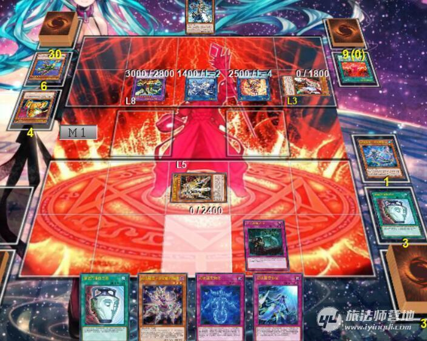

========
幻变骚灵
========

前言
========

最后更新于18/11，大部分内容作成于18/3，后面只是小修小补，陈旧内容都保留着，看的时候可以跳过。

| 幻变骚灵是坑beat，又不同于普通的坑beat卡组，它变化较多，部分细节需要一定的操作技巧。
| 本文主要介绍这个卡组系统内的运营要点，篇幅较长，看完需要一点耐心。
| 本文是\ `这个 <https://www.iyingdi.cn/web/article/yugioh/52139>`__\ 和 \ `这个 <https://www.iyingdi.cn/web/article/search/54979>`__\ 的整理。不过有些内容没有放进本文，这两篇原文还是需要看一看，特别是后一篇。

单卡介绍
========

| 幻变骚灵·网络傀儡师 光/魔法使 4星 1600/1700
| 这个卡名的②的效果1回合只能使用1次。
| ①：这张卡召唤成功时才能发动。从卡组选1张「オルターガイスト」陷阱卡在自己的魔法与陷阱区域盖放。
| ②：以自己场上1张「オルターガイスト」卡和自己墓地1只「オルターガイスト」怪兽为对象才能发动。作为对象的场上的卡送去墓地，作为对象的墓地的怪兽特殊召唤。

-  | ①效果可以规避「灰流丽」来盖下系统内陷阱卡。一般选「幻变骚灵协议」，已经存在时则选「幻变骚灵物化」。基本上站位在2或4，给预备出场的「幻变骚灵·十六巫赫斯提」提升攻击力。

-  | ②效果一般以自己场上送去墓地后能发动效果的本家怪兽为对象来发动。不选择自身，就可以规避「幽鬼兔」。

.. note:: 以自身为对象发动②效果，被「御前试合」连锁的场合，只要自己场上没有其他怪兽，由于自身送墓后自己场上已没有怪兽，可以正常把墓地对象的卡特殊召唤。

| 幻变骚灵·寻道梅露辛 水/魔法使 500/100
| 这个卡名的③的效果1回合只能使用1次。
| ①：这张卡可以直接攻击。
| ②：这张卡给与对方战斗伤害时，以对方场上1张卡为对象才能发动。那张卡送去墓地。
| ③：这张卡从场上送去墓地的场合才能发动。从卡组把「オルターガイスト・メリュシーク」以外的1只「オルターガイスト」怪兽加入手卡。

-  | 「幻变骚灵·寻道梅露辛」作为连接素材送去墓地，发动③效果，是本系列怪兽的主要检索手段之一。存在以下缺点：

   1. 被「灰流丽」无效比较受伤，损失通常召唤次数和1张场上的本家卡，可能使需要cost的其他本家陷阱无法发动效果。
   2. 很多时候连接召唤的是「连接栗子球」等连接1的怪兽，由于本家没有连接1的怪兽，这个回合不能发动「强欲而谦虚之壶」，也不能发动「幻变骚灵·多功能诈骗者」的②效果。

   | 所以，不要固化思维的想当然就这么展开。比如有「幻变骚灵协议」时直接攻表站着可能更好：不被打死可以无效1次发动，被打死则在伤害步骤不会被「灰流丽」连锁。即使对方使用魔法·陷阱卡，在资源互换中也是赚了：本身对方几乎不可能消耗魔法·陷阱卡去解「连接栗子球」。

-  | 这张卡的①②效果也相当出色，配合③效果让对方不会轻易的对它发动「神之通告」等卡片，单卡强度极高。由于必须造成伤害才能解场，对方有「连接栗子球」时必须先用其他怪兽消灭之，「装弹枪管龙」能让此卡攻击力下降到0，在内战中活用「幻变骚灵·查询昆提兰那克」挡住对方此卡则有可能改变战局。

-  | 由于十分惧怕「龙星的九支」等特殊解场的陷阱，自己场上不存在表侧表示的「幻变骚灵协议」时只直接攻击就行，不要发动效果去撞「龙星的九支」，盖下其他陷阱再等待机会一般更好。

| 幻变骚灵·多功能诈骗者 暗/魔法使 3星 1200/800
| 这个卡名的①②的效果1回合各能使用1次。
| ①：自己把陷阱卡发动的场合才能发动。这张卡从手卡特殊召唤。
| ②：这张卡特殊召唤成功的场合才能发动。从卡组把「オルターガイスト・マルチフェイカー」以外的1只「オルターガイスト」怪兽守备表示特殊召唤。这个效果发动的回合，自己不是「オルターガイスト」怪兽不能特殊召唤。

| ①效果是场合选发的诱发效果，在陷阱卡发动的连锁处理完毕时发动，不是直接连锁来发动。
| 陷阱卡的发动被无效的场合，不能发动①效果。

-  | 作为卡组展开的核心，主要的目标是「幻变骚灵·寻道梅露辛」和「幻变骚灵·泛在羽衣精」，我自己偶尔会特殊召唤「幻变骚灵·查询昆提兰那克」。由于有「幻变骚灵协议」的保护，这卡基本不会被「灰流丽」无效。
   | 手卡发效果被「增殖的G」连锁时，基本上仍会选择发动②效果，否则就是白送1卡，前场还脆，且没有续航。被「神之通告」无效并破坏的话，有「幻变骚灵物化」「幻变骚灵·网络傀儡师」则再从墓地苏生就好，都没有就没办法了。
   | 特殊召唤过非本家怪兽的回合，不能发动②效果。

.. note:: 没有成功特殊召唤非本家怪兽，就仍可以发动②效果。见\ :ref:`誓约_特殊召唤被无效`\ 。

| 作为\ :ref:`从手卡发动的诱发效果`\ ，有一些看起来比较奇特的combo：

- 「个人欺骗攻击」卡的发动时使用效果，把「幻变骚灵·多功能诈骗者」加入手卡，连锁处理后可以对应这次陷阱卡的发动跳出「幻变骚灵·多功能诈骗者」。
- 「幻变骚灵物化」苏生「幻变骚灵·泛在羽衣精」，特殊召唤成功时「幻变骚灵·泛在羽衣精」发动效果让自己场上的「幻变骚灵·多功能诈骗者」作为cost回到手卡时，可以连锁跳出「幻变骚灵·多功能诈骗者」，对应的是「幻变骚灵物化」卡的发动。
- 「幻变骚灵·寻道梅露辛」发动②效果，被「灰流丽」连锁，我方发动盖放的「幻变骚灵协议」或「神之通告」无效后，成功把「幻变骚灵·多功能诈骗者」加入手卡。这个连锁处理后可以跳出「幻变骚灵·多功能诈骗者」。被「墓穴的指名者」连锁，我方再连锁发动「幻变骚灵物化」，成功把「幻变骚灵·多功能诈骗者」加入手卡的场合也一样。
- 自己有盖放的「幻变骚灵协议」，发动「激流葬」后，要跳出「幻变骚灵·多功能诈骗者」时，可以考虑先发动「幻变骚灵物化」，再连锁发动「幻变骚灵·多功能诈骗者」：如果对方有「增殖的G」，在「幻变骚灵物化」发动时连锁发动了的话，盖放的「幻变骚灵协议」就可以把表侧表示的「幻变骚灵物化」送墓来连锁发动使其无效了。然后「幻变骚灵·多功能诈骗者」仍然可以连锁发动。

| 幻变骚灵·泛在羽衣精 风/魔法使 2星 800/1500
| 这个卡名的①②的效果1回合各能使用1次。
| ①：让这张卡以外的自己场上1张「オルターガイスト」卡回到持有者手卡，以对方场上1张卡为对象才能发动。那张卡回到持有者手卡。这个效果在对方回合也能发动。
| ②：这张卡从场上送去墓地的场合，以自己墓地1张「オルターガイスト」陷阱卡为对象才能发动。那张卡加入手卡。

| 卡组的主要干扰点之一，同时也有一定续航。通过「幻变骚灵·多功能诈骗者」或「幻变骚灵物化」就能出场，然后可以把它们用作cost。本身没有特殊召唤能力，不期待上手，一般只下2张。
| 在结束阶段出场可以弹走对方盖放的卡片，在对方只盖下1-2张时可以用这个规避陷阱。在自己抽卡阶段和准备阶段再发动1次弹走下1张即可，也可以用来配合「魔封的芳香」。
| 内战时经常使用此卡看住对方的「幻变骚灵协议」「个人欺骗攻击」，因为永续魔法·陷阱卡的效果处理时不在场上就不会处理。

-  | 由于「幻变骚灵物化」发动后会就那样留在场上，这个cost可以用发动时的「幻变骚灵物化」，通常陷阱卡处理时不在场上不影响结果，这样苏生后由于没有装备，也不存在离场破坏的副作用。
   | 「幻变骚灵物化」把它苏生，然后它用这个「幻变骚灵物化」回到手卡作为cost的场合，自身送墓又能回收，同时弹走对方场上1张卡。重新盖下「幻变骚灵物化」又能循环作战。
   | 用「幻变骚灵物化」苏生的它作素材之一，连接召唤「幻变骚灵·十六巫赫斯提」的场合可以直接回收「幻变骚灵物化」。在和「幻变骚灵·寻道梅露辛」一起作为连接素材时，让「幻变骚灵·寻道梅露辛」的③效果在连锁1，它的②效果在连锁2来自排连锁，可以规避对方的「灰流丽」。

| 幻变骚灵·查询昆提兰那克 地/魔法使 5星 0/2400
| ①：自己场上有「オルターガイスト」卡存在的场合，对方怪兽的攻击宣言时才能发动。这张卡从手卡特殊召唤，那次攻击无效。
| ②：这张卡特殊召唤成功的场合，以对方场上1张表侧表示的卡为对象才能发动。这只怪兽表侧表示存在期间，那张卡的效果无效化。

| 「幻变骚灵·查询昆提兰那克」在上位卡组中一般只放1张在side，其他文章涉及此卡的较少，而我自己在主卡组投入1张。
| 它的无效能力可以做一些「幻变骚灵·泛在羽衣精」无法办到的事情，比如无效SPYRAL场地，让取对象抗性消失。

-  | 有时资源足够但「幻变骚灵·泛在羽衣精」的回手效果是卡名1回合1次，需要它来增加1次干扰。在合适的时点特殊召唤能无效对方怪兽出场时的选发效果。
   | 例：在对方回合，对方手卡「幻变骚灵·多功能诈骗者」效果发动，自己连锁「幻变骚灵物化」苏生它，「幻变骚灵·多功能诈骗者」特召时的效果发动作为C1，它的效果发动作为C2，结果「幻变骚灵·多功能诈骗者」的效果被无效。

-  | \ :ref:`从手卡发动的诱发效果`\ 组连锁时实际上当作2速处理，假设自己场上有它和「幻变骚灵·泛在羽衣精」，对方怪兽攻击宣言时，自己可以C1「幻变骚灵·泛在羽衣精」cost回它弹1，\ **立即C2发动它的效果**\ 无效这次攻击再次特殊召唤。这个攻击无效不取对象，可以在对方回合暂时应付有取对象抗性的怪兽。
   | 同样的，对方攻击宣言时如果自己场上只有盖放的「幻变骚灵协议」/「幻变骚灵物化」，可以发动它们作为C1，再让手卡的它作为C2连锁发动。不必提前发动。
   | 此卡效果没有发动次数限制，没有使用过效果的「幻变骚灵·泛在羽衣精」和此卡可以合计阻挡3次对方怪兽的攻击。若有「个人欺骗攻击」则能阻挡4次。
   | 自己场上没有「幻变骚灵」卡，对方怪兽攻击宣言时发动非本家的陷阱卡，跳出「幻变骚灵·多功能诈骗者」导致卷回，对方怪兽重新选择攻击对象时不是攻击宣言时，自己手卡的此卡无法发动效果。所以一般要在战斗阶段开始时让「幻变骚灵」卡出场。

-  | 现在，这卡不作为发动的效果，不能无效「隐藏的机壳杀手-物质主义」等怪兽。
   | 「幻变骚灵·查询昆提兰那克」在②效果适用后再进入无效状态，对象卡片仍然无效。

| 幻变骚灵协议 永续陷阱 
| 这个卡名的②的效果1回合只能使用1次。
| ①：只要这张卡在魔法与陷阱区域存在，自己场上的「オルターガイスト」卡的效果的发动以及那些发动的效果不会被无效化。
| ②：对方把怪兽的效果发动时，把这张卡以外的自己场上1张表侧表示的「オルターガイスト」卡送去墓地才能发动。那个发动无效并破坏。

-  | ①效果保证\ **场上**\ 的本家效果发动时不会被反制，②效果又能直接无效1次怪兽效果的发动并破坏。基本上对战中会争取尽快盖下此卡并成功发动。
   | 由于魔法·陷阱卡的发动时已经在场上，因此这张卡适用中，「幻变骚灵」陷阱卡的发动也不会被无效。此外，已经表侧表示存在时，自身②效果的发动也被保护，不会被「狱火机·拿玛」等效果无效。

-  | 不能完全防御「无限泡影」等效果无效卡。这个效果只保护需要发动的效果，不保护卡片本身，卡片仍然会进入无效状态。「幻变骚灵·寻道梅露辛」的直接攻击能力这样的不入连锁效果仍然会因「无限泡影」而被无效。
   | 例：
   | 与「幻变骚灵协议」同一纵列的「无限泡影」发动的场合，由于「幻变骚灵协议」不是防御「幻变骚灵」卡本身，作为对象的「幻变骚灵」怪兽被无效后，继而「幻变骚灵协议」也被无效，从而成功无效效果。
   | 「幻变骚灵协议」的①效果适用中，「幻变骚灵」怪兽效果发动时，对方连锁对其发动「闪刀机-黑寡妇抓锚」，且墓地有3张以上魔法卡时，「幻变骚灵」怪兽进入无效状态，控制权被夺取，但这个效果处理时正常适用效果，不会无效。
   | 场上存在已经被「无限泡影」无效的「幻变骚灵·十六巫赫斯提」，连接着「幻变骚灵·寻道梅露辛」，由于效果无效，攻击力保持1500。对方发动魔法卡，「幻变骚灵·十六巫赫斯提」的效果连锁发动，再连锁3发动「幻变骚灵协议」，这次效果处理就不会无效，结果魔法卡的发动被无效。

-  手卡·墓地发动的效果无法保护，这可能是个\ **致命破绽**\ 。比如「幻变骚灵·寻道梅露辛」作连接素材送墓被「灰流丽」连锁，或者手卡「幻变骚灵·多功能诈骗者」效果发动时被「神之通告」连锁等。在手卡质量尚可时，尽可能先用受保护的卡片展开，不要让自己陷入只能用手卡·墓地的效果展开的境地。

-  | 此卡已经在场上表侧表示存在时，要\ **注意对方的「幽鬼兔」**\ 。永续陷阱处理时不在场上效果不适用，由于这个效果还要送墓1卡作为cost，基本上比「自然兽」被「幽鬼兔」还亏。伤害步骤这个效果也能发动，是「幽鬼兔」和各种风的盲点，此时即使已经表侧表示也可以大胆发动效果了。
   | 当我方场上有表侧和盖放合计2张「幻变骚灵协议」，对方怪兽效果发动时，把表侧的送墓发动盖放的「幻变骚灵协议」也是规避「幽鬼兔」的常见操作。
   | 如果是2张盖放的，要规避对方「龙星的九支」等发动无效，那就应该提前发动1张盖放的逼迫对面选择是否无效。成功发动的场合，再在对方怪兽效果发动时，把自己场上的怪兽送去墓地，发动盖放的另1张同时使用效果。

-  | 内战时要保证自己场上有表侧表示的本家卡提供cost，例如在准备阶段发动「幻变骚灵物化」。否则在主要阶段让过1次「幻变骚灵·网络傀儡师」的效果，就有可能被对方抢回节奏甚至翻盘。

-  由于cost是送去墓地，对方场上的「M·HERO·暗爪」或者「大宇宙」等效果适用中，无法发动这张卡的②效果。「次元的裂缝」的场合仍可以把陷阱卡送去墓地来发动。

-  | 自己盖放了此卡和其他永续陷阱，有表侧表示的本家卡时，要跳出「幻变骚灵·多功能诈骗者」的话，应该用其他永续陷阱。这样即使对方发动「增殖的G」，也可以连锁无效掉。如果作此卡的发动，对方立即连锁「增殖的G」的话，由于在永续陷阱卡的发动连锁上不能再发动效果，「增殖的G」就会适用了。

-  | 让自己场上的「幻变骚灵协议」回手，或者「幻变骚灵·网络傀儡师」把「幻变骚灵协议」送墓，用「幻变骚灵·泛在羽衣精」的②效果再回收，都可以让「幻变骚灵协议」只作卡的发动，以规避「幽鬼兔」。
   | 「幻变骚灵·网络傀儡师」盖放第2张「幻变骚灵协议」，把已经表侧的「幻变骚灵协议」送去墓地来发动也是常见规避「幽鬼兔」的操作。

| 幻变骚灵物化 通常陷阱 这个卡名的卡的②效果1回合只能使用1次。
| ①：以自己墓地1只「オルターガイスト」怪兽为对象才能把这张卡发动。那只怪兽攻击表示特殊召唤，把这张卡当作装备卡使用给那只怪兽装备。这张卡离开场上时那只怪兽破坏。
| ②：把墓地的这张卡除外，以自己墓地1张「オルターガイスト」陷阱卡为对象才能发动。那张卡加入手卡。

-  | 不仅可以苏生本家的连接怪兽，作为通常陷阱，处理时不在场上效果也适用，此时还是完全苏生，不存在离场破坏的副作用。
   | 利用这点有以下3个combo：

   1. C1发动「幻变骚灵物化」被对方怪兽效果连锁时，C3发动「幻变骚灵协议」的②效果，把「幻变骚灵物化」送去墓地作为cost，让对方怪兽效果的发动无效并破坏。自己怪兽成功特殊召唤。
   2. C1发动「幻变骚灵物化」，C2发动「幻变骚灵·泛在羽衣精」的①效果，让这个「幻变骚灵物化」回到手卡作为cost，取对方场上1张卡为对象使其返回手卡。
   3. C1发动「幻变骚灵物化」，C2发动「个人欺骗攻击」的效果，让这个「幻变骚灵物化」回到卡组作为cost，从卡组选1张「幻变骚灵」怪兽加入手卡。

   .. attention::

      | 不推荐第3个combo：尽量不要让其回到卡组。
      | 比较浅显的原因是它在墓地有效果，还有1个原因是可以简单的配合「幻变骚灵·泛在羽衣精」循环作战：苏生「幻变骚灵·泛在羽衣精」，发动「幻变骚灵·泛在羽衣精」的效果，让「幻变骚灵物化」回手，弹1，然后再盖放。「幻变骚灵·泛在羽衣精」被副作用送墓后还能再回收1张陷阱。
      | 在「幻变骚灵·多功能诈骗者」的介绍中提到了用发动中的它作「幻变骚灵协议」的cost无效「增殖的G」。如果对方不在这个时点连锁发动，自己就误以为对方没有，而在「幻变骚灵·多功能诈骗者」的效果连锁发动后，为了卡差自作聪明的发动「个人欺骗攻击」让它作为cost回到卡组时，对方才连锁发动「增殖的G」的话，盖放的「幻变骚灵协议」没有cost发动不了，我方就会十分难受。

   .. note:: 对方即使这样操作也很正常，熟悉幻变骚灵的玩家会知道先开「幻变骚灵物化」大概率是骗2速效果，除了「墓穴的指名者」外，不连锁发动确实比较稳妥。也因此，手卡有「幻变骚灵·多功能诈骗者」时，「幻变骚灵物化」最好不要取墓地的「幻变骚灵·多功能诈骗者」为对象。

-  | ②效果用的状况不多。大部分的状况下是用「幻变骚灵·泛在羽衣精」的②效果去回收，因为把它除外后就真的再也回不来了。1个简单的操作是用它苏生「幻变骚灵·泛在羽衣精」，再发动「幻变骚灵·泛在羽衣精」的①效果，让它回手，此时「幻变骚灵·泛在羽衣精」因它的副作用被破坏，选择对方场上1张卡回手，然后「幻变骚灵·泛在羽衣精」发动②效果回收陷阱卡。
   | 那么一般什么时候用这个效果呢？开局和「幻变骚灵协议」一起盖放，被「鹰身女妖的羽毛扫」破坏后就可以随时回收「幻变骚灵协议」。每多1次陷阱发动，就多1分用「幻变骚灵·多功能诈骗者」翻盘的机会。

| 个人欺骗攻击 永续陷阱
| ①：1回合1次，从手卡以及自己场上表侧表示的卡中让1张「オルターガイスト」回到持有者卡组才能发动。从卡组将1只「オルターガイスト」怪兽加入手卡。

-  没有本家字段是一大缺点，由于这张卡的发动时使用效果把「幻变骚灵·多功能诈骗者」加入手卡的场合可以直接发动「幻变骚灵·多功能诈骗者」的效果，必须满3来追求上手。

-  | 作为永续陷阱，此卡也惧怕「幽鬼兔」。所以很多时候1局中可能只使用1次效果。虽然操作者要抱着只使用1次的最坏打算，但是对方却要实实在在的应付这卡的潜在威胁，即使真的只用了1次，也可以说是达到期望了。
   | 这张卡的效果还能被「灰流丽」无效，由于没有本家字段，「幻变骚灵协议」无法保护。因此在场上存在「幻变骚灵协议」时发动效果的场合最好在场上留下1个本家怪兽，让「幻变骚灵协议」为此卡护航。

-  | 有这卡时就不会很惧怕对方的「拮抗胜负」，例如召唤「幻变骚灵·网络傀儡师」盖下「幻变骚灵协议」，再只盖下这卡。对方发动「拮抗胜负」，可以连锁发动这卡，手卡有就选手卡的「幻变骚灵」回到卡组，让「幻变骚灵协议」保护不被「灰流丽」。没有只能选场上的「幻变骚灵·网络傀儡师」，如果没被无效，选这卡里侧除外，相当于对方只换了这1张卡。

.. note:: 为什么「个人欺骗攻击」卡的发动时检索「幻变骚灵·多功能诈骗者」可以立即特殊召唤，手卡诱发效果如何判断发动时点？

   | 首先要明确的是，手卡的诱发效果具有这样的特权：\ **在连锁中满足发动条件的时点，即使还不在手卡也没关系，只要连锁处理完毕时在手卡，就可以发动效果。**
   | 这么一句话可能还是很糊涂，我想也没几个人选择去重新翻连锁相关的内容，所以这里就介绍1个简易判断方法：\ **只要假设本身已经在手卡，来看最后是否能发动就可以了**\ 。
   | 假设手中本来就有「幻变骚灵·多功能诈骗者」，「个人欺骗攻击」卡的发动的连锁处理完毕时，这个「幻变骚灵·多功能诈骗者」的效果自然可以发动。因此，本来没有的场合既然检索上手也能发动。
   | 再举个用这个方法判断不能的例子：通常召唤「光天使 天杖」，发动效果把「光天使 天座」加入手卡，这个时点这张「光天使 天座」的效果不能发动。
   | 假设手中本来就有「光天使 天座」，通常召唤「光天使 天杖」成功时，这张「光天使 天座」的效果必须连锁「光天使 天杖」的效果发动，这个时点放弃就不再满足发动条件了。在「光天使 天杖」的效果处理完的时点，显然已经不能发动了。

.. attention:: 不要误以为场合效果可以无限制延后发动。上面例子中，在通常召唤成功时这个时点过去后，「光天使 天座」的场合效果仍然不能发动了。时选发在处理途中满足条件会错过时点，场合选发可以在这个处理完毕时发动。仅此而已，不能再往后延后。

.. tip:: 「个人欺骗攻击」卡的发动上手「幻变骚灵·多功能诈骗者」时可以规避对方的「三叉龙之影灵衣」「M·HERO·暗爪」

   | 以「三叉龙之影灵衣」为例，自己手卡只留下1张「幻变骚灵」卡，引诱对方出「三叉龙之影灵衣」。对方仪式魔法发动时，连锁发动「个人欺骗攻击」并使用效果，让手卡的「幻变骚灵」卡回到卡组，检索「幻变骚灵·多功能诈骗者」。「三叉龙之影灵衣」仪式召唤成功，发动效果作为C1，自己「幻变骚灵·多功能诈骗者」效果发动作为C2，结果「三叉龙之影灵衣」效果处理时我方没有手卡，完全不处理。这样既省了1次「幻变骚灵协议」，还不用担心对方「影灵衣之术士 施里特」的自排连锁。

| 幻变骚灵·十六巫赫斯提 炎/魔法使 连接·效果 LINK2 ATK1500 [↓→]
| 「オルターガイスト」怪兽2只
| 这个卡名的③的效果1回合只能使用1次。
| ①：这张卡的攻击力上升这张卡所连接区的「オルターガイスト」怪兽的原本攻击力数值。
| ②：魔法·陷阱卡的效果发动时，把这张卡所连接区1只「オルターガイスト」怪兽解放才能发动。那个发动无效并破坏。
| ③：这张卡从场上送去墓地的场合才能发动。从卡组把1张「オルターガイスト」卡加入手卡。

| 强度极高的LINK2怪兽，可以无效效果的发动，并且没有次数限制。由于「幻变骚灵物化」和「幻变骚灵·多功能诈骗者」的特殊召唤能力，很多时候可以无效3次以上。

-  | 有时候其实不必非要出这个LINK2，举个例子：自己场上有「幻变骚灵·多功能诈骗者」和「幻变骚灵·寻道梅露辛」，是不是就要出它，再「幻变骚灵·寻道梅露辛」检索「幻变骚灵·网络傀儡师」并通常召唤在连接端发动效果盖下本家陷阱卡？
   | 确实是很流畅且强力的combo。不过，在文章开头就有提到，「幻变骚灵·寻道梅露辛」的效果被「灰流丽」无效时很可能致死。这个状况中也一样，如果被「灰流丽」无效，则「幻变骚灵·十六巫赫斯提」直接硬直，基本就崩盘了。所以，一定要先考虑好自己的所有手卡，只出个「连接栗子球」再检索探探情况也未尝不可，在自己场上还有「幻变骚灵·泛在羽衣精」/「个人欺骗攻击」的情况下，即使被「灰流丽」无效，由于留下了「幻变骚灵·多功能诈骗者」，基本不会受到什么影响。而他们并不能让从额外出场的「幻变骚灵·十六巫赫斯提」回到手卡/卡组。
   | 进一步的，如果自己场上有「幻变骚灵协议」，这么做就没有什么问题了。直接把「幻变骚灵·十六巫赫斯提」送墓来无效「灰流丽」就行。这样既拿到了「幻变骚灵·网络傀儡师」盖放本家陷阱，「幻变骚灵·十六巫赫斯提」还能再拿个「幻变骚灵物化」，再视自己盖放的陷阱决定「幻变骚灵·网络傀儡师」送墓自身还是表侧的「幻变骚灵协议」来苏生「幻变骚灵·多功能诈骗者」/「幻变骚灵·寻道梅露辛」，结果几乎没受影响的流畅展开了。
   | 这里没有考虑自己「幻变骚灵协议」是否已经表侧，对方是否还有「旋风」「长眠不醒的噩梦」「幽鬼兔」等情况，若有则仍然崩盘。

投入率较低的卡片
----------------

以下卡片都可以不投入。这里介绍一下部分卡组为何要投入这些卡片。

| 幻变骚灵·击键录杜尔迦 暗/魔法师 连接·效果 LINK2 ATK 1000 [←↓]
| 「幻变骚灵」怪兽2只
| ①：这张卡以外的自己的「幻变骚灵」怪兽给与对方战斗伤害时，以对方墓地1只怪兽为对象才能发动。那只怪兽在作为这张卡所连接区的自己场上特殊召唤。这个效果特殊召唤的怪兽不在这张卡攻击宣言过的回合不能攻击。
| ②：这张卡被战斗破坏的场合，以自己墓地1张「幻变骚灵」卡为对象才能发动。那张卡加入手卡。

-  | 除了怕「幻变骚灵·十六巫赫斯提」被「浮幽樱」等原因，一般投入这卡只是为了这个combo：
   | 这张卡在场，「幻变骚灵·寻道梅露辛」直接攻击的伤害计算后，以对方场上的「闪刀姬」连接怪兽为对象发动效果，以对方墓地的「闪刀姬·零衣」为对象发动这张卡的①效果，任意顺序排连锁就可以成功瓦解闪刀卡组的前场防御。

   .. attention:: 要使用这个效果，自己就不能在这个回合发动「幻变骚灵·多功能诈骗者」的②效果。

| 幻变骚灵·隐私王班西 暗/魔法师 连接·效果 LINK 3 ATK: 2100 [↓↘→]
| 「幻变骚灵」怪兽2只以上 
| 这个卡名的①②的效果1回合各能使用1次。
| ①：自己·对方的主要阶段把这张卡以外的自己场上1只「幻变骚灵」怪兽解放才能发动。从卡组把1只「幻变骚灵」怪兽在作为这张卡所连接区的自己场上特殊召唤。
| ②：这张卡从场上送去墓地的场合，以自己墓地1张「幻变骚灵」卡为对象才能发动。那张卡加入手卡。

-  | 一般来说，能用3只「幻变骚灵」怪兽，就应该至少通过「幻变骚灵·十六巫赫斯提」检索到「幻变骚灵·多功能诈骗者」，这卡①效果基本用不上。
   | 并且，回收怪兽有「幻变骚灵·网络傀儡师」，回收陷阱有「幻变骚灵·泛在羽衣精」，这卡②效果也基本用不上。
   | 所以如果要投入这卡，其实是因为有2100的攻击力。放在「幻变骚灵·十六巫赫斯提」的连接端，这个「幻变骚灵·十六巫赫斯提」的攻击力就是3600，可以干掉「装弹枪管龙」「RR 究极猎鹰」等怪兽。具体步骤见combo展示部分。

| 幻变骚灵·模拟精灵 永续陷阱
| ①：这张卡发动后变成效果怪兽（魔法师族·光·4星·攻1400/守1800）在怪兽区域特殊召唤。这张卡也当作陷阱卡使用。 
| ②：只要这张卡的效果特殊召唤的这张卡在怪兽区域存在，这张卡以外的自己场上的「幻变骚灵」陷阱卡不会成为效果的对象，不会被效果破坏。 

-  | 这卡②效果不能保护自身，还要注意只能保护表侧表示的本家陷阱。
   | 一般来说，投入这卡就是为了凑个素材，而不是因为②效果。例如开局用「幻变骚灵·网络傀儡师」盖下这卡，如果是「幻变骚灵物化」有在T3墓地没怪而不能发动的风险。

combo展示
=========

| 在对方回合EP跳出「幻变骚灵·多功能诈骗者」反杀

| 在对方回合卖血到EP，发动1张陷阱，然后发动手卡的「幻变骚灵·多功能诈骗者」的效果，特殊召唤后把卡组的「幻变骚灵·寻道梅露辛」特殊召唤。
| 自己回合，「幻变骚灵·寻道梅露辛」直接攻击，把对方场上1张卡送去墓地，连接召唤「幻变骚灵·十六巫赫斯提」，「幻变骚灵·寻道梅露辛」的效果把「幻变骚灵·网络傀儡师」加入手卡。
| 通常召唤「幻变骚灵·网络傀儡师」，发动①效果盖放「幻变骚灵协议」。再发动②效果把「幻变骚灵·十六巫赫斯提」送去墓地，特殊召唤「幻变骚灵·多功能诈骗者」，「幻变骚灵·十六巫赫斯提」的效果把「幻变骚灵物化」加入手卡，「幻变骚灵·多功能诈骗者」特殊召唤「幻变骚灵·泛在羽衣精」。「幻变骚灵·泛在羽衣精」的①效果发动，让「幻变骚灵·多功能诈骗者」回手，让对方场上1张卡回到手卡。盖放「幻变骚灵物化」，在对方回合抽卡阶段/准备阶段发动，苏生「幻变骚灵·十六巫赫斯提」在「幻变骚灵·网络傀儡师」左侧。
| 结果：「幻变骚灵·十六巫赫斯提」可以无效1次魔法·陷阱效果的发动，之后发动盖放的「幻变骚灵协议」，跳出「幻变骚灵·多功能诈骗者」拉「幻变骚灵·寻道梅露辛」在连接端，又可以无效1次，并且还能检索1张本家怪兽。而「幻变骚灵协议」可以无效1次怪兽效果的发动，「幻变骚灵·泛在羽衣精」可以让1张卡回手，总的来说就是1卡→解2卡+场面5卡+2次魔陷无效+1次怪效无效+1次2速回手。
| \*这个combo用到能瞬间逆转战局，请多多体会「幻变骚灵·多功能诈骗者」的强度以及这个卡组的展开套路。

- | 变式：永续陷阱是「幻变骚灵协议」
   | 前面流程同上。通常召唤「幻变骚灵·网络傀儡师」（要在3号位/5号位），发动①效果盖放「幻变骚灵物化」，发动②效果把这个「幻变骚灵协议」送去墓地，特殊召唤「幻变骚灵·多功能诈骗者」，拉出「幻变骚灵·泛在羽衣精」，连接召唤第2个「幻变骚灵·十六巫赫斯提」，在第1个下方和「幻变骚灵·网络傀儡师」的左端。「幻变骚灵·泛在羽衣精」回收「幻变骚灵协议」。
   | 结果：对方第2次发动魔法·陷阱卡的效果时，解放主怪兽区域的「幻变骚灵·十六巫赫斯提」无效后，可以检索「幻变骚灵·多功能诈骗者」，再发动「幻变骚灵物化」苏生这个「幻变骚灵·十六巫赫斯提」，跳出「幻变骚灵·多功能诈骗者」在连接端，拉「幻变骚灵·泛在羽衣精」，就又是2次魔陷无效。本身少弹了1次，总的来说是2卡→解1卡+场面5卡+4次魔陷无效+1次怪效无效+1次2速回手

- | 变式：除永续陷阱外，还有1张盖放的「幻变骚灵物化」/墓地有任意本家怪兽，自己只有1张盖放的「幻变骚灵物化」
   | 前面流程同上。在3号位/5号位通常召唤「幻变骚灵·网络傀儡师」，①效果盖放「幻变骚灵协议」。「幻变骚灵物化」苏生「幻变骚灵·多功能诈骗者」拉「幻变骚灵·泛在羽衣精」，连接召唤第2个「幻变骚灵·十六巫赫斯提」，回收「幻变骚灵物化」。
   | 结果同上。
   | 此外，2个「幻变骚灵·十六巫赫斯提」+「幻变骚灵·网络傀儡师」的场子，也可以再把EX区域的「幻变骚灵·十六巫赫斯提」和「幻变骚灵·网络傀儡师」连接召唤「幻变骚灵·隐私王班西」在主怪兽区域的「幻变骚灵·十六巫赫斯提」的连接端，检索1张「幻变骚灵物化」。这样「幻变骚灵·十六巫赫斯提」的攻击力是3600，足以解决对方的「装弹枪管龙」/「RR 究极猎鹰」

| 不做场，要解场，怎么做？
| 在EP发动，跳出并特殊召唤「幻变骚灵·寻道梅露辛」。
| 自己回合，「幻变骚灵·寻道梅露辛」直接攻击，把对方场上1张卡送去墓地，连接召唤「幻变骚灵·十六巫赫斯提」，「幻变骚灵·寻道梅露辛」的效果把「幻变骚灵·网络傀儡师」加入手卡。
| 通常召唤「幻变骚灵·网络傀儡师」，发动①效果盖放「幻变骚灵物化」。再发动②效果把自身送去墓地，苏生「幻变骚灵·寻道梅露辛」，作为素材连接召唤「连接栗子球」。
| 「连接栗子球」和「幻变骚灵·十六巫赫斯提」送去墓地，连接召唤「星杯战士 宁吉尔苏」，「幻变骚灵·十六巫赫斯提」的效果检索1张「幻变骚灵」卡。
| 「星杯战士 宁吉尔苏」发动效果，把盖放的「幻变骚灵物化」和对方场上1张卡送去墓地。这个效果不取对象，可以选「装弹枪管龙」。

.. attention:: 在对方回合，对方「装弹枪管龙」可以在自己陷阱卡发动的连锁处理完毕时先发动效果，这样自己「幻变骚灵·多功能诈骗者」就不能连锁，结果不能在这次发动了。详见\ :ref:`优先权何时会发生转移`\ 。

运营要点
==========

这副卡组，解场、打断、检索、展开、续航都不唯一：

- 解场：「幻变骚灵·寻道梅露辛」「幻变骚灵·泛在羽衣精」
- 打断：「幻变骚灵·泛在羽衣精」「幻变骚灵·十六巫赫斯提」「幻变骚灵协议」
- 检索：「幻变骚灵·寻道梅露辛」「幻变骚灵·十六巫赫斯提」「幻变骚灵·多功能诈骗者」（严格来说从卡组特殊召唤不叫检索）
- 展开：「幻变骚灵·多功能诈骗者」「幻变骚灵·网络傀儡师」「幻变骚灵物化」
- 续航：「幻变骚灵·网络傀儡师」「幻变骚灵·泛在羽衣精」「幻变骚灵物化」

也就是说，只要初动没问题，对方只有单点打断的话基本没有意义。此外，内战时使用「墓穴的指名者」也不会太影响自己。

-  | 「幻变骚灵·泛在羽衣精」的回收对象不一定是「幻变骚灵·多功能诈骗者」，「幻变骚灵·寻道梅露辛」的检索也一样。
   | 自己场上只有「幻变骚灵·泛在羽衣精」「幻变骚灵·多功能诈骗者」和表侧表示的「幻变骚灵协议」时，「幻变骚灵·泛在羽衣精」应该先回收「幻变骚灵协议」。这样再盖放后，在对方回合回收「幻变骚灵·多功能诈骗者」，再发动就可以跳出了。
   | 如果先回收「幻变骚灵·多功能诈骗者」，由于没有陷阱诱发，即使在对方回合再回收「幻变骚灵协议」，也要等自己回合盖放，再等对方回合发动，慢了2个回合。
   | 自己没有陷阱卡的场合，「幻变骚灵·寻道梅露辛」的检索也同理，应该选「幻变骚灵·网络傀儡师」先弄出陷阱，本身它还有1个苏生的能力，即使墓地没有「幻变骚灵·多功能诈骗者」，也可以苏生「幻变骚灵·寻道梅露辛」。
   | 在墓地有「幻变骚灵·多功能诈骗者」的情况下，「幻变骚灵·泛在羽衣精」把「幻变骚灵·网络傀儡师」作为cost回收也可能比回收「幻变骚灵·多功能诈骗者」更好。

-  | 手卡有「幻变骚灵·网络傀儡师」「幻变骚灵·寻道梅露辛」，出哪个？
   | 自然需要分情况。当手卡已有「幻变骚灵协议」时，自然是拍「幻变骚灵·寻道梅露辛」（解场并在M2）看情况选择是否作连接素材拿「幻变骚灵·多功能诈骗者」。
   | 对方场上有盖卡或者有怪兽效果反制，这时也经常拍「幻变骚灵·寻道梅露辛」进行试探。
   | 此外，在手卡没有陷阱卡或者只有系列外陷阱的时候，很多时候其实我会先拍「幻变骚灵·网络傀儡师」盖张「幻变骚灵协议」再说，即使对面不是空场「幻变骚灵·网络傀儡师」很有可能死亡。为什么不用「幻变骚灵·寻道梅露辛」解场？
   | 这里要提一点，\ **一时的场面卡差**\ 对幻变骚灵来说没有那么重要。从之前的combo介绍就可看出，「幻变骚灵·多功能诈骗者」1张卡就可以铺场反杀并做康。假设用「幻变骚灵·寻道梅露辛」解场拿了「幻变骚灵·多功能诈骗者」，在没有陷阱时仍然要到自己回合通召「幻变骚灵·网络傀儡师」盖「幻变骚灵协议」，这就十分无力了：一来此时可能出现了能反制「幻变骚灵·网络傀儡师」无法盖下「幻变骚灵协议」的卡片，二来「幻变骚灵·多功能诈骗者」还要再等1回合开「幻变骚灵协议」才能跳。即使有其他陷阱，「幻变骚灵·多功能诈骗者」也有吃「灰流丽」的风险。
   | 而如果先盖下「幻变骚灵协议」，则在对方回合多了1次怪效康，到自己回合「幻变骚灵·寻道梅露辛」还能保证解场，再可以作素材拿「幻变骚灵·多功能诈骗者」，如果留住了「幻变骚灵·网络傀儡师」或者有「幻变骚灵物化」，「幻变骚灵·寻道梅露辛」就不惧「灰流丽」了。即使没有，也可以不连接召唤，在对方回合作cost或者被战斗破坏来检索「幻变骚灵·多功能诈骗者」。
   | 总而言之，虽然先出「幻变骚灵·寻道梅露辛」可能收益更大，但是后场的「幻变骚灵协议」也是安心展开的保证，由于陷阱卡本身要慢1回合，所以要争取尽早发动它。不惧「灰流丽」，能稳定检索它的「幻变骚灵·网络傀儡师」性能就很优秀。幻变骚灵这个卡组绝不是仅仅靠「幻变骚灵·多功能诈骗者」反复特殊召唤就能概括的，只是一味的追求「幻变骚灵·多功能诈骗者」，就有可能后方不稳。要记住，\ **后场的「幻变骚灵协议」是展开的保证**\ 。

-  | 手里有「强欲而谦虚之壶」和「幻变骚灵·寻道梅露辛」，出「连接栗子球」么？
   | 还是分情况。在需要解场的时候，尽量先打一下解场再M2看情况决定。个人来说不太影响的话还是先开「强欲而谦虚之壶」，毕竟「幻变骚灵·寻道梅露辛」在对方回合因各种情况死了也能检索，并没有那么急迫。而「强欲而谦虚之壶」在这副卡组中往往能拿到强力卡片。即使是对方有「灰流丽」的情况，「强欲而谦虚之壶」被无效总好过「幻变骚灵·寻道梅露辛」被无效。当然，对方可能不无效「强欲而谦虚之壶」，这时我方可以再按检索的卡片进行其他操作。

其他问题
==========

   如何解「装弹枪管龙」？

| 「幻变骚灵·多功能诈骗者」+「幻变骚灵协议」的combo上面已经提过了。此外，「幻变骚灵·多功能诈骗者」单卡combo中，先「幻变骚灵·寻道梅露辛」连接召唤「连接栗子球」，检索「幻变骚灵·网络傀儡师」，通常召唤发动效果盖放陷阱卡后，和「幻变骚灵·多功能诈骗者」连接召唤「幻变骚灵·十六巫赫斯提」，就可以和「连接栗子球」连接召唤「星杯战士 宁吉尔苏」，「幻变骚灵·十六巫赫斯提」检索「幻变骚灵物化」。最后选「幻变骚灵·网络傀儡师」盖下的陷阱卡和「装弹枪管龙」送去墓地。
| 这里「幻变骚灵·网络傀儡师」还能发动效果让「幻变骚灵·多功能诈骗者」送去墓地，特殊召唤「幻变骚灵·泛在羽衣精」，这样连接召唤还能多回收1张陷阱卡。
| 除上面的combo外，更多情况可能需要2~4个回合来斡旋出自己的「装弹枪管龙」或者「幻变骚灵·十六巫赫斯提」连接「幻变骚灵·隐私王班西」使攻击力上升至3600。
| 此外，必要时可以用「浮幽樱」去除对方额外的此卡。
| 「幻变骚灵协议」要尽早出现威慑「装弹枪管龙」不去发动③效果。
| 关于其②效果的干扰能力：
| 对「幻变骚灵·查询昆提兰那克」：在对方「装弹枪管龙」攻击宣言时优先权还在对方，发动不能被连锁的②效果就可以让手卡的「幻变骚灵·查询昆提兰那克」无法发动。
| 对「幻变骚灵·多功能诈骗者」：对方回合，自己陷阱卡发动的连锁处理完毕时，由于对方作为回合玩家持有优先权，可以先发动「装弹枪管龙」的②效果，由于自己不能连锁这个效果，不能发动手卡「幻变骚灵·多功能诈骗者」的①效果。在自己回合，自己陷阱卡发动的连锁处理完毕时，由于自己作为回合玩家持有优先权，对方「装弹枪管龙」无法阻止自己「幻变骚灵·多功能诈骗者」的①效果发动。
| 理解不了？可以参考→\ :ref:`优先权`\ 。

   如何解「冲浪检察官」？

| 一个方法是使用「电子龙」「海龟坏兽 加美西耶勒」，还能配合「嵌合巨舰龙」「幻变骚灵·泛在羽衣精」。
| 此外，「水晶机巧 继承光纤」可以在对方回合变成「生命激流龙」「瑚之龙」。后者在自己回合也能通过手坑调整和「幻变骚灵·多功能诈骗者」等方式出场。
| 相比下面这个方法，由于是在对方回合再变身，如果用「幻变骚灵·寻道梅露辛」作LINK素材，那么可以放心的发动其效果多1张检索。
| 在自己回合，「水晶机巧 继承光纤」特殊召唤怪兽后可以变成「梦幻崩影·独角兽」。
| 由于上述都要凑2个怪兽，除此之外，可以投入「波纹防护罩-波浪之力-」等陷阱卡，还能在内战时阻挡「幻变骚灵·寻道梅露辛」。

实战示例
========

这次对局，对方是ABC召唤师，对方整体运转十分流畅，我方轻微卡手。

.. figure:: ../.static/c04/Altergeist_1.jpeg
   :alt: image.jpeg

场面：「幻变骚灵·多功能诈骗者」是本来就有的，「个人欺骗攻击」仅仅进行了卡的发动。「水晶机巧
继承玻纤」特殊召唤的「幽鬼兔」当回合不能发动效果。对方融合召唤了「召唤兽
梅尔卡巴」，我方对其发动「幻变骚灵·泛在羽衣精」效果让「幻变骚灵·多功能诈骗者」回手，对方丢弃「幻兽机飞狮」无效之，我方连锁「个人欺骗攻击」
的效果，「幻变骚灵·泛在羽衣精」回到卡组，「幻变骚灵·查询昆提兰那克」上手。

对方攻宣时由于「幻变骚灵物化」在场并特召了「幻变骚灵·寻道梅露辛」，用「幻变骚灵·查询昆提兰那克」无效了「召唤兽
梅尔卡巴」。

对方M2，「召唤兽 梅尔卡巴」和「水晶机巧
继承玻纤」出「召唤女巫」点衍生物一套操作后，场上是「ABC-神龙歼灭者」「代理龙」「防火龙」「幽鬼兔」。「ABC-神龙歼灭者」发动效果，丢1手卡除外了「幻变骚灵·寻道梅露辛」，「幻变骚灵物化」送墓。

.. figure:: ../.static/c04/Altergeist_2.jpeg
   :alt: image.jpeg

抽卡，又是1张「强欲而谦虚之壶」，发动后结果拿到了「幻变骚灵协议」。于是盖下「幻变骚灵协议」「强欲而谦虚之壶」「幻变骚灵物化」。对方没有发动效果。

| 对方抽卡抽到了第二张「幽鬼兔」，于是「召唤师
  阿莱斯特」拿了「召唤魔术」后和场上的「幽鬼兔」出「水晶机巧
  继承玻纤」拉个「成长的鳞茎」，就打过来了，「防火龙」战斗破坏「幻变骚灵·查询昆提兰那克」（此时墓地只有这1张，战斗破坏之前「幻变骚灵物化」无法发动），接着吃下了3000+1400+1500=5900伤害。

战斗阶段结束时，我方发动「幻变骚灵物化」苏生「幻变骚灵·查询昆提兰那克」，对方「ABC-神龙歼灭者」连锁发动效果，我方C3连锁「幻变骚灵协议」送墓「幻变骚灵物化」无效之，对方「代理龙」破坏「防火龙」（不破坏也是查询无效防火），之后「幻变骚灵·多功能诈骗者」跳出特召「幻变骚灵·泛在羽衣精」弹回「ABC-神龙歼灭者」，对方M2再出「召唤兽
梅尔卡巴」也没用了，投。

.. figure:: ../.static/c04/Altergeist_4.jpeg
   :alt: image.jpeg

| 这一局中对方操作虽然可改变的细节较多，但仍然只是加速死亡与否的结局，真正压死的情况应该只有在我方回合结束阶段发动效果在3张卡之中点中除外了刚盖放的「幻变骚灵协议」。
| 随便举个不是这样操作的结果：「ABC-神龙歼灭者」在结束阶段丢1手卡发动效果，除外了「幻变骚灵物化」。在自己回合丢1手卡发动效果，点中「幻变骚灵协议」（此时没有手卡了），连锁翻开，之后被除外。「幻变骚灵·多功能诈骗者」跳出，特殊召唤「幻变骚灵·泛在羽衣精」让「幻变骚灵·查询昆提兰那克」回手，弹回「ABC-神龙歼灭者」，则「代理龙」「防火龙」「幽鬼兔」无法过「幻变骚灵·泛在羽衣精」「幻变骚灵·查询昆提兰那克」「个人欺骗攻击」的防线。即使「防火龙」「幽鬼兔」在「幻变骚灵·多功能诈骗者」效果发动时连锁，破坏「幻变骚灵·多功能诈骗者」并使「幻变骚灵·查询昆提兰那克」回手，让「幻变骚灵·泛在羽衣精」无法弹卡，然后不攻击，在对方回合解放「ABC-神龙歼灭者」，也是5张靶子，「个人欺骗攻击」回「幻变骚灵·查询昆提兰那克」检索「幻变骚灵·网络傀儡师」盖放「幻变骚灵协议」再送墓自身苏生「幻变骚灵·多功能诈骗者」，节奏重新抢回，对面只是慢性死亡。

以上对局「幻变骚灵·查询昆提兰那克」参与的比较多，再来看1个没它的。

.. figure:: ../.static/c04/Altergeist_5.png
   :alt: image.png

场面：「冰灵神 穆兰格雷斯」被我方「幽鬼兔」破坏，手卡「海皇的重装兵」是已知情报。我方抽卡「幻变骚灵·寻道梅露辛」，盖下它和「幻变骚灵协议」结束回合。对方回合由于战阶跳过，基本啥也没做。

.. figure:: ../.static/c04/Altergeist_6.png
   :alt: image.png

| 神抽「幻变骚灵·多功能诈骗者」，反转「幻变骚灵·寻道梅露辛」，通常召唤「幻变骚灵·泛在羽衣精」发动效果，回「幻变骚灵·寻道梅露辛」，取对象「饼蛙」。「饼蛙」把1个「魔知青蛙」送墓连锁发动，我方再连锁发动「幻变骚灵协议」，不使用效果，保护「幻变骚灵·泛在羽衣精」不被无效而已。对方继续连锁丢「海皇的重装兵」，但由于不是立即破坏，结果「饼蛙」回额外卡组。之后由于「海皇的重装兵」是必发效果，作为C1发动，我方「幻变骚灵·多功能诈骗者」的效果发动作为C2，对方「增殖的G」发动作为C3，我方送墓「幻变骚灵·泛在羽衣精」发动「幻变骚灵协议」无效之，一组连锁后送去墓地的「幻变骚灵·泛在羽衣精」回收「幻变骚灵协议」，「幻变骚灵·多功能诈骗者」再度特殊召唤了1张「幻变骚灵·泛在羽衣精」。形势已经开始逆转。

.. figure:: ../.static/c04/Altergeist_7.png
   :alt: image.png

| 不过对方运气也比较好，由于再做「饼蛙」也会被「幻变骚灵·泛在羽衣精」「幻变骚灵·协议」看住，干脆做出了「装弹枪管龙」，之后被抢血到剩1900，M2提升等级到9的时点发动「幻变骚灵协议」，跳出「幻变骚灵·多功能诈骗者」「幻变骚灵·寻道梅露辛」后，对方没有进一步动作，回合结束。
| 「幻变骚灵·多功能诈骗者」「幻变骚灵·寻道梅露辛」「幻变骚灵协议」3卡是标准的「幻变骚灵·十六巫赫斯提」「幻变骚灵·隐私王班西」combo，打死「装弹枪管龙」和另1只怪后对面已经无力回天。

.. attention:: 对方的EP发动陷阱卡处理完毕时，对方的「装弹枪管龙」可以先发动效果，让「幻变骚灵·多功能诈骗者」不能在这次发动。由于我方没有第2张陷阱卡让「幻变骚灵·多功能诈骗者」发动效果，假如对方知道这个操作，那么我方就输了。

总而言之，看似劣势时无法立即解场时不要灰心丧气，盖下陷阱过可能还有救。

系统外
======

-  | 吸毒壶
   | 看个人爱好，可能破坏卡组结构，十分容易让对方连锁「灰流丽」来保护自己「幻变骚灵·寻道梅露辛」「个人欺骗攻击」的效果。

-  | 打草惹蛇
   | 娱乐性卡片，一般带的话也就带1下着玩。「花札卫-五光」是对淘气劝降宝具。此外一般再带个「RR
     究极猎鹰」。有时候可能只是特殊召唤卡组的「幻变骚灵」怪兽。
   | 比较常见的使用方法是在对方「水晶机巧
     继承玻纤」面前盖放再出怪兽打过去引诱对方变身「科技属
     奇妙魔术师」。以及在对方发动「红色重启」时从卡组盖放看住对方的「拓扑三叶双头蛇」。
   | \*出本家外怪兽的回合不能发动「幻变骚灵·多功能诈骗者」的效果。

-  | 一对一
   | 2换1的骗「灰流丽」物，容易亏卡，我个人倾向于不带。

-  | 拷问巨人
   | side局对方有可能换下或减少「灰流丽」以外的手坑，因此可以换上的卡片。
   | 单卡基本combo：
   | 首先做到「虚空俏丽魔术师」「防火龙」，「虚空俏丽魔术师」宣言1只满3的本家怪兽，这里可能堆下魔法·陷阱卡。再特殊召唤「拷问巨人」，墓地「连接栗子球」解放1个衍生物特殊召唤，和另1个衍生物连接召唤「梦幻崩影·地狱犬」在「防火龙」右端，丢1手卡，如果墓地没有魔法·陷阱卡，丢手中的魔法·陷阱卡，破坏「拷问巨人」并抽1。再和「虚空俏丽魔术师」连接召唤「梦幻崩影
     狮鹫」在「防火龙」右端，墓地有魔法·陷阱卡时就可以丢1盖放1并抽1。
   | 结果：单卡→「防火龙」+「梦幻崩影
     狮鹫」+丢1抽1+（可能）拿1+（可能）丢1盖1抽1。
   | 大场combo：
   | 手卡还需要：「幻变骚灵·寻道梅露辛」或「幻变骚灵·泛在羽衣精」，以及1张可以通常召唤的怪兽（比如手坑）
   | 额外还需要：「星杯神乐
     夏娃」「召唤女巫」。LINK1需要「连接栗子球」「连接栗子球」「连接蜘蛛」
   | 首先用2个「连接栗子球」做到「虚空俏丽魔术师」「防火龙」。「虚空俏丽魔术师」发动效果翻4张。再特殊召唤「拷问巨人」，1个衍生物连接召唤「连接蜘蛛」，和另一个衍生物连接召唤「星杯神乐
     夏娃」，再和「虚空俏丽魔术师」连接召唤「召唤女巫」，「防火龙」特殊召唤「幻变骚灵·寻道梅露辛」或「幻变骚灵·泛在羽衣精」在「召唤女巫」的连接端，「召唤女巫」发动效果特殊召唤另1个。两个出「幻变骚灵·十六巫赫斯提」，C1「防火龙」，C2「幻变骚灵·寻道梅露辛」（可能存在C3「幻变骚灵·泛在羽衣精」回收），把「幻变骚灵·网络傀儡师」特殊召唤，发动效果让「幻变骚灵·十六巫赫斯提」送去墓地，苏生「幻变骚灵·泛在羽衣精」在最左端，检索「幻变骚灵物化」。
   | 「幻变骚灵·泛在羽衣精」让「幻变骚灵·网络傀儡师」回到手卡，弹回「拷问巨人」。再特殊召唤，墓地「连接栗子球」解放1个衍生物特殊召唤，和另1个衍生物连接召唤「梦幻崩影·地狱犬」在「防火龙」右端，丢1手卡，如果墓地没有魔法·陷阱卡，丢手中的魔法·陷阱卡，破坏「拷问巨人」并抽1。再和「召唤女巫」连接召唤「梦幻崩影
     狮鹫」在「防火龙」右端，墓地有魔法·陷阱卡时就可以丢1盖放1并抽1。「防火龙」特殊召唤「幻变骚灵·网络傀儡师」在最右端。然后盖下「幻变骚灵物化」。在对方回合准备阶段可以苏生「幻变骚灵·十六巫赫斯提」在「幻变骚灵·网络傀儡师」左端。
   | 结果：「幻变骚灵·泛在羽衣精」+「幻变骚灵·十六巫赫斯提」+「幻变骚灵·网络傀儡师」+「幻变骚灵物化」+「防火龙」+「梦幻崩影
     狮鹫」+丢1抽1+（可能）检索1+（可能）丢1盖1抽1+（可能）回收1

-  | 手发陷阱：无限泡影、拮抗胜负、台风
   | 其实没什么可讲的，要注意T1也不必盲目「无限泡影」接「幻变骚灵·多功能诈骗者」，没有「幻变骚灵协议」的保护，被「灰流丽」无效的场合也很容易崩盘。

-  | 神之通告/神之警告
   | 通常玩家会习惯性先考虑「神之通告」，但在这副卡组中，「神之警告」的表现往往更好。首先，可以代替「神之通告」去无效「宙读之魔术士」「幻变骚灵·多功能诈骗者」「淘气仙星·曼珠诗华」等卡，同时可以无效「冲浪检察官」「淘气仙星·坎迪娜」「幻变骚灵·寻道梅露辛」「幻变骚灵·网络傀儡师」等怪兽的通常召唤，内战中丝毫不惧对方的「幻变骚灵协议」。虽然对手坑无力，可以用自己的「幻变骚灵协议」补足。

-  | 心灵崩坏
   | 在与魔术师、淘气、内战的对局中都能有不错表现。
   | 与淘气的对局中宣言对方检索的「淘气仙星的灯光舞台」或「淘气仙星·坎迪娜」都能取得较大优势。
   | 内战时对方若有没使用效果的「个人欺骗攻击」，则最好不要宣言「幻变骚灵·多功能诈骗者」，防止对方战略性取消让我方再丢1手卡。

对战心得
==========

   vs 淘气仙星

| 「幻变骚灵·查询昆提兰那克」用来挡住对方的攻击保存自己的LP，「幻变骚灵·寻道梅露辛」在自己回合依据自己情况选择解对方的前场/后场/场地，在伤害步骤小红等卡无法连锁。一般来说这个对局中很少使用「幻变骚灵·泛在羽衣精」，也就看住「替罪羊」别出「装弹枪管龙」而已。基本上幻变骚灵不怕淘气仙星拿手的「替罪羊」「吞食百万的暴食兽」，但因为下级本身打点劣势很可能更需要尽快除去淘气本家的前场。
| 不要因「淘气仙星的灯光舞台」乱了阵脚，后场众多时使用「神之」反击陷阱卡无效通常召唤的怪兽很可能直接决定胜局。「幻变骚灵物化」这种非打断卡被点中完全可以留到EP再发动，正好跳出「幻变骚灵·多功能诈骗者」。
| side中「心灵崩坏」和「无法醒来的噩梦」表现比较优秀。

   vs 闪刀姬

| 这个卡组节奏很快，并且解场很强，总体来讲是劣势对局，要十分注意对方的解场魔法。开局前场不要出怪，或者有「个人欺骗攻击」时出怪兽骗对面的「闪刀术式-烈火再燃」。「幻变骚灵·多功能诈骗者」一定要尽可能迟的跳出，尽量在战阶之后，能卖血到EP跳出的话就一直留在手上。
| 换side时去掉反击陷阱和「幽鬼兔」等无用卡，保证主卡有「魔封的芳香」「王宫的敕命」。「灰流丽」「增殖的G」也是必须满上的卡片。
| \*可以尝试「白之咆哮」「小丑与锁鸟」「岔子」「误捕」「合乘」「雷王」「打草惹蛇」等科技。

   内战

| 值得一提的是「幻变骚灵·泛在羽衣精」可以看住对方的「幻变骚灵协议」「个人欺骗攻击」。
| 例：对方场上有「幻变骚灵协议」「幻变骚灵·网络傀儡师」，我方场上有「幻变骚灵·泛在羽衣精」。我方通常召唤「幻变骚灵·网络傀儡师」时，对方「幻变骚灵协议」是不敢发效果的，否则「幻变骚灵·泛在羽衣精」连锁让「幻变骚灵·网络傀儡师」回手，将其弹回，就仍然盖下了「幻变骚灵协议」，而对方因cost还少了1个怪兽。
| 对方后场没有「幻变骚灵协议」，自己场上只有「幻变骚灵协议」和盖放的「幻变骚灵物化」时，有必要在对方回合主要阶段前就发动「幻变骚灵物化」。否则对方主要阶段通常召唤「幻变骚灵·网络傀儡师」发动效果，我方的「幻变骚灵协议」无法反制，极易崩盘。
| 「幻变骚灵·网络傀儡师」的②效果也不要忽视。很多时候可以变身「幻变骚灵·寻道梅露辛」提供给「幻变骚灵协议」作cost或者「幻变骚灵·多功能诈骗者」再度展开。
| 总体来讲系统内就是互相抢节奏，其中细节难以用文字讲清，需要多多体会。

干扰点总结
==========

   「灰流丽」

| 只有「幻变骚灵·寻道梅露辛」或「个人欺骗攻击」时要十分注意此卡。而持有「幻变骚灵·网络傀儡师」和「幻变骚灵·多功能诈骗者」就几乎不需要管对方是否有这张卡片。总体来讲是我方弱势时十分需要注意的卡片。
| 大部分规避措施上文都讲到了，此外没有提到的：「幻变骚灵·寻道梅露辛」与其他怪兽LINK召唤「水晶机巧
  继承光纤」「梦幻崩影·地狱犬」「梦幻崩影·凤凰」时可以通过自排连锁规避此卡。

   「幽鬼兔」/「水晶机巧 继承玻纤」

| 手卡的「幽鬼兔」相当隐蔽，而我方已经表侧的「幻变骚灵协议」和「个人欺骗攻击」很容易因为在关键点被1换2而直接崩盘，尽管如此，本身这卡相对而言其实已经比较慢了，和「水晶机巧
  继承玻纤」一样，这卡慢在本身防不住卡的发动那个时点，而破坏本系列怪兽又几乎毫无意义。除非我方十分弱势，一般其实想规避它还是有方法的。
| 至于「水晶机巧
  继承玻纤」，在我方已有「幻变骚灵·多功能诈骗者」时对方的这货也意义甚微，变身效果只能在主要阶段发动，「幻变骚灵·泛在羽衣精」可以在对方结束阶段或者自己准备阶段发动直接让其回到额外卡组。拉出的「幽鬼兔」在当回合还不能使用效果。总体来讲对没有后场还只有「幻变骚灵·网络傀儡师」的幻变骚灵比较强势，已经有后场才出它很可能没什么用。
| 用「幻变骚灵·寻道梅露辛」直击也可以解掉它或「科技属
  奇妙魔术师」，且由于不是破坏，不能抽卡。伤害步骤对方「幽鬼兔」又不能连锁，在M2连接召唤「连接栗子球」检索「幻变骚灵·多功能诈骗者」，这样就近乎没受阻碍的展开了。

   「增殖的G」

| 一般只连锁「幻变骚灵·多功能诈骗者」发动，基本一定仍然发动特殊召唤效果，让对方抽2张卡。
| 若连锁「幻变骚灵物化」发动，则直接把其送去墓地发动「幻变骚灵协议」即可。

   「墓穴的指名者」

手卡已经有「幻变骚灵·多功能诈骗者」时，不要用「幻变骚灵物化」去苏生墓地的「幻变骚灵·多功能诈骗者」。也许你想节省手卡资源，却可能因此导致「幻变骚灵·多功能诈骗者」2个回合无法使用效果。如果是为「幻变骚灵·十六巫赫斯提」增加无效次数，则直接少了2次无效机会，这些情况都极容易导致没控住场面进而崩盘。

   3速发动无效：「神之通告」「龙星的九支」等

由于连锁不上，在对方有盖卡时注意提前打开「幻变骚灵协议」，有时也可以让对方盖卡同纵列的盖放的「无限泡影」看似无意义的提前发动掉。

最后
====

| 本文篇幅太长，要有耐心才能看完，主要还是在强调这副卡组的灵活性，并没有什么绝对的操作，要尽量考虑到对方的干扰，做出最优的选择。
| 这是一副怪兽与陷阱联动的卡组，即使自己的无法当回合解场时，也不要觉得这一局就交掉了，盖下陷阱可能还有胜机。很多时候要在战斗阶段开始时/结束时/结束阶段进行大量操作，「幻变骚灵·多功能诈骗者」「幻变骚灵·泛在羽衣精」等效果发动的时机十分重要。一时的卖血不要心痛，毕竟这副卡组前期节奏就是偏慢，只要基本分不是0，就不要十分在乎了。总而言之，不到黄河心不死，幻变骚灵就是这么一副卡组吧。
