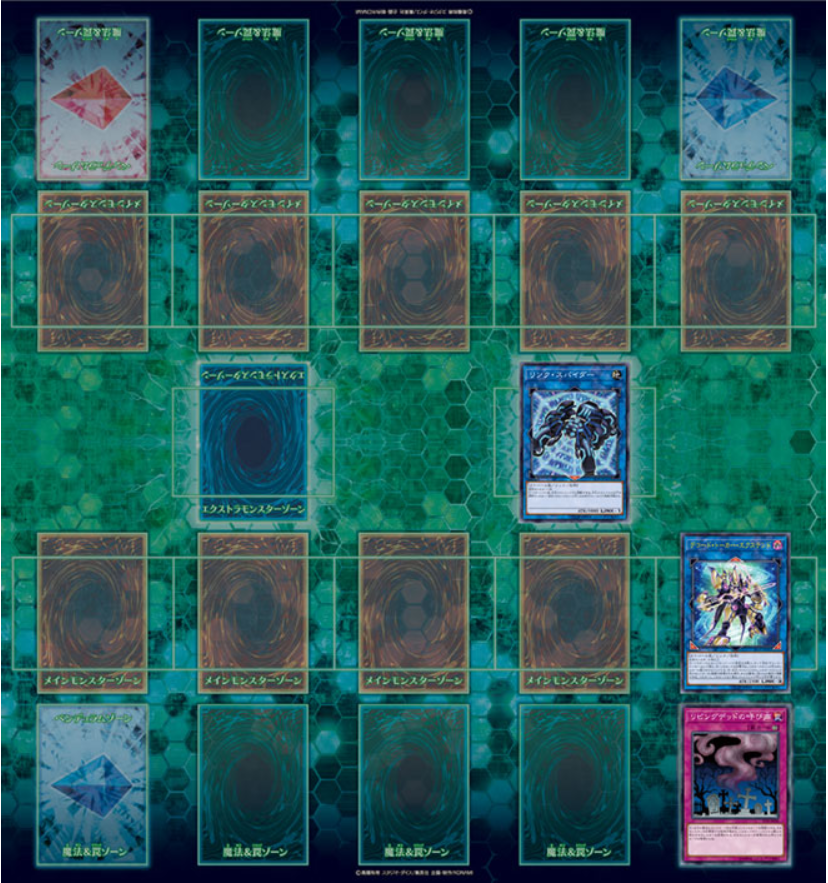
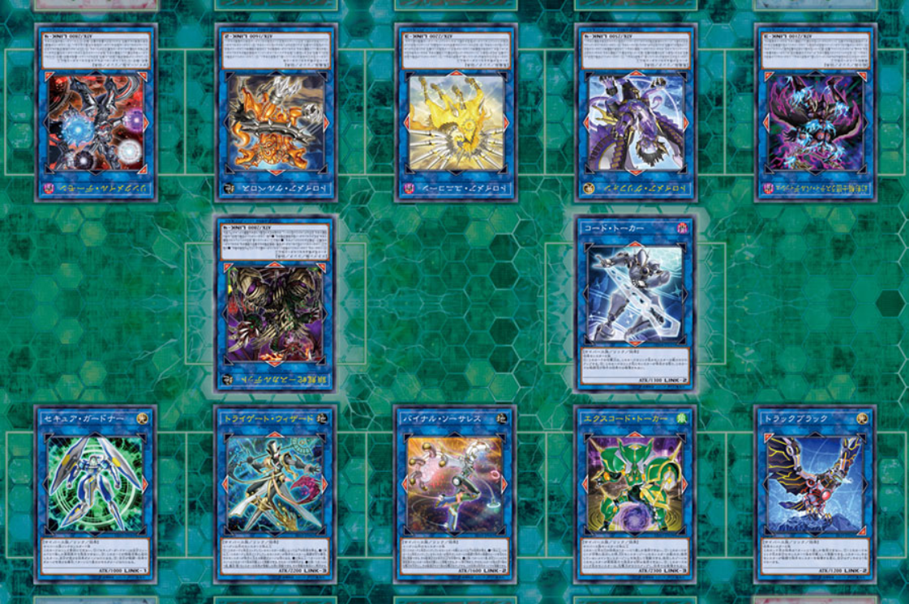
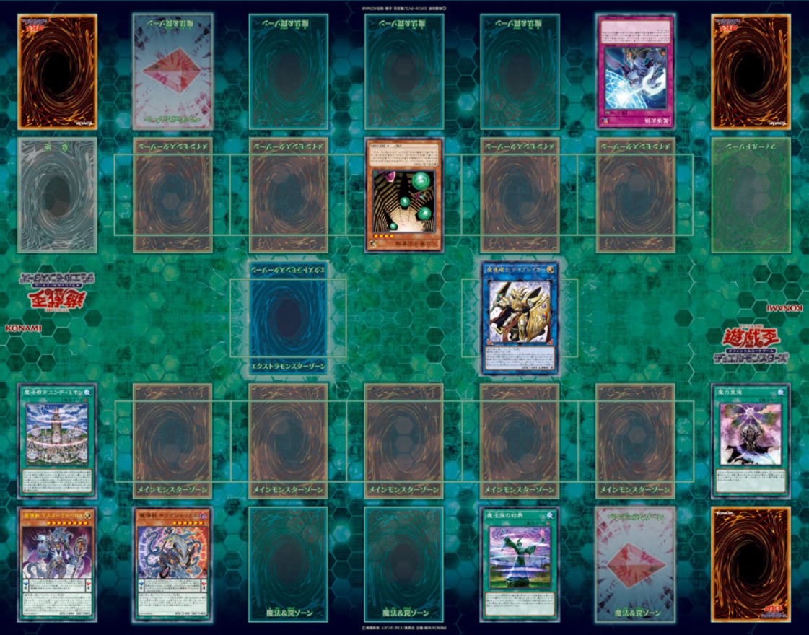
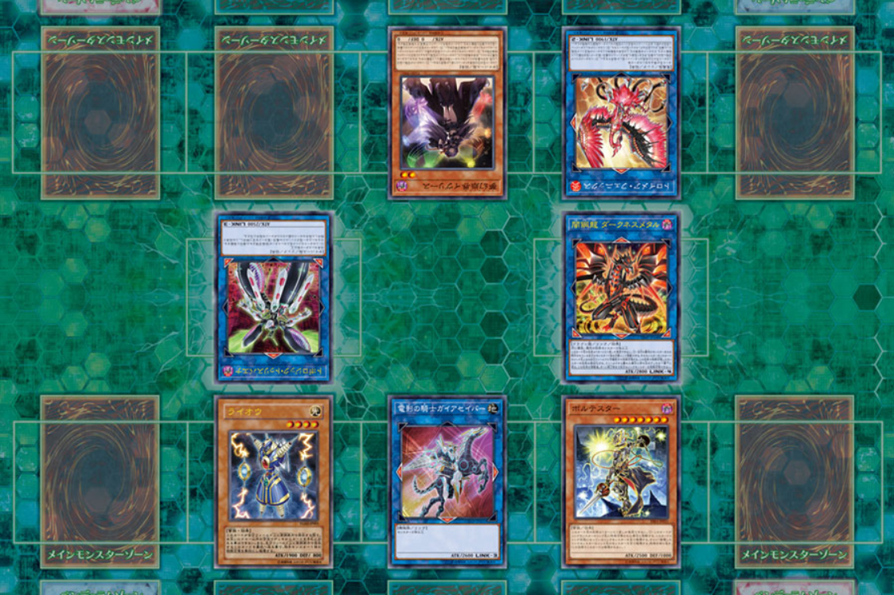

============================
2019年游戏王OCG规则检定测试
============================

由罗伽翻译并发布在旅法师营地，点击下列链接进入：

| \ `基本部分 <https://www.iyingdi.com/web/bbspost/detail/1897801>`__\
| \ `应用部分 <https://www.iyingdi.com/web/bbspost/detail/1898323>`__\

答案见：

| \ `答案总览 <https://www.iyingdi.com/web/bbspost/detail/1912295>`__\

以下为复制黏贴的备份。

基本部分
===========

1. | 在游戏王OCG中（下略），以下可以使用「`禁止令`_」宣言了卡名的怪兽进行的是？
   | A.用「`禁止令`_」宣言了卡名的怪兽攻击宣言
   | B.让包含「`禁止令`_」宣言了卡名的怪兽的怪兽用「`奇迹接触`_」的效果回到卡组，把融合怪兽特殊召唤
   | C.把「`禁止令`_」宣言了卡名的怪兽与其他怪兽送去墓地来连接召唤
   | D.把「`禁止令`_」宣言了卡名的手卡的怪兽用灵摆召唤特殊召唤
   | E.其他4项都不能进行

2. | 以下的卡·效果之中，能在伤害步骤发动的是？
   | A.「`电脑网刷新`_」
   | B.「`电脑网冲突`_」
   | C.「`电脑网回归`_」
   | D.「`电脑网级联`_」
   | E.其他4项均不能在伤害步骤发动

3. | 关于「`快速规则`_」，以下说明正确的是？（注意不是Duel Link，是官方推出的OCG简化规则）
   | A.结束阶段时手卡即使在7张以上也不需要丢弃
   | B.没有额外怪兽区域
   | C.决斗开始时的生命值是4000，决斗开始时的手卡是5张
   | D.场上可以放置的魔法·陷阱卡包括场地魔法最多能有3张
   | E.没有主要阶段2，战斗阶段后进入结束阶段

4. | 以下作为「`双穹之骑士 阿斯特拉姆`_」的连接素材包含的怪兽正确的是？
   | A.「`自奏圣乐的释音`_」特殊召唤的「`宵星之机神 丁吉尔苏`_」
   | B.「`星遗物的继承`_」特殊召唤的「`星杯剑士 奥拉姆`_」
   | C.被「`紫霄之机界骑士`_」的效果除外，回到主要怪兽区域的「`星痕之机界骑士`_」
   | D.「`梦幻崩影·人鱼`_」的效果特殊召唤的「`梦幻转星 易德莉丝`_」
   | E.「`剑巫之圣像骑士`_」的效果移动过的「`天穹之圣像骑士`_」

5. | 关于「`守护龙 厄尔庇`_」的「`②：自己主要阶段才能发动。从手卡·卡组把1只龙族怪兽往作为受2只以上的连接怪兽所连接区的自己场上特殊召唤`_」怪兽的效果处理，以下说明正确的是？
   | A.有2只连接怪兽存在，那2只的连接标记共同指向的自己主要怪兽区域闲置时，在那个区域特殊召唤
   | B.有2只连接怪兽存在，那些连接怪兽中任意一方所连接区的主要怪兽区域闲置时可以发动效果，进行特殊召唤
   | C.有成为连接状态的怪兽2只以上存在的场合，选闲置的任意自己主要怪兽区域进行特殊召唤
   | D.把互相连接状态的2只怪兽送去墓地来进行特殊召唤
   | E.对方的连接2以上的怪兽在额外怪兽区域存在，自己怪兽只有额外怪兽区域的「`守护龙 厄尔庇`_」的场合才能发动效果，进行特殊召唤

6. | 关于准备阶段以及在那个阶段中进行的处理，以下说明正确的是？
   | A.是抽卡阶段被「`刻之封印`_」跳过的场合进行，在主要阶段之前发动卡的效果的阶段
   | B.被自身效果除外的「`迪亚邦德之核`_」回到场上的场合，必须在准备阶段最初进行处理
   | C.「`地狱门的契约书`_」等，有准备阶段必须进行的处理的场合，全部组成连锁处理
   | D.是在战斗阶段前进行，指定进行攻击的怪兽和攻击对象的阶段
   | E.「`王宫的敕命`_」与「`银幕之镜壁`_」等，准备阶段需要支付生命值的场合，可以任选从谁开始处理

7. | 以下不是「`灵魂怪兽`_」的是？
   | A.「`伊奘凪`_」
   | B.「`伊奘波`_」
   | C.「`剑道魂 皆传`_」
   | D.「`灵魂鸟神-彦孔雀`_」
   | E.「`大和神`_」

8. | 以下可以作为「`星杯的神子 夏娃`_」的同调素材怪兽组合的是？
   | A.「`机界骑士 亚伯拉姆`_」+「`右起子`_」
   | B.「`星骸龙`_」+「`原型机灵`_」
   | C.「`被星杯所劝诱者`_」+「`领取星杯的巫女`_」
   | D.「`梦幻崩界 伊娃力丝`_」+「`被星杯所选中者`_」
   | E.「`守护龙 朱斯提亚`_」+「`星杯神乐 夏娃`_」

9. | 以下不能被「`天空神骑士 罗德珀耳修斯`_」的怪兽效果从卡组加入手卡的魔法·陷阱卡是？
   | A.「`神罚`_」
   | B.「`裁决之光`_」
   | C.「`轮回之珀耳修斯`_」
   | D.「`珀耳修斯的神域`_」
   | E.其他4项都可以从卡组加入手卡

10. | 关于「`机动要犀 铁犀三角龙`_」的怪兽效果，以下说明正确的是？
    | A.是在自己回合的准备阶段或者对方回合才能发动的效果
    | B.是虽然在伤害步骤不能发动，但满足条件的话无论在自己回合还是对方回合都能发动的效果
    | C.是在对方把3只怪兽同时特殊召唤的回合才能发动的效果
    | D.是对方把第3只怪兽召唤·反转召唤·特殊召唤成功时才能发动的效果
    | E.是包含自己以及对方的怪兽区域的特殊召唤的怪兽，有3只怪兽存在的场合才能发动的效果

11. | 关于「`黑魔术的幕帘`_」，以下说明正确的是？
    | A.是可以从手卡·卡组·墓地特殊召唤「`黑魔术师`_」的卡
    | B.是陷阱卡
    | C.是支付自己一半生命值发动的卡
    | D.是双方玩家特殊召唤魔法师族怪兽的卡
    | E.是场上没有怪兽时才能发动的卡

12. | 以下是「`不能通常召唤的怪兽`_」的是？
    | A.其他4项都是「`不能通常召唤的怪兽`_」
    | B.「`守护龙 厄尔庇`_」的效果特殊召唤的「`稀有金属龙`_」
    | C.发动后当作怪兽的「`机怪虫之圣像骑士`_」
    | D.把攻击力0的3只怪兽解放特殊召唤的「`魔兽皇帝 加泽特`_」
    | E.「`时钟翼龙`_」的效果特殊召唤的「`时钟衍生物`_」

13. | 以下可以对「`欧贝利斯克之巨神兵`_」正常适用效果的陷阱卡是？
    | A.「`魔法筒`_」
    | B.「`破坏轮`_」
    | C.「`附锁链的回力镖`_」
    | D.「`神圣防护罩-反射镜力-`_」
    | E.「`沉默的邪恶灵`_」

14. | 场上是以下状况的场合，不能从自己的额外卡组连接召唤的怪兽是？（「`解码语者·扩展`_」是被「`活死人的呼声`_」特殊召唤的状态）
    | |image1.png|
    | A.「`双穹之骑士 阿斯特拉姆`_」
    | B.「`登陆群舰 游走巨鲸`_」
    | C.「`召命之神弓-阿波罗萨`_」
    | D.「`龙绝兰`_」
    | E.「`拓扑篡改感染龙`_」

15. | 以下可以用「`溢出龙`_」的效果把「`溢出衍生物`_」特殊召唤的处理的例子是？
    | A.连锁2以上发动的「`激流葬`_」的效果把自己和对方场上各1只怪兽破坏
    | B.「`神圣防护罩-反射镜力-`_」的效果把2只攻击表示怪兽破坏
    | C.「`神鸟攻击`_」的效果把灵摆区域的「`时读之魔术师`_」与怪兽区域的「`星读之魔术师`_」破坏
    | D.连锁1和2的「`雷破`_」发动，那些处理把合计2只怪兽破坏
    | E.「`死之卡组破坏病毒`_」的效果把手卡2只怪兽破坏

16. | 关于魔力指示物，以下说明正确的是？
    | A.放置有魔力指示物的怪兽当作魔法师族怪兽
    | B.全部的卡放置的魔力指示物都没有上限
    | C.只有怪兽才能放置魔力指示物
    | D.是可以给全部的表侧表示的卡放置的指示物
    | E.可以给自身放置魔力指示物的效果被无效化的场合，放置的魔力指示物全部取除

17. | 以下状况中，正确进行的处理是？
    | A.「`荷鲁斯之黑炎龙 LV6`_」被战斗·效果破坏之际，适用墓地的「`复活之福音`_」的效果而不会被破坏
    | B.对方的怪兽区域有表侧表示的「`地缚神 维拉科查·拉斯卡`_」存在，因为不能选择作为攻击对象，自己可以用「`最高战士`_」直接攻击对方玩家
    | C.「`战线复归`_」的处理，以墓地的「`芙莉西亚之虫惑魔`_」为对象，但是因为不受陷阱卡的效果影响，不能特殊召唤
    | D.对方怪兽区域有里侧表示的「`无限起动 大河式风击龙`_」存在，因为对方的「`超接地展开`_」的效果适用中，自己不能以那只「`无限起动 大河式风击龙`_」为对象发动「`盾碎`_」
    | E.被「`安卡栗子球`_」的效果从墓地特殊召唤成功的「`骸之魔妖-饿者髑髅`_」，因为不受其他卡的效果影响，结束阶段不会送去墓地

18. | 以下需要宣言卡或效果的发动的特殊召唤是？
    | A.相同纵列有3张卡以上存在的场合进行的「`铁骑龙 创世母神机`_」的特殊召唤
    | B.让记述的怪兽回到卡组进行的「`剑斗兽 尼禄`_」的特殊召唤
    | C.其他4项都是需要宣言卡或效果的发动的特殊召唤
    | D.自己墓地的暗属性怪兽是5只的场合进行的「`暗灵神 翁布雷密拉热`_」的特殊召唤
    | E.「`雷神龙-雷龙`_」的把怪兽除外进行的特殊召唤

19. | 以下不需要取对象进行卡·效果的发动的卡是？
    | A.「`抹杀之圣刻印`_」
    | B.其他4项均是需要取对象进行卡·效果的发动的卡
    | C.「`战士抹杀`_」
    | D.「`抹杀之使徒`_」
    | E.「`无情的抹杀`_」

20. | 关于「`成为连接状态特殊召唤`_」效果处理，以下说明正确的是？
    | A.因为「`梦幻崩界 伊娃力丝`_」不持有连接标记，没有已和其他怪兽成为连接状态时，自身不能发动效果
    | B.「`梦幻崩界 伊娃力丝`_」的效果是把连接怪兽特殊召唤后成为连接状态，可以把「`纳祭之魔·阿尼玛`_」特殊召唤
    | C.其他4项说明均不正确
    | D.虽然「`防火超越龙`_」自身在主要怪兽区域存在，因为是把连接4的电子界族怪兽特殊召唤的效果，可以特殊召唤「`拓扑逻辑轰炸龙`_」
    | E.因为「`防火超越龙`_」自身在额外怪兽区域存在的场合不能进行处理，所以不能发动效果

21. | 以下场上的怪兽中，不在「`额外连接`_」状态的怪兽是？
    | |image2.png|
    | A.「`幻影骑士团 锈蚀月刃斧`_」
    | B.其他4项都不在额外连接状态
    | C.「`连接邮件盔甲恶魔`_」
    | D.「`安全守卫者`_」
    | E.「`引用通告黑鸟`_」

22. | 以下是「`融合召唤的怪兽`_」的是？
    | A.用「`剑斗兽总监 主斗`_」的效果从额外卡组特殊召唤的「`剑斗兽 盲斗`_」
    | B.其他4项均不是「`融合召唤的怪兽`_」
    | C.用「`新宇融合`_」的效果从额外卡组特殊召唤的「`元素英雄 星云新宇侠`_」
    | D.用「`天威无双之拳`_」的效果从额外卡组特殊召唤的「`青眼究极龙`_」
    | E.把「`电子龙`_」和额外怪兽区域的「`电子龙·凯旋`_」送去墓地从额外卡组特殊召唤的「`嵌合巨舰龙`_」

23. | 以下可以使用「`三眼怪`_」的效果加入手卡的怪兽进行的是？
    | A.发动加入手卡的怪兽的同名怪兽被送去墓地时的效果
    | B.加入手卡的怪兽是灵摆怪兽的场合，从手卡在灵摆区域发动
    | C.发动加入手卡的怪兽在手卡发动的效果
    | D.加入手卡的怪兽是灵摆怪兽的场合，发动那个灵摆效果
    | E.从手卡通常召唤之际，里侧守备表示盖放

24. | （在游戏王OCG中，）实际存在的卡是？
    | A.「`魔女术·名匠玻璃女巫`_」
    | B.「`魔女-术·名匠玻璃女巫`_」
    | C.「`魔女·术·名匠·玻璃女巫`_」
    | D.「`魔女☆术☆名匠玻璃女巫乌`_」
    | E.「`魔女术名匠·玻璃女巫`_」

25. | 关于「`妖神-不知火`_」的怪兽效果选「`妖神-不知火`_」自身的场合进行的处理，以下说明正确的是？
    | A.「`○不死族`_」、「`○炎属性`_」、「`○同调`_」的效果之中，只能任选其中1个适用
    | B.因为「`妖神-不知火`_」是不死族怪兽，先适用「`○不死族`_」的处理，适用的场合不能再适用「`○炎属性`_」和「`○同调`_」的效果
    | C.因为「`妖神-不知火`_」是S怪兽，只能适用「`○同调`_」的效果
    | D.本来「`妖神-不知火`_」自己就不能发动效果选自身
    | E.「`○不死族`_」、「`○炎属性`_」、「`○同调`_」的效果之中，可以各自任意选择适用或者不适用

26. | 以下「`解码语者·扩展`_」的『③：自己战斗阶段，这张卡所连接区的怪兽被战斗破坏的场合或者被送去墓地的场合才能发动。这个回合，这张卡在同1次的战斗阶段中可以作2次攻击。』怪兽的效果发动的场合，正确的例子是？
    | A.「`淘气仙星·曼珠诗华`_」的效果让所连接区的「`淘气仙星·坎迪娜`_」回到持有者手卡的场合
    | B.「`动态密码`_」的效果特殊召唤的所连接区的「`安全令牌衍生物`_」被「`光道猎犬 雷光`_」的效果破坏的场合
    | C.自身的效果特殊召唤的所连接区的「`亡龙的战栗-死欲龙`_」被战斗破坏回到卡组最下面的场合
    | D.「`纹理转换蛙`_」的效果在所连接区特殊召唤的「`骑狮机兽`_」被「`奈落的落穴`_」的效果破坏并除外的场合
    | E.所连接区的「`触发器冻结妖`_」为让「`电脑网交叉清除`_」的发动而解放、因为「`大宇宙`_」的效果除外的场合

27. | 以下咒文速度2的效果是？
    | A.手卡发动的「`亡命左轮手枪龙`_」的效果
    | B.手卡发动的「`黄昏之忍者-上弦`_」的效果
    | C.手卡发动的「`魔神仪的创造主-创造祭台`_」的效果
    | D.手卡发动的「`PSY骨架装备·β`_」的效果
    | E.手卡发动的「`银河剑圣`_」的效果

28. | 以下会让「`咒眼之死徒 沙利叶`_」的③的效果在下个回合的准备阶段不能发动的是？
    | A.对方连锁「`咒眼之死徒 沙利叶`_」的②的效果发动「`替罪的黑暗`_」，效果无效
    | B.②的效果发动后，「`咒眼之死徒 沙利叶`_」自身的控制权被转移给对方
    | C.「`咒眼之死徒 沙利叶`_」的②的效果没有把对方的怪兽破坏
    | D.装备中的「`太阴之咒眼`_」被破坏不在场上存在
    | E.②的效果发动后，「`咒眼之死徒 沙利叶`_」自身因「`月之书`_」的效果变成里侧守备表示

应用部分
===========

29. | 卡的效果适用的以下的效果处理中，在效果发动的回合结束时效果不再适用的是？
    | A.「`召命之神弓-阿波罗萨`_」的怪兽效果下降的攻击力
    | B.「`力量结合`_」的效果上升的攻击力
    | C.「`反转世界`_」的效果交换的攻击力
    | D.其他4项都不会在效果发动的回合结束时效果不再适用
    | E.「`青眼混沌龙`_」的怪兽效果变成0的攻击力

30. | 以下的卡·效果中，能在结束阶段正常发动并处理的是？
    | A.包含「`转生炎兽 郊狼`_」的3只怪兽作为连接素材的「`转生炎兽 多头狮`_」的连接召唤被「`神之警告`_」无效后，自己结束阶段的「`转生炎兽 郊狼`_」的怪兽效果
    | B.其他4项均不能正常发动并处理
    | C.里侧守备表示特殊召唤后，反转召唤的「`鹰身先知`_」的怪兽效果
    | D.没有使用过让作为对象的灵摆刻度变成11的灵摆效果的回合，「`魔妖仙兽 独眼群主`_」的自身回到手卡的灵摆效果
    | E.被「`魔法筒`_」的效果无效攻击的「`淘气仙星·吉她斯薇特`_」的恢复自身上升的攻击力的怪兽效果

31. | 场上是以下的状况时，进行下例所示的卡或效果的发动的场合，最终场上存在的魔力指示物合计数量正确的是？
    | |image3.png|
    | 例：场上存在的魔力指示物是只有「`魔导耀士 破晓者`_」上的1个的状态。从手卡发动「`魔力统辖`_」，从卡组把「`恩底弥翁的仆从`_」加入手卡，进行魔力指示物的放置处理。随后发动「`魔导兽 胡狼王`_」的灵摆效果。把额外卡组的「`魔导兽 刻耳柏洛斯尊主`_」特殊召唤。之后在灵摆区域发动「`恩底弥翁的仆从`_」，并发动其灵摆效果。从卡组把「`创圣魔导王 恩底弥翁`_」特殊召唤。最后，从手卡发动「`双龙卷`_」，把对方的「`魔导变换`_」以及自己的「`魔法族的结界`_」破坏。
    | A.6
    | B.11
    | C.18
    | D.14
    | E.9

32. | 「`万用电表兵`_」特殊召唤时，场上是以下状况的场合，不会被「`万用电表兵`_」的怪兽效果破坏的怪兽是？
    | |image4.png|
    | A.「`拓扑三叶双头蛇`_」
    | B.「`梦幻崩界 伊娃力丝`_」
    | C.「`万用电表兵`_」以外的全部怪兽都会被破坏
    | D.「`雷王`_」
    | E.「`电影之骑士 盖亚剑士`_」

33. | 关于下例状况中的行为，以下说明正确的是？
    | 例：这个回合召唤的对方的「`首领 扎鲁格`_」被自己的「`月之书`_」的效果变成守备表示后，对方发动的「`太阳之书`_」的效果再让那个表示形式变回表侧攻击表示，那个回合的战斗阶段对方用那只「`首领 扎鲁格`_」攻击宣言。自己的魔法与陷阱区域有「`穿刺的落穴`_」盖放。
    | A.召唤的怪兽被「`月之书`_」的效果变成里侧守备表示的时点，就不再是这个回合召唤的怪兽，因此「`穿刺的落穴`_」不能发动
    | B.不限于里侧守备表示，召唤的怪兽的表示形式变更的时点，就不再是这个回合召唤的怪兽，因此「`穿刺的落穴`_」不能发动
    | C.里侧守备表示盖放着后反转·反转召唤的怪兽，也仍然是这个回合召唤的怪兽，因此这个场合可以发动「`穿刺的落穴`_」
    | D.其他4项说明均不正确
    | E.即使被「`月之书`_」的效果变成里侧守备表示，那是这个回合召唤的怪兽的事实不会改变，可以发动「`穿刺的落穴`_」

34. | 在下例状况中不能正常进行的行动是？
    | 例：额外怪兽区域有自己的「`炎星仙-鹫真人`_」存在，对方的主要怪兽区域有已是7星的「`方程式运动员 甩尾越野骑手`_」表侧表示存在。注意，此外为了效果的发动而需要的卡在手卡和场上、卡组、墓地均存在。
    | A.伤害计算时发动「`空炎星-犀超`_」的攻击力上升的效果
    | B.主要阶段中发动「`杀炎星-牛逵`_」的自身特殊召唤的效果
    | C.其他4项均可以正常进行
    | D.主要阶段中发动「`立炎星-董鸡`_」的把「`炎舞`_」魔法·陷阱卡盖放的效果
    | E.发动被战斗破坏的「`魁炎星王-宋虎`_」的把2只兽战士族怪兽特殊召唤的效果

35. | 下例状况中进行战斗伤害计算的场合，对方受到的正确伤害数值是？
    | 例：自己的「`威风妖怪音波`_」的效果适用中的「`威风妖怪·蛤蟆`_」向对方表侧表示攻击的「`电子界魔术师`_」攻击。注意，这个回合，自己发动的「`和睦的使者`_」的效果也已经适用。
    | A.100
    | B.50
    | C.0
    | D.25
    | E.200

36. | 下例状况中，正确的「`青眼白龙`_」场上的最终攻击力数值是？
    | 例：自己的生命值是5000，对方的生命值是4000的状况，装备有自己发动的「`巨大化`_」的「`青眼白龙`_」向对方怪兽攻击宣言时，发动「`才呼粉身`_」。那个处理后，对方发动「`旋风`_」，把「`巨大化`_」破坏。
    | A.1500
    | B.12000
    | C.5000
    | D.3000
    | E.6000

37. | 在游戏王OCG中，额外怪兽区域有自己的「`枪口焰龙`_」存在的场合，关于使用成为那个所连接区的对方主要怪兽区域的行为或效果处理，以下说明不正确的是？
    | A.其他4项均正确
    | B.对方发动「`终焉之焰`_」，在包含「`枪口焰龙`_」所连接区的2处主要怪兽区域把「`黑焰衍生物`_」特殊召唤
    | C.自己把「`枪口焰龙`_」所连接区存在的对方里侧守备表示怪兽解放，在相同的怪兽区域把「`坏星坏兽 席兹奇埃鲁`_」特殊召唤
    | D.对方在「`枪口焰龙`_」所连接区召唤「`蟑螂柱`_」，以那个为连接素材把「`转生炎兽 独角兔`_」连接召唤
    | E.因自己特殊召唤的「`骏足之迅猛龙`_」的怪兽效果，对方把墓地的「`黑森林的女巫`_」在「`枪口焰龙`_」的所连接区特殊召唤

38. | 下例状况中，对方受到的正确战斗伤害数值是？
    | 例：对方的场地区域有「`暗黑地带`_」，自己的怪兽区域有卡名当作「`罪 青眼白龙`_」并得到那个攻击力和效果的1只「`混沌幻影`_」，自己的场地区域有「`罪 世界`_」，自己的魔法与陷阱区域有「`罪 领域`_」，那些卡表侧表示存在的状况，自己用「`混沌幻影`_」进行攻击宣言。
    | A.500
    | B.3000
    | C.0
    | D.1500
    | E.3500

39. | 以下说明中，不进行伤害计算的是？
    | A.自己的「`缺陷编译器`_」向对方的「`淘气仙星·莉莉贝儿`_」攻击之际，对方把「`暗黑安琪儿`_」的怪兽效果发动时
    | B.自己的「`电子界量子龙`_」向对方的里侧守备表示怪兽攻击之际，对方以「`电子界量子龙`_」为对象发动「`禁忌的圣杯`_」的效果时
    | C.自己的「`更新干扰员`_」向对方的「`马格努姆弹丸龙`_」攻击的伤害计算时，自己发动「`更新干扰员`_」的怪兽效果时
    | D.自己的「`装弹枪管狞猛龙`_」向对方的「`恐龙摔跤手·摔跤暴龙王`_」攻击之际，对方发动手卡的「`恐龙摔跤手·武术崇高龙`_」的怪兽效果时
    | E.自己的「`防火龙`_」向对方的「`廷达魔三角之锐角地狱犬`_」攻击之际，自己发动手卡的「`禁止档案蛇`_」的怪兽效果发动时

40. | 下例状况中，正确进行了效果的发动和处理的说明是？
    | 例：自己的魔法与陷阱区域有「`电脑网编解码`_」表侧表示存在，自己的怪兽区域有「`帧缓存火牛`_」和「`格式弹涂鱼`_」表侧表示存在的状况，在成为额外怪兽区域的对方的「`混沌之战士 混沌战士`_」所连接区的自己主要怪兽区域把「`码语者·翻转`_」连接召唤。注意，自己手卡只有「`电脑网优化`_」。
    | A.首先，可以进行处理的「`电脑网编解码`_」和「`格式弹涂鱼`_」的效果组成连锁发动，进行处理。由此电子界族怪兽加入手卡，那之后，「`码语者·翻转`_」的效果和「`帧缓存火牛`_」的效果组成连锁发动并处理。
    | B.首先，作为连接素材的「`帧缓存火牛`_」和「`格式弹涂鱼`_」的效果组成连锁发动并进行处理。那之后，连接召唤成功的「`码语者·翻转`_」的效果和「`电脑网编解码`_」的效果组成新的连锁发动并处理。
    | C.「`格式弹涂鱼`_」和「`电脑网编解码`_」的效果可以各自以任意顺序组成连锁发动，因为手卡没有电子界族怪兽存在，「`帧缓存火牛`_」和「`码语者·翻转`_」的效果不能发动。
    | D.作为连接素材的「`帧缓存火牛`_」的效果和「`格式弹涂鱼`_」的效果、连接召唤成功的「`码语者·翻转`_」的效果、「`电脑网编解码`_」的效果，全部满足发动条件，可以以任意顺序组成连锁发动效果，各自进行效果处理。
    | E.作为连接素材的「`帧缓存火牛`_」和「`格式弹涂鱼`_」的效果只能选其中1个发动，无论发动了哪1个，「`码语者·翻转`_」、「`电脑网编解码`_」的效果都能以任意顺序组成连锁发动并处理。

41. | 「`元素英雄 神·新宇侠`_」的「`直到结束阶段时得到和那只怪兽相同效果`_」效果适用后的场合，结果不能适用的效果是？
    | A.「`邪心英雄 地狱小魔`_」的结束阶段抽卡的效果
    | B.「`命运英雄 统治人`_」的把「`命运英雄`_」怪兽特殊召唤的效果
    | C.其他4项结果都不能适用
    | D.「`元素英雄 秩序新宇侠`_」的对方不能把场上发动的效果发动的效果
    | E.「`元素英雄 宏伟侠`_」的上升作为融合素材的怪兽的等级合计数值攻击力的效果

42. | 以下状况中，那个回合自己可以发动「`替罪羊`_」的是？
    | A.发动「`名推理`_」之际，对方宣言4星但由于翻开的可以通常召唤的怪兽是「`深夜急行骑士`_」，没有进行特殊召唤
    | B.之前的回合特殊召唤的「`长世国王恶魔`_」的恶魔族怪兽被送去墓地的场合的效果发动，那个处理的结果把送去墓地的恶魔族怪兽加入手卡
    | C.「`恶龙`_」特殊召唤，但因对方的「`进化帝·半鸟龙`_」的怪兽效果，那个特殊召唤被无效，被破坏
    | D.「`死者苏生`_」发动，但对方连锁发动「`墓穴的指名者`_」把作为对象的怪兽除外，没有特殊召唤=
    | E.其他4项任何情况，自己在那个回合都不能发动「`替罪羊`_」

43. | 下例状况中，进行了正确的处理的说明是？
    | 例：对方连锁自己的「`地中族导师`_」的反转召唤发动的怪兽效果发动「`幻变骚灵协议`_」的效果，自己再连锁选择「`地中族的决战`_」的『●这个回合，「`地中族`_」卡所发动的效果不会被无效化。』效果发动。对方再把魔法与陷阱区域表侧表示存在的「`幻变骚灵的闹鬼死锁`_」的「`②：对方把陷阱卡发动时，从手卡把1只「幻变骚灵」怪兽送去墓地才能发动。那个效果无效并破坏`_」效果发动。
    | A.「`幻变骚灵的闹鬼死锁`_」的效果把「`地中族的决战`_」的效果无效，但不会被破坏，就那样回到盖放的状态。「`幻变骚灵协议`_」的效果把「`地中族导师`_」的效果的发动无效并破坏送去墓地。
    | B.「`幻变骚灵的闹鬼死锁`_」的效果把「`地中族的决战`_」的效果无效，但不会被破坏，就那样回到盖放的状态。被「`幻变骚灵协议`_」的效果无效发动的「`地中族导师`_」被破坏送去墓地，因为效果不会被无效化，正常适用从卡组把「`地中族`_」卡加入手卡的效果。
    | C.「`幻变骚灵的闹鬼死锁`_」的效果把「`地中族的决战`_」的效果无效并破坏送去墓地。「`幻变骚灵协议`_」的效果把「`地中族导师`_」的效果的发动无效并破坏送去墓地。
    | D.「`幻变骚灵的闹鬼死锁`_」的效果把「`地中族的决战`_」破坏送去墓地，但这个回合，「`地中族`_」卡所发动的效果是不会被无效化的状态。被「`幻变骚灵协议`_」的效果无效发动的「`地中族导师`_」被破坏送去墓地，因为效果不会被无效化，正常适用从卡组把「`地中族`_」卡加入手卡的效果。
    | E.「`地中族的决战`_」的发动后不送去墓地，就那样盖放，「`幻变骚灵的闹鬼死锁`_」的效果没有把那个效果无效化。「`幻变骚灵协议`_」的效果适用，但因为「`地中族的决战`_」的效果也适用了，「`地中族导师`_」虽然可以被破坏送去墓地，但正常适用从卡组把「`地中族`_」卡加入手卡的效果。

44. | 下例状况中，自己在这个回合最多能进行的召唤的次数是？
    | 例：额外怪兽区域有自己的「`高速疾行机人 GOM枪`_」存在，自己的魔法与陷阱区域有「`对手见冤家`_」盖放，自己的场地区域有表侧表示的「`脑开发研究所`_」存在。注意，自己的手卡是有「`均衡负载王`_」「`重建鹿`_」「`幽鬼兔`_」「`电子界工具`_」「`比特机灵`_」的状态。
    | A.3
    | B.2
    | C.5
    | D.1
    | E.4

45. | 下记状况中，可以正常进行特殊召唤的处理的是？
    | A.把里侧守备表示的「`红莲魔龙·右红痕`_」解放发动「`爆裂模式`_」，把「`红莲魔龙/爆裂体`_」特殊召唤
    | B.用「`爆裂狙击手`_」的效果从卡组把「`科技属 戟炮手/爆裂体`_」特殊召唤
    | C.用「`再爆裂`_」的效果把「`爆裂模式零型`_」的效果特殊召唤后送去墓地的「`奥金魔术师/爆裂体`_」特殊召唤
    | D.「`爆裂再起`_」的效果特殊召唤的「`星尘龙/爆裂体`_」因自身的效果解放并特殊召唤
    | E.用「`巨人斗士/爆裂体`_」的效果把「`打草惹蛇`_」的效果特殊召唤后送去墓地的「`巨人斗士`_」特殊召唤

46. | 关于下例状况中的行为，以下说明正确的是？
    | 例：额外怪兽区域的自己的「`装弹枪管龙`_」和对方的「`光之护封灵剑`_」各自存在，「`装弹枪管龙`_」进行攻击宣言。
    | A.「`光之护封灵剑`_」是陷阱卡，自己可以先选择是否发动「`装弹枪管龙`_」的②的怪兽效果。
    | B.攻击宣言时要发动「`装弹枪管龙`_」的②的怪兽效果的场合，对方的「`光之护封灵剑`_」是表侧表示的话，对方可以先选择是否发动其①的效果。对方的「`光之护封灵剑`_」是里侧表示的场合，自己可以先选择是否发动「`装弹枪管龙`_」的②的怪兽效果。
    | C.自己攻击宣言的场合，最先可以进行卡的发动的是回合玩家，发动「`装弹枪管龙`_」的②的怪兽效果的场合，无论「`光之护封灵剑`_」是表侧表示还是里侧表示，都不能发动那个①的效果。
    | D.自己攻击宣言的场合，最先可以进行卡的发动的是对方玩家，无论「`光之护封灵剑`_」是表侧表示还是里侧表示，对方先选择是否发动那个①的效果，那之后自己才能选择是否发动「`装弹枪管龙`_」的②的怪兽效果。
    | E.「`光之护封灵剑`_」持有攻击宣言时发动的①的效果，无论对方玩家的「`光之护封灵剑`_」是表侧表示还是里侧表示，对方先选是否发动那个①的效果，那之后自己才能选择是否发动「`装弹枪管龙`_」的②的怪兽效果。

47. | 下例状况中，正确进行了效果处理的说明是？
    | 例：额外怪兽区域有自己的「`鹰身引导者`_」存在，「`歇斯底里的舞会`_」的效果特殊召唤的「`鹰身女郎1`_」「`鹰身女郎2`_」「`鹰身女郎3`_」在自己的主要怪兽区域表侧攻击表示存在。自己发动「`古遗物运动机构`_」选择「`歇斯底里的舞会`_」为要破坏的魔法·陷阱卡。
    | A.「`古遗物运动机构`_」的效果处理，不仅把作为对象的卡破坏，还要从卡组选1只「`古遗物`_」怪兽在自己的魔法与陷阱区域盖放，因此「`歇斯底里的舞会`_」的效果把「`鹰身女郎1`_」等破坏之际，「`鹰身引导者`_」的「`可以作为代替把自己场上1张魔法·陷阱卡破坏`_」效果不能适用。
    | B.「`鹰身引导者`_」的「`可以作为代替把自己场上1张魔法·陷阱卡破坏`_」的效果，是连锁要把「`鹰身`_」怪兽破坏的效果发动的效果。这个场合，「`古遗物运动机构`_」不是要把「`鹰身`_」怪兽而是要把「`歇斯底里的舞会`_」破坏的发动的效果，因此「`鹰身引导者`_」的效果不能发动。
    | C.这个场合，不存在处理后要送去墓地的「`古遗物运动机构`_」和「`歇斯底里的舞会`_」以外的魔法·陷阱卡，因此「`鹰身引导者`_」的「`可以作为代替把自己场上1张魔法·陷阱卡破坏`_」效果不能适用。
    | D.「`歇斯底里的舞会`_」的效果破坏「`鹰身女郎1`_」等之际，「`鹰身引导者`_」的「`可以作为代替把自己场上1张魔法·陷阱卡破坏`_」效果适用的场合，可以从「`歇斯底里的舞会`_」、「`古遗物运动机构`_」、「`古遗物运动机构`_」的效果盖放的「`古遗物`_」怪兽选择其中1张作为代替破坏的卡。
    | E.「`鹰身引导者`_」的「`可以作为代替把自己场上1张魔法·陷阱卡破坏`_」的效果适用的场合，那之际要被破坏的卡不能代替破坏。另外，代替破坏的处理要立刻适用，因此这个场合，可以选「`古遗物运动机构`_」作为代替破坏的卡。

48. | 自己把「`儚无水木`_」的怪兽效果发动后，如下例的对方把怪兽特殊召唤的场合，回复的生命值合计正确的是？
    | 例：对方回合的主要阶段1。「`灵魂补充`_」的效果把「`防火守护者`_」「`网格扫除机`_」「`数字机灵`_」「`电子界同调士`_」「`缓存猫娃L2`_」特殊召唤。以「`防火守护者`_」和「`网格扫除机`_」为素材把「`LAN喙嘴龙`_」连接召唤。「`电子界同调士`_」和「`缓存猫娃L2`_」同调召唤「`电子界集成员`_」。「`电子界集成员`_」的①的怪兽效果把「`电子界同调士`_」特殊召唤。「`电子界同调士`_」以「`电子界集成员`_」为对象发动①的怪兽效果，「`电子界同调士`_」和「`电子界集成员`_」同调召唤「`电子界量子龙`_」。
    | A.6300
    | B.7400
    | C.2600
    | D.5800
    | E.4700

49. | 对方的「`皇帝斗技场`_」的效果适用中，自己和对方的怪兽区域各有1只怪兽存在的场合，以下可以正常进行的处理是？
    | A.对方怪兽的攻击战斗破坏自己怪兽而受到战斗伤害的场合，发动墓地的「`英豪挑战者 千刀兵`_」的怪兽效果
    | B.自己发动「`灵魂交错`_」，把那个效果适用中的对方怪兽和自己怪兽解放，上级召唤「`虚无之统括者`_」
    | C.自己把对方怪兽解放，在对方场上把「`多次元坏兽 拉迪安`_」特殊召唤
    | D.其他4项处理都不能进行
    | E.自己发动「`超融合`_」，用自己的怪兽区域存在的怪兽和对方的怪兽区域存在的怪兽那2只进行融合召唤

50. | 关于自己以「`转生炎兽 阔耳狐`_」和「`转生炎兽 烽火猞猁`_」为连接素材连接召唤「`转生炎兽 日光狼`_」，被对方的「`神之通告`_」无效之际进行的效果处理，以下说明正确的是？
    | A.「`转生炎兽 日光狼`_」的连接召唤被无效并破坏。「`转生炎兽 烽火猞猁`_」的②的怪兽效果不能适用，「`转生炎兽 阔耳狐`_」的①和②的怪兽效果不能发动。
    | B.「`转生炎兽 日光狼`_」的连接召唤被无效并破坏。那之际，「`转生炎兽 烽火猞猁`_」的②的怪兽效果不能适用，「`转生炎兽 阔耳狐`_」的①的怪兽效果不能发动，但「`转生炎兽 阔耳狐`_」的②的怪兽效果可以发动。
    | C.「`转生炎兽 日光狼`_」的连接召唤被无效并破坏。因此，「`转生炎兽 阔耳狐`_」的①和②的怪兽效果两者都可以发动，可以以任意顺序组成连锁发动。
    | D.「`神之通告`_」的效果把连接召唤无效之际，可以适用被送去墓地的「`转生炎兽 烽火猞猁`_」的②的怪兽效果让「`转生炎兽 日光狼`_」不会被破坏，连接召唤因此成功，「`转生炎兽 日光狼`_」的①的怪兽效果、「`转生炎兽 阔耳狐`_」的①和②的怪兽效果，可以各自以任意顺序组成连锁发动。
    | E.「`神之通告`_」的效果把连接召唤无效之际，可以适用被送去墓地的「`转生炎兽 烽火猞猁`_」的②的怪兽效果让「`转生炎兽 日光狼`_」不会被破坏，连接召唤因此成功，「`转生炎兽 日光狼`_」的①的怪兽效果、「`转生炎兽 阔耳狐`_」和②的怪兽效果，可以各自以任意顺序组成连锁发动。

答案
=======

| 1-10 BBECA EAACB
| 11-20 CADAB EAACC
| 21-30 EBEEE CCEDD
| 31-40 DAEAB BCEEC
| 41-50 CBCEC BEECA

.. _`进化帝·半鸟龙`: https://ygocdb.com/card/name/进化帝·半鸟龙
.. _`皇帝斗技场`: https://ygocdb.com/card/name/皇帝斗技场
.. _`迪亚邦德之核`: https://ygocdb.com/card/name/迪亚邦德之核
.. _`剑斗兽总监 主斗`: https://ygocdb.com/card/name/剑斗兽总监%20主斗
.. _`青眼白龙`: https://ygocdb.com/card/name/青眼白龙
.. _`电脑网刷新`: https://ygocdb.com/card/name/电脑网刷新
.. _`复活之福音`: https://ygocdb.com/card/name/复活之福音
.. _`被星杯所选中者`: https://ygocdb.com/card/name/被星杯所选中者
.. _`墓穴的指名者`: https://ygocdb.com/card/name/墓穴的指名者
.. _`大和神`: https://ygocdb.com/card/name/大和神
.. _`炎星仙-鹫真人`: https://ygocdb.com/card/name/炎星仙-鹫真人
.. _`电子龙`: https://ygocdb.com/card/name/电子龙
.. _`元素英雄 神·新宇侠`: https://ygocdb.com/card/name/元素英雄%20神·新宇侠
.. _`名推理`: https://ygocdb.com/card/name/名推理
.. _`②：自己主要阶段才能发动。从手卡·卡组把1只龙族怪兽往作为受2只以上的连接怪兽所连接区的自己场上特殊召唤`: https://ygocdb.com/?search=②：自己主要阶段才能发动。从手卡·卡组把1只龙族怪兽往作为受2只以上的连接怪兽所连接区的自己场上特殊召唤
.. _`防火龙`: https://ygocdb.com/card/name/防火龙
.. _`网格扫除机`: https://ygocdb.com/card/name/网格扫除机
.. _`溢出龙`: https://ygocdb.com/card/name/溢出龙
.. _`古遗物`: https://ygocdb.com/?search=古遗物
.. _`梦幻转星 易德莉丝`: https://ygocdb.com/card/name/梦幻转星%20易德莉丝
.. _`星杯的神子 夏娃`: https://ygocdb.com/card/name/星杯的神子%20夏娃
.. _`死之卡组破坏病毒`: https://ygocdb.com/card/name/死之卡组破坏病毒
.. _`魔导变换`: https://ygocdb.com/card/name/魔导变换
.. _`装弹枪管狞猛龙`: https://ygocdb.com/card/name/装弹枪管狞猛龙
.. _`爆裂模式零型`: https://ygocdb.com/card/name/爆裂模式零型
.. _`可以作为代替把自己场上1张魔法·陷阱卡破坏`: https://ygocdb.com/card/name/可以作为代替把自己场上1张魔法·陷阱卡破坏
.. _`魔法筒`: https://ygocdb.com/card/name/魔法筒
.. _`巨人斗士/爆裂体`: https://ygocdb.com/card/name/巨人斗士/爆裂体
.. _`幻变骚灵协议`: https://ygocdb.com/card/name/幻变骚灵协议
.. _`轮回之珀耳修斯`: https://ygocdb.com/card/name/轮回之珀耳修斯
.. _`才呼粉身`: https://ygocdb.com/card/name/才呼粉身
.. _`旋风`: https://ygocdb.com/card/name/旋风
.. _`雷破`: https://ygocdb.com/card/name/雷破
.. _`魔力统辖`: https://ygocdb.com/card/name/魔力统辖
.. _`右起子`: https://ygocdb.com/card/name/右起子
.. _`帧缓存火牛`: https://ygocdb.com/card/name/帧缓存火牛
.. _`双穹之骑士 阿斯特拉姆`: https://ygocdb.com/card/name/双穹之骑士%20阿斯特拉姆
.. _`英豪挑战者 千刀兵`: https://ygocdb.com/card/name/英豪挑战者%20千刀兵
.. _`剑巫之圣像骑士`: https://ygocdb.com/card/name/剑巫之圣像骑士
.. _`终焉之焰`: https://ygocdb.com/card/name/终焉之焰
.. _`成为连接状态特殊召唤`: https://ygocdb.com/card/name/成为连接状态特殊召唤
.. _`码语者·翻转`: https://ygocdb.com/card/name/码语者·翻转
.. _`天穹之圣像骑士`: https://ygocdb.com/card/name/天穹之圣像骑士
.. _`元素英雄 宏伟侠`: https://ygocdb.com/card/name/元素英雄%20宏伟侠
.. _`电脑网交叉清除`: https://ygocdb.com/card/name/电脑网交叉清除
.. _`LAN喙嘴龙`: https://ygocdb.com/card/name/LAN喙嘴龙
.. _`安全令牌衍生物`: https://ygocdb.com/card/name/安全令牌衍生物
.. _`妖神-不知火`: https://ygocdb.com/card/name/妖神-不知火
.. _`元素英雄 秩序新宇侠`: https://ygocdb.com/card/name/元素英雄%20秩序新宇侠
.. _`淘气仙星·吉她斯薇特`: https://ygocdb.com/card/name/淘气仙星·吉她斯薇特
.. _`鹰身引导者`: https://ygocdb.com/card/name/鹰身引导者
.. _`数字机灵`: https://ygocdb.com/card/name/数字机灵
.. _`反转世界`: https://ygocdb.com/card/name/反转世界
.. _`坏星坏兽 席兹奇埃鲁`: https://ygocdb.com/card/name/坏星坏兽%20席兹奇埃鲁
.. _`红莲魔龙/爆裂体`: https://ygocdb.com/card/name/红莲魔龙/爆裂体
.. _`枪口焰龙`: https://ygocdb.com/card/name/枪口焰龙
.. _`地狱门的契约书`: https://ygocdb.com/card/name/地狱门的契约书
.. _`蟑螂柱`: https://ygocdb.com/card/name/蟑螂柱
.. _`鹰身`: https://ygocdb.com/?search=鹰身
.. _`星遗物的继承`: https://ygocdb.com/card/name/星遗物的继承
.. _`电脑网冲突`: https://ygocdb.com/card/name/电脑网冲突
.. _`溢出衍生物`: https://ygocdb.com/card/name/溢出衍生物
.. _`命运英雄`: https://ygocdb.com/?search=命运英雄
.. _`长世国王恶魔`: https://ygocdb.com/card/name/长世国王恶魔
.. _`力量结合`: https://ygocdb.com/card/name/力量结合
.. _`王宫的敕命`: https://ygocdb.com/card/name/王宫的敕命
.. _`爆裂狙击手`: https://ygocdb.com/card/name/爆裂狙击手
.. _`空炎星-犀超`: https://ygocdb.com/card/name/空炎星-犀超
.. _`均衡负载王`: https://ygocdb.com/card/name/均衡负载王
.. _`虚无之统括者`: https://ygocdb.com/card/name/虚无之统括者
.. _`时读之魔术师`: https://ygocdb.com/card/name/时读之魔术师
.. _`幻影骑士团 锈蚀月刃斧`: https://ygocdb.com/card/name/幻影骑士团%20锈蚀月刃斧
.. _`抹杀之使徒`: https://ygocdb.com/card/name/抹杀之使徒
.. _`转生炎兽 日光狼`: https://ygocdb.com/card/name/转生炎兽%20日光狼
.. _`裁决之光`: https://ygocdb.com/card/name/裁决之光
.. _`沉默的邪恶灵`: https://ygocdb.com/card/name/沉默的邪恶灵
.. _`神圣防护罩-反射镜力-`: https://ygocdb.com/card/name/神圣防护罩-反射镜力-
.. _`无情的抹杀`: https://ygocdb.com/card/name/无情的抹杀
.. _`电脑网编解码`: https://ygocdb.com/card/name/电脑网编解码
.. _`黑魔术的幕帘`: https://ygocdb.com/card/name/黑魔术的幕帘
.. _`时钟衍生物`: https://ygocdb.com/card/name/时钟衍生物
.. _`直到结束阶段时得到和那只怪兽相同效果`: https://ygocdb.com/card/name/直到结束阶段时得到和那只怪兽相同效果
.. _`和睦的使者`: https://ygocdb.com/card/name/和睦的使者
.. _`魔导耀士 破晓者`: https://ygocdb.com/card/name/魔导耀士%20破晓者
.. _`原型机灵`: https://ygocdb.com/card/name/原型机灵
.. _`红莲魔龙·右红痕`: https://ygocdb.com/card/name/红莲魔龙·右红痕
.. _`剑斗兽 尼禄`: https://ygocdb.com/card/name/剑斗兽%20尼禄
.. _`电影之骑士 盖亚剑士`: https://ygocdb.com/card/name/电影之骑士%20盖亚剑士
.. _`新宇融合`: https://ygocdb.com/card/name/新宇融合
.. _`鹰身先知`: https://ygocdb.com/card/name/鹰身先知
.. _`恐龙摔跤手·摔跤暴龙王`: https://ygocdb.com/card/name/恐龙摔跤手·摔跤暴龙王
.. _`古遗物运动机构`: https://ygocdb.com/card/name/古遗物运动机构
.. _`青眼混沌龙`: https://ygocdb.com/card/name/青眼混沌龙
.. _`欧贝利斯克之巨神兵`: https://ygocdb.com/card/name/欧贝利斯克之巨神兵
.. _`格式弹涂鱼`: https://ygocdb.com/card/name/格式弹涂鱼
.. _`召命之神弓-阿波罗萨`: https://ygocdb.com/card/name/召命之神弓-阿波罗萨
.. _`雷神龙-雷龙`: https://ygocdb.com/card/name/雷神龙-雷龙
.. _`禁忌的圣杯`: https://ygocdb.com/card/name/禁忌的圣杯
.. _`剑斗兽 盲斗`: https://ygocdb.com/card/name/剑斗兽%20盲斗
.. _`罪 青眼白龙`: https://ygocdb.com/card/name/罪%20青眼白龙
.. _`剑道魂 皆传`: https://ygocdb.com/card/name/剑道魂%20皆传
.. _`嵌合巨舰龙`: https://ygocdb.com/card/name/嵌合巨舰龙
.. _`○不死族`: https://ygocdb.com/card/name/○不死族
.. _`地中族`: https://ygocdb.com/?search=地中族
.. _`歇斯底里的舞会`: https://ygocdb.com/card/name/歇斯底里的舞会
.. _`珀耳修斯的神域`: https://ygocdb.com/card/name/珀耳修斯的神域
.. _`星杯神乐 夏娃`: https://ygocdb.com/card/name/星杯神乐%20夏娃
.. _`融合召唤的怪兽`: https://ygocdb.com/card/name/融合召唤的怪兽
.. _`最高战士`: https://ygocdb.com/card/name/最高战士
.. _`替罪的黑暗`: https://ygocdb.com/card/name/替罪的黑暗
.. _`禁止令`: https://ygocdb.com/card/name/禁止令
.. _`亡龙的战栗-死欲龙`: https://ygocdb.com/card/name/亡龙的战栗-死欲龙
.. _`电脑网优化`: https://ygocdb.com/card/name/电脑网优化
.. _`伊奘凪`: https://ygocdb.com/card/name/伊奘凪
.. _`地中族的决战`: https://ygocdb.com/card/name/地中族的决战
.. _`鹰身女郎3`: https://ygocdb.com/card/name/鹰身女郎3
.. _`转生炎兽 独角兔`: https://ygocdb.com/card/name/转生炎兽%20独角兔
.. _`爆裂模式`: https://ygocdb.com/card/name/爆裂模式
.. _`廷达魔三角之锐角地狱犬`: https://ygocdb.com/card/name/廷达魔三角之锐角地狱犬
.. _`混沌幻影`: https://ygocdb.com/card/name/混沌幻影
.. _`幻变骚灵的闹鬼死锁`: https://ygocdb.com/card/name/幻变骚灵的闹鬼死锁
.. _`天空神骑士 罗德珀耳修斯`: https://ygocdb.com/card/name/天空神骑士%20罗德珀耳修斯
.. _`拓扑逻辑轰炸龙`: https://ygocdb.com/card/name/拓扑逻辑轰炸龙
.. _`破坏轮`: https://ygocdb.com/card/name/破坏轮
.. _`芙莉西亚之虫惑魔`: https://ygocdb.com/card/name/芙莉西亚之虫惑魔
.. _`三眼怪`: https://ygocdb.com/card/name/三眼怪
.. _`命运英雄 统治人`: https://ygocdb.com/card/name/命运英雄%20统治人
.. _`纳祭之魔·阿尼玛`: https://ygocdb.com/card/name/纳祭之魔·阿尼玛
.. _`防火超越龙`: https://ygocdb.com/card/name/防火超越龙
.. _`额外连接`: https://ygocdb.com/card/name/额外连接
.. _`灵魂补充`: https://ygocdb.com/card/name/灵魂补充
.. _`安卡栗子球`: https://ygocdb.com/card/name/安卡栗子球
.. _`安全守卫者`: https://ygocdb.com/card/name/安全守卫者
.. _`比特机灵`: https://ygocdb.com/card/name/比特机灵
.. _`装弹枪管龙`: https://ygocdb.com/card/name/装弹枪管龙
.. _`暗黑地带`: https://ygocdb.com/card/name/暗黑地带
.. _`动态密码`: https://ygocdb.com/card/name/动态密码
.. _`缺陷编译器`: https://ygocdb.com/card/name/缺陷编译器
.. _`巨大化`: https://ygocdb.com/card/name/巨大化
.. _`梦幻崩影·人鱼`: https://ygocdb.com/card/name/梦幻崩影·人鱼
.. _`科技属 戟炮手/爆裂体`: https://ygocdb.com/card/name/科技属%20戟炮手/爆裂体
.. _`魔女-术·名匠玻璃女巫`: https://ygocdb.com/card/name/魔女-术·名匠玻璃女巫
.. _`○炎属性`: https://ygocdb.com/card/name/○炎属性
.. _`电子界量子龙`: https://ygocdb.com/card/name/电子界量子龙
.. _`万用电表兵`: https://ygocdb.com/card/name/万用电表兵
.. _`银河剑圣`: https://ygocdb.com/card/name/银河剑圣
.. _`重建鹿`: https://ygocdb.com/card/name/重建鹿
.. _`首领 扎鲁格`: https://ygocdb.com/card/name/首领%20扎鲁格
.. _`连接邮件盔甲恶魔`: https://ygocdb.com/card/name/连接邮件盔甲恶魔
.. _`灵魂鸟神-彦孔雀`: https://ygocdb.com/card/name/灵魂鸟神-彦孔雀
.. _`星杯剑士 奥拉姆`: https://ygocdb.com/card/name/星杯剑士%20奥拉姆
.. _`高速疾行机人 GOM枪`: https://ygocdb.com/card/name/高速疾行机人%20GOM枪
.. _`大宇宙`: https://ygocdb.com/card/name/大宇宙
.. _`魔兽皇帝 加泽特`: https://ygocdb.com/card/name/魔兽皇帝%20加泽特
.. _`光之护封灵剑`: https://ygocdb.com/card/name/光之护封灵剑
.. _`拓扑篡改感染龙`: https://ygocdb.com/card/name/拓扑篡改感染龙
.. _`缓存猫娃L2`: https://ygocdb.com/card/name/缓存猫娃L2
.. _`解码语者·扩展`: https://ygocdb.com/card/name/解码语者·扩展
.. _`荷鲁斯之黑炎龙 LV6`: https://ygocdb.com/card/name/荷鲁斯之黑炎龙%20LV6
.. _`邪心英雄 地狱小魔`: https://ygocdb.com/card/name/邪心英雄%20地狱小魔
.. _`炎舞`: https://ygocdb.com/?search=炎舞
.. _`奥金魔术师/爆裂体`: https://ygocdb.com/card/name/奥金魔术师/爆裂体
.. _`暗黑安琪儿`: https://ygocdb.com/card/name/暗黑安琪儿
.. _`魔妖仙兽 独眼群主`: https://ygocdb.com/card/name/魔妖仙兽%20独眼群主
.. _`魔女☆术☆名匠玻璃女巫乌`: https://ygocdb.com/card/name/魔女☆术☆名匠玻璃女巫乌
.. _`罪 领域`: https://ygocdb.com/card/name/罪%20领域
.. _`机界骑士 亚伯拉姆`: https://ygocdb.com/card/name/机界骑士%20亚伯拉姆
.. _`月之书`: https://ygocdb.com/card/name/月之书
.. _`梦幻崩界 伊娃力丝`: https://ygocdb.com/card/name/梦幻崩界%20伊娃力丝
.. _`神罚`: https://ygocdb.com/card/name/神罚
.. _`黑魔术师`: https://ygocdb.com/card/name/黑魔术师
.. _`铁骑龙 创世母神机`: https://ygocdb.com/card/name/铁骑龙%20创世母神机
.. _`双龙卷`: https://ygocdb.com/card/name/双龙卷
.. _`更新干扰员`: https://ygocdb.com/card/name/更新干扰员
.. _`马格努姆弹丸龙`: https://ygocdb.com/card/name/马格努姆弹丸龙
.. _`太阳之书`: https://ygocdb.com/card/name/太阳之书
.. _`魔女术名匠·玻璃女巫`: https://ygocdb.com/card/name/魔女术名匠·玻璃女巫
.. _`电脑网回归`: https://ygocdb.com/card/name/电脑网回归
.. _`超融合`: https://ygocdb.com/card/name/超融合
.. _`无限起动 大河式风击龙`: https://ygocdb.com/card/name/无限起动%20大河式风击龙
.. _`刻之封印`: https://ygocdb.com/card/name/刻之封印
.. _`星痕之机界骑士`: https://ygocdb.com/card/name/星痕之机界骑士
.. _`抹杀之圣刻印`: https://ygocdb.com/card/name/抹杀之圣刻印
.. _`鹰身女郎1`: https://ygocdb.com/card/name/鹰身女郎1
.. _`转生炎兽 阔耳狐`: https://ygocdb.com/card/name/转生炎兽%20阔耳狐
.. _`伊奘波`: https://ygocdb.com/card/name/伊奘波
.. _`电脑网级联`: https://ygocdb.com/card/name/电脑网级联
.. _`骑狮机兽`: https://ygocdb.com/card/name/骑狮机兽
.. _`魁炎星王-宋虎`: https://ygocdb.com/card/name/魁炎星王-宋虎
.. _`超接地展开`: https://ygocdb.com/card/name/超接地展开
.. _`龙绝兰`: https://ygocdb.com/card/name/龙绝兰
.. _`附锁链的回力镖`: https://ygocdb.com/card/name/附锁链的回力镖
.. _`魔神仪的创造主-创造祭台`: https://ygocdb.com/card/name/魔神仪的创造主-创造祭台
.. _`对手见冤家`: https://ygocdb.com/card/name/对手见冤家
.. _`奇迹接触`: https://ygocdb.com/card/name/奇迹接触
.. _`天威无双之拳`: https://ygocdb.com/card/name/天威无双之拳
.. _`魔女术·名匠玻璃女巫`: https://ygocdb.com/card/name/魔女术·名匠玻璃女巫
.. _`脑开发研究所`: https://ygocdb.com/card/name/脑开发研究所
.. _`电子界同调士`: https://ygocdb.com/card/name/电子界同调士
.. _`替罪羊`: https://ygocdb.com/card/name/替罪羊
.. _`灵魂交错`: https://ygocdb.com/card/name/灵魂交错
.. _`奈落的落穴`: https://ygocdb.com/card/name/奈落的落穴
.. _`魔导兽 刻耳柏洛斯尊主`: https://ygocdb.com/card/name/魔导兽%20刻耳柏洛斯尊主
.. _`鹰身女郎2`: https://ygocdb.com/card/name/鹰身女郎2
.. _`骏足之迅猛龙`: https://ygocdb.com/card/name/骏足之迅猛龙
.. _`魔女·术·名匠·玻璃女巫`: https://ygocdb.com/card/name/魔女·术·名匠·玻璃女巫
.. _`宵星之机神 丁吉尔苏`: https://ygocdb.com/card/name/宵星之机神%20丁吉尔苏
.. _`战士抹杀`: https://ygocdb.com/card/name/战士抹杀
.. _`打草惹蛇`: https://ygocdb.com/card/name/打草惹蛇
.. _`电子界集成员`: https://ygocdb.com/card/name/电子界集成员
.. _`电子界魔术师`: https://ygocdb.com/card/name/电子界魔术师
.. _`活死人的呼声`: https://ygocdb.com/card/name/活死人的呼声
.. _`时钟翼龙`: https://ygocdb.com/card/name/时钟翼龙
.. _`咒眼之死徒 沙利叶`: https://ygocdb.com/card/name/咒眼之死徒%20沙利叶
.. _`不能通常召唤的怪兽`: https://ygocdb.com/card/name/不能通常召唤的怪兽
.. _`拓扑三叶双头蛇`: https://ygocdb.com/card/name/拓扑三叶双头蛇
.. _`恶龙`: https://ygocdb.com/card/name/恶龙
.. _`混沌之战士 混沌战士`: https://ygocdb.com/card/name/混沌之战士%20混沌战士
.. _`太阴之咒眼`: https://ygocdb.com/card/name/太阴之咒眼
.. _`禁止档案蛇`: https://ygocdb.com/card/name/禁止档案蛇
.. _`快速规则`: https://ygocdb.com/card/name/快速规则
.. _`元素英雄 星云新宇侠`: https://ygocdb.com/card/name/元素英雄%20星云新宇侠
.. _`方程式运动员 甩尾越野骑手`: https://ygocdb.com/card/name/方程式运动员%20甩尾越野骑手
.. _`○同调`: https://ygocdb.com/card/name/○同调
.. _`星读之魔术师`: https://ygocdb.com/card/name/星读之魔术师
.. _`幽鬼兔`: https://ygocdb.com/card/name/幽鬼兔
.. _`稀有金属龙`: https://ygocdb.com/card/name/稀有金属龙
.. _`恩底弥翁的仆从`: https://ygocdb.com/card/name/恩底弥翁的仆从
.. _`威风妖怪音波`: https://ygocdb.com/card/name/威风妖怪音波
.. _`死者苏生`: https://ygocdb.com/card/name/死者苏生
.. _`地缚神 维拉科查·拉斯卡`: https://ygocdb.com/card/name/地缚神%20维拉科查·拉斯卡
.. _`被星杯所劝诱者`: https://ygocdb.com/card/name/被星杯所劝诱者
.. _`暗灵神 翁布雷密拉热`: https://ygocdb.com/card/name/暗灵神%20翁布雷密拉热
.. _`地中族导师`: https://ygocdb.com/card/name/地中族导师
.. _`电子界工具`: https://ygocdb.com/card/name/电子界工具
.. _`神之警告`: https://ygocdb.com/card/name/神之警告
.. _`银幕之镜壁`: https://ygocdb.com/card/name/银幕之镜壁
.. _`②：对方把陷阱卡发动时，从手卡把1只「幻变骚灵」怪兽送去墓地才能发动。那个效果无效并破坏`: https://ygocdb.com/card/name/②：对方把陷阱卡发动时，从手卡把1只「幻变骚灵」怪兽送去墓地才能发动。那个效果无效并破坏
.. _`战线复归`: https://ygocdb.com/card/name/战线复归
.. _`黑焰衍生物`: https://ygocdb.com/card/name/黑焰衍生物
.. _`魔导兽 胡狼王`: https://ygocdb.com/card/name/魔导兽%20胡狼王
.. _`杀炎星-牛逵`: https://ygocdb.com/card/name/杀炎星-牛逵
.. _`淘气仙星·莉莉贝儿`: https://ygocdb.com/card/name/淘气仙星·莉莉贝儿
.. _`深夜急行骑士`: https://ygocdb.com/card/name/深夜急行骑士
.. _`守护龙 厄尔庇`: https://ygocdb.com/card/name/守护龙%20厄尔庇
.. _`引用通告黑鸟`: https://ygocdb.com/card/name/引用通告黑鸟
.. _`魔法族的结界`: https://ygocdb.com/card/name/魔法族的结界
.. _`登陆群舰 游走巨鲸`: https://ygocdb.com/card/name/登陆群舰%20游走巨鲸
.. _`激流葬`: https://ygocdb.com/card/name/激流葬
.. _`罪 世界`: https://ygocdb.com/card/name/罪%20世界
.. _`自奏圣乐的释音`: https://ygocdb.com/card/name/自奏圣乐的释音
.. _`巨人斗士`: https://ygocdb.com/card/name/巨人斗士
.. _`星骸龙`: https://ygocdb.com/card/name/星骸龙
.. _`机怪虫之圣像骑士`: https://ygocdb.com/card/name/机怪虫之圣像骑士
.. _`淘气仙星·曼珠诗华`: https://ygocdb.com/card/name/淘气仙星·曼珠诗华
.. _`立炎星-董鸡`: https://ygocdb.com/card/name/立炎星-董鸡
.. _`威风妖怪·蛤蟆`: https://ygocdb.com/card/name/威风妖怪·蛤蟆
.. _`光道猎犬 雷光`: https://ygocdb.com/card/name/光道猎犬%20雷光
.. _`星尘龙/爆裂体`: https://ygocdb.com/card/name/星尘龙/爆裂体
.. _`儚无水木`: https://ygocdb.com/card/name/儚无水木
.. _`机动要犀 铁犀三角龙`: https://ygocdb.com/card/name/机动要犀%20铁犀三角龙
.. _`骸之魔妖-饿者髑髅`: https://ygocdb.com/card/name/骸之魔妖-饿者髑髅
.. _`纹理转换蛙`: https://ygocdb.com/card/name/纹理转换蛙
.. _`紫霄之机界骑士`: https://ygocdb.com/card/name/紫霄之机界骑士
.. _`神鸟攻击`: https://ygocdb.com/card/name/神鸟攻击
.. _`电子龙·凯旋`: https://ygocdb.com/card/name/电子龙·凯旋
.. _`防火守护者`: https://ygocdb.com/card/name/防火守护者
.. _`守护龙 朱斯提亚`: https://ygocdb.com/card/name/守护龙%20朱斯提亚
.. _`神之通告`: https://ygocdb.com/card/name/神之通告
.. _`领取星杯的巫女`: https://ygocdb.com/card/name/领取星杯的巫女
.. _`青眼究极龙`: https://ygocdb.com/card/name/青眼究极龙
.. _`再爆裂`: https://ygocdb.com/card/name/再爆裂
.. _`爆裂再起`: https://ygocdb.com/card/name/爆裂再起
.. _`转生炎兽 烽火猞猁`: https://ygocdb.com/card/name/转生炎兽%20烽火猞猁
.. _`灵魂怪兽`: https://ygocdb.com/card/name/灵魂怪兽
.. _`雷王`: https://ygocdb.com/card/name/雷王
.. _`PSY骨架装备·β`: https://ygocdb.com/card/name/PSY骨架装备·β
.. _`亡命左轮手枪龙`: https://ygocdb.com/card/name/亡命左轮手枪龙
.. _`黑森林的女巫`: https://ygocdb.com/card/name/黑森林的女巫
.. _`盾碎`: https://ygocdb.com/card/name/盾碎
.. _`转生炎兽 多头狮`: https://ygocdb.com/card/name/转生炎兽%20多头狮
.. _`穿刺的落穴`: https://ygocdb.com/card/name/穿刺的落穴
.. _`恐龙摔跤手·武术崇高龙`: https://ygocdb.com/card/name/恐龙摔跤手·武术崇高龙
.. _`多次元坏兽 拉迪安`: https://ygocdb.com/card/name/多次元坏兽%20拉迪安
.. _`创圣魔导王 恩底弥翁`: https://ygocdb.com/card/name/创圣魔导王%20恩底弥翁
.. _`淘气仙星·坎迪娜`: https://ygocdb.com/card/name/淘气仙星·坎迪娜
.. _`黄昏之忍者-上弦`: https://ygocdb.com/card/name/黄昏之忍者-上弦
.. _`转生炎兽 郊狼`: https://ygocdb.com/card/name/转生炎兽%20郊狼
.. _`触发器冻结妖`: https://ygocdb.com/card/name/触发器冻结妖
