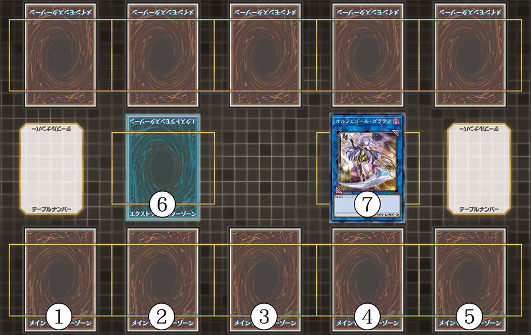
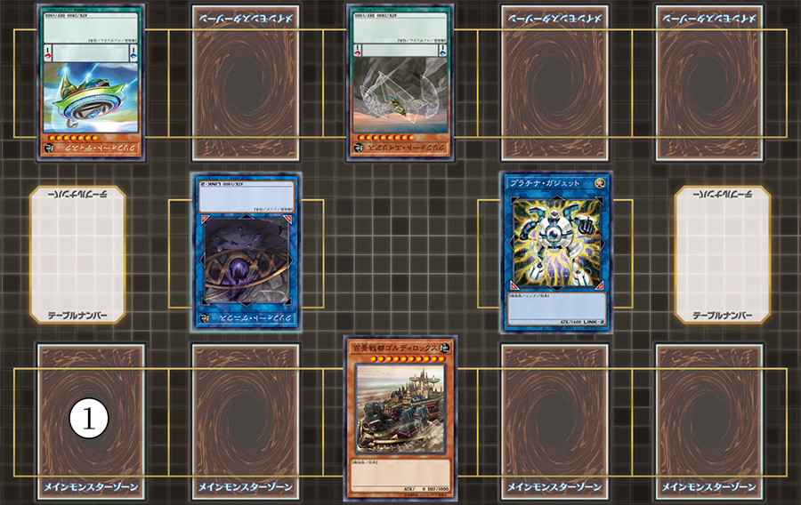
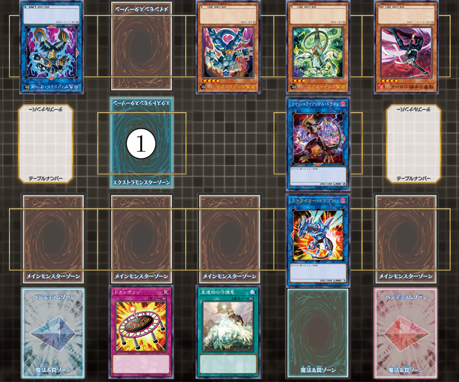

============================
2020年游戏王OCG规则检定测试
============================

由罗伽翻译，小红帽等校对并发布在石墨文档，点击链接进入：

| \ `规则检定2020 <https://shimo.im/docs/ZzkLVrxL7eiEN3QE/read>`__\

以下为复制黏贴的备份。

基本部分
===========

1.  | 以「`暗骑士@火灵天星`_」、「`沉沉妖@火灵天星`_」、「`炎凤凰@火灵天星`_」、「`抖抖妖@火灵天星`_」为连接素材把「`电子界到临者@火灵天星`_」连接召唤的场合，那只「`电子界到临者@火灵天星`_」的原本攻击力是『？』
    | A.3000
    | B.2000
    | C.6000
    | D.5000
    | E.4000

2.  | 以下的效果处理中，会将卡组洗切的是？
    | A.以对方墓地1只通常怪兽为对象发动的「`恶魔的叹息`_」的处理
    | B.「`魔救之奇迹-巨龙晶石`_」的①的效果处理。
    | C.「`邪遗式魂灵座甲魔`_」的效果处理确认手卡时，没有宣言种族·属性的怪兽的场合
    | D.以5只融合怪兽为对象发动的「`贪欲之壶`_」的处理
    | E.「`水海龙@火灵天星`_」的②的效果处理

3.  | 下例状况中可以正常发动「`原始生命态 尼比鲁`_」的效果的是？
    | A.对方对5只以上怪兽的召唤·特殊召唤成功后， 因「`激流葬`_」的效果使得场上没有怪兽存在的场合
    | B. 对方对5只以上怪兽的召唤·特殊召唤成功的回合的结束阶段
    | C. 对方对5只以上怪兽的召唤·特殊召唤成功的回合，且「`深渊之结界像`_」适用中的场合
    | D. 对方对5只以上怪兽的召唤·特殊召唤成功的回合，且「`日全食之书`_」的效果适用使得全部怪兽变成里侧守备表示的场合
    | E.对方在战斗阶段中把5只以上怪兽召唤·特殊召唤的回合的主要阶段2

4.  | 连锁以对方场上的「`破械童子 娑罗摩`_」为对象发动的「`破械神的祸灵`_」的②效果把以下的卡·效果发动的场合，仍然进行连接召唤的是？
    | A.「`洗脑解除`_」
    | B.以「`破械神的祸灵`_」为对象发动「`月之书`_」
    | C.以「`破械童子 娑罗摩`_」为对象发动「`强制脱出装置`_」
    | D.以「`破械童子 娑罗摩`_」为对象发动「`神龙骑士 闪耀`_」的效果
    | E.以「`破械神的祸灵`_」为对象发动「`大逮捕`_」

5.  | 以下内容中，怪兽卡上没有记述的是？
    | A.卡名
    | B.效果标识
    | C.被收录时的卡包序列名
    | D.攻击力
    | E.种族

6.  | 在「`机巧蹄-天迦久御雷`_」的②的效果装备的以下怪兽中，可以被其③效果特殊召唤的是？
    | A.「`星光大道`_」的效果特殊召唤的「`星尘龙`_」
    | B.「`霸王眷龙 凶饿毒`_」
    | C.「`流天类星龙`_」
    | D.在「`自奏圣乐`_」连接怪兽上叠来XYZ召唤的「`宵星之机神 丁吉尔苏`_」
    | E.「`调皮宝贝吼吼龙`_」

7.  | 以下的自己怪兽因对方的「`强制脱出装置`_」的效果适用而从场上离开的场合，其效果能发动的是？
    | A.「`No.24 龙血鬼 德拉古勒斯`_」
    | B.「`超机怪虫·方舟感质虫`_」
    | C.「`星尘战士`_」
    | D.「`御用皇帝`_」
    | E.「`抗锯齿星人`_」

8.  | 场上有用自身的①效果特殊召唤的「`并行超越龙`_」以及用那个②效果特殊召唤的「`并行超越龙`_」存在，之后「`技能抽取`_」的效果适用的场合，以下处理中正确的是？
    | A.其他4项均不正确
    | B.只有①效果特殊召唤的「`并行超越龙`_」等级变回8星，攻击力·守备力变回2000
    | C.2只「`并行超越龙`_」都仍然是4星，攻击力·守备力1000的状态
    | D. 只有②效果特殊召唤的「`并行超越龙`_」等级变回8星，攻击力·守备力变回2000
    | E.2只「`并行超越龙`_」的等级都变回8星，攻击力·守备力变回2000

9.  | 以下怪兽中不能作为「`六花圣 花簪剑菊`_」①效果的正确对象的是？
    | A.「`芳香炽天使-甜马郁兰`_」
    | B.「`宝石骑士·珍珠`_」
    | C.「`曼陀罗天使号手`_」
    | D.其他4项均是正确对象
    | E.「`XYZ-神龙炮`_」

10. | 「`捕食植物 青锁龙森蚺`_」的②的效果发动之际，不能被送去墓地的卡是？
    | A.「`融合回收`_」
    | B.「`决斗融合`_」
    | C.「`吸光融合`_」
    | D.「`“艾”慕融合`_」
    | E.「`融合解除`_」

11. | 以下怪兽效果中，不能满足「`战华之仲-孙谋`_」③效果的发动条件的是？
    | A.「`战华之智-诸葛孔`_」的①效果
    | B.「`战华之美-周公`_」的①效果
    | C.其他4项均能满足「`战华之仲-孙谋`_」③效果的发动条件
    | D.「`战华之德-刘玄`_」的③效果
    | E.「`战华之孟-曹德`_」的③效果

12. | 场上是以下状况的场合，没有使用正确区域进行特殊召唤的选项是？
    | |image1.jpg|
    | A.用「`简易融合`_」的效果在5号区域把「`千眼纳祭神`_」特殊召唤
    | B.用「`重编码存活`_」的①效果在1号区域把「`解码语者·炽热之魂`_」特殊召唤
    | C.以「`自奏圣乐·伽拉忒亚`_」为XYZ素材在6号区域把「`宵星之机神 丁吉尔苏`_」XYZ召唤
    | D.其他4项使用的区域均不正确
    | E.用「`妖刀-不知火`_」的效果在2号区域把「`妖神-不知火`_」特殊召唤

13. | 用「`连接十字`_」的效果把2只连接衍生物特殊召唤的回合中，以下选项中可以进行的是？
    | A.用2只连接衍生物把「`降频承办员`_」连接召唤
    | B.用2只连接衍生物把「`沼地的泥龙王`_」融合召唤
    | C.仅把2只连接衍生物解放，把「`神眼幻龙`_」从额外卡组特殊召唤
    | D.用「`喷气同调士`_」和1只连接衍生物把「`方程式同调士`_」同调召唤
    | E.用2只连接衍生物把「`森罗的姬芽宫`_」XYZ召唤

14. | 以下组合中不能正确作为「`神影依·七贤巨鲲魔`_」的融合素材怪兽的是？
    | A.「`影依·拿非利`_」+「`神影依·拿非利`_」
    | B.「`神圣之影 商神杖使`_」+「`影依巫女 艾莉娅儿`_」
    | C.「`影灵之翼 文蒂`_」+「`救影依-神数纳迦`_」
    | D.「`神影依·舍金纳迦`_」+「`神影依·异花莉莉丝`_」
    | E.「`神影依·文迪戈`_」+「`神影依·神子晶`_」

15. | 关于「`召命之神弓-阿波罗萨`_」的攻击力，以下选项中正确的是？
    | A.因为「`召命之神弓-阿波罗萨`_」的原本攻击力是『？』，所以不受「`收缩`_」的效果影响。
    | B.「`召命之神弓-阿波罗萨`_」的原本攻击力会在作为连接素材的怪兽不在墓地存在的场合下降
    | C.「`召命之神弓-阿波罗萨`_」的攻击力会在回合结束时变回原本攻击力数值
    | D.每次「`召命之神弓-阿波罗萨`_」的③效果发动，攻击力就降低800，但原本攻击力不会变化
    | E.因为「`召命之神弓-阿波罗萨`_」是连接4怪兽，所以原本攻击力会维持在3200

16. | 以下的效果处理中，进行了抽卡的是？
    | A.「`凡人的意志`_」出示通常怪兽发动的效果处理
    | B.「`增援`_」从卡组把1只4星以下的战士族怪兽加入手卡的效果处理
    | C.「`僵尸带菌者`_」让1张手卡回到卡组最上面发动的效果处理
    | D.「`强欲而谦虚之壶`_」把翻开的3张卡的其中1张加入手卡的效果处理
    | E.「`魔导书整理`_」从卡组上面把3张卡翻开的效果处理

17. | 以下选项描述的状况中，能正常发动「`红色重启`_」的是？
    | A.「`人造人-念力震慑者`_」表侧表示存在，「`自奏圣乐之阶`_」的②效果发动时
    | B.自己的魔法与陷阱区域有5张魔法卡盖放的状态下，对方把「`邪神之大灾害`_」发动时
    | C.对方从手卡把「`红色重启`_」发动时
    | D.「`魔女术的守护灵`_」的②的效果发动时
    | E.把墓地的「`无限泡影`_」除外来发动「`废品收集者`_」的效果时

18. | 以下怪兽中，可以用「`超烈焰波`_」的③效果特殊召唤的是？
    | A.适用「`失乐之霹雳`_」的①效果特殊召唤后被送去墓地的「`降雷皇 哈蒙`_」
    | B.用「`暗黑之召唤神`_」的①效果从卡组特殊召唤后被送去墓地的「`神炎皇 乌利亚`_」
    | C.用「`混沌之召唤神`_」的①效果从手卡特殊召唤后被送去墓地的「`降雷皇 哈蒙`_」
    | D.适用「`超烈焰波`_」的①效果特殊召唤，但被「`神之警告`_」无效并送去墓地的「`神炎皇 乌利亚`_」
    | E.被「`混沌核`_」的效果从手卡送去墓地的「`幻魔皇 拉比艾尔`_」

19. | 以下进行仪式召唤的效果中，需要把等级合计和仪式召唤的怪兽等级相同的怪兽解放的是？
    | A.「`异色眼降临`_」
    | B.「`黑魔术的秘仪`_」
    | C.「`遗式世传的禁断秘术`_」
    | D.「`高等仪式术`_」
    | E.「`魔神仪的祝诞`_」

20. | 关于“装备怪兽”这一文本，以下选项中描述正确的是？
    | A.可以作为装备卡正确对象的怪兽
    | B.当作装备卡使用的怪兽
    | C.有装备卡装备中的怪兽
    | D.有装备魔法卡装备中的怪兽
    | E.在有装备卡装备的状态被破坏的怪兽

21. | 关于「`三战之才`_」的发动条件，以下选项的说明中正确的是？
    | A.对方怪兽的效果没有适用的场合不能发动
    | B.3种“●”的处理全部可以进行的场合才能发动
    | C.3种“●”的处理中只要有1个可以进行就可以发动
    | D.3种“●”的处理中有2个以上可以进行的场合才能发动
    | E.对方怪兽的效果的发动被无效的回合也能发动

22. | 关于成为「`蓄积硫酸的落穴`_」对象的怪兽的效果的发动和处理，以下选项的说明中正确的是？
    | A.「`蓄积硫酸的落穴`_」的效果把「`机怪虫·轴突虫`_」变成表侧守备表示并破坏的场合，那只「`机怪神·轴突虫`_」的①②的效果可以以任意顺序组成连锁发动
    | B.「`蓄积硫酸的落穴`_」的效果把「`死亡精怪`_」变成表侧守备表示并破坏的场合，因为那只「`死亡精怪`_」自身已经在墓地存在，所以可以以其自身为对象发动效果并令其回到卡组。
    | C.「`蓄积硫酸的落穴`_」的效果把「`恶魔侦察者`_」变成表侧守备表示并破坏的场合，那只「`恶魔侦察者`_」的效果会发动
    | D.「`蓄积硫酸的落穴`_」的效果把「`禁忌之壶`_」变成表侧守备表示再回到里侧守备表示的场合，那只「`禁忌之壶`_」的效果会发动
    | E.「`蓄积硫酸的落穴`_」的效果把「`影依兽`_」变成表侧守备表示并破坏的场合，那只「`影依兽`_」的①的效果不能发动，但②的效果可以正常发动。

23. | 场上是以下状况的场合，自己用「`百景战都 金发姑娘号`_」的③效果令其移动到1号区域的场合，被破坏的卡的数量是？
    | |image2.jpg|
    | A.3张
    | B.1张
    | C.2张
    | D.4张
    | E.5张

24. | 自己的场地区域有「`魔法都市 恩底弥翁`_」，自己怪兽区域有当作通常怪兽使用的「`暗黑女武神`_」，自己的灵摆区域有2张「`创圣魔导王 恩底弥翁`_」，以上情况下，把「`创圣魔导王 恩底弥翁`_」的①的灵摆效果发动的场合，最多可以选多少张场上的卡破坏？
    | A.0张
    | B.3张
    | C.1张
    | D.4张
    | E.2张

25. | 以下选项中正确进行了特殊召唤的是？
    | A.用「`闪刀机-虎鲨加农炮`_」的①的效果把对方墓地的「`闪刀姬-泽克`_」特殊召唤
    | B.其他4项关于特殊召唤的处理均正确
    | C.被战斗破坏时发动的「`闪刀姬-零衣`_」的②的效果特殊召唤成功时，发动「`闪刀姬-露世`_」的①的效果并特殊召唤
    | D.以「`闪刀姬-燎里`_」和「`闪刀姬衍生物`_」为素材把「`闪刀姬-泽克`_」连接召唤
    | E.用「`闪刀姬-零衣`_」的效果把「`闪刀姬-泽克`_」特殊召唤

26. | 以下作为融合素材怪兽的组合中，「`黎明之堕天使 路西法`_」不能发动①效果的选项是？
    | A.「`堕天使 路西法`_」+「`堕天使 路西法`_」+「`堕天使 路西法`_」
    | B.「`堕天使 路西法`_」+「`堕天使 安度西亚斯`_」+「`堕天使 内尔伽勒`_」
    | C.「`堕天使 杰拉特`_」+「`堕天使 埃地·阿拉耶`_」+因「`DNA移植手术`_」当作暗属性使用的「`心眼之女神`_」
    | D.「`堕天使 路西法`_」+「`堕天使 苏泊比亚`_」+「`堕天使 路西法`_」
    | E.其他4项中①效果均可以发动

27. | 以下的卡·效果中，可以对应发动「`幽鬼兔`_」的效果的是？
    | A.「`黄金乡的盗墓者`_」的①效果
    | B.「`被诅咒的黄金国度`_」的③效果
    | C.「`永久辉煌的黄金乡`_」的①效果
    | D.「`魔救之勒皮他晶石`_」的②效果
    | E.「`六花精 仙客来`_」的①效果

28. | 连锁对方发动的「`灰流丽`_」的效果把以下的卡·效果发动的场合，不会把那个「`灰流丽`_」的效果的发动（或者那个效果）无效化的是？
    | A.其他4项均会把「`灰流丽`_」的效果的发动（或者那个效果）无效化
    | B.「`天罚`_」
    | C.「`D.D.乌鸦`_」
    | D.「`墓穴的指名者`_」
    | E.「`抹杀之指名者`_」

应用部分
===========

29. | 关于「`半龙女仆的更衣`_」的②效果的处理，以下选项中说明正确的是？
    | A.以「`暗钢龙 暗钢`_」的效果特殊召唤的「`半龙女仆·赤焰龙女`_」为对象发动的场合，因为「`半龙女仆·赤焰龙女`_」会回到卡组最下面，所以不能把墓地的「`半龙女仆的更衣`_」加入手卡
    | B.连锁以「`半龙女仆·天风龙女`_」为对象发动的该效果把「`半龙女仆的休息`_」的效果发动使那只「`半龙女仆·天风龙女`_」回到手卡的场合，因为作为对象的怪兽不在场上存在，把墓地的「`半龙女仆的更衣`_」加入手卡的处理不能适用
    | C.连锁以「`半龙女仆·洗衣龙女`_」为对象发动的该效果把「`月之书`_」发动使那只「`半龙女仆·洗衣龙女`_」变成里侧守备表示的场合，把墓地的「`半龙女仆的更衣`_」加入手卡的处理以及把作为对象的怪兽加入手卡的处理均不适用
    | D.以「`半龙女仆·耀光龙女`_」为对象发动的场合，墓地的「`半龙女仆的更衣`_」加入手卡，「`半龙女仆·耀光龙女`_」回到额外卡组
    | E.以「`半龙女仆·龙女管家`_」为对象发动的场合，墓地的「`半龙女仆的更衣`_」加入手卡，「`半龙女仆·龙女管家`_」留在场上

30. | 连锁把「`解码语者·扩展`_」除外来发动的自己的「`访问码语者`_」的②效果，自己把「`技能抽取`_」发动的场合，以下处理中正确的是？
    | A.不把对方场上的卡破坏，这个回合，自己不能再把暗属性怪兽除外来发动「`访问码语者`_」的②效果
    | B. 「`技能抽取`_」本身就不能对应「`访问码语者`_」的②效果的发动而发动
    | C.把对方场上的卡破坏，这个回合，自己仍然可以把暗属性怪兽除外来发动「`访问码语者`_」的②效果
    | D.把对方场上的卡破坏，这个回合，自己不能再把暗属性怪兽除外来发动「`访问码语者`_」的②效果
    | E.不把对方场上的卡破坏，这个回合，自己仍然可以把暗属性怪兽除外来发动「`访问码语者`_」的②效果

31. | 场上是以下状况的场合，对方把以下的卡或效果发动，那时有卡会被除外的选项是？
    | |image3.jpg|
    | A.用「`试胆竞速`_」的效果把「`试胆竞速`_」自身破坏
    | B.其他4项均不会让卡被除外
    | C.用「`古怪恶魔`_」的灵摆效果把自身以及「`失乐园`_」破坏
    | D.战斗阶段结束时让「`剑斗兽 射斗`_」回到卡组把效果发动
    | E.让「`试胆竞速`_」回到手卡来把「`黑羽-精锐之泽费洛斯`_」的效果发动并特殊召唤

32. | 自己把「`救援鼠`_」召唤，自己和对方各自要把「`救援鼠`_」的①的怪兽效果和「`效果遮蒙者`_」的效果发动的场合，关于那些发动和处理，以下选项中说明正确的是？
    | A.「`救援鼠`_」召唤成功时，双方先确认是否要发动快速效果，结果对方可以先把「`效果遮蒙者`_」的效果发动。因为「`救援鼠`_」的怪兽效果是把自身解放来发动的效果，那个效果不会被无效，正常适用
    | B.「`救援鼠`_」召唤成功时，自己选择是否要发动那个①的怪兽效果。然而，要发动的场合，由于是咒文速度2，对方可以先发动「`效果遮蒙者`_」的效果，随后自己才能作为连锁2把「`救援鼠`_」的①的怪兽效果发动
    | C.其他4项均不正确
    | D.「`救援鼠`_」召唤成功时，双方先确认是否要发动快速效果。因此，在「`救援鼠`_」的起动效果发动之前，对方可以先把「`效果遮蒙者`_」的效果发动把「`救援鼠`_」的效果无效
    | E.「`救援鼠`_」召唤成功时，自己选择是否要发动那个①的怪兽效果。发动的场合，因为「`救援鼠`_」将自身解放了，结果对方不能再连锁发动「`效果遮蒙者`_」的效果

33. | 以下「`恩底弥翁的仆从`_」的②的灵摆效果的发动·处理中，那个回合自己还能把「`恩底弥翁的仆从`_」特殊召唤的选项是？
    | A.连锁「`恩底弥翁的仆从`_」的②的灵摆效果把「`空牙团的睿智 薇兹`_」的②效果发动的场合
    | B. 连锁「`恩底弥翁的仆从`_」的②的灵摆效果把「`旋风`_」发动，「`恩底弥翁的仆从`_」自身被破坏的场合
    | C.其他4项中，自己均能在这个回合再把「`恩底弥翁的仆从`_」特殊召唤
    | D. 连锁「`恩底弥翁的仆从`_」的②的灵摆效果把「`王宫的敕命`_」发动的场合
    | E. 「`恩底弥翁的仆从`_」的②的灵摆效果的效果处理时，卡组没有可以特殊召唤的怪兽存在的场合

34. | 以下效果发动时，可以连锁发动「`死灵王 恶眼`_」的①效果的是？
    | A.「`死灵佐玛`_」的②效果
    | B.「`黄金乡的盗墓者`_」的①效果
    | C.「`不死世界`_」适用中发动的「`娱乐法师 伤害杂耍人`_」的③效果
    | D.其他4项均能连锁发动「`死灵王 恶眼`_」的①效果
    | E.「`不死世界`_」适用中发动的「`古代的机械魔神`_」的②效果

35. | 自己的「`深海哨兵`_」的①效果把对方的「`封印之黄金柜`_」除外的回合，自己的「`深海吟游诗人`_」的①效果再把对方的「`黑洞`_」除外。以上情况下，关于这个回合的结束阶段的处理，以下选项中描述正确的是？
    | A.必须按照效果发动的顺序让被除外的卡回到对方手卡，如题所述的情况下，先让被除外的「`封印之黄金柜`_」回到对方手卡，那之后再让「`黑洞`_」回到对方手卡
    | B.被直到结束阶段除外的卡是复数张的场合，那些卡同时回到手卡，如题所述的情况下，「`封印之黄金柜`_」和「`黑洞`_」同时回到对方手卡
    | C.其他4项的说明均不正确
    | D.被那些效果直到结束阶段除外的卡，自己可以任意选择让它们回到对方手卡的顺序。可以先让「`封印之黄金柜`_」回到对方手卡，也可以先让「`黑洞`_」回到对方手卡
    | E.被那些效果除外的卡要回去的场合，各自开连锁进行处理。自己可以以任意顺序组成连锁发动并进行回到手卡的处理

36. | 被「`同盟运输车`_」的效果当作装备卡使用的场合，以下选项中不能发动·适用的效果是？
    | A.「`破坏剑-龙破坏之剑`_」的②效果
    | B.「`龙骑兵团-长柄大刀龙`_」的②效果
    | C.「`甲虫装机 大黄蜂`_」的③效果
    | D.「`装甲电子翼`_」的②效果
    | E.「`秘旋谍装备-绝地胜机`_」的②效果

37. | 关于「`神影依·米德拉什`_」的②效果，以下选项中描述正确的是？
    | A.自己把「`神影依·米德拉什`_」特殊召唤的回合，自己不能把怪兽特殊召唤
    | B.「`神影依·米德拉什`_」的②效果适用中，自己的「`混源龙 巨涡始祖神`_」的特殊召唤被对方的「`神之通告`_」的效果无效的场合，自己还能对怪兽进行1次特殊召唤
    | C.即使自己已经进行过特殊召唤，也能以「`神影依·米德拉什`_」为素材进行连接召唤
    | D.连锁对方的「`与神之假身的接触`_」的发动，自己把「`王宫的敕命`_」发动让那个效果无效的场合，对方在这个回合不能再进行特殊召唤
    | E.在「`神影依·米德拉什`_」特殊召唤前进行过特殊召唤的玩家在这个回合不能再把怪兽特殊召唤

38. | 以下选项描述的状况中可以发动「`战华史略-十万之矢`_」的②效果的是？
    | A.「`战华之美-周公`_」存在的状态，连锁1以墓地的「`战华之智-诸葛孔`_」为对象发动「`死者苏生`_」，连锁2以「`战华史略-十万之矢`_」为对象发动「`旋风`_」使其被破坏送去墓地
    | B.其他4项的场合均能发动
    | C.「`战华之义-关云`_」的攻击把对方怪兽破坏时，作为「`战华之孟-曹德`_」①效果发动时的COST把场上的「`战华史略-十万之矢`_」送去墓地
    | D.「`战华之诡-贾文`_」和「`战华之妙-鲁敬`_」存在的状态，发动「`双龙卷`_」把「`战华史略-十万之矢`_」破坏送去墓地
    | E.被「`战华之仲-孙谋`_」的②效果加入手卡的「`战华之智-诸葛孔`_」用其①效果将自身特殊召唤后，作为②效果发动时的COST把场上的「`战华史略-十万之矢`_」送去墓地

39. | 自己的「`暗骑士@火灵天星`_」和对方的「`解码语者`_」进行战斗时，自己发动「`“艾”打式袭击`_」的场合，关于那个发动和处理，以下选项中描述正确的是？
    | A.因为双方怪兽的攻击力都是2300，所以「`“艾”打式袭击`_」本身就不能发动
    | B.由于「`“艾”打式袭击`_」的②效果需要在①效果发动前进行适用与处理，因此若不是墓地已有「`“艾”打式袭击`_」存在再发动第2张「`“艾”打式袭击`_」的①效果的状况，就不能适用②效果
    | C.「`“艾”打式袭击`_」的①效果在伤害计算时发动的场合，由于到伤害步骤结束时属于同一个效果的处理，因此不能适用「`“艾”打式袭击`_」的②效果，结果怪兽被战斗破坏的自己和对方各受到2300伤害
    | D.伤害计算时发动「`“艾”打式袭击`_」的①效果，进行战斗伤害计算时，由于「`“艾”打式袭击`_」还不在墓地存在，所以不能适用其②效果，结果怪兽被战斗破坏的自己和对方各受到2300伤害
    | E.伤害计算时发动「`“艾”打式袭击`_」的①效果，由于「`“艾”打式袭击`_」这张卡在效果处理后立刻送去墓地，可以适用②效果。那次伤害步骤结束时，只有对方的怪兽被战斗破坏且对方受到2300伤害，之后自己可以发动「`暗骑士@火灵天星`_」的②效果

40. | 自己的「`大星义终极龙`_」的②效果宣言龙族怪兽来发动，结果没有把龙族怪兽破坏的场合，关于那个发动和处理，以下选项中描述正确的是？
    | A.「`大星义终极龙`_」的②效果必须宣言在双方场上各有1只以上存在的可以被效果破坏的怪兽的种族，因此，这个场合下本身就不能宣言龙族怪兽来发动
    | B.没有把宣言种族的怪兽破坏的场合，『直到下个回合的结束时，双方不能把宣言的种族的怪兽特殊召唤』的效果不适用
    | C.「`大星义终极龙`_」的②效果必须宣言在场上有2只以上存在的可以被效果破坏的怪兽的种族，因此，这个场合下本身就不能宣言龙族怪兽来发动
    | D.没有把宣言种族的怪兽破坏的场合，『直到下个回合的结束时，双方不能把宣言的种族的怪兽特殊召唤』的效果也会适用
    | E.若「`大星义终极龙`_」宣言龙族来发动效果，由于自身的①效果而不会被效果破坏，结果『场上的宣言种族的怪兽全部破坏』的处理不会适用。因此，这个场合下本身就不能宣言龙族怪兽来发动

41. | 以下使用「`I:P伪装舞会莱娜`_」的①效果进行连接召唤的描述中，不正确的选项是？
    | A.以「`I:P伪装舞会莱娜`_」和「`神树之圣像骑士`_」为素材把「`大君主之圣像骑士`_」连接召唤
    | B.以「`I:P伪装舞会莱娜`_」和手卡的「`代码生成员`_」「`代码导出员`_」为素材把「`访问码语者`_」连接召唤
    | C.以「`I:P伪装舞会莱娜`_」和「`备份秘书`_」为素材把「`更新干扰员`_」连接召唤
    | D.只以「`I:P伪装舞会莱娜`_」为素材把「`安全守卫者`_」连接召唤
    | E.其他4项均能正确进行连接召唤

42. | 连锁1对方的「`超魔导龙骑士-真红眼龙骑士`_」的②效果发动，连锁2自己的「`超魔导龙骑士-真红眼龙骑士`_」的③效果发动，关于这一场合中的处理，以下选项中描述正确的是？
    | A.对方的「`超魔导龙骑士-真红眼龙骑士`_」的效果的发动被无效但自身不会被破坏，自己的「`超魔导龙骑士-真红眼龙骑士`_」的攻击力不上升
    | B.本身就不能对应对方的「`超魔导龙骑士-真红眼龙骑士`_」的②效果把自己的「`超魔导龙骑士-真红眼龙骑士`_」的③效果发动
    | C.对方的「`超魔导龙骑士-真红眼龙骑士`_」的效果的发动不会被无效且自身也不会被破坏，自己的「`超魔导龙骑士-真红眼龙骑士`_」的攻击力上升1000
    | D.对方的「`超魔导龙骑士-真红眼龙骑士`_」的效果的发动被无效且自身被破坏，自己的「`超魔导龙骑士-真红眼龙骑士`_」的攻击力上升1000
    | E.对方的「`超魔导龙骑士-真红眼龙骑士`_」的效果的发动被无效但自身不会被破坏，自己的「`超魔导龙骑士-真红眼龙骑士`_」的攻击力上升1000

43. | 连锁1发动「`黄金乡的征服者`_」的①效果，连锁2发动「`红化血染之黄金国永生药`_」的①效果把「`黄金卿 黄金国巫妖`_」特殊召唤，关于这一场合中的处理，以下选项中描述正确的是？
    | A.由于「`黄金乡的征服者`_」的效果处理时有「`黄金卿 黄金国巫妖`_」存在，「`黄金乡的征服者`_」在怪兽区域特殊召唤，那之后，作为怪兽的效果，「`黄金乡的征服者`_」发动把场上表侧表示的卡破坏的效果
    | B.其他4项均不正确
    | C.由于「`黄金乡的征服者`_」的效果发动时没有「`黄金卿 黄金国巫妖`_」存在，只进行把「`黄金乡的征服者`_」在怪兽区域特殊召唤的处理
    | D.首先，「`黄金乡的征服者`_」在怪兽区域特殊召唤，那之后「`红化血染之黄金国永生药`_」的①效果把「`黄金卿 黄金国巫妖`_」特殊召唤。然而，没有「`黄金卿 黄金国巫妖`_」存在的场合，本身就不能发动「`黄金乡的征服者`_」。因此，正确的处理应当是在「`红化血染之黄金国永生药`_」的效果处理后再发动「`黄金乡的征服者`_」
    | E. 由于「`黄金乡的征服者`_」的效果处理时有「`黄金卿 黄金国巫妖`_」存在，「`黄金乡的征服者`_」在怪兽区域特殊召唤后，作为同一个效果的处理，可以再进行把场上表侧表示存在的卡破坏的处理

44. | 「`海晶少女的斗海`_」的③效果给「`海晶少女 妙晶心`_」装备了「`海晶少女 青高海牛`_」、「`海晶少女 奶嘴海葵`_」以及「`海晶少女 石狗公`_」。这一状况下，以下的效果适用的场合，会让装备卡破坏的选项是？
    | A.「`海晶少女的斗海`_」适用了对方的「`魔术师的导门阵`_」的②效果
    | B.「`海晶少女 妙晶心`_」适用了对方的「`禁忌的圣杯`_」的效果
    | C.对方的「`究极传导恐兽`_」的①效果适用
    | D.「`海晶少女的斗海`_」被对方的「`宇宙旋风`_」的效果除外
    | E.其他4项的场合下装备卡均不会破坏

45. | 宣言「`电子龙`_」的卡名发动的「`禁止令`_」的①效果适用中的场合，以下选项中可以进行的是？
    | A.用「`同盟运输车`_」的①效果把「`电子龙`_」当作装备卡使用给「`同盟运输车`_」装备
    | B.用「`死者苏生`_」的效果从墓地把「`电子龙`_」特殊召唤
    | C.使用「`电子龙`_」的①效果特殊召唤
    | D.在进行通常召唤时把「`电子龙`_」里侧守备表示盖放
    | E.其他4项均不能进行

46. | 「`旋坏之贯破黄蜂巢`_」在4阶XYZ怪兽上面重叠来XYZ召唤的回合中，以下发动或处理中正确的选项是？
    | A.用「`永界王战 欧姆刚德王`_」的③效果把「`旋坏之贯破黄蜂巢`_」变成XYZ素材
    | B.在「`旋坏之贯破黄蜂巢`_」上面重叠来把「`迅雷之骑士 盖亚龙骑士`_」XYZ召唤
    | C.以「`旋坏之贯破黄蜂巢`_」为对象发动「`再起超量`_」的②效果
    | D.其他4项均不是正确的发动或处理
    | E.以「`旋坏之贯破黄蜂巢`_」为对象发动「`升阶魔法-星光之力`_」

47. | 对方的魔法与陷阱区域有「`大宇宙`_」表侧表示存在，进行下述操作的场合，那个回合结束时，「`红莲魔兽 塔·伊沙`_」的最终攻击力·守备力是？
    | 例：自己主要阶段1，发动「`强欲而贪欲之壶`_」。用「`机巧蛇-丛云远吕智`_」的①效果将其特殊召唤，把「`红莲魔兽 塔·伊沙`_」通常召唤。那个回合的战斗阶段，对方发动「`对手见冤家`_」把「`死灵之颜`_」召唤。连锁1召唤成功的「`死灵之颜`_」的效果发动，连锁2自己发动「`狡猾的落穴`_」把对方的「`死灵之颜`_」和自己的「`机巧蛇-丛云远吕智`_」破坏。
    | A.4800
    | B.400
    | C.2400
    | D.10400
    | E.4400

48. | 指定1号区域发动的自己的「`嘣床`_」表侧表示存在，场上是以下状况的场合，以下选项描述的状况中「`嘣床`_」的效果不会发动的是？
    | |image4.jpg|
    | A.以「`刚鬼 硬铠食人魔`_」和「`刚鬼 过肩摔霸王龙`_」为素材在1号区域把「`刚鬼 力道食人魔`_」连接召唤
    | B.以「`刚鬼 过肩摔霸王龙`_」、「`刚鬼 固定眼镜蛇`_」和「`复仇的女战士 罗丝`_」为素材在1号区域把「`星态龙`_」同调召唤
    | C.用「`速射扳机`_」的效果把「`双三角龙`_」和「`主动撞针龙`_」破坏，在1号区域把「`装弹枪管狂怒龙`_」融合召唤
    | D.以「`主动撞针龙`_」和「`双三角龙`_」为素材在1号区域把「`拓扑三叶双头蛇`_」连接召唤
    | E.以「`刚鬼 过肩摔霸王龙`_」和「`复仇的女战士 罗丝`_」为素材在1号区域把「`阿洛美勒丝之虫惑魔`_」XYZ召唤

49. | 「`大宇宙`_」的②效果适用中，「`宵星之骑士 吉尔苏`_」的①效果发动的场合，以下选项中对其处理描述正确的是？
    | A.从卡组选的卡不送去墓地而除外。相同纵列有2张以上其他卡存在的场合，再把「`宵星之骑士 吉尔苏`_」当作调整使用
    | B.从卡组选的卡不送去墓地而除外。相同纵列有2张以上其他卡存在的场合，也不能把「`宵星之骑士 吉尔苏`_」当作调整使用
    | C.从卡组选的如果是怪兽卡则会被除外。选魔法·陷阱卡的场合正常送去墓地，此时相同纵列有2张以上其他卡存在的场合，把「`宵星之骑士 吉尔苏`_」当作调整使用
    | D.虽然可以发动，但由于效果处理不能从卡组把卡送去墓地，效果处理不适用
    | E.若不是相同纵列有2张以上其他卡存在的场合则不能发动，只进行把「`宵星之骑士 吉尔苏`_」当作调整适用的处理，不进行从卡组把卡送去墓地的处理。

50. | 以灵摆区域的「`霸王龙 扎克`_」为对象发动的「`雪暴`_」的效果适用的回合，关于会被「`雪暴`_」的效果无效化的效果，以下选项中描述正确的是？
    | A.全部的怪兽效果·灵摆效果
    | B.②的灵摆效果
    | C.①和④的怪兽效果
    | D.①和④的怪兽效果，②的灵摆效果
    | E.①和②的灵摆效果

答案
=======

| 1-5 EAEAB
| 6-10 DEEEB
| 11-15 EBDAD
| 16-20 ACACC
| 21-25 CEAED
| 26-30 CDCDE
| 31-35 BDCCD
| 36-40 EBBED
| 41-45 CAEEE
| 46-50 ABBBB

.. |image3.jpg| image:: ../.static/c05/2020_3.jpg

.. _`魔救之奇迹-巨龙晶石`: https://ygocdb.com/?search=魔救之奇迹-巨龙晶石
.. _`DNA移植手术`: https://ygocdb.com/?search=DNA移植手术
.. _`剑斗兽 射斗`: https://ygocdb.com/?search=剑斗兽+射斗
.. _`宵星之机神 丁吉尔苏`: https://ygocdb.com/?search=宵星之机神+丁吉尔苏
.. _`暗黑之召唤神`: https://ygocdb.com/?search=暗黑之召唤神
.. _`重编码存活`: https://ygocdb.com/?search=重编码存活
.. _`黑魔术的秘仪`: https://ygocdb.com/?search=黑魔术的秘仪
.. _`炎凤凰@火灵天星`: https://ygocdb.com/?search=炎凤凰@火灵天星
.. _`沼地的泥龙王`: https://ygocdb.com/?search=沼地的泥龙王
.. _`魔导书整理`: https://ygocdb.com/?search=魔导书整理
.. _`恩底弥翁的仆从`: https://ygocdb.com/?search=恩底弥翁的仆从
.. _`方程式同调士`: https://ygocdb.com/?search=方程式同调士
.. _`百景战都 金发姑娘号`: https://ygocdb.com/?search=百景战都+金发姑娘号
.. _`刚鬼 力道食人魔`: https://ygocdb.com/?search=刚鬼+力道食人魔
.. _`凡人的意志`: https://ygocdb.com/?search=凡人的意志
.. _`恶魔侦察者`: https://ygocdb.com/?search=恶魔侦察者
.. _`闪刀姬-燎里`: https://ygocdb.com/?search=闪刀姬-燎里
.. _`死亡精怪`: https://ygocdb.com/?search=死亡精怪
.. _`创圣魔导王 恩底弥翁`: https://ygocdb.com/?search=创圣魔导王+恩底弥翁
.. _`海晶少女的斗海`: https://ygocdb.com/?search=海晶少女的斗海
.. _`无限泡影`: https://ygocdb.com/?search=无限泡影
.. _`空牙团的睿智 薇兹`: https://ygocdb.com/?search=空牙团的睿智+薇兹
.. _`自奏圣乐·伽拉忒亚`: https://ygocdb.com/?search=自奏圣乐·伽拉忒亚
.. _`喷气同调士`: https://ygocdb.com/?search=喷气同调士
.. _`遗式世传的禁断秘术`: https://ygocdb.com/?search=遗式世传的禁断秘术
.. _`堕天使 路西法`: https://ygocdb.com/?search=堕天使+路西法
.. _`芳香炽天使-甜马郁兰`: https://ygocdb.com/?search=芳香炽天使-甜马郁兰
.. _`废品收集者`: https://ygocdb.com/?search=废品收集者
.. _`黄金卿 黄金国巫妖`: https://ygocdb.com/?search=黄金卿+黄金国巫妖
.. _`秘旋谍装备-绝地胜机`: https://ygocdb.com/?search=秘旋谍装备-绝地胜机
.. _`狡猾的落穴`: https://ygocdb.com/?search=狡猾的落穴
.. _`失乐园`: https://ygocdb.com/?search=失乐园
.. _`战华之孟-曹德`: https://ygocdb.com/?search=战华之孟-曹德
.. _`半龙女仆·洗衣龙女`: https://ygocdb.com/?search=半龙女仆·洗衣龙女
.. _`神影依·异花莉莉丝`: https://ygocdb.com/?search=神影依·异花莉莉丝
.. _`月之书`: https://ygocdb.com/?search=月之书
.. _`半龙女仆·天风龙女`: https://ygocdb.com/?search=半龙女仆·天风龙女
.. _`灰流丽`: https://ygocdb.com/?search=灰流丽
.. _`失乐之霹雳`: https://ygocdb.com/?search=失乐之霹雳
.. _`星态龙`: https://ygocdb.com/?search=星态龙
.. _`宵星之骑士 吉尔苏`: https://ygocdb.com/?search=宵星之骑士+吉尔苏
.. _`永界王战 欧姆刚德王`: https://ygocdb.com/?search=永界王战+欧姆刚德王
.. _`解码语者·炽热之魂`: https://ygocdb.com/?search=解码语者·炽热之魂
.. _`超魔导龙骑士-真红眼龙骑士`: https://ygocdb.com/?search=超魔导龙骑士-真红眼龙骑士
.. _`速射扳机`: https://ygocdb.com/?search=速射扳机
.. _`神影依·米德拉什`: https://ygocdb.com/?search=神影依·米德拉什
.. _`六花圣 花簪剑菊`: https://ygocdb.com/?search=六花圣+花簪剑菊
.. _`森罗的姬芽宫`: https://ygocdb.com/?search=森罗的姬芽宫
.. _`魔女术的守护灵`: https://ygocdb.com/?search=魔女术的守护灵
.. _`日全食之书`: https://ygocdb.com/?search=日全食之书
.. _`黎明之堕天使 路西法`: https://ygocdb.com/?search=黎明之堕天使+路西法
.. _`连接十字`: https://ygocdb.com/?search=连接十字
.. _`收缩`: https://ygocdb.com/?search=收缩
.. _`简易融合`: https://ygocdb.com/?search=简易融合
.. _`破械童子 娑罗摩`: https://ygocdb.com/?search=破械童子+娑罗摩
.. _`半龙女仆的更衣`: https://ygocdb.com/?search=半龙女仆的更衣
.. _`被诅咒的黄金国度`: https://ygocdb.com/?search=被诅咒的黄金国度
.. _`大君主之圣像骑士`: https://ygocdb.com/?search=大君主之圣像骑士
.. _`代码生成员`: https://ygocdb.com/?search=代码生成员
.. _`封印之黄金柜`: https://ygocdb.com/?search=封印之黄金柜
.. _`魔神仪的祝诞`: https://ygocdb.com/?search=魔神仪的祝诞
.. _`解码语者`: https://ygocdb.com/?search=解码语者
.. _`红化血染之黄金国永生药`: https://ygocdb.com/?search=红化血染之黄金国永生药
.. _`神影依·神子晶`: https://ygocdb.com/?search=神影依·神子晶
.. _`心眼之女神`: https://ygocdb.com/?search=心眼之女神
.. _`刚鬼 硬铠食人魔`: https://ygocdb.com/?search=刚鬼+硬铠食人魔
.. _`妖刀-不知火`: https://ygocdb.com/?search=妖刀-不知火
.. _`神之通告`: https://ygocdb.com/?search=神之通告
.. _`水海龙@火灵天星`: https://ygocdb.com/?search=水海龙@火灵天星
.. _`禁忌之壶`: https://ygocdb.com/?search=禁忌之壶
.. _`高等仪式术`: https://ygocdb.com/?search=高等仪式术
.. _`邪遗式魂灵座甲魔`: https://ygocdb.com/?search=邪遗式魂灵座甲魔
.. _`再起超量`: https://ygocdb.com/?search=再起超量
.. _`混沌之召唤神`: https://ygocdb.com/?search=混沌之召唤神
.. _`曼陀罗天使号手`: https://ygocdb.com/?search=曼陀罗天使号手
.. _`神树之圣像骑士`: https://ygocdb.com/?search=神树之圣像骑士
.. _`大星义终极龙`: https://ygocdb.com/?search=大星义终极龙
.. _`僵尸带菌者`: https://ygocdb.com/?search=僵尸带菌者
.. _`备份秘书`: https://ygocdb.com/?search=备份秘书
.. _`半龙女仆·龙女管家`: https://ygocdb.com/?search=半龙女仆·龙女管家
.. _`闪刀姬衍生物`: https://ygocdb.com/?search=闪刀姬衍生物
.. _`闪刀姬-露世`: https://ygocdb.com/?search=闪刀姬-露世
.. _`究极传导恐兽`: https://ygocdb.com/?search=究极传导恐兽
.. _`暗骑士@火灵天星`: https://ygocdb.com/?search=暗骑士@火灵天星
.. _`闪刀姬-零衣`: https://ygocdb.com/?search=闪刀姬-零衣
.. _`抗锯齿星人`: https://ygocdb.com/?search=抗锯齿星人
.. _`神影依·文迪戈`: https://ygocdb.com/?search=神影依·文迪戈
.. _`代码导出员`: https://ygocdb.com/?search=代码导出员
.. _`堕天使 安度西亚斯`: https://ygocdb.com/?search=堕天使+安度西亚斯
.. _`装甲电子翼`: https://ygocdb.com/?search=装甲电子翼
.. _`神龙骑士 闪耀`: https://ygocdb.com/?search=神龙骑士+闪耀
.. _`战华之德-刘玄`: https://ygocdb.com/?search=战华之德-刘玄
.. _`古代的机械魔神`: https://ygocdb.com/?search=古代的机械魔神
.. _`天罚`: https://ygocdb.com/?search=天罚
.. _`霸王龙 扎克`: https://ygocdb.com/?search=霸王龙+扎克
.. _`影依·拿非利`: https://ygocdb.com/?search=影依·拿非利
.. _`安全守卫者`: https://ygocdb.com/?search=安全守卫者
.. _`吸光融合`: https://ygocdb.com/?search=吸光融合
.. _`深渊之结界像`: https://ygocdb.com/?search=深渊之结界像
.. _`救援鼠`: https://ygocdb.com/?search=救援鼠
.. _`王宫的敕命`: https://ygocdb.com/?search=王宫的敕命
.. _`激流葬`: https://ygocdb.com/?search=激流葬
.. _`战华之仲-孙谋`: https://ygocdb.com/?search=战华之仲-孙谋
.. _`堕天使 苏泊比亚`: https://ygocdb.com/?search=堕天使+苏泊比亚
.. _`战华之美-周公`: https://ygocdb.com/?search=战华之美-周公
.. _`妖神-不知火`: https://ygocdb.com/?search=妖神-不知火
.. _`闪刀姬-泽克`: https://ygocdb.com/?search=闪刀姬-泽克
.. _`沉沉妖@火灵天星`: https://ygocdb.com/?search=沉沉妖@火灵天星
.. _`魔术师的导门阵`: https://ygocdb.com/?search=魔术师的导门阵
.. _`战华史略-十万之矢`: https://ygocdb.com/?search=战华史略-十万之矢
.. _`访问码语者`: https://ygocdb.com/?search=访问码语者
.. _`深海哨兵`: https://ygocdb.com/?search=深海哨兵
.. _`红莲魔兽 塔·伊沙`: https://ygocdb.com/?search=红莲魔兽+塔·伊沙
.. _`救影依-神数纳迦`: https://ygocdb.com/?search=救影依-神数纳迦
.. _`试胆竞速`: https://ygocdb.com/?search=试胆竞速
.. _`大宇宙`: https://ygocdb.com/?search=大宇宙
.. _`甲虫装机 大黄蜂`: https://ygocdb.com/?search=甲虫装机+大黄蜂
.. _`六花精 仙客来`: https://ygocdb.com/?search=六花精+仙客来
.. _`星光大道`: https://ygocdb.com/?search=星光大道
.. _`召命之神弓-阿波罗萨`: https://ygocdb.com/?search=召命之神弓-阿波罗萨
.. _`迅雷之骑士 盖亚龙骑士`: https://ygocdb.com/?search=迅雷之骑士+盖亚龙骑士
.. _`幽鬼兔`: https://ygocdb.com/?search=幽鬼兔
.. _`海晶少女 奶嘴海葵`: https://ygocdb.com/?search=海晶少女+奶嘴海葵
.. _`“艾”慕融合`: https://ygocdb.com/?search=“艾”慕融合
.. _`调皮宝贝吼吼龙`: https://ygocdb.com/?search=调皮宝贝吼吼龙
.. _`禁忌的圣杯`: https://ygocdb.com/?search=禁忌的圣杯
.. _`D.D.乌鸦`: https://ygocdb.com/?search=D.D.乌鸦
.. _`娱乐法师 伤害杂耍人`: https://ygocdb.com/?search=娱乐法师+伤害杂耍人
.. _`古怪恶魔`: https://ygocdb.com/?search=古怪恶魔
.. _`XYZ-神龙炮`: https://ygocdb.com/?search=XYZ-神龙炮
.. _`嘣床`: https://ygocdb.com/?search=嘣床
.. _`强欲而谦虚之壶`: https://ygocdb.com/?search=强欲而谦虚之壶
.. _`“艾”打式袭击`: https://ygocdb.com/?search=“艾”打式袭击
.. _`强制脱出装置`: https://ygocdb.com/?search=强制脱出装置
.. _`神眼幻龙`: https://ygocdb.com/?search=神眼幻龙
.. _`人造人-念力震慑者`: https://ygocdb.com/?search=人造人-念力震慑者
.. _`堕天使 内尔伽勒`: https://ygocdb.com/?search=堕天使+内尔伽勒
.. _`神影依·七贤巨鲲魔`: https://ygocdb.com/?search=神影依·七贤巨鲲魔
.. _`并行超越龙`: https://ygocdb.com/?search=并行超越龙
.. _`龙骑兵团-长柄大刀龙`: https://ygocdb.com/?search=龙骑兵团-长柄大刀龙
.. _`双三角龙`: https://ygocdb.com/?search=双三角龙
.. _`蓄积硫酸的落穴`: https://ygocdb.com/?search=蓄积硫酸的落穴
.. _`刚鬼 固定眼镜蛇`: https://ygocdb.com/?search=刚鬼+固定眼镜蛇
.. _`原始生命态 尼比鲁`: https://ygocdb.com/?search=原始生命态+尼比鲁
.. _`自奏圣乐之阶`: https://ygocdb.com/?search=自奏圣乐之阶
.. _`主动撞针龙`: https://ygocdb.com/?search=主动撞针龙
.. _`增援`: https://ygocdb.com/?search=增援
.. _`宝石骑士·珍珠`: https://ygocdb.com/?search=宝石骑士·珍珠
.. _`流天类星龙`: https://ygocdb.com/?search=流天类星龙
.. _`永久辉煌的黄金乡`: https://ygocdb.com/?search=永久辉煌的黄金乡
.. _`刚鬼 过肩摔霸王龙`: https://ygocdb.com/?search=刚鬼+过肩摔霸王龙
.. _`海晶少女 青高海牛`: https://ygocdb.com/?search=海晶少女+青高海牛
.. _`装弹枪管狂怒龙`: https://ygocdb.com/?search=装弹枪管狂怒龙
.. _`雪暴`: https://ygocdb.com/?search=雪暴
.. _`不死世界`: https://ygocdb.com/?search=不死世界
.. _`幻魔皇 拉比艾尔`: https://ygocdb.com/?search=幻魔皇+拉比艾尔
.. _`升阶魔法-星光之力`: https://ygocdb.com/?search=升阶魔法-星光之力
.. _`抖抖妖@火灵天星`: https://ygocdb.com/?search=抖抖妖@火灵天星
.. _`魔法都市 恩底弥翁`: https://ygocdb.com/?search=魔法都市+恩底弥翁
.. _`御用皇帝`: https://ygocdb.com/?search=御用皇帝
.. _`阿洛美勒丝之虫惑魔`: https://ygocdb.com/?search=阿洛美勒丝之虫惑魔
.. _`千眼纳祭神`: https://ygocdb.com/?search=千眼纳祭神
.. _`同盟运输车`: https://ygocdb.com/?search=同盟运输车
.. _`海晶少女 石狗公`: https://ygocdb.com/?search=海晶少女+石狗公
.. _`技能抽取`: https://ygocdb.com/?search=技能抽取
.. _`死灵佐玛`: https://ygocdb.com/?search=死灵佐玛
.. _`与神之假身的接触`: https://ygocdb.com/?search=与神之假身的接触
.. _`旋坏之贯破黄蜂巢`: https://ygocdb.com/?search=旋坏之贯破黄蜂巢
.. _`神之警告`: https://ygocdb.com/?search=神之警告
.. _`闪刀机-虎鲨加农炮`: https://ygocdb.com/?search=闪刀机-虎鲨加农炮
.. _`半龙女仆·耀光龙女`: https://ygocdb.com/?search=半龙女仆·耀光龙女
.. _`效果遮蒙者`: https://ygocdb.com/?search=效果遮蒙者
.. _`死灵王 恶眼`: https://ygocdb.com/?search=死灵王+恶眼
.. _`死者苏生`: https://ygocdb.com/?search=死者苏生
.. _`暗钢龙 暗钢`: https://ygocdb.com/?search=暗钢龙+暗钢
.. _`霸王眷龙 凶饿毒`: https://ygocdb.com/?search=霸王眷龙+凶饿毒
.. _`影灵之翼 文蒂`: https://ygocdb.com/?search=影灵之翼+文蒂
.. _`I:P伪装舞会莱娜`: https://ygocdb.com/?search=I:P伪装舞会莱娜
.. _`混源龙 巨涡始祖神`: https://ygocdb.com/?search=混源龙+巨涡始祖神
.. _`恶魔的叹息`: https://ygocdb.com/?search=恶魔的叹息
.. _`捕食植物 青锁龙森蚺`: https://ygocdb.com/?search=捕食植物+青锁龙森蚺
.. _`贪欲之壶`: https://ygocdb.com/?search=贪欲之壶
.. _`复仇的女战士 罗丝`: https://ygocdb.com/?search=复仇的女战士+罗丝
.. _`神炎皇 乌利亚`: https://ygocdb.com/?search=神炎皇+乌利亚
.. _`抹杀之指名者`: https://ygocdb.com/?search=抹杀之指名者
.. _`更新干扰员`: https://ygocdb.com/?search=更新干扰员
.. _`神影依·舍金纳迦`: https://ygocdb.com/?search=神影依·舍金纳迦
.. _`机怪虫·轴突虫`: https://ygocdb.com/?search=机怪虫·轴突虫
.. _`暗黑女武神`: https://ygocdb.com/?search=暗黑女武神
.. _`黄金乡的征服者`: https://ygocdb.com/?search=黄金乡的征服者
.. _`三战之才`: https://ygocdb.com/?search=三战之才
.. _`半龙女仆的休息`: https://ygocdb.com/?search=半龙女仆的休息
.. _`墓穴的指名者`: https://ygocdb.com/?search=墓穴的指名者
.. _`战华之妙-鲁敬`: https://ygocdb.com/?search=战华之妙-鲁敬
.. _`对手见冤家`: https://ygocdb.com/?search=对手见冤家
.. _`洗脑解除`: https://ygocdb.com/?search=洗脑解除
.. _`No.24 龙血鬼 德拉古勒斯`: https://ygocdb.com/?search=No.24+龙血鬼+德拉古勒斯
.. _`电子龙`: https://ygocdb.com/?search=电子龙
.. _`机巧蹄-天迦久御雷`: https://ygocdb.com/?search=机巧蹄-天迦久御雷
.. _`半龙女仆·赤焰龙女`: https://ygocdb.com/?search=半龙女仆·赤焰龙女
.. _`禁止令`: https://ygocdb.com/?search=禁止令
.. _`星尘龙`: https://ygocdb.com/?search=星尘龙
.. _`黑洞`: https://ygocdb.com/?search=黑洞
.. _`战华之智-诸葛孔`: https://ygocdb.com/?search=战华之智-诸葛孔
.. _`星尘战士`: https://ygocdb.com/?search=星尘战士
.. _`黑羽-精锐之泽费洛斯`: https://ygocdb.com/?search=黑羽-精锐之泽费洛斯
.. _`降频承办员`: https://ygocdb.com/?search=降频承办员
.. _`战华之诡-贾文`: https://ygocdb.com/?search=战华之诡-贾文
.. _`死灵之颜`: https://ygocdb.com/?search=死灵之颜
.. _`邪神之大灾害`: https://ygocdb.com/?search=邪神之大灾害
.. _`超机怪虫·方舟感质虫`: https://ygocdb.com/?search=超机怪虫·方舟感质虫
.. _`超烈焰波`: https://ygocdb.com/?search=超烈焰波
.. _`机怪神·轴突虫`: https://ygocdb.com/?search=机怪神·轴突虫
.. _`解码语者·扩展`: https://ygocdb.com/?search=解码语者·扩展
.. _`魔救之勒皮他晶石`: https://ygocdb.com/?search=魔救之勒皮他晶石
.. _`海晶少女 妙晶心`: https://ygocdb.com/?search=海晶少女+妙晶心
.. _`堕天使 杰拉特`: https://ygocdb.com/?search=堕天使+杰拉特
.. _`决斗融合`: https://ygocdb.com/?search=决斗融合
.. _`黄金乡的盗墓者`: https://ygocdb.com/?search=黄金乡的盗墓者
.. _`影依巫女 艾莉娅儿`: https://ygocdb.com/?search=影依巫女+艾莉娅儿
.. _`强欲而贪欲之壶`: https://ygocdb.com/?search=强欲而贪欲之壶
.. _`拓扑三叶双头蛇`: https://ygocdb.com/?search=拓扑三叶双头蛇
.. _`融合解除`: https://ygocdb.com/?search=融合解除
.. _`堕天使 埃地·阿拉耶`: https://ygocdb.com/?search=堕天使+埃地·阿拉耶
.. _`降雷皇 哈蒙`: https://ygocdb.com/?search=降雷皇+哈蒙
.. _`影依兽`: https://ygocdb.com/?search=影依兽
.. _`电子界到临者@火灵天星`: https://ygocdb.com/?search=电子界到临者@火灵天星
.. _`自奏圣乐`: https://ygocdb.com/?search=自奏圣乐
.. _`混沌核`: https://ygocdb.com/?search=混沌核
.. _`旋风`: https://ygocdb.com/?search=旋风
.. _`破械神的祸灵`: https://ygocdb.com/?search=破械神的祸灵
.. _`融合回收`: https://ygocdb.com/?search=融合回收
.. _`神影依·拿非利`: https://ygocdb.com/?search=神影依·拿非利
.. _`大逮捕`: https://ygocdb.com/?search=大逮捕
.. _`战华之义-关云`: https://ygocdb.com/?search=战华之义-关云
.. _`异色眼降临`: https://ygocdb.com/?search=异色眼降临
.. _`机巧蛇-丛云远吕智`: https://ygocdb.com/?search=机巧蛇-丛云远吕智
.. _`深海吟游诗人`: https://ygocdb.com/?search=深海吟游诗人
.. _`神圣之影 商神杖使`: https://ygocdb.com/?search=神圣之影+商神杖使
.. _`红色重启`: https://ygocdb.com/?search=红色重启
.. _`双龙卷`: https://ygocdb.com/?search=双龙卷
.. _`宇宙旋风`: https://ygocdb.com/?search=宇宙旋风
.. _`破坏剑-龙破坏之剑`: https://ygocdb.com/?search=破坏剑-龙破坏之剑
