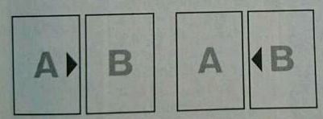

.. _新大师规则变更点:

================
新大师规则变更点
================

写在前面
========

| 相关链接：
| `NW论坛：OCG第10期 <http://bbs.newwise.com/thread-907107-1-1.html>`__
| `下载官方新大师规则手册（日文） <http://www.yugioh-card.com/japan/howto/data/rulebook_new_master_rule_ver1.0.pdf>`__
| `新大师完全规则书（中文） <https://www.gitbook.com/book/warsier/yugioh_master_rule_4/details>`__
| `在线卡查（中文） <http://www.ourocg.cn/>`__\ ，需要在网页底部调整翻译版本为NW优先。
| 用微信卡查时，需要在\ **微信小程序-游戏王查卡器-我的-中文译名设置-当前偏好**\ 中调整为NWBBS。

新增2个EX区域
=============

.. figure:: .static/3.jpg
   :alt: 决斗场地变化

   决斗场地变化

| 玩家把怪兽特殊召唤到EX区域时选1个EX区域使用。
| 基本上1个玩家只能使用1个区域。
| EX区域存在怪兽则成为那个怪兽控制者场上的一部分。
| EX区域不存在怪兽则不属于任何玩家。

| 例：
| 只有EX区域存在自己的怪兽的场合，自己手卡的「光子斩击者」也不能特殊召唤。
| 自己把EX区域的怪兽作为素材从额外卡组特殊召唤怪兽的场合，若另一个EX区域没有怪兽存在，自己可以不使用原来的EX区域，而把新的怪兽特殊召唤到那个EX区域。
| 「鬼计女夜魔」的效果破坏了EX区域的怪兽的场合，那个EX区域变得不能使用。另一个EX区域没有怪兽存在的场合，自己和对方都可以使用。

-  | 一方玩家只有EX区域有怪兽存在的场合，另一方玩家也不能用怪兽直接攻击。

-  | 我方对位于EX区域的对方怪兽发动「精神操作」的场合，会移动到我方的主怪兽区域，具体位置我方决定。将上述怪兽的控制权返还时，会移动到对方的主怪兽区域，具体位置对方决定。
   | 自己只有1只怪兽，对方有6只怪兽的场合发动「强制转移」，对方必须选主怪兽区域的怪兽与我方交换。

-  | 一时除外的怪兽回到场上的时点放置到主怪兽区域。主怪兽区域没有空位的场合送去墓地。
   | 「忍法 影缝之术」除外了EX区域的怪兽的场合那个EX区域也变得双方都不能使用。由于那个怪兽无法回到EX区域，结果要回到场上的时点那个怪兽送去墓地。

-  | 「替罪羊」等，由于EX区域没有怪兽存在的场合不属于任何玩家场上，这些衍生物只能特殊召唤到主怪兽区域。「扰乱三人组」等，把怪兽特殊召唤到对方场上的场合，具体位置也是由我方决定。

-  | 「海龟坏兽 加美西耶勒」等解放对方EX区域的怪兽的场合，特殊召唤到对方的主怪兽区域，具体位置我方决定。对方主怪兽区域没有空位的场合，只能解放对方主怪兽区域的怪兽来特殊召唤。
   | 解放EX区域的怪兽上级召唤的场合，由于新的怪兽只能放置到主怪兽区域，LV5-6的怪兽上级召唤的场合要求主怪兽区域必须有空位存在。否则只能解放主怪兽区域的怪兽。
   | LV7以上的怪兽只要再解放1只主怪兽区域的怪兽即可提供自身所需空位。

-  | 「位置移动」「突击犀牛」等移动到相邻怪兽区域的效果不能把主怪兽区域的怪兽移动到EX区域。
   | 「位置移动」可以把主怪兽区域的从额外卡组特殊召唤的怪兽移动到没有连接标记指向的左右相邻的主怪兽区域。

新增连接怪兽·连接召唤
=====================

连接怪兽
--------

.. figure:: .static/4.jpg
   :alt: 连接怪兽示例

   连接怪兽示例

| 连接怪兽是新增的放在额外卡组的怪兽。连接怪兽\ **不存在等级·阶级**\ 。不能以其为对象发动影响等级·阶级的效果。
| 装备魔法卡的发动时没有效果处理，即使效果只影响等级的场合也可以给X·连接怪兽装备。
| 例：
| 「降格处分」可以装备给连接怪兽·X怪兽，「同调英雄」装备的场合只攻击力上升500。

-  | 连接怪兽原本记载守备力的地方现在记载着连接数，不持有守备力，\ **不能变成守备表示**\ 。不能以其为对象发动使其成为守备表示的效果。
   | 例：
   | 「右手拿盾左手持剑」「阿努比斯的诅咒」「日全食之书」等对连接怪兽完全不适用，场上只有连接怪兽的场合不能发动。
   | 「地中族邪界妖魔」没有守备力，无法计算攻击力与守备力的合计数值，不能以其为对象发动「地中族的决战」。
   | 「纳祭之魔」把连接怪兽变成装备卡的场合只上升攻击力。
   | 「肥大化」等一并影响攻击力·守备力的效果只影响攻击力，后续处理正常适用。
   | 「仁王立」的①效果不能以连接怪兽为对象发动，②效果可以。
   | 「御用守护者」等把怪兽以守备表示特殊召唤的效果不能发动来特殊召唤连接怪兽。
   | 「时空警察」的效果不能盖放连接怪兽，结果连接怪兽就那样一直除外。
   | 连接怪兽特殊召唤成功时，「超级运动员 强壮阻挡员」的②效果不能发动。
   | 连接怪兽效果发动时，「健忘」的效果不能发动。
   | 装备魔法即使只影响守备力也可以正常装备给连接怪兽，其他效果正常适用。
   | 「银河剑圣」的效果不能选择没有守备力的连接怪兽「银河眼煌星龙」。

   .. attention:: 以其他例子来看，其实「银河剑圣」这个调整比较特别。

-  | 连接怪兽卡片的红色箭头称为连接标记。其紧邻指向的自己·对方的\ **区域或卡**\ 称为\ **连接端**\ ，这时这个连接怪兽自身是\ **连接起点**\ 。
   | 例：
   | 2个EX区域的连接怪兽的连接标记互相指向的场合这2个区域不是连接端。
   | 自己主怪兽区域的连接怪兽的连接标记指向了对方主怪兽区域的场合，那个区域\ **不是**\ 连接端。

   .. note:: 规则中「リンク先」指连接标记指向的区域或卡，虽然NW翻译为所连接区，我还是选择了完全规则书翻译的连接端。

-  连接标记不是怪兽效果，「技能抽取」适用中仍然正常存在。

连接召唤
--------

与S召唤，X召唤类似，连接召唤也是在场上的\ **表侧表示**\ 怪兽集齐时进行的新的召唤方式。把集齐的作为连接素材的怪兽送去墓地，从额外卡组把连接怪兽特殊召唤。

-  衍生物和P怪兽都\ **可以**\ 作为连接素材。前者消灭，后者加入额外卡组。

-  「大宇宙」适用中可以正常进行连接召唤，此时连接素材被除外。

连接怪兽进行连接召唤需要的素材数即\ **卡片记载的连接数**\ 。基本上，1只怪兽当作1个素材。

-  | 把连接怪兽作为连接素材使用时，可以作为\ **那个连接数的素材**\ 使用。
   | 例：
   | 连接3的「解码语者」进行连接召唤时，召唤条件是2只以上效果怪兽，则可以是把场上3只表侧表示的效果怪兽作为素材送去墓地，也可以是把1只连接2的效果怪兽和另1只效果怪兽作为素材送去墓地。
   | 连接3的「解码语者」自身作为连接素材时，可以作为1只或3只连接素材。不能当作2只。

   .. attention:: 不能用4只以上怪兽作为连接素材去连接召唤连接3的「解码语者」。不能超出连接数。

-  | 连接怪兽进行连接召唤必须同时满足连接数和召唤条件这\ **两个限制**\ 。
   | 例：
   | 连接3的「解码语者」进行连接召唤时，召唤条件是2只以上效果怪兽，因此不能只把1只连接3的怪兽作为素材送去墓地。

连接状态·互相连接·EX 连接
=========================

连接怪兽的连接标记指向的怪兽区域有怪兽存在的场合，这些怪兽和那只连接怪兽都处于连接状态。

   A和B都处于连接状态

特别地，连接怪兽的连接标记指向的怪兽区域有连接怪兽存在，且连接标记互相指向的场合是互相连接。

.. figure:: .static/6.png
   :alt: A和B是互相连接状态

   A和B是互相连接状态

连接怪兽从1个EX区域\ **通过一方的主怪兽区域**\ 全部互相连接而与另一个EX区域互相连接时称为EX连接。
可以通过连接对方主怪兽区域实现。

.. figure:: .static/7.png
   :alt: 通过自己·对方的主怪兽区域达成EX 连接

   通过自己·对方的主怪兽区域达成EX 连接

自己使用了1个EX区域，并通过自己·对方主怪兽区域全部互相连接到的另一个EX区域没有怪兽存在的场合，自己可以在这个EX区域把\ **能满足EX连接条件的连接怪兽**\ 连接召唤。
只在这个状态，1个玩家可以同时使用2个EX区域。

.. figure:: .static/8.png
   :alt: 自己可以在空着的EX区域特殊召唤有向下连接标记的连接怪兽

   自己可以在空着的EX区域特殊召唤有向下连接标记的连接怪兽

| Q.可以通过斜向上连接标记和斜向下连接标记共3只怪兽来达成EX连接吗？
| A.可以。

| 例：
| 对方主怪兽区域中央位置的「枪口焰龙」可以和我方的「闪刀姬-燎里」「闪刀姬-雫空」达成EX连接。
| 自己达成EX连接时，若主怪兽区域2或4号位的连接怪兽又与其侧的「拓扑篡改感染龙」互相连接，则这个「拓扑篡改感染龙」也是EX连接状态，可以发动②效果。

新增サイバース族
================

「游戏王 VRAINS」的主角使用着这个种族的怪兽。

.. figure:: .static/9.jpg
   :alt: サイバース族卡片

   サイバース族卡片

以前的规则变更点
================

.. figure:: .static/10.jpg
   :alt: 主怪兽区域

   主怪兽区域

| 以前的怪兽区域更名为主怪兽区域。
| 例：
| 「封魔一闪」等现在在对方主怪兽区域全部有怪兽存在的场合才能发动。这时若对方有怪兽在EX区域存在，也能破坏。
| 「魔术礼帽」在只有EX区域存在自己怪兽的场合不能发动。自己主怪兽区域有卡存在，这张卡发动的场合只能选主怪兽区域的怪兽去混合洗切。
| EX区域的「风魔女-水晶钟」得到「彷徨的木乃伊」的效果并发动的场合，自身变成里侧守备表示，再把主怪兽区域里侧守备表示的怪兽洗切并按自己喜欢的顺序放回主怪兽区域。主怪兽区域没有里侧守备表示的怪兽的场合，自身变成里侧守备表示就是这个效果处理完毕。
| 「No.98 绝望皇 霍普勒斯」的②效果需要先把自己特殊召唤，自己没有怪兽区域可用的场合不能发动。

.. figure:: .static/11.jpg
   :alt: 现在的P区域

   现在的P区域

| P区域与魔法·陷阱卡区域两侧合并。
| 放置的是P卡的场合既是P区域也是魔法·陷阱卡区域。
| 合计最多只能出现5张卡。
| 平时只作为魔法·陷阱卡区域使用，此时当作P区域不存在卡片。
| 例：
| 在魔法·陷阱卡区域两侧盖放的魔法·陷阱卡不会被「摇晃的目光」破坏。
| 「荒野的大龙卷」可以破坏P区域的P卡。
| 「DDD 克龙王 贝奥武夫」的②效果会破坏P区域的P卡。
| 魔法·陷阱卡区域两侧盖放了卡片的场合，可以发动「惊异灵摆」。
| P怪兽变成装备卡的场合由于其实只是装备魔法卡，只作为魔法·陷阱卡区域使用，所以P区域实际上仍不存在卡片。

.. figure:: .static/12.jpg
   :alt: 连接标记方向

   连接标记方向

| 怪兽从额外卡组特殊召唤的场合，必须特殊召唤到EX区域或连接端。
| 从额外卡组以外把这些怪兽特殊召唤的场合，特殊召唤到主怪兽区域。
| 如果没有连接怪兽，则互相只有1个EX区域可用，此时从额外卡组特殊召唤怪兽的数量最多只能有1只。
| 例：
| EX区域存在自己的1只X怪兽，自己主怪兽区域没有可用的连接端的场合，自己不能再进行S召唤或发动「假面变化」。
| 自己从额外卡组特殊召唤的「御用防御者」要发动效果的场合必须对方的连接怪兽有连接标记指向我方主怪兽区域。或者自己从墓地把「御用防御者」特殊召唤，由于此时在主怪兽区域，可以发动效果把同名卡特殊召唤到EX区域。

-  | 连接怪兽不作为怪兽卡存在时连接标记失去意义。
   | 例：
   | 「纳祭之魔」把连接怪兽变成装备卡的场合，连接标记指向的主怪兽区域不会成为连接端。

X召唤的步骤现在是，先把X素材移动到可用的EX区域或连接端重叠，再把X怪兽在其上重叠进行X召唤。X素材自身位于EX区域或连接端的场合可以不移动。

-  | EX区域或连接端有怪兽存在，可以使用那个怪兽为素材，直接在那个区域把额外卡组的怪兽特殊召唤。
   | 例：
   | 只有EX区域或1个连接端可用的场合，「升阶魔法-七皇之剑」等效果也可以正常发动并适用。
   | 「光波分光」要从墓地特殊召唤怪兽再从额外卡组特殊召唤怪兽，因此，需要有1个EX区域和1个主怪兽区域合计2个区域可用或有1个连接端的场合才能发动。

-  | EX区域·主怪兽区域各存在1只仅有左右连接标记的「蜜蜂机器人」，自己发动「融合」等从额外卡组把怪兽特殊召唤的效果处理时，主怪兽区域的「蜜蜂机器人」从场上离开，连接端不存在的场合那个\ **效果不适用**\ ，不能特殊召唤融合怪兽。
   | 「高等纹章术」等已经发动后，在效果处理时没有EX区域和连接端可用的场合，把2只「纹章兽」怪兽特殊召唤即处理完毕。

| 连接端的怪兽作为素材送去墓地导致那些主怪兽区域不再是连接端的场合，从额外卡组特殊召唤的怪兽只能放置到其他连接端或EX区域。
| 要把连接怪兽作为素材从额外卡组特殊召唤新的怪兽的场合，若会导致没有连接端或EX区域来放置新的怪兽，那么这个连接怪兽不能作为这次特殊召唤的素材。

.. attention:: 连接怪兽从场上离开后，其连接端的从额外卡组特殊召唤的怪兽\ **就那样留在场上**\ 。
